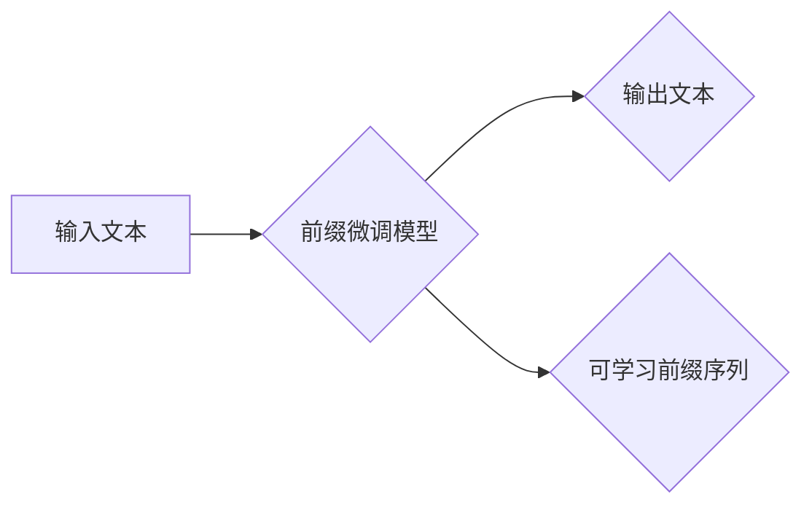

> 大语言模型、前缀微调、参数效率、文本生成、自然语言处理

## 1. 背景介绍

近年来，大语言模型（Large Language Models，LLMs）在自然语言处理（Natural Language Processing，NLP）领域取得了显著进展，展现出强大的文本生成、翻译、问答等能力。这些模型通常拥有数十亿甚至数千亿个参数，需要海量数据和计算资源进行训练。然而，对于许多实际应用场景来说，部署如此庞大的模型存在着成本和效率方面的挑战。

前缀微调（Prefix Tuning）作为一种参数效率的训练方法，在降低模型训练成本和提高模型适应性方面展现出巨大潜力。它通过在模型输入端添加一个可学习的前缀序列，来引导模型生成特定类型的文本，从而实现对模型的微调。

## 2. 核心概念与联系

前缀微调的核心思想是将模型的微调任务转化为学习一个固定长度的前缀序列的任务。

**Mermaid 流程图：**



**核心概念：**

* **大语言模型（LLM）：** 拥有大量参数的深度学习模型，能够理解和生成人类语言。
* **前缀微调（Prefix Tuning）：** 通过在模型输入端添加一个可学习的前缀序列，来引导模型生成特定类型的文本。
* **可学习前缀序列：** 一段固定长度的文本序列，由模型学习，用于控制模型的输出。

**联系：**

前缀微调通过在模型输入端添加可学习的前缀序列，实现了对模型的微调，从而提高了模型的适应性和效率。

## 3. 核心算法原理 & 具体操作步骤

### 3.1  算法原理概述

前缀微调的核心算法原理是将模型的微调任务转化为学习一个固定长度的前缀序列的任务。

具体来说，在使用前缀微调时，会将输入文本与一个可学习的前缀序列拼接在一起，作为模型的输入。模型会根据拼接后的输入序列生成输出文本。

通过训练，模型会学习到一个能够引导模型生成特定类型文本的前缀序列。

### 3.2  算法步骤详解

1. **准备工作：** 选择一个预训练好的大语言模型，并确定微调任务和前缀序列的长度。
2. **添加前缀序列：** 在模型的输入端添加一个可学习的前缀序列。
3. **训练模型：** 使用微调数据集训练模型，目标是学习到一个能够引导模型生成特定类型文本的前缀序列。
4. **评估模型：** 使用测试数据集评估模型的性能，并根据需要调整模型参数和训练策略。
5. **部署模型：** 将训练好的模型部署到实际应用场景中。

### 3.3  算法优缺点

**优点：**

* **参数效率：** 相比于对整个模型进行微调，前缀微调只需要学习一个相对较小的前缀序列，从而降低了模型训练的成本和时间。
* **适应性强：** 前缀微调可以针对不同的微调任务学习不同的前缀序列，从而提高模型的适应性。
* **易于实现：** 前缀微调的实现相对简单，只需要在模型的输入端添加一个可学习的前缀序列即可。

**缺点：**

* **前缀序列长度限制：** 前缀序列的长度有限制，可能会影响模型的表达能力。
* **过拟合风险：** 如果前缀序列长度过长，可能会导致模型过拟合训练数据。

### 3.4  算法应用领域

前缀微调在以下领域具有广泛的应用前景：

* **文本生成：** 生成不同风格、主题的文本，例如诗歌、小说、新闻报道等。
* **机器翻译：** 提高机器翻译的准确性和流畅度。
* **问答系统：** 提升问答系统的准确性和相关性。
* **代码生成：** 自动生成代码片段，提高开发效率。

## 4. 数学模型和公式 & 详细讲解 & 举例说明

### 4.1  数学模型构建

前缀微调的数学模型可以表示为：

$$
\mathbf{y} = f(\mathbf{x} + \mathbf{p})
$$

其中：

* $\mathbf{x}$ 是输入文本的词嵌入向量。
* $\mathbf{p}$ 是可学习的前缀序列的词嵌入向量。
* $f$ 是大语言模型的解码器函数。
* $\mathbf{y}$ 是模型生成的输出文本的词嵌入向量。

### 4.2  公式推导过程

前缀微调的目标是学习一个能够引导模型生成特定类型文本的前缀序列 $\mathbf{p}$。

可以使用交叉熵损失函数来衡量模型的预测结果与真实文本之间的差异。

$$
L = -\sum_{i=1}^{T} \log p(y_i | y_{<i}, \mathbf{x} + \mathbf{p})
$$

其中：

* $T$ 是输出文本的长度。
* $y_i$ 是输出文本的第 $i$ 个词。
* $y_{<i}$ 是输出文本的前 $i-1$ 个词。
* $p(y_i | y_{<i}, \mathbf{x} + \mathbf{p})$ 是模型预测输出文本第 $i$ 个词的概率。

通过反向传播算法，可以更新前缀序列 $\mathbf{p}$ 的参数，使其能够最小化损失函数。

### 4.3  案例分析与讲解

假设我们想要使用前缀微调来训练一个生成诗歌的模型。

我们可以使用一些诗歌数据集来训练模型，并使用一个固定长度的前缀序列来引导模型生成诗歌。

例如，前缀序列可以是：

"春风拂过柳枝头，"

这个前缀序列可以引导模型生成与春天相关的诗歌。

## 5. 项目实践：代码实例和详细解释说明

### 5.1  开发环境搭建

* Python 3.7+
* PyTorch 1.7+
* Transformers 4.10+

### 5.2  源代码详细实现

```python
from transformers import AutoModelForCausalLM, AutoTokenizer

# 加载预训练模型和词表
model_name = "gpt2"
tokenizer = AutoTokenizer.from_pretrained(model_name)
model = AutoModelForCausalLM.from_pretrained(model_name)

# 定义前缀序列
prefix = "春风拂过柳枝头，"

# 定义训练函数
def train_model(train_data, epochs=3):
    # ... 训练代码 ...

# 训练模型
train_model(train_data)

# 保存模型
model.save_pretrained("prefix_tuned_model")
tokenizer.save_pretrained("prefix_tuned_model")

```

### 5.3  代码解读与分析

* 代码首先加载预训练模型和词表。
* 然后定义前缀序列，并将其添加到模型的输入端。
* 训练函数负责训练模型，并使用交叉熵损失函数来衡量模型的性能。
* 最后，将训练好的模型保存到本地。

### 5.4  运行结果展示

训练完成后，可以使用以下代码生成诗歌：

```python
# 加载训练好的模型
model = AutoModelForCausalLM.from_pretrained("prefix_tuned_model")
tokenizer = AutoTokenizer.from_pretrained("prefix_tuned_model")

# 生成诗歌
input_text = prefix
output_text = model.generate(
    tokenizer.encode(input_text, return_tensors="pt"),
    max_length=100,
    num_beams=5,
)
print(tokenizer.decode(output_text[0], skip_special_tokens=True))
```

## 6. 实际应用场景

### 6.1  文本生成

前缀微调可以用于生成不同风格、主题的文本，例如诗歌、小说、新闻报道等。

### 6.2  机器翻译

前缀微调可以提高机器翻译的准确性和流畅度。

### 6.3  问答系统

前缀微调可以提升问答系统的准确性和相关性。

### 6.4  未来应用展望

前缀微调在未来将有更广泛的应用场景，例如：

* **代码生成：** 自动生成代码片段，提高开发效率。
* **对话系统：** 训练更自然、更流畅的对话系统。
* **个性化推荐：** 根据用户的偏好生成个性化的推荐内容。

## 7. 工具和资源推荐

### 7.1  学习资源推荐

* **论文：** Prefix Tuning: Optimizing Continuous Prompts for Generation
* **博客文章：** https://huggingface.co/blog/prefix-tuning

### 7.2  开发工具推荐

* **Transformers：** https://huggingface.co/docs/transformers/index

### 7.3  相关论文推荐

* **BERT：** https://arxiv.org/abs/1810.04805
* **GPT-3：** https://openai.com/blog/gpt-3/

## 8. 总结：未来发展趋势与挑战

### 8.1  研究成果总结

前缀微调是一种参数效率高的训练方法，能够有效地提高模型的适应性和效率。

### 8.2  未来发展趋势

未来，前缀微调的研究将朝着以下方向发展：

* **更有效的训练策略：** 研究更有效的训练策略，例如动态调整前缀序列长度、使用强化学习等。
* **更广泛的应用场景：** 将前缀微调应用到更多领域，例如代码生成、对话系统等。
* **跨模态前缀微调：** 研究跨模态前缀微调，例如将文本和图像结合起来进行微调。

### 8.3  面临的挑战

前缀微调也面临一些挑战：

* **前缀序列长度限制：** 前缀序列的长度有限制，可能会影响模型的表达能力。
* **过拟合风险：** 如果前缀序列长度过长，可能会导致模型过拟合训练数据。
* **可解释性：** 前缀微调的机制相对复杂，其可解释性需要进一步研究。

### 8.4  研究展望

尽管面临一些挑战，但前缀微调仍然是一个很有前景的研究方向。相信随着研究的深入，前缀微调将取得更大的突破，并在更多领域发挥重要作用。

## 9. 附录：常见问题与解答

**Q1：前缀微调与微调有什么区别？**

**A1：** 微调是指对整个模型进行训练，而前缀微调只对模型输入端的可学习前缀序列进行训练。

**Q2：前缀微调的优势是什么？**

**A2：** 前缀微调的优势在于参数效率高，适应性强，易于实现。

**Q3：前缀微调的局限性是什么？**

**A3：** 前缀微调的局限性在于前缀序列长度限制，以及过拟合风险。


作者：禅与计算机程序设计艺术 / Zen and the Art of Computer Programming 
<end_of_turn>