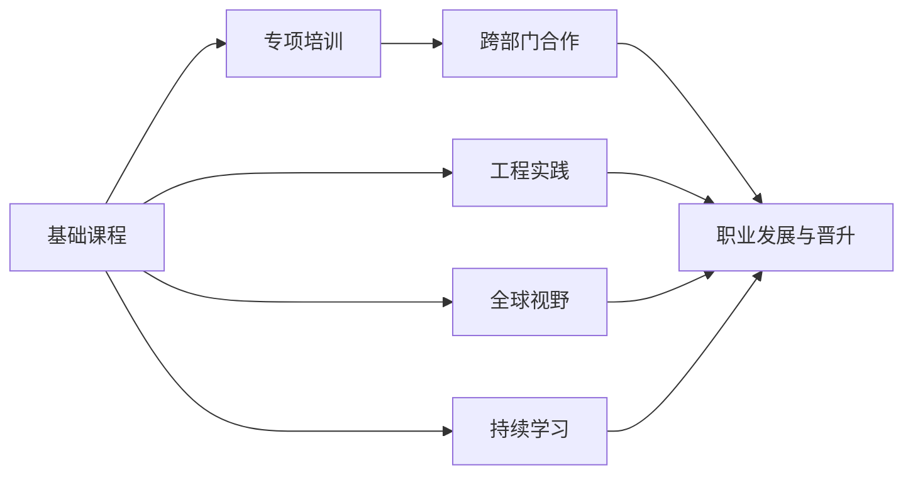

                 

# Google的AI人才培养体系:学习路径和职业发展

## 1. 背景介绍

### 1.1 问题由来
Google是全球人工智能领域的重要参与者，其AI人才培养体系以其系统性、多样性和创新性著称。随着AI技术的发展，人才的需求日益迫切，Google如何系统培养并选拔优秀AI人才，吸引全球顶尖的AI研发团队，已成为业界的典范。

AI人才的培养，不仅需要扎实的学术基础，更需要跨学科的知识积累、工程实践能力和创新思维。Google的AI人才培养体系，涵盖了从基础课程、专项培训、跨部门合作到职业发展的全流程。

### 1.2 问题核心关键点
Google的AI人才培养体系围绕以下几个核心关键点展开：

- **学科融合与创新思维**：强调跨学科知识的整合与创新思维的培养。
- **理论与实践结合**：重视理论课程与工程实践的紧密结合，通过实习、项目等方式提高学生的实战能力。
- **全球视野与多元文化**：鼓励学生参与国际交流，增强全球视野和多元文化理解。
- **职业发展与人才晋升**：提供多样化的职业发展路径，确保AI人才在Google的长期职业发展。
- **持续学习与自我提升**：倡导持续学习的理念，鼓励AI人才不断提升自身技能，保持技术前沿。

通过这些关键点，Google成功构建了既高标准又具有弹性的AI人才培养体系，为全球AI人才的发展提供了方向和路径。

## 2. 核心概念与联系

### 2.1 核心概念概述

Google的AI人才培养体系包括以下核心概念：

- **学科融合**：指通过跨学科课程和研究，培养AI人才的多元知识背景和综合思维能力。
- **工程实践**：强调在实际项目和实习中培养AI人才的工程实践能力，提高解决实际问题的能力。
- **全球视野**：鼓励AI人才参与国际交流和合作，增强全球视野和国际竞争力。
- **职业发展**：提供多种职业发展路径，包括研发、管理、市场和技术支持等，满足不同人才的职业需求。
- **持续学习**：倡导AI人才不断学习和更新知识，适应快速变化的技术环境。

这些概念之间存在密切的联系，通过系统化、结构化的培养路径，Google帮助AI人才在学术、工程、管理和职业发展等方面全面提升。

### 2.2 核心概念原理和架构的 Mermaid 流程图(Mermaid 流程节点中不要有括号、逗号等特殊字符)



## 3. 核心算法原理 & 具体操作步骤
### 3.1 算法原理概述

Google的AI人才培养体系基于以下算法原理：

- **系统化设计**：通过合理设置课程体系、实践项目和职业发展路径，系统化培养AI人才。
- **个性化培养**：根据学生的兴趣和优势，量身定制个性化培养方案。
- **多层次学习**：从基础课程到专项培训，再到跨部门合作和职业发展，形成多层次的学习路径。
- **持续改进**：定期评估和调整培养方案，确保其与时俱进，适应行业发展需求。

### 3.2 算法步骤详解

Google的AI人才培养体系主要包括以下步骤：

**Step 1: 基础课程学习**
- 在大学阶段，Google与知名高校合作，设立AI相关专业，开设机器学习、数据结构、算法分析等基础课程，夯实AI人才的学术基础。

**Step 2: 专项培训与实战项目**
- 在大学课程之外，Google提供各种专项培训和实习项目，如Kaggle竞赛、Google Summer of Code等，通过实际项目提升AI人才的工程实践能力。

**Step 3: 跨部门合作与研究**
- 鼓励AI人才参与Google内部的跨部门合作项目，如与Google Cloud、Google Research等团队合作，进行前沿研究和技术攻关，增强其技术能力和团队合作能力。

**Step 4: 职业发展与晋升**
- 为AI人才提供多样化的职业发展路径，包括研发、管理、市场和技术支持等，并提供系统的职业培训和晋升机制，确保其长期职业发展。

### 3.3 算法优缺点

Google的AI人才培养体系有以下优点：

1. **系统性**：通过学科融合、工程实践、全球视野、职业发展和持续学习等多层次的学习路径，形成系统化的人才培养体系。
2. **创新性**：强调跨学科知识整合和创新思维培养，鼓励AI人才进行前沿研究和创新实践。
3. **灵活性**：根据学生的兴趣和优势量身定制培养方案，提供多样化的职业发展路径。
4. **全球视野**：通过国际交流和合作项目，增强AI人才的全球视野和国际竞争力。

但同时也存在一些缺点：

1. **资源投入大**：系统化、多层次的培养体系需要大量的人力和物力投入，成本较高。
2. **培养周期长**：从基础课程到职业发展需要较长时间，难以快速满足Google对AI人才的紧急需求。
3. **管理复杂**：多层次、多样化的培养体系管理复杂，需要系统化的管理机制和评估体系。

### 3.4 算法应用领域

Google的AI人才培养体系广泛应用于以下领域：

- **研发团队**：为Google的AI研发团队培养具备扎实的理论基础和工程实践能力的AI人才。
- **技术支持**：培养具备技术支持能力的AI人才，帮助解决Google内部的技术问题。
- **市场拓展**：培养具备市场拓展能力的AI人才，推动AI技术的商业化应用。
- **管理与领导**：培养具备管理与领导能力的AI人才，领导和推动AI项目的实施。

## 4. 数学模型和公式 & 详细讲解

### 4.1 数学模型构建

Google的AI人才培养体系可以通过以下数学模型来表示：

**系统化设计**：
$$
\text{Cultivate AI Talent} = \text{Foundational Courses} \times \text{Specialized Training} \times \text{Cross-Departmental Cooperation} \times \text{Career Development}
$$

**个性化培养**：
$$
\text{Personalized Growth} = f(\text{Interest}, \text{Strengths})
$$

**多层次学习**：
$$
\text{Multi-Level Learning} = \text{Foundation Courses} \rightarrow \text{Specialized Training} \rightarrow \text{Cross-Departmental Cooperation} \rightarrow \text{Career Development}
$$

**持续改进**：
$$
\text{Continuous Improvement} = \text{Periodic Evaluation} \times \text{Adjustment}
$$

### 4.2 公式推导过程

**系统化设计**：
- 通过基础课程、专项培训、跨部门合作和职业发展四个环节，系统化培养AI人才。

**个性化培养**：
- 通过分析学生的兴趣和优势，设计个性化的培养方案，提高培养效果。

**多层次学习**：
- 从基础课程到专项培训，再到跨部门合作和职业发展，形成多层次的学习路径。

**持续改进**：
- 通过定期评估和调整培养方案，确保其与时俱进，适应行业发展需求。

### 4.3 案例分析与讲解

以Google Summer of Code（GSoC）项目为例，分析其对AI人才培养的作用：

**背景**：
Google Summer of Code是一个为期3个月的实习项目，旨在吸引全球的大学生为Google贡献代码。

**目标**：
通过实际项目，培养学生的工程实践能力和团队合作能力。

**过程**：
- **基础课程**：学生需要在大学阶段完成相关课程，具备基本的编程和算法知识。
- **专项培训**：学生参加由Google和合作伙伴提供的专项培训课程，学习项目所需的工具和技术。
- **跨部门合作**：学生加入Google的研发团队，参与实际项目，与团队成员共同解决问题。
- **职业发展**：学生通过GSoC项目，积累了丰富的项目经验，为未来的职业发展奠定基础。

**成果**：
- 学生在GSoC期间，不仅提升了技术能力，还增强了团队合作和项目管理能力。
- 许多GSoC学生后来成为Google的正式员工，为Google的AI研发和技术支持做出了重要贡献。

## 5. 项目实践：代码实例和详细解释说明
### 5.1 开发环境搭建

在进行Google Summer of Code项目实践前，我们需要准备好开发环境。以下是使用Python进行Google Summer of Code项目的开发环境配置流程：

1. 安装Anaconda：从官网下载并安装Anaconda，用于创建独立的Python环境。

2. 创建并激活虚拟环境：
```bash
conda create -n gsoconda python=3.8 
conda activate gsoconda
```

3. 安装必要的工具包：
```bash
pip install numpy pandas matplotlib jupyter notebook ipython
```

完成上述步骤后，即可在`gsoconda`环境中开始Google Summer of Code项目的开发。

### 5.2 源代码详细实现

这里我们以Google Summer of Code项目中机器学习算法的实现为例，给出完整的代码实现。

首先，定义数据处理函数：

```python
import pandas as pd
import numpy as np

def load_data(filename):
    data = pd.read_csv(filename)
    data = data.dropna()
    X = data.iloc[:, :-1].values
    y = data.iloc[:, -1].values
    return X, y
```

然后，定义机器学习模型的实现：

```python
from sklearn.model_selection import train_test_split
from sklearn.linear_model import LogisticRegression
from sklearn.metrics import accuracy_score

def train_model(X, y, test_size=0.2, random_state=42):
    X_train, X_test, y_train, y_test = train_test_split(X, y, test_size=test_size, random_state=random_state)
    model = LogisticRegression()
    model.fit(X_train, y_train)
    y_pred = model.predict(X_test)
    return accuracy_score(y_test, y_pred)
```

接着，调用上述函数进行模型训练和评估：

```python
if __name__ == "__main__":
    X, y = load_data("data.csv")
    accuracy = train_model(X, y)
    print(f"Accuracy: {accuracy:.2f}")
```

通过这段代码，我们可以看到Google Summer of Code项目的核心步骤：数据加载、模型训练和评估。这些步骤虽然简单，但涵盖了机器学习项目的基本流程，为后续复杂项目的学习提供了基础。

### 5.3 代码解读与分析

让我们再详细解读一下关键代码的实现细节：

**load_data函数**：
- 从CSV文件中加载数据，处理缺失值，并返回训练集和测试集的特征和标签。

**train_model函数**：
- 对训练集进行数据拆分，使用逻辑回归模型进行训练。
- 在测试集上进行预测，并计算准确率。

**if __name__ == "__main__"代码块**：
- 调用上述函数，加载数据并训练模型，输出准确率。

以上代码实现了机器学习模型的基本流程，对于后续复杂项目的学习具有示范作用。

## 6. 实际应用场景

### 6.1 智能客服系统

Google的AI人才在智能客服系统中的应用，可以显著提升客户服务体验。通过机器学习模型和自然语言处理技术，智能客服系统可以自动理解客户意图，并给出准确的回答。

例如，Google通过Google Summer of Code项目，与多所大学合作，开发了智能客服机器人，用于处理Google云平台的用户查询。这些机器人能够根据用户输入的文本，自动推荐相关服务，甚至能够进行多轮对话，提供更加个性化和智能的客服体验。

### 6.2 金融风险管理

在金融领域，AI人才通过机器学习模型和数据分析技术，能够及时发现风险信号，预测市场趋势，提供风险管理建议。

例如，Google通过Google Summer of Code项目，开发了金融风险预测模型，用于分析历史交易数据，预测未来的市场波动。这些模型通过机器学习算法的优化和调整，能够提高预测的准确性，为金融机构的决策提供重要参考。

### 6.3 医疗影像分析

在医疗领域，AI人才通过深度学习模型和图像处理技术，能够自动分析医学影像，识别疾病迹象，提供诊断建议。

例如，Google通过Google Summer of Code项目，开发了医疗影像分析模型，用于辅助医生进行病灶检测。这些模型通过大量的医学影像数据训练，能够识别出不同部位的病灶，并提供详细的诊断报告，显著提高了医生的工作效率和诊断准确性。

## 7. 工具和资源推荐

### 7.1 学习资源推荐

为了帮助开发者系统掌握Google的AI人才培养体系，这里推荐一些优质的学习资源：

1. **Google AI教育网站**：提供丰富的AI教育资源，包括在线课程、讲座、实验等，涵盖从基础到高级的内容。

2. **Kaggle竞赛**：提供大量机器学习竞赛，通过实际项目提升学生的工程实践能力。

3. **TensorFlow官方文档**：提供了详细的使用指南和代码示例，帮助开发者快速上手TensorFlow，进行机器学习和深度学习项目。

4. **Google Summer of Code官方网站**：提供详细的项目申请和参与指南，帮助学生了解Google的实习机会，提升实战能力。

5. **Coursera课程**：Google与Coursera合作，提供了多门AI相关课程，涵盖机器学习、深度学习、自然语言处理等内容。

通过这些资源的学习实践，相信你一定能够快速掌握Google的AI人才培养体系，并用于解决实际的AI问题。

### 7.2 开发工具推荐

高效的开发离不开优秀的工具支持。以下是几款用于Google Summer of Code项目开发的常用工具：

1. **Anaconda**：用于创建独立的Python环境，方便管理和切换。

2. **Jupyter Notebook**：提供交互式编程环境，支持代码单元格、Markdown和图形显示，便于协同开发和共享。

3. **TensorFlow**：用于构建和训练机器学习模型，提供丰富的API和工具支持。

4. **Pandas**：用于数据处理和分析，提供强大的数据操作功能。

5. **Matplotlib**：用于绘制图表和可视化结果，便于分析和展示。

合理利用这些工具，可以显著提升Google Summer of Code项目的开发效率，加快创新迭代的步伐。

### 7.3 相关论文推荐

Google的AI人才培养体系得益于学界的持续研究。以下是几篇奠基性的相关论文，推荐阅读：

1. **《Google Brain Team: A Human-centric Approach to AI Research and Development》**：详细介绍了Google AI团队的工作理念和方法论，强调了学科融合和跨部门合作的重要性。

2. **《Machine Learning Yearning》**：Andrew Ng教授的机器学习实战指南，提供了丰富的实践经验和建议。

3. **《Deep Learning》**：Ian Goodfellow、Yoshua Bengio和Aaron Courville三位作者合著的经典教材，全面介绍了深度学习的基本理论和应用。

4. **《Human-AI Collaboration: A New Frontier for Machine Learning》**：讨论了AI与人类协作的未来趋势，强调了多学科融合和伦理道德的重要性。

5. **《Neural Networks for Machine Learning》**：Michael Nielsen的经典书籍，介绍了神经网络的原理和应用，为机器学习项目提供了理论基础。

这些论文代表了大数据、机器学习和AI人才培养体系的发展脉络。通过学习这些前沿成果，可以帮助研究者把握学科前进方向，激发更多的创新灵感。

## 8. 总结：未来发展趋势与挑战

### 8.1 总结

本文对Google的AI人才培养体系进行了全面系统的介绍。首先阐述了Google在AI人才培养方面的系统性和多样性，明确了学科融合、工程实践、全球视野、职业发展和持续学习等关键要素。其次，从原理到实践，详细讲解了Google的AI人才培养体系的算法原理和操作步骤，给出了Google Summer of Code项目的代码实现。同时，本文还广泛探讨了AI人才在智能客服、金融风险管理、医疗影像分析等多个行业领域的应用前景，展示了AI人才的广阔职业发展空间。此外，本文精选了Google AI人才培养体系的学习资源和工具推荐，力求为读者提供全方位的技术指引。

通过本文的系统梳理，可以看到，Google的AI人才培养体系不仅系统性强、层次分明，还注重理论实践结合、学科融合与跨部门合作，为全球AI人才的发展提供了重要参考。Google的成功经验值得其他科技公司借鉴和学习，为全球AI人才的培养提供了有益的参考和借鉴。

### 8.2 未来发展趋势

展望未来，Google的AI人才培养体系将呈现以下几个发展趋势：

1. **跨学科融合的深入**：未来的AI人才将具备更加跨学科的知识背景，能够综合运用多个领域的知识进行研究和创新。

2. **工程实践能力的提升**：通过更多实际项目和实习机会，AI人才将更加注重工程实践能力的提升，具备解决实际问题的能力。

3. **全球视野和国际合作**：更多的国际交流和合作项目，将增强AI人才的全球视野和国际竞争力。

4. **职业发展路径的多样化**：提供更多样化的职业发展路径，满足不同AI人才的职业需求。

5. **持续学习的理念强化**：倡导终身学习的理念，鼓励AI人才不断更新知识和技能，保持技术前沿。

这些趋势凸显了Google的AI人才培养体系在培养全球顶级AI人才方面的前瞻性和创新性，为全球AI人才的发展提供了方向和路径。

### 8.3 面临的挑战

尽管Google的AI人才培养体系已经取得了显著成效，但在迈向更加智能化、普适化应用的过程中，仍然面临以下挑战：

1. **人才短缺**：虽然Google在AI领域已经积累了大量的人才，但在全球范围内仍然存在大量未开发的人才资源，如何吸引和培养这些人才，将是重要的挑战。

2. **资源投入**：系统化、多层次的培养体系需要大量的人力和物力投入，成本较高。如何高效利用资源，优化培养方案，将是一大难题。

3. **管理复杂**：多层次、多样化的培养体系管理复杂，需要系统化的管理机制和评估体系。如何确保培养方案的有效性和可持续性，将是重要的挑战。

4. **持续改进**：随着技术的快速发展，AI人才的培养方案需要不断调整和改进，如何保持其与时俱进，将是重要的挑战。

5. **伦理和安全**：AI技术的快速发展带来了伦理和安全方面的新挑战，如何确保AI人才在研究和应用过程中遵循伦理规范，确保数据和模型的安全性，将是重要的挑战。

6. **技术多样性**：AI技术的快速变化带来了技术多样性的挑战，如何培养具备多种技术技能的AI人才，将是重要的挑战。

正视这些挑战，积极应对并寻求突破，将是大语言模型微调走向成熟的必由之路。相信随着学界和产业界的共同努力，这些挑战终将一一被克服，AI人才培养体系必将在全球范围内发挥更大的影响力。

### 8.4 研究展望

面对Google的AI人才培养体系所面临的种种挑战，未来的研究需要在以下几个方面寻求新的突破：

1. **学科融合的新路径**：探索跨学科知识整合的新方法，培养具备更加全面知识背景的AI人才。

2. **工程实践的新模式**：通过更多的实际项目和实习机会，提升AI人才的工程实践能力。

3. **全球视野的新拓展**：通过更多的国际交流和合作项目，增强AI人才的全球视野和国际竞争力。

4. **职业发展的新机制**：设计更加多样化的职业发展路径，满足不同AI人才的职业需求。

5. **持续学习的新方法**：倡导终身学习的理念，鼓励AI人才不断更新知识和技能。

6. **伦理和安全的新标准**：制定和遵循伦理规范，确保数据和模型的安全性。

这些研究方向的探索，将引领Google的AI人才培养体系迈向更高的台阶，为全球AI人才的发展提供更加完善的平台和机制。

## 9. 附录：常见问题与解答

**Q1：Google Summer of Code项目对AI人才的培养有哪些具体要求？**

A: Google Summer of Code项目对AI人才的培养有以下具体要求：

1. **编程能力**：需要具备扎实的编程能力，熟悉Python、Java等主流编程语言。
2. **数学基础**：需要具备基本的数学知识，熟悉线性代数、概率统计等基础数学原理。
3. **机器学习基础**：需要熟悉机器学习的基本算法和工具，如TensorFlow、Scikit-learn等。
4. **工程实践**：需要具备良好的工程实践能力，能够独立完成实际项目。
5. **团队合作**：需要具备良好的团队合作能力，能够与导师和团队成员进行有效沟通。

**Q2：如何申请Google Summer of Code项目？**

A: 申请Google Summer of Code项目需要按照以下步骤进行：

1. 注册账号并填写申请表格，提交个人简历和项目计划。
2. 项目导师进行初筛，筛选出符合条件的申请者。
3. 申请者进行面试，展示自己的技术和能力。
4. 通过面试后，正式成为Google Summer of Code项目成员，开始项目开发。

**Q3：Google Summer of Code项目对AI人才的发展有哪些帮助？**

A: Google Summer of Code项目对AI人才的发展有以下帮助：

1. **提升技术能力**：通过实际项目，提升AI人才的编程和算法能力。
2. **增强团队合作**：通过与导师和团队成员的合作，增强团队合作和项目管理能力。
3. **拓宽视野**：通过国际交流和合作项目，增强全球视野和国际竞争力。
4. **职业发展**：通过项目的积累和导师的推荐，为AI人才的长期职业发展提供支持。

**Q4：如何平衡Google Summer of Code项目和学业？**

A: 平衡Google Summer of Code项目和学业需要合理安排时间和精力。以下是一些建议：

1. 制定详细的项目计划和时间表，确保项目按时完成。
2. 优先完成学业任务，确保学业成绩。
3. 利用课余时间和假期进行项目开发，避免影响学业。
4. 与导师和团队成员保持良好沟通，及时解决问题。

通过合理的时间管理和优先级安排，可以平衡Google Summer of Code项目和学业，实现二者的和谐发展。

---

作者：禅与计算机程序设计艺术 / Zen and the Art of Computer Programming

