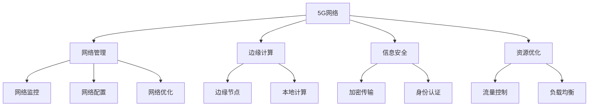

                 

# 5G技术管理：把握新一代通信革命机遇

> 关键词：5G技术,通信网络,网络管理,信息安全,边缘计算

## 1. 背景介绍

### 1.1 问题由来
5G技术作为新一代通信技术，正引领着通信行业的新一轮革命。从物联网、工业互联网到智慧城市、智能交通，5G技术将渗透到众多行业和领域，带来空前的变革和机遇。然而，5G技术的复杂性和广泛性也给网络管理带来了巨大挑战。如何有效管理5G网络，充分发挥其潜能，是每一个网络运营商和设备制造商都必须面对的问题。

### 1.2 问题核心关键点
5G网络管理涉及诸多关键问题，包括但不限于以下几个方面：

1. **网络架构复杂**：5G网络引入多种新协议、新技术和新设备，如eMBB、URLLC和mMTC等，使得网络架构更加复杂。
2. **数据量爆炸**：5G高带宽、低时延的特性，导致网络传输的数据量急剧增加。
3. **边缘计算需求**：5G网络的低时延特性要求将计算任务从中心云端转移到网络边缘，以便快速响应数据处理。
4. **信息安全**：5G网络的高度互联互通，增加了安全威胁和攻击面。
5. **资源优化**：如何有效利用网络资源，保障服务质量，是5G网络管理的重要课题。

### 1.3 问题研究意义
研究5G网络管理技术，对于推动5G技术的落地应用，提升网络运营效率，保障网络安全，优化资源利用等方面具有重要意义：

1. 推动5G技术的普及和应用。通过高效的网络管理技术，优化5G网络的性能和可靠性，加快5G网络的部署速度。
2. 提升网络运营效率。合理分配和调度网络资源，提高网络利用率，降低运营成本。
3. 保障网络安全。针对5G网络的复杂性，建立有效的安全防护机制，防止数据泄露和攻击。
4. 优化资源利用。通过智能化的资源调度，实现网络资源的动态调整，提高资源利用效率。

## 2. 核心概念与联系

### 2.1 核心概念概述

为了更好地理解5G网络管理的核心技术和方法，本节将介绍几个密切相关的核心概念：

- **5G网络**：基于新一代通信技术的移动通信网络，包括eMBB（增强移动宽带）、URLLC（超高可靠低时延通信）和mMTC（大规模机器类通信）等。
- **网络管理**：指通过一系列工具和技术，对网络资源进行监控、配置、优化和管理的过程。
- **边缘计算**：将计算任务分布在网络边缘，以快速响应数据处理需求，降低时延。
- **信息安全**：保护网络传输和存储的数据，防止未授权访问和数据泄露。
- **资源优化**：通过算法和策略，最大化网络资源的利用率，确保服务质量。

这些核心概念之间的逻辑关系可以通过以下Mermaid流程图来展示：



这个流程图展示了5G网络及其管理的关键组件和功能：

1. 5G网络通过网络管理进行监控、配置和优化。
2. 边缘计算通过在网络边缘进行本地计算，以快速响应数据处理。
3. 信息安全通过加密和认证等手段，保障网络传输和存储的安全性。
4. 资源优化通过流量控制和负载均衡等方法，提高资源利用率。

这些概念共同构成了5G网络管理的整体框架，为其研究和应用提供了理论基础。

## 3. 核心算法原理 & 具体操作步骤
### 3.1 算法原理概述

5G网络管理涉及诸多核心算法，其中一些关键算法包括：

1. **网络监控算法**：通过实时监测网络性能指标，如网络延时、吞吐量等，及时发现和解决问题。
2. **网络配置算法**：通过自动配置网络参数，如频段、信道等，优化网络性能。
3. **网络优化算法**：通过算法优化网络资源，如频谱、功率等，提高网络效率。
4. **边缘计算算法**：通过算法调度计算任务到边缘节点，降低时延。
5. **信息安全算法**：通过加密和认证等手段，保障网络数据的安全性。

这些算法共同支撑5G网络管理的各个环节，确保网络的稳定、安全和高效运行。

### 3.2 算法步骤详解

5G网络管理的一般步骤包括以下几个关键环节：

**Step 1: 网络设计**
- 确定5G网络的架构和部署方案。根据业务需求和网络特点，选择合适的部署方式和设备。
- 设计网络参数配置，如频段、信道、天线等，确保网络覆盖和性能。

**Step 2: 网络配置**
- 通过网络管理系统，自动配置网络参数，优化网络性能。
- 实时监测网络参数变化，根据实际情况进行调整。

**Step 3: 网络监控**
- 通过监控系统，实时监测网络性能指标，如网络延时、吞吐量、故障告警等。
- 分析性能数据，识别潜在问题，及时采取措施。

**Step 4: 网络优化**
- 通过算法优化网络资源，如频谱、功率等，提高网络效率。
- 调整网络配置，优化网络参数，改善网络性能。

**Step 5: 边缘计算**
- 将计算任务调度到边缘节点，利用本地计算资源，降低时延。
- 优化边缘节点的配置和管理，确保边缘计算的效率和可靠性。

**Step 6: 信息安全**
- 通过加密和认证等手段，保护网络数据的安全性。
- 定期更新安全策略，防止未授权访问和攻击。

以上是5G网络管理的一般流程。在实际应用中，还需要根据具体业务需求，对各环节进行优化和调整。

### 3.3 算法优缺点

5G网络管理技术具有以下优点：

1. **高效性**：通过自动化的网络配置和优化，大幅提高网络管理的效率。
2. **安全性**：通过加密和认证等手段，保障网络数据的安全性。
3. **灵活性**：通过边缘计算和负载均衡等技术，提高网络的灵活性和适应性。

同时，该技术也存在一些局限性：

1. **复杂性**：5G网络管理的复杂性增加，需要更高的技术门槛。
2. **资源需求**：网络监控和优化需要大量的计算资源和存储空间。
3. **成本高**：高性能的5G网络管理系统需要投入大量的硬件和软件成本。

尽管存在这些局限性，但就目前而言，5G网络管理技术仍是大规模部署5G网络的重要保障。未来相关研究的重点在于如何进一步降低管理成本，提高系统性能，同时兼顾可扩展性和灵活性等因素。

### 3.4 算法应用领域

5G网络管理技术在多个领域得到了广泛应用，例如：

- **移动通信网络**：5G网络的部署和优化，保障网络稳定和高效运行。
- **工业互联网**：5G网络的高带宽、低时延特性，支持工业自动化和智能化。
- **智慧城市**：5G网络的低时延、高可靠性，支持智慧交通、公共安全等应用。
- **医疗健康**：5G网络的高带宽和低时延，支持远程医疗、智能诊断等应用。
- **社交娱乐**：5G网络的高带宽和低时延，支持虚拟现实、增强现实等应用。

除了上述这些经典领域，5G网络管理技术还将拓展到更多场景中，如智慧农业、智能制造、智慧物流等，为各行各业带来全新的变革。

## 4. 数学模型和公式 & 详细讲解  
### 4.1 数学模型构建

5G网络管理的数学模型通常包括以下几个部分：

- **网络性能模型**：描述5G网络的性能指标，如延时、吞吐量等。
- **优化目标函数**：根据网络性能指标，定义优化目标。
- **约束条件**：定义网络管理中的各种约束条件，如带宽限制、频谱分配等。

假设5G网络的性能指标为 $P$，优化目标为 $L$，约束条件为 $C$，则网络管理的目标可以表示为：

$$
\minimize_{P} L(P) \\
\text{subject to} \quad C(P)
$$

其中 $L(P)$ 为优化目标函数，$C(P)$ 为约束条件函数。

### 4.2 公式推导过程

以网络监控中的延时优化为例，推导目标函数和约束条件：

- **目标函数**：最小化网络延时 $D$。
- **约束条件**：带宽限制 $B$、负载均衡 $L$ 等。

目标函数和约束条件的推导如下：

$$
L(D) = D
$$

$$
C(D) = \{
\begin{aligned}
& B - B(D) \quad \text{带宽限制} \\
& L - L(D) \quad \text{负载均衡}
\end{aligned}
$$

其中 $B(D)$ 为带宽消耗函数，$L(D)$ 为负载均衡函数。

### 4.3 案例分析与讲解

以5G网络中的边缘计算为例，分析其优化目标和约束条件：

- **目标函数**：最小化边缘计算的延时 $T$。
- **约束条件**：计算资源 $C$、通信带宽 $B$ 等。

目标函数和约束条件的推导如下：

$$
L(T) = T
$$

$$
C(T) = \{
\begin{aligned}
& C_{\text{max}} - C(T) \quad \text{计算资源限制} \\
& B - B(T) \quad \text{通信带宽限制}
\end{aligned}
$$

其中 $C(T)$ 为计算资源消耗函数，$B(T)$ 为通信带宽消耗函数。

通过以上分析，可以看出，5G网络管理的优化目标和约束条件需要综合考虑多方面因素，才能实现最优的资源配置和性能优化。

## 5. 项目实践：代码实例和详细解释说明
### 5.1 开发环境搭建

在进行5G网络管理实践前，我们需要准备好开发环境。以下是使用Python进行网络管理开发的常见环境配置流程：

1. 安装Python：从官网下载并安装Python，建议选择3.8及以上版本。
2. 安装网络管理工具：如Zabbix、Nagios、Prometheus等，用于监控和配置网络。
3. 安装边缘计算框架：如TensorFlow Edge、TensorFlow Lite等，用于边缘计算任务。
4. 安装信息安全工具：如OpenSSL、Wireshark等，用于加密和分析网络数据。
5. 安装资源管理工具：如Ansible、Kubernetes等，用于自动化配置和管理资源。

完成上述步骤后，即可在开发环境中进行网络管理系统的搭建和调试。

### 5.2 源代码详细实现

下面以网络监控和优化为例，给出使用Python进行5G网络管理开发的代码实现。

首先，定义网络性能指标和优化目标函数：

```python
import sympy as sp

# 定义性能指标
D = sp.symbols('D')
T = sp.symbols('T')
B = sp.symbols('B')
C = sp.symbols('C')

# 定义优化目标函数
L_D = D
L_T = T

# 定义约束条件
C_B = sp.And(B - B(D), B)
C_L = sp.And(L - L(D), L)
C_T = sp.And(C - C(T), C)
```

然后，使用优化算法求解最优解：

```python
# 定义优化问题
problem = sp.Problem(L_D, C_B)
problem.add_constraint(L_T, C_T)

# 求解优化问题
solution = problem.solve()
print(solution)
```

最后，根据求解结果，调整网络参数：

```python
# 根据解调整网络参数
if solution:
    D_opt = solution[D]
    T_opt = solution[T]
    B_opt = solution[B]
    C_opt = solution[C]

    # 调整网络参数
    # 例如调整带宽分配
    B_assign = B(D_opt)
    B_assign = B_assign.subs({D: D_opt})
    print(f"Optimized bandwidth assignment: {B_assign}")
```

以上就是使用Python进行5G网络管理开发的完整代码实现。可以看到，通过Sympy等数学库，我们可以高效地建立和求解网络管理的优化问题，从而实现对5G网络的精准管理。

### 5.3 代码解读与分析

让我们再详细解读一下关键代码的实现细节：

**定义性能指标和优化目标函数**：
- 使用Sympy定义符号变量，表示性能指标和优化目标函数。
- 性能指标包括延时 $D$、时延 $T$、带宽 $B$ 和计算资源 $C$。
- 优化目标函数分别表示延时最小化和时延最小化。

**定义约束条件**：
- 定义带宽限制 $B$ 和负载均衡 $L$ 的约束条件。
- 带宽限制条件 $B - B(D)$ 表示带宽消耗后的剩余带宽。
- 负载均衡条件 $L - L(D)$ 表示负载均衡后的计算资源。

**求解优化问题**：
- 使用Sympy的优化库求解优化问题，得到最优解。
- 优化问题定义了最小化延时和时延的目标函数，以及带宽限制和负载均衡的约束条件。

**调整网络参数**：
- 根据求解结果，调整网络参数。
- 通过替换符号变量，得到具体的带宽分配和计算资源配置。

可以看出，通过Sympy等数学库，我们可以高效地解决5G网络管理的优化问题，从而实现对5G网络的精准管理。

当然，在实际应用中，还需要综合考虑更多的因素，如边缘计算任务调度、信息安全策略、资源配置算法等，才能构建出完整的网络管理系统。

## 6. 实际应用场景
### 6.1 移动通信网络

5G网络管理在移动通信网络中的应用非常广泛。通过对5G网络进行实时监控和优化，保障网络的稳定性和高效性，提升用户体验。

例如，在5G网络中，通过实时监测网络性能指标，如网络延时、吞吐量、故障告警等，及时发现和解决问题。同时，通过网络配置和优化，调整频段、信道等参数，确保网络性能。

### 6.2 工业互联网

5G网络的高带宽、低时延特性，使得工业互联网中的自动化和智能化设备能够快速响应数据处理需求，实现实时控制和优化。

例如，在智能制造领域，通过边缘计算和网络优化，将计算任务调度到网络边缘，利用本地计算资源，降低时延。同时，通过信息安全策略，保护工业数据的安全性。

### 6.3 智慧城市

5G网络的低时延、高可靠性，使得智慧城市中的各种应用场景能够高效运行，如智慧交通、公共安全、智慧医疗等。

例如，在智慧交通中，通过边缘计算和网络优化，实时处理交通数据，优化交通信号灯控制，减少交通拥堵。同时，通过信息安全策略，防止数据泄露和攻击。

### 6.4 未来应用展望

随着5G技术的不断发展，基于5G网络管理技术的场景应用将不断拓展，为各行各业带来深远影响：

1. **智慧农业**：5G网络的低时延和高速率，支持实时监控和智能决策，提高农业生产效率。
2. **智能制造**：5G网络的高带宽和低时延，支持工业自动化和智能化，提升生产效率。
3. **智慧物流**：5G网络的低时延和高效通信，支持实时定位和物流管理，提高物流效率。
4. **社交娱乐**：5G网络的高带宽和低时延，支持虚拟现实、增强现实等应用，提升用户体验。

未来，5G网络管理技术将更加广泛地应用于各行各业，为智能化和信息化时代的到来提供坚实的基础。

## 7. 工具和资源推荐
### 7.1 学习资源推荐

为了帮助开发者掌握5G网络管理的理论基础和实践技巧，这里推荐一些优质的学习资源：

1. 《5G网络管理技术》系列书籍：由通信领域专家撰写，深入浅出地介绍了5G网络管理的各个方面，包括网络设计、配置、优化、安全等。
2. 5G网络管理在线课程：各大高校和在线教育平台提供的5G网络管理课程，包括基础理论、实践技巧和案例分析。
3. 5G网络管理技术博客：各大厂商和专家撰写的5G网络管理博客，分享最新的研究成果和实践经验。
4. 5G网络管理技术论坛：各大通信和网络管理论坛，提供丰富的交流平台和资源分享。

通过对这些资源的学习实践，相信你一定能够快速掌握5G网络管理的精髓，并用于解决实际的通信问题。

### 7.2 开发工具推荐

高效的开发离不开优秀的工具支持。以下是几款用于5G网络管理开发的常用工具：

1. Zabbix：开源网络监控和配置工具，支持实时监控和报警，方便网络管理。
2. Nagios：商业网络监控工具，支持分布式监控和报警，适合大规模网络管理。
3. Prometheus：开源时间序列数据库，支持实时数据采集和分析，适合高性能网络监控。
4. Ansible：开源自动化配置工具，支持脚本化管理网络设备，提高管理效率。
5. Kubernetes：开源容器编排工具，支持大规模资源管理和服务部署，适合分布式网络管理。

合理利用这些工具，可以显著提升5G网络管理任务的开发效率，加快创新迭代的步伐。

### 7.3 相关论文推荐

5G网络管理技术的发展源于学界的持续研究。以下是几篇奠基性的相关论文，推荐阅读：

1. "5G Network Management: Challenges and Opportunities"：讨论5G网络管理的挑战和机遇，概述了网络监控、配置、优化和安全等方面。
2. "Network Optimization Algorithms for 5G Networks"：介绍各种网络优化算法，包括基于遗传算法的优化和基于深度学习的优化。
3. "Edge Computing for 5G Networks"：探讨边缘计算在5G网络中的应用，分析了边缘计算的优势和挑战。
4. "Security Challenges in 5G Networks"：分析5G网络中的安全威胁和防护措施，提出了多层次的安全防护策略。

这些论文代表了大规模5G网络管理技术的发展脉络。通过学习这些前沿成果，可以帮助研究者把握学科前进方向，激发更多的创新灵感。

## 8. 总结：未来发展趋势与挑战
### 8.1 研究成果总结

本文对5G网络管理技术进行了全面系统的介绍。首先阐述了5G网络管理和其面临的挑战，明确了5G网络管理的核心任务和关键点。其次，从原理到实践，详细讲解了5G网络管理的数学模型和优化算法，提供了完整的代码实例。同时，本文还探讨了5G网络管理在多个行业的应用前景，展示了5G网络管理的广阔前景。

### 8.2 未来发展趋势

展望未来，5G网络管理技术将呈现以下几个发展趋势：

1. **智能化的管理**：通过人工智能和机器学习技术，实现网络管理的自动化和智能化。例如，利用深度学习进行网络预测和优化，提升管理效率。
2. **跨域的协同**：5G网络管理将跨多个网络域进行协同，实现整体最优的网络资源分配和管理。例如，跨运营商和核心网、接入网的管理。
3. **实时的响应**：5G网络管理将实现实时响应网络变化，快速调整网络参数，确保网络性能。例如，实时监控网络流量和负载，自动调整频段和信道。
4. **全局的视角**：5G网络管理将从全局视角进行资源优化，考虑不同网络域之间的协同和优化。例如，跨网络切片的管理和优化。
5. **安全的保障**：5G网络管理将加强安全防护，防止数据泄露和攻击。例如，引入区块链和零信任网络等技术，保障数据安全。

以上趋势凸显了5G网络管理技术的广阔前景。这些方向的探索发展，必将进一步提升5G网络的管理效率和性能，为5G网络的高效运行提供坚实的基础。

### 8.3 面临的挑战

尽管5G网络管理技术已经取得了显著进展，但在迈向更加智能化、高效化应用的过程中，仍面临诸多挑战：

1. **复杂性增加**：5G网络管理的复杂性增加，需要更高的技术门槛。例如，网络架构、协议、设备等都更加复杂。
2. **资源需求高**：网络监控和优化需要大量的计算资源和存储空间。例如，实时监控和优化需要高性能的设备和大规模的存储。
3. **成本高**：高性能的5G网络管理系统需要投入大量的硬件和软件成本。例如，高性能的监控设备和边缘计算设备。
4. **安全风险**：5G网络的高度互联互通，增加了安全威胁和攻击面。例如，数据泄露和攻击的风险。

尽管存在这些挑战，但通过不断优化和改进，相信5G网络管理技术将不断突破，为5G网络的广泛应用提供有力保障。

### 8.4 研究展望

面对5G网络管理所面临的挑战，未来的研究需要在以下几个方面寻求新的突破：

1. **智能化管理算法**：开发更加智能化的网络管理算法，利用人工智能和机器学习技术，提升网络管理的自动化和智能化。
2. **跨域协同管理**：研究跨多个网络域的协同管理技术，实现整体最优的网络资源分配和管理。
3. **实时响应机制**：研究实时响应网络变化的技术，快速调整网络参数，确保网络性能。
4. **全域视角管理**：研究全局视角下的网络资源优化技术，考虑不同网络域之间的协同和优化。
5. **安全保障策略**：研究更加全面的安全防护策略，防止数据泄露和攻击。

这些研究方向的探索，必将推动5G网络管理技术的不断进步，为5G网络的高效运行提供坚实的基础。面向未来，5G网络管理技术还需要与其他人工智能技术进行更深入的融合，如深度学习、区块链等，多路径协同发力，共同推动5G网络的高效管理和智能化应用。

## 9. 附录：常见问题与解答
**Q1：5G网络管理中的网络监控和优化有什么区别？**

A: 网络监控主要关注网络性能的实时监测和告警，通过实时数据采集和分析，及时发现和解决问题。例如，监控网络延时、吞吐量等指标，识别网络故障并报警。而网络优化则关注网络资源的调整和配置，通过算法和策略，优化网络参数和资源，提升网络性能。例如，优化频谱分配和负载均衡，提高网络效率。

**Q2：如何提高5G网络管理的效率？**

A: 提高5G网络管理的效率，可以通过以下几种方式：
1. 自动化配置：使用自动化工具，如Ansible、Kubernetes等，自动配置网络参数，减少人工干预。
2. 分布式监控：通过分布式监控工具，如Zabbix、Nagios等，实时监控网络性能，快速发现和解决问题。
3. 智能算法：利用人工智能和机器学习技术，开发智能化的管理算法，提升管理效率。
4. 边缘计算：通过边缘计算，将计算任务调度到网络边缘，减少时延和带宽消耗。
5. 数据分析：利用大数据分析技术，优化网络资源分配，提高网络利用率。

通过综合使用以上方法，可以有效提高5G网络管理的效率，保障网络稳定和高效运行。

**Q3：5G网络管理中的信息安全有哪些关键技术？**

A: 5G网络管理中的信息安全技术包括：
1. 加密传输：利用对称加密和非对称加密技术，保护网络数据的安全性。例如，SSL/TLS协议。
2. 身份认证：通过认证机制，验证用户和设备的身份，防止未授权访问。例如，OAuth2、JWT等。
3. 访问控制：根据用户和设备的角色和权限，限制对网络资源的访问。例如，基于角色的访问控制。
4. 安全审计：记录和分析网络操作日志，发现和防范潜在的安全威胁。例如，日志分析和入侵检测。
5. 防攻击技术：通过入侵检测和防御技术，防止网络攻击。例如，防火墙、IDS/IPS等。

通过以上技术手段，可以有效保障5G网络的安全性，防止数据泄露和攻击。

**Q4：5G网络管理中的资源优化有哪些关键策略？**

A: 5G网络管理中的资源优化策略包括：
1. 带宽优化：通过算法和策略，优化带宽分配和频谱使用，提高网络带宽利用率。例如，动态频谱分配和负载均衡。
2. 计算资源优化：通过算法和策略，优化计算资源的分配和调度，提升计算效率。例如，边缘计算和负载均衡。
3. 存储资源优化：通过算法和策略，优化存储资源的分配和管理，提高存储利用率。例如，分布式存储和缓存技术。
4. 能耗优化：通过算法和策略，优化能耗管理，提高网络设备的能效。例如，节能算法和能效管理系统。
5. 负载均衡：通过算法和策略，均衡网络负载，提高系统稳定性和性能。例如，负载均衡算法和分布式系统。

通过以上策略，可以有效优化5G网络资源，提高网络效率和服务质量。

**Q5：5G网络管理中的边缘计算有哪些关键技术？**

A: 5G网络管理中的边缘计算技术包括：
1. 本地计算：将计算任务调度到网络边缘，利用本地计算资源，降低时延。例如，利用GPU、FPGA等本地硬件资源进行计算。
2. 边缘节点管理：通过管理边缘节点，确保边缘计算的效率和可靠性。例如，边缘计算平台和编排系统。
3. 数据缓存：在边缘节点缓存数据，减少网络传输和时延。例如，内容分发网络（CDN）。
4. 动态任务调度：根据业务需求和网络状况，动态调整计算任务的分配和调度。例如，基于需求和性能的调度算法。
5. 边缘安全：通过边缘计算设备，加强数据和计算的安全性。例如，边缘设备的安全防护机制。

通过以上技术手段，可以有效实现边缘计算在5G网络中的应用，提升网络性能和服务质量。

通过本文的系统梳理，可以看到，5G网络管理技术在推动5G网络的高效运行中发挥了重要作用。面对未来的挑战和机遇，只有不断优化和创新，才能实现5G网络的持续发展和广泛应用。

