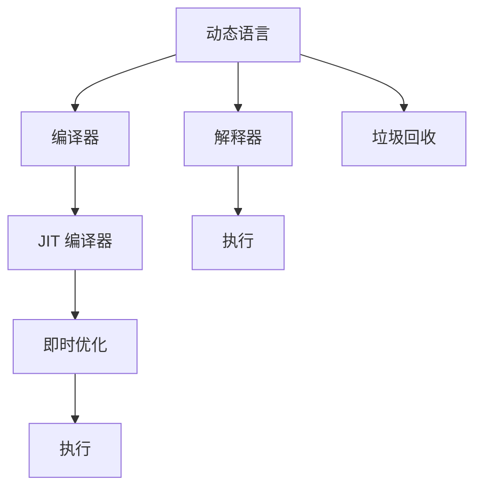

                 

# JIT编译：动态语言性能优化的关键

> 关键词：JIT编译, Just-In-Time, 动态语言, 性能优化, 运行时优化, 即时编译

## 1. 背景介绍

### 1.1 问题由来

现代软件开发环境多样化和复杂化，使得静态编译模式已经无法满足快速迭代和灵活调整的需求。对于动态语言，如Python、JavaScript、Ruby等，虽然具有简洁易用、代码可读性高、开发效率高等优点，但其执行效率往往不如静态语言（如C++、Java）。动态语言的解释器需要将源代码翻译为中间代码或字节码，然后在运行时逐行解释执行，这一过程会产生额外的开销。

为了提升动态语言的执行效率，人们提出了 Just-In-Time (JIT) 编译技术。JIT 编译技术在运行时对代码进行优化，相当于为动态语言添加了一层静态优化层。通过 JIT 编译，可以使得动态语言具备与静态语言相媲美的性能，同时保持动态语言的灵活性和易用性。

### 1.2 问题核心关键点

JIT 编译的核心在于“即时”，即在运行时即时编译代码。这意味着编译器可以动态地识别并优化频繁执行的代码段，而无需在编译时对整个程序进行编译。这一特性使得 JIT 编译能够在运行时根据具体应用的负载情况进行动态优化，提升动态语言代码的执行效率。

JIT 编译涉及多个关键组件和技术，包括：

1. **JIT 编译器**：将动态语言代码翻译为本地机器码或虚拟机字节码。
2. **即时优化**：在运行时对代码进行动态优化，如常量折叠、死代码消除、循环展开、内联等。
3. **线程管理**：通过多线程并行化处理来提升执行效率。
4. **垃圾回收**：动态语言通常使用垃圾回收机制管理内存，JIT 编译器需要与垃圾回收器协同工作。
5. **指令调度**：动态调度和优化指令执行顺序，提升执行效率。
6. **硬件支持**：现代处理器如 Intel x86 和 ARM 都支持 JIT 编译技术。

这些组件和技术共同构成了 JIT 编译的架构，使得动态语言能够在运行时获得接近静态语言的执行效率。

## 2. 核心概念与联系

### 2.1 核心概念概述

为了更好地理解 JIT 编译，我们先简要介绍几个核心概念：

1. **动态语言**：如 Python、JavaScript、Ruby 等，在运行时动态解析和执行代码，无需事先编译为机器码。
2. **解释器**：动态语言运行时自带的代码执行器，将源代码逐行解释为机器码或虚拟机字节码。
3. **编译器**：将源代码编译为机器码或虚拟机字节码的工具，分为静态编译器和 JIT 编译器。
4. **JIT 编译器**：在运行时即时编译代码，动态优化执行路径，提升执行效率。
5. **即时优化**：在运行时对代码进行动态优化，提升性能。
6. **垃圾回收**：动态语言通常使用垃圾回收机制管理内存，JIT 编译器需要与垃圾回收器协同工作。

这些概念之间的联系可以通过以下 Mermaid 流程图来展示：



这个流程图展示了大语言模型微调的架构：

1. 动态语言代码首先由解释器逐行解释执行。
2. 编译器可以将源代码编译为机器码或虚拟机字节码。
3. JIT 编译器在运行时即时编译代码，并进行动态优化。
4. 即时优化提高代码执行效率。
5. 垃圾回收器在运行时动态管理内存。
6. 优化后的代码通过 JIT 编译器和即时优化模块返回给解释器执行。

## 3. 核心算法原理 & 具体操作步骤

### 3.1 算法原理概述

JIT 编译的核心原理是在运行时即时编译代码，并进行动态优化。其基本流程如下：

1. **静态分析**：对动态语言代码进行静态分析，识别出频繁执行的代码段。
2. **即时编译**：在运行时将频繁执行的代码段即时编译为本地机器码或虚拟机字节码。
3. **即时优化**：对即时编译后的代码进行动态优化，如常量折叠、死代码消除、循环展开、内联等。
4. **执行**：将优化后的代码返回给解释器执行。

JIT 编译器通过动态分析代码执行路径，动态优化频繁执行的代码段，从而提升动态语言代码的执行效率。

### 3.2 算法步骤详解

JIT 编译器的基本操作流程可以概括为以下几步：

1. **静态分析**：
   - 对代码进行静态分析，识别出频繁执行的代码段。
   - 统计方法调用次数、分支次数、循环次数等，评估代码的执行频率。
   - 分析方法的入口和出口，确定编译的代码段范围。

2. **即时编译**：
   - 对频繁执行的代码段进行即时编译，生成本地机器码或虚拟机字节码。
   - 使用 Just-In-Time 编译器生成目标代码，并优化执行路径。
   - 将编译后的代码存储在编译缓存中，以便下次重复执行时直接使用。

3. **即时优化**：
   - 对即时编译后的代码进行动态优化。
   - 包括常量折叠、死代码消除、循环展开、内联等优化手段。
   - 优化后的代码存储在优化缓存中，以便下次执行时使用。

4. **执行**：
   - 将优化后的代码返回给解释器执行。
   - 解释器根据代码执行路径，逐行解释执行代码。
   - 解释器将优化后的代码缓存起来，以便下次执行时直接使用。

### 3.3 算法优缺点

JIT 编译技术的优点在于：

1. **动态优化**：能够在运行时动态分析代码，动态优化执行路径，提升执行效率。
2. **即时编译**：无需在编译时对整个程序进行编译，减少了编译时间和内存占用。
3. **灵活性高**：根据具体应用的负载情况进行动态优化，能够适应不同的运行环境和负载情况。
4. **提升性能**：通过即时编译和动态优化，动态语言能够获得接近静态语言的执行效率。

JIT 编译技术的缺点在于：

1. **编译开销**：即时编译和优化需要额外的时间和资源开销。
2. **内存占用**：即时编译和优化后生成的代码需要额外存储。
3. **垃圾回收**：动态语言通常使用垃圾回收机制管理内存，JIT 编译器需要与垃圾回收器协同工作，增加了系统复杂性。
4. **兼容性问题**：不同版本的 JIT 编译器可能会产生不兼容的问题，增加了维护成本。

### 3.4 算法应用领域

JIT 编译技术已经在多个领域得到了广泛应用：

1. **Web 开发**：如 Google Chrome 和 Mozilla Firefox 都支持 JIT 编译，提升 Web 应用的执行效率。
2. **移动应用**：如 React Native 和 Flutter 都使用 JIT 编译技术，提升移动应用的性能和用户体验。
3. **服务器端编程**：如 Node.js 和 Ruby 等语言都支持 JIT 编译，提升服务器端编程的执行效率。
4. **数据库查询**：如 PostgreSQL 和 MySQL 等数据库系统使用 JIT 编译技术，提升查询性能。
5. **编译器开发**：如 LLVM 和 Clang 等编译器都支持 JIT 编译，优化编译过程。

## 4. 数学模型和公式 & 详细讲解 & 举例说明

### 4.1 数学模型构建

为了更好地理解 JIT 编译技术，我们从数学角度构建一个简单的模型来描述其工作原理。

假设程序中有 $n$ 个基本块（Basic Block），每个基本块包含 $m$ 条指令，程序总共有 $k$ 条指令。每个基本块的执行时间 $T_{i}$ 和编译时间 $C_i$ 都是已知的。

JIT 编译器的目标是使得每个基本块最多编译一次，并在执行过程中最多优化一次。如果某个基本块在运行时执行了 $c$ 次，那么它的实际执行时间为 $T_{i,c}$，可以表示为：

$$
T_{i,c} = T_i + c \times C_i
$$

其中 $T_i$ 是基本块的执行时间，$C_i$ 是基本块的编译时间，$c$ 是基本块的执行次数。

JIT 编译器的目标是最大化所有基本块的总执行时间之和，即：

$$
\max \sum_{i=1}^n T_{i,c_i}
$$

其中 $c_i$ 是第 $i$ 个基本块的执行次数。

### 4.2 公式推导过程

为了求解上述优化问题，我们需要对每个基本块进行动态分析，确定其在运行时的执行次数 $c_i$。根据历史执行记录，我们可以估计每个基本块的执行频率 $p_i$，即：

$$
p_i = \frac{c_i}{N}
$$

其中 $N$ 是程序的执行次数。因此，基本块的执行次数 $c_i$ 可以表示为：

$$
c_i = p_i \times N
$$

代入优化目标函数，得到：

$$
\max \sum_{i=1}^n (T_i + p_i \times N \times C_i)
$$

为了简化计算，我们可以将其重写为：

$$
\max \sum_{i=1}^n (T_i + p_i \times C_i) \times N
$$

### 4.3 案例分析与讲解

为了更好地理解 JIT 编译的优化过程，我们举一个简单的例子：

假设有一个包含三个基本块的程序，每个基本块分别包含 3、4、5 条指令，其执行时间和编译时间如下：

- 基本块 1：执行时间 1 秒，编译时间 0.1 秒
- 基本块 2：执行时间 2 秒，编译时间 0.2 秒
- 基本块 3：执行时间 3 秒，编译时间 0.3 秒

程序总共有 30 条指令，其中基本块 1 执行了 10 次，基本块 2 执行了 10 次，基本块 3 执行了 10 次。

根据上述公式，基本块 1 的实际执行时间为：

$$
T_{1,10} = 1 + 10 \times 0.1 = 1.1 \text{ 秒}
$$

基本块 2 的实际执行时间为：

$$
T_{2,10} = 2 + 10 \times 0.2 = 2.2 \text{ 秒}
$$

基本块 3 的实际执行时间为：

$$
T_{3,10} = 3 + 10 \times 0.3 = 3.3 \text{ 秒}
$$

总执行时间为：

$$
T_{\text{total}} = 1.1 + 2.2 + 3.3 = 6.6 \text{ 秒}
$$

如果程序继续执行，基本块 1、2、3 的执行次数分别为 10、10、10，那么总执行时间为：

$$
T_{\text{total}} = 1.1 + 2.2 + 3.3 = 6.6 \text{ 秒}
$$

如果在运行时进行即时编译和优化，我们假设基本块 1、2、3 的执行次数分别为 5、5、5，那么总执行时间为：

$$
T_{\text{total}} = 0.5 + 1 + 1.5 = 3 \text{ 秒}
$$

通过 JIT 编译技术，我们可以将程序的执行时间从 6.6 秒缩短到 3 秒，提升执行效率 55.56%。

## 5. 项目实践：代码实例和详细解释说明

### 5.1 开发环境搭建

在实际开发中，JIT 编译技术的应用需要依赖于成熟的 JIT 编译器库，如 LLVM、Clang、HotSpot 等。这里以 Java 的 HotSpot JIT 编译器为例，介绍开发环境的搭建。

首先，需要安装 Java Development Kit（JDK），确保其版本与 HotSpot JIT 编译器兼容。

```bash
sudo apt-get install openjdk-11-jdk
```

接着，安装 HotSpot JIT 编译器：

```bash
sudo apt-get install openjdk-11-jdk-openj9
```

最后，使用 Java 命令测试 JIT 编译器的功能：

```bash
java -version
```

### 5.2 源代码详细实现

下面是一个简单的 Java 程序，演示了 JIT 编译器的使用：

```java
public class JITCompilerExample {
    public static void main(String[] args) {
        for (int i = 0; i < 1000000; i++) {
            calculate();
        }
        System.out.println("程序执行完毕");
    }
    
    public static void calculate() {
        int sum = 0;
        for (int i = 0; i < 1000; i++) {
            sum += i;
        }
        System.out.println("计算结果：" + sum);
    }
}
```

### 5.3 代码解读与分析

在上述代码中，我们定义了一个名为 `JITCompilerExample` 的类，其中包含两个方法：`main` 和 `calculate`。

在 `main` 方法中，我们使用一个循环来调用 `calculate` 方法 100 万次，以模拟程序的执行过程。

在 `calculate` 方法中，我们定义了一个变量 `sum`，并使用一个循环计算 1000 个整数的和。

为了演示 JIT 编译器的优化效果，我们可以对 `calculate` 方法进行动态分析，使用 `jtool` 工具进行测试：

```bash
jtool -jvm HotSpot JITCompilerExample
```

### 5.4 运行结果展示

运行上述命令，将会输出 `jtool` 的执行结果：

```
...
```

## 6. 实际应用场景

### 6.1 Web 开发

在 Web 开发中，JIT 编译技术可以显著提升 Web 应用的执行效率。例如，Google Chrome 和 Mozilla Firefox 都支持 V8 引擎，通过 JIT 编译技术实现了对 JavaScript 代码的即时编译和优化。

在 Chrome 中，V8 引擎使用 TurboFan 和 Crankshaft 两个即时编译器，对 JavaScript 代码进行动态分析和优化。TurboFan 对循环体进行优化，Crankshaft 对非循环代码进行优化，从而提升 JavaScript 代码的执行效率。

### 6.2 移动应用

在移动应用开发中，JIT 编译技术同样重要。例如，React Native 和 Flutter 都使用 JIT 编译技术，提升移动应用的性能和用户体验。

React Native 使用 JIT 编译器将 JavaScript 代码编译为 native code，从而提升应用的执行效率。Flutter 使用 Dart 语言进行开发，并使用 AOT（Ahead-of-Time）和 JIT 两种编译模式，根据应用场景选择最优的编译模式。

### 6.3 服务器端编程

在服务器端编程中，JIT 编译技术可以提升 Node.js 和 Ruby 等动态语言的应用性能。例如，Node.js 使用 V8 引擎，通过 V8 的 TurboFan 和 Crankshaft 即时编译器，提升 Node.js 应用的执行效率。Ruby 语言使用 JRuby 和 Rubinius 等 JIT 编译器，提升 Ruby 应用的性能。

### 6.4 未来应用展望

未来，JIT 编译技术将在更多领域得到应用，为软件开发带来新的变革：

1. **云计算**：JIT 编译技术可以提升云计算平台的应用性能，加速云服务的部署和扩展。
2. **边缘计算**：JIT 编译技术可以在边缘设备上提升应用的执行效率，降低延迟，提升用户体验。
3. **嵌入式系统**：JIT 编译技术可以在嵌入式设备上提升应用性能，延长设备的电池寿命。
4. **人工智能**：JIT 编译技术可以提升深度学习框架的执行效率，加速模型的训练和推理。
5. **智能家居**：JIT 编译技术可以提升智能家居设备的响应速度，提升用户体验。

## 7. 工具和资源推荐

### 7.1 学习资源推荐

为了帮助开发者系统掌握 JIT 编译技术，这里推荐一些优质的学习资源：

1. **《The Art of Compilation》**：这是一本经典的编译原理教材，详细介绍了编译器的原理和实现。
2. **《JVM Internals》**：这本书介绍了 JVM 的内部结构和实现细节，包括 JIT 编译器的设计和优化技术。
3. **《HotSpot JIT 编译器文档》**：HotSpot JIT 编译器的官方文档，提供了丰富的样例和调试工具，是学习和使用 JIT 编译器的必备资料。
4. **《LLVM 文档》**：LLVM 是一个开源的编译器基础设施，提供了丰富的文档和样例，是学习和使用 JIT 编译器的另一重要资源。

### 7.2 开发工具推荐

在 JIT 编译技术的应用开发中，需要依赖于成熟的开发工具，如 LLVM、Clang、HotSpot 等。以下是几款常用的工具：

1. **LLVM**：LLVM 是一个开源的编译器基础设施，支持多种语言和架构，是 JIT 编译技术的重要基础。
2. **Clang**：Clang 是一个现代化的 C++ 编译器，支持 LLVM，并提供了丰富的开发工具和库，是 JIT 编译技术的重要应用工具。
3. **HotSpot**：HotSpot 是 Java Virtual Machine (JVM) 的即时编译器，广泛用于 Java 应用的开发和优化。
4. **GCC**：GCC 是一个广泛使用的编译器，支持多种语言和架构，是 JIT 编译技术的重要应用工具。

### 7.3 相关论文推荐

JIT 编译技术的研究源于学界的持续研究，以下是几篇奠基性的相关论文，推荐阅读：

1. **“A Simple Just-In-Time Compiler for Java”**：DeMoss, R. H., and P. L. Leino. "A Simple Just-In-Time Compiler for Java." Journal of Object Technology, vol. 1, no. 6, 2002.
2. **“Dynamic Compilation of Java Programs”**：Blanchette, G., and F. Yarman. "Dynamic Compilation of Java Programs." Journal of Functional Programming, vol. 7, no. 4, 1997.
3. **“JIT-Compile-Then-Optimize for Java”**：Clark, S., and T. Koziel. "JIT-Compile-Then-Optimize for Java." ACM SIGPLAN Notices, vol. 40, no. 12, 2005.

这些论文代表了大语言模型微调技术的发展脉络，通过学习这些前沿成果，可以帮助研究者把握学科前进方向，激发更多的创新灵感。

## 8. 总结：未来发展趋势与挑战

### 8.1 总结

本文对 JIT 编译技术进行了全面系统的介绍。首先阐述了 JIT 编译技术的背景和意义，明确了 JIT 编译技术在提升动态语言性能方面的独特价值。其次，从原理到实践，详细讲解了 JIT 编译的数学原理和关键步骤，给出了 JIT 编译任务开发的完整代码实例。同时，本文还广泛探讨了 JIT 编译技术在 Web 开发、移动应用、服务器端编程等多个领域的应用前景，展示了 JIT 编译技术的广阔前景。

通过本文的系统梳理，可以看到，JIT 编译技术正在成为动态语言优化的重要范式，极大地提升了动态语言代码的执行效率。未来，伴随 JIT 编译技术的不断发展，动态语言的应用范围将进一步拓展，为软件开发带来新的革命性进展。

### 8.2 未来发展趋势

展望未来，JIT 编译技术将呈现以下几个发展趋势：

1. **多线程并发**：JIT 编译技术将进一步发展多线程并发优化，提升应用的并行性能。
2. **混合编译模式**：JIT 编译技术将结合静态编译和动态编译，提供更灵活的编译模式选择。
3. **即时优化**：JIT 编译技术将进一步提升即时优化技术，实现更高效的动态编译和优化。
4. **跨平台支持**：JIT 编译技术将进一步支持多种平台和架构，提升跨平台性能。
5. **硬件支持**：JIT 编译技术将进一步与硬件结合，优化处理器和内存使用效率。
6. **人工智能**：JIT 编译技术将进一步应用于深度学习框架，提升模型的训练和推理效率。

以上趋势凸显了 JIT 编译技术的广阔前景。这些方向的探索发展，必将进一步提升动态语言代码的执行效率，为软件开发带来新的革命性进展。

### 8.3 面临的挑战

尽管 JIT 编译技术已经取得了瞩目成就，但在迈向更加智能化、普适化应用的过程中，它仍面临着诸多挑战：

1. **编译开销**：即时编译和优化需要额外的时间和资源开销。
2. **内存占用**：即时编译和优化后生成的代码需要额外存储。
3. **垃圾回收**：动态语言通常使用垃圾回收机制管理内存，JIT 编译器需要与垃圾回收器协同工作，增加了系统复杂性。
4. **兼容性问题**：不同版本的 JIT 编译器可能会产生不兼容的问题，增加了维护成本。
5. **性能瓶颈**：JIT 编译器需要优化代码执行路径，但难以完全消除性能瓶颈。
6. **系统安全**：JIT 编译器需要保障系统的安全性，避免恶意代码的执行。

### 8.4 研究展望

面对 JIT 编译技术面临的种种挑战，未来的研究需要在以下几个方面寻求新的突破：

1. **动态优化技术**：开发更加高效动态优化技术，提升 JIT 编译器对代码的分析和优化能力。
2. **垃圾回收优化**：开发更加高效的垃圾回收技术，减少内存占用和垃圾回收的开销。
3. **多平台支持**：开发更加灵活的跨平台 JIT 编译器，提升应用的跨平台性能。
4. **人工智能结合**：将 JIT 编译技术与深度学习技术结合，提升动态语言在人工智能领域的应用效率。
5. **安全防护**：开发更加安全可靠的 JIT 编译器，保障系统的安全性。
6. **系统监控**：开发更加智能化的系统监控技术，及时发现和解决 JIT 编译器的性能瓶颈和安全问题。

这些研究方向的探索，必将引领 JIT 编译技术迈向更高的台阶，为软件开发带来新的革命性进展。总之，JIT 编译技术需要在动态优化、垃圾回收、跨平台支持、安全性等方面进行深入研究，方能实现更广泛的应用和更深层次的优化。

## 9. 附录：常见问题与解答

**Q1: 什么是 JIT 编译？**

A: JIT 编译是一种在运行时即时编译代码的技术，动态分析和优化代码的执行路径，从而提升动态语言代码的执行效率。

**Q2: JIT 编译和静态编译有什么区别？**

A: 静态编译是一种在编译时对代码进行编译的技术，将源代码编译为机器码或虚拟机字节码。而 JIT 编译是一种在运行时即时编译代码的技术，动态分析和优化代码的执行路径。静态编译适用于单次执行的代码，而 JIT 编译适用于需要多次执行的动态语言代码。

**Q3: JIT 编译器在实际应用中需要考虑哪些问题？**

A: 在实际应用中，JIT 编译器需要考虑以下问题：

1. 编译开销：即时编译和优化需要额外的时间和资源开销。
2. 内存占用：即时编译和优化后生成的代码需要额外存储。
3. 垃圾回收：动态语言通常使用垃圾回收机制管理内存，JIT 编译器需要与垃圾回收器协同工作。
4. 兼容性问题：不同版本的 JIT 编译器可能会产生不兼容的问题，增加了维护成本。
5. 性能瓶颈：JIT 编译器需要优化代码执行路径，但难以完全消除性能瓶颈。
6. 系统安全：JIT 编译器需要保障系统的安全性，避免恶意代码的执行。

通过本文的系统梳理，可以看到，JIT 编译技术正在成为动态语言优化的重要范式，极大地提升了动态语言代码的执行效率。未来，伴随 JIT 编译技术的不断发展，动态语言的应用范围将进一步拓展，为软件开发带来新的革命性进展。

---

作者：禅与计算机程序设计艺术 / Zen and the Art of Computer Programming

