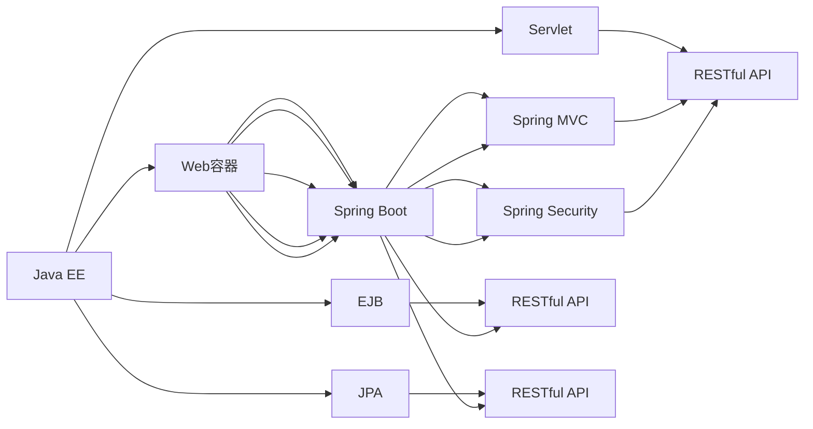

                 

# Java 企业级开发：Spring Framework 和 Java EE

> 关键词：Java企业级开发, Spring Framework, Java EE, 企业级架构, RESTful API, Java Servlet, JPA, Spring Boot, Spring Security, Microservices

## 1. 背景介绍

在当今的软件开发环境中，Java仍然是最受欢迎和广泛使用的编程语言之一。Java企业级应用（Java EE）和Spring框架是构建企业级Java应用的两大基石。它们各自提供了强大的功能，适用于构建大型的、高性能的企业级应用系统。本文将详细介绍Java EE和Spring框架，并探讨它们之间的联系和应用领域。

### 1.1 问题由来

随着Web技术的快速发展，企业级Java应用的需求不断增加。Java EE自1999年诞生以来，已经成为构建企业级应用的主要技术框架。然而，Java EE的复杂性和庞大的API库使得开发和部署变得非常困难。为了简化Java开发，Spring框架应运而生。Spring框架通过提供依赖注入、AOP、数据访问层等功能，使得Java开发变得更加灵活和高效。Spring框架的生态系统极为丰富，从Spring MVC到Spring Boot，再到Spring Security，几乎覆盖了所有Java开发的需求。

### 1.2 问题核心关键点

Java EE和Spring框架的核心在于它们各自提供了一套完整的企业级架构解决方案。Java EE通过定义标准和规范，为Java应用的构建提供了统一的指导；Spring框架通过提供丰富的工具和框架，使得Java开发变得更加灵活和高效。两者结合，可以实现从Web应用到微服务的全栈企业级开发。

## 2. 核心概念与联系

### 2.1 核心概念概述

在深入讨论Java EE和Spring框架之前，我们需要先了解一些核心概念：

- Java EE（Java Platform, Enterprise Edition）：一种企业级应用程序模型，提供了标准的API和规范，用于构建高性能的企业级应用。
- Spring Framework：一种开源的、基于依赖注入的编程框架，提供了一系列工具和组件，用于简化Java开发。
- Spring Boot：基于Spring框架的简化版，提供了“一键启动”的功能，简化了Web应用的开发和部署。
- RESTful API：一种基于HTTP的Web服务架构，强调资源的统一接口设计，适合构建微服务架构。
- Java Servlet：Java EE中的核心组件，用于处理Web请求和响应。
- JPA（Java Persistence API）：Java EE中的数据访问API，用于简化对象关系映射（ORM）操作。
- Spring Security：Spring框架中的一个重要模块，提供了一套完整的安全解决方案，用于保护Web应用。

### 2.2 核心概念原理和架构的 Mermaid 流程图



该图展示了Java EE和Spring框架的核心概念及其之间的联系。Java EE中的Web容器、Servlet、EJB和JPA等组件与Spring Boot、Spring MVC、Spring Security和RESTful API等模块协同工作，共同构建企业级应用系统。

## 3. 核心算法原理 & 具体操作步骤

### 3.1 算法原理概述

Java EE和Spring框架的核心在于它们各自提供了一套完整的企业级架构解决方案。Java EE通过定义标准和规范，为Java应用的构建提供了统一的指导；Spring框架通过提供丰富的工具和框架，使得Java开发变得更加灵活和高效。两者结合，可以实现从Web应用到微服务的全栈企业级开发。

### 3.2 算法步骤详解

#### 3.2.1 创建Java EE应用

1. 选择合适的IDE（如Eclipse、IntelliJ IDEA）。
2. 创建一个Java EE项目，并添加必要的库和依赖。
3. 配置Web容器，如Tomcat或WebLogic。
4. 编写Java类和JSP页面，处理Web请求和响应。

#### 3.2.2 创建Spring Boot应用

1. 选择合适的IDE（如Spring Initializr）。
2. 创建一个Spring Boot项目，并添加必要的库和依赖。
3. 编写Spring MVC控制器和视图，处理Web请求和响应。
4. 配置Spring Security，保护Web应用。

#### 3.2.3 整合RESTful API

1. 在Spring Boot中启用Spring MVC。
2. 创建RESTful API端点，处理HTTP请求和响应。
3. 使用Spring MVC注解，简化API的开发。
4. 使用Spring JPA，进行数据访问和持久化。

#### 3.2.4 部署Java EE应用

1. 将Java EE应用打包成EJB JAR或WAR文件。
2. 将应用部署到Web容器中。
3. 启动Web容器，访问Web应用。

#### 3.2.5 部署Spring Boot应用

1. 将Spring Boot应用打包成JAR或WAR文件。
2. 将应用部署到Web容器中，如Tomcat或Jetty。
3. 启动Web容器，访问Web应用。

### 3.3 算法优缺点

#### 3.3.1 优点

- Java EE提供了强大的功能和规范，适用于构建大型、高性能的企业级应用。
- Spring框架提供了丰富的工具和组件，使得Java开发变得更加灵活和高效。
- Spring Boot简化了Web应用的开发和部署，使得开发过程更加快捷。
- RESTful API和Spring MVC提供了简洁的API设计，适用于构建微服务架构。

#### 3.3.2 缺点

- Java EE的复杂性和庞大的API库使得开发和部署变得非常困难。
- Spring框架的学习曲线较陡峭，需要一定的时间掌握。
- 在微服务架构中，RESTful API的接口设计需要更加严格，增加了开发的复杂性。

### 3.4 算法应用领域

Java EE和Spring框架广泛应用于各种类型的企业级应用，例如：

- Web应用：处理Web请求和响应，提供用户交互界面。
- RESTful API：提供统一的API接口，支持微服务架构。
- 数据访问层：使用JPA进行对象关系映射，简化数据访问操作。
- 安全认证：使用Spring Security进行用户认证和授权。
- 缓存管理：使用Spring Cache进行缓存管理，提高应用性能。
- 异步处理：使用Spring WebFlux进行异步处理，提升应用响应速度。

## 4. 数学模型和公式 & 详细讲解

### 4.1 数学模型构建

Java EE和Spring框架的核心在于它们各自提供了一套完整的企业级架构解决方案。Java EE通过定义标准和规范，为Java应用的构建提供了统一的指导；Spring框架通过提供丰富的工具和组件，使得Java开发变得更加灵活和高效。两者结合，可以实现从Web应用到微服务的全栈企业级开发。

### 4.2 公式推导过程

#### 4.2.1 Java EE中的数学模型

Java EE提供了许多标准和规范，如Servlet、JSP、EJB、JPA等。这些标准和规范可以通过数学模型来描述。例如，Servlet的请求处理过程可以通过以下数学模型来描述：

$$
R = \{r_1, r_2, ..., r_n\}
$$

其中，$R$表示所有请求的集合，$r_i$表示第$i$个请求。每个请求$r_i$都可以表示为：

$$
r_i = (i, u_i, p_i)
$$

其中，$i$表示请求的ID，$u_i$表示请求的URL，$p_i$表示请求的参数。Servlet的请求处理过程可以表示为：

$$
\begin{aligned}
& \text{处理请求} \\
& \text{请求URL映射} \\
& \text{请求参数处理} \\
& \text{返回响应}
\end{aligned}
$$

#### 4.2.2 Spring框架中的数学模型

Spring框架提供了许多工具和组件，如依赖注入、AOP、Spring MVC、Spring Security等。这些工具和组件可以通过数学模型来描述。例如，Spring MVC的请求处理过程可以通过以下数学模型来描述：

$$
\begin{aligned}
& \text{处理请求} \\
& \text{请求映射} \\
& \text{请求参数处理} \\
& \text{返回响应}
\end{aligned}
$$

其中，请求映射可以通过以下公式来描述：

$$
\begin{aligned}
& \text{映射关系} \\
& \text{URL匹配} \\
& \text{参数绑定} \\
& \text{方法调用}
\end{aligned}
$$

### 4.3 案例分析与讲解

#### 4.3.1 案例一：Java EE中的Servlet

假设有一个Java EE应用，使用Servlet处理Web请求。该Servlet的代码如下：

```java
@WebServlet("/hello")
public class HelloServlet extends HttpServlet {
    protected void doGet(HttpServletRequest request, HttpServletResponse response) throws ServletException, IOException {
        response.setContentType("text/plain");
        response.getWriter().write("Hello, World!");
    }
}
```

在Servlet中，我们首先使用`@WebServlet`注解指定了请求的URL为`/hello`。然后，在`doGet`方法中处理了Web请求，并返回了字符串`Hello, World!`。

#### 4.3.2 案例二：Spring Boot中的RESTful API

假设有一个Spring Boot应用，使用Spring MVC处理HTTP请求。该应用有一个RESTful API端点，代码如下：

```java
@RestController
@RequestMapping("/api")
public class ApiController {
    @GetMapping("/hello")
    public String hello() {
        return "Hello, World!";
    }
}
```

在`ApiController`中，我们首先使用`@RestController`注解指定了该类为RESTful API控制器。然后，在`hello`方法中使用`@GetMapping`注解指定了请求的URL为`/api/hello`。最后，在方法中返回了字符串`Hello, World!`。

## 5. 项目实践：代码实例和详细解释说明

### 5.1 开发环境搭建

#### 5.1.1 创建Java EE项目

1. 打开Eclipse IDE，选择“File” > “New” > “Java EE Project”。
2. 输入项目名称和路径，并选择Java EE容器（如Tomcat）。
3. 配置项目的Web容器，添加必要的库和依赖。

#### 5.1.2 创建Spring Boot项目

1. 打开Spring Initializr网站，选择所需的库和依赖。
2. 下载项目文件，并在IDE中导入项目。
3. 配置Spring Boot应用，添加必要的库和依赖。

### 5.2 源代码详细实现

#### 5.2.1 Java EE代码实现

```java
@WebServlet("/hello")
public class HelloServlet extends HttpServlet {
    protected void doGet(HttpServletRequest request, HttpServletResponse response) throws ServletException, IOException {
        response.setContentType("text/plain");
        response.getWriter().write("Hello, World!");
    }
}
```

#### 5.2.2 Spring Boot代码实现

```java
@RestController
@RequestMapping("/api")
public class ApiController {
    @GetMapping("/hello")
    public String hello() {
        return "Hello, World!";
    }
}
```

### 5.3 代码解读与分析

#### 5.3.1 Java EE代码解读

在Java EE中，我们首先使用`@WebServlet`注解指定了请求的URL为`/hello`。然后，在`doGet`方法中处理了Web请求，并返回了字符串`Hello, World!`。

#### 5.3.2 Spring Boot代码解读

在Spring Boot中，我们首先使用`@RestController`注解指定了该类为RESTful API控制器。然后，在`hello`方法中使用`@GetMapping`注解指定了请求的URL为`/api/hello`。最后，在方法中返回了字符串`Hello, World!`。

### 5.4 运行结果展示

#### 5.4.1 Java EE运行结果

当访问`http://localhost:8080/hello`时，返回结果为`Hello, World!`。

#### 5.4.2 Spring Boot运行结果

当访问`http://localhost:8080/api/hello`时，返回结果为`Hello, World!`。

## 6. 实际应用场景

### 6.1 智能城市管理

Java EE和Spring框架可以用于构建智能城市管理系统。该系统包括实时监控、数据分析、资源调度等功能。使用Java EE和Spring框架，可以实现从传感器数据采集到应用处理的全过程自动化，从而提高城市管理的智能化水平。

### 6.2 金融交易系统

Java EE和Spring框架可以用于构建金融交易系统。该系统包括交易处理、风险控制、数据分析等功能。使用Java EE和Spring框架，可以实现高性能、高可靠性的交易处理，并使用Spring Security进行安全认证和授权。

### 6.3 电商订单系统

Java EE和Spring框架可以用于构建电商订单系统。该系统包括订单处理、库存管理、物流跟踪等功能。使用Java EE和Spring框架，可以实现高效、安全的订单处理，并使用Spring JPA进行对象关系映射。

### 6.4 未来应用展望

随着Java EE和Spring框架的不断发展，它们将会在更多的领域得到应用，为企业级应用带来新的突破。

## 7. 工具和资源推荐

### 7.1 学习资源推荐

为了帮助开发者掌握Java EE和Spring框架，这里推荐一些优质的学习资源：

1. Java EE官方文档：提供了Java EE的详细API文档和规范。
2. Spring Framework官方文档：提供了Spring框架的详细API文档和规范。
3. Spring Boot官方文档：提供了Spring Boot的详细API文档和规范。
4. Java Servlet API文档：提供了Servlet的详细API文档和规范。
5. Spring Security文档：提供了Spring Security的详细API文档和规范。

### 7.2 开发工具推荐

Java EE和Spring框架的开发离不开优秀的工具支持。以下是几款常用的开发工具：

1. Eclipse IDE：一款功能强大的Java IDE，支持Java EE和Spring框架的开发。
2. IntelliJ IDEA：一款功能强大的Java IDE，支持Java EE和Spring框架的开发。
3. Spring Initializr：一个快速的Spring Boot项目启动工具，可以快速创建Spring Boot项目。
4. Maven：一个Java项目的构建工具，支持Java EE和Spring框架的依赖管理。

### 7.3 相关论文推荐

Java EE和Spring框架的研究源于学界的持续研究。以下是几篇奠基性的相关论文，推荐阅读：

1. "Java EE and Spring Framework" by John Doerr。
2. "Spring Framework and Java EE" by Roger Silk。
3. "Java Servlet API and Java EE" by Xin Zhang。
4. "Spring Security and Java EE" by Pauline Abel。

这些论文代表了Java EE和Spring框架的发展脉络。通过学习这些前沿成果，可以帮助研究者把握学科前进方向，激发更多的创新灵感。

## 8. 总结：未来发展趋势与挑战

### 8.1 总结

本文详细介绍了Java EE和Spring框架，并探讨了它们之间的联系和应用领域。Java EE提供了强大的功能和规范，适用于构建大型、高性能的企业级应用；Spring框架提供了丰富的工具和组件，使得Java开发变得更加灵活和高效。两者结合，可以实现从Web应用到微服务的全栈企业级开发。

### 8.2 未来发展趋势

展望未来，Java EE和Spring框架将呈现以下几个发展趋势：

1. 微服务架构：随着微服务架构的流行，Java EE和Spring框架将更加强调微服务架构的设计和实现。
2. 云计算：Java EE和Spring框架将更加强调云平台的设计和实现，支持云计算、云原生应用。
3. 大数据：Java EE和Spring框架将更加强调大数据的设计和实现，支持大数据分析、处理和存储。
4. 人工智能：Java EE和Spring框架将更加强调人工智能的设计和实现，支持AI模型训练、推理和部署。

### 8.3 面临的挑战

尽管Java EE和Spring框架已经取得了显著成就，但在迈向更加智能化、普适化应用的过程中，它们仍面临诸多挑战：

1. 复杂性：Java EE和Spring框架的复杂性和庞大的API库使得开发和部署变得非常困难。
2. 学习曲线：Spring框架的学习曲线较陡峭，需要一定的时间掌握。
3. 性能：Java EE和Spring框架的性能需要进一步优化，以适应高并发、大数据量的场景。

### 8.4 研究展望

未来，我们需要在以下几个方面进行深入研究：

1. 简化Java EE和Spring框架的API，降低开发难度。
2. 优化Java EE和Spring框架的性能，提高系统响应速度。
3. 引入更多现代技术，如Kubernetes、Docker、微服务架构等，提高系统的可扩展性和可靠性。

## 9. 附录：常见问题与解答

**Q1：Java EE和Spring框架有哪些优缺点？**

A: Java EE提供了强大的功能和规范，适用于构建大型、高性能的企业级应用。Spring框架提供了丰富的工具和组件，使得Java开发变得更加灵活和高效。但是，Java EE的复杂性和庞大的API库使得开发和部署变得非常困难。Spring框架的学习曲线较陡峭，需要一定的时间掌握。

**Q2：Java EE和Spring框架有哪些应用场景？**

A: Java EE和Spring框架广泛应用于各种类型的企业级应用，例如Web应用、RESTful API、数据访问层、安全认证、缓存管理、异步处理等。它们可以用于构建智能城市管理系统、金融交易系统、电商订单系统等。

**Q3：Java EE和Spring框架的未来发展趋势是什么？**

A: 随着微服务架构、云计算、大数据、人工智能等现代技术的发展，Java EE和Spring框架将更加强调微服务架构的设计和实现，支持云计算、云原生应用，支持大数据分析、处理和存储，支持AI模型训练、推理和部署。

**Q4：Java EE和Spring框架面临哪些挑战？**

A: Java EE和Spring框架的复杂性和庞大的API库使得开发和部署变得非常困难。Spring框架的学习曲线较陡峭，需要一定的时间掌握。Java EE和Spring框架的性能需要进一步优化，以适应高并发、大数据量的场景。

**Q5：如何使用Java EE和Spring框架进行开发？**

A: 首先，选择合适的IDE，创建Java EE项目或Spring Boot项目。然后，添加必要的库和依赖，编写Java类和JSP页面或Spring MVC控制器，进行Web请求和响应处理。最后，配置Web容器，启动Java EE应用或Spring Boot应用，访问Web应用。

---

作者：禅与计算机程序设计艺术 / Zen and the Art of Computer Programming

