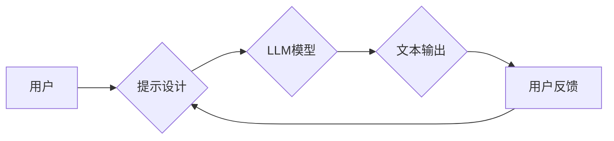

> 大语言模型、提示工程、自然语言处理、深度学习、Transformer、文本生成

## 1. 背景介绍

近年来，深度学习技术取得了飞速发展，特别是大语言模型（Large Language Model，LLM）的出现，为自然语言处理（Natural Language Processing，NLP）领域带来了革命性的变革。LLM 拥有强大的文本理解和生成能力，能够完成诸如文本摘要、机器翻译、对话系统等多种复杂的任务。然而，LLM 的应用并非一帆风顺，其性能受限于训练数据和模型架构，并且需要精心设计的输入格式才能获得最佳效果。

提示工程（Prompt Engineering）应运而生，它旨在通过设计巧妙的输入提示，引导LLM 生成更准确、更符合预期结果的输出。提示工程已成为LLM应用的关键技术之一，它不仅可以提升模型性能，还可以降低模型训练成本和开发难度。

## 2. 核心概念与联系

**2.1  大语言模型 (LLM)**

大语言模型是指参数量巨大、训练数据海量的人工智能模型，能够理解和生成人类语言。常见的LLM架构包括Transformer、GPT、BERT等。这些模型通过学习大量的文本数据，掌握了语言的语法、语义和上下文关系，从而能够完成各种自然语言处理任务。

**2.2  提示工程 (Prompt Engineering)**

提示工程是指设计和优化输入提示，以引导LLM生成更准确、更符合预期结果的输出。提示工程是一个迭代的过程，需要根据模型的特性和任务需求不断调整和改进提示内容。

**2.3  提示与模型交互**

提示工程的核心在于理解LLM的输入机制和输出机制。LLM通常接受文本序列作为输入，并根据输入序列生成相应的文本序列作为输出。提示工程通过设计特定的输入提示，引导LLM关注特定信息，并生成符合预期结果的输出。

**2.4  提示工程与其他技术**

提示工程与其他NLP技术相互关联，例如：

* **数据预处理:** 数据预处理可以提高LLM的输入质量，从而提升提示工程的效果。
* **模型微调:** 模型微调可以针对特定任务优化LLM，使其在提示工程中表现更优。
* **强化学习:** 强化学习可以用于训练提示生成器，自动生成更有效的提示。

**Mermaid 流程图**



## 3. 核心算法原理 & 具体操作步骤

**3.1  算法原理概述**

提示工程的核心算法原理是基于Transformer模型的注意力机制。Transformer模型能够学习文本序列中不同词语之间的关系，并根据上下文信息生成更准确的输出。提示工程通过设计特定的提示结构，引导Transformer模型关注特定信息，从而生成更符合预期结果的输出。

**3.2  算法步骤详解**

1. **定义任务:** 首先需要明确LLM需要完成的任务，例如文本摘要、机器翻译、对话系统等。
2. **设计提示:** 根据任务需求，设计特定的输入提示，引导LLM关注特定信息。提示可以包含以下内容：
    * **任务说明:** 明确LLM需要完成的任务。
    * **示例输入输出:** 提供一些示例输入输出，帮助LLM理解任务要求。
    * **关键词:**  突出任务中重要的关键词，引导LLM关注关键信息。
    * **语气和风格:**  指定LLM输出的语气和风格，例如正式、非正式、幽默等。
3. **评估结果:**  评估LLM生成的输出结果，并根据评估结果调整提示内容。

**3.3  算法优缺点**

**优点:**

* **易于实现:** 提示工程不需要复杂的模型训练，只需要设计合适的提示即可。
* **灵活度高:** 提示可以根据任务需求进行灵活调整，以获得最佳效果。
* **成本低:** 提示工程不需要大量的计算资源，可以降低模型训练成本。

**缺点:**

* **效果受限:** 提示工程的效果取决于提示设计的质量，如果提示设计不合理，可能会导致LLM生成错误或不符合预期结果的输出。
* **缺乏通用性:** 不同的任务可能需要不同的提示设计，缺乏通用性。

**3.4  算法应用领域**

提示工程在各种NLP领域都有广泛的应用，例如：

* **文本摘要:**  使用提示引导LLM生成文本摘要。
* **机器翻译:** 使用提示引导LLM进行机器翻译。
* **对话系统:** 使用提示引导LLM进行对话系统开发。
* **代码生成:** 使用提示引导LLM生成代码。

## 4. 数学模型和公式 & 详细讲解 & 举例说明

**4.1  数学模型构建**

LLM的训练过程本质上是一个优化问题，目标是找到模型参数，使得模型在训练数据上表现最佳。常用的优化算法包括梯度下降法和Adam算法。

**4.2  公式推导过程**

假设LLM的输出为y，输入为x，模型参数为θ，损失函数为L(y,x)，则模型训练的目标函数为：

$$
J(\theta) = \sum_{i=1}^{N} L(y_i, x_i)
$$

其中N为训练数据的数量。

模型训练的目标是找到最优的模型参数θ，使得目标函数J(θ)最小化。

**4.3  案例分析与讲解**

例如，在文本分类任务中，LLM的输出是一个概率分布，表示每个类别对应的概率。损失函数可以是交叉熵损失函数，用于衡量模型预测结果与真实标签之间的差异。

$$
L(y, \hat{y}) = - \sum_{i=1}^{C} y_i \log(\hat{y}_i)
$$

其中C为类别数量，$y_i$为真实标签，$\hat{y}_i$为模型预测的概率。

## 5. 项目实践：代码实例和详细解释说明

**5.1  开发环境搭建**

可以使用Python语言和相关的深度学习框架，例如TensorFlow或PyTorch，搭建LLM开发环境。

**5.2  源代码详细实现**

```python
import tensorflow as tf

# 定义模型结构
model = tf.keras.Sequential([
    tf.keras.layers.Embedding(input_dim=vocab_size, output_dim=embedding_dim),
    tf.keras.layers.LSTM(units=hidden_size),
    tf.keras.layers.Dense(units=vocab_size, activation='softmax')
])

# 编译模型
model.compile(optimizer='adam', loss='sparse_categorical_crossentropy', metrics=['accuracy'])

# 训练模型
model.fit(x_train, y_train, epochs=num_epochs)

# 预测结果
predictions = model.predict(x_test)
```

**5.3  代码解读与分析**

这段代码定义了一个简单的文本生成模型，使用LSTM网络结构。

* `Embedding`层将单词转换为向量表示。
* `LSTM`层学习文本序列中的上下文信息。
* `Dense`层将隐藏状态映射到输出概率分布。

**5.4  运行结果展示**

训练完成后，可以使用模型预测新的文本序列。

## 6. 实际应用场景

**6.1  文本摘要**

使用提示工程引导LLM生成文本摘要，例如新闻文章摘要、会议记录摘要等。

**6.2  机器翻译**

使用提示工程引导LLM进行机器翻译，例如将英文文本翻译成中文。

**6.3  对话系统**

使用提示工程引导LLM开发对话系统，例如聊天机器人、虚拟助手等。

**6.4  未来应用展望**

提示工程在未来将有更广泛的应用场景，例如：

* **代码生成:** 使用提示工程引导LLM生成代码，提高开发效率。
* **创意写作:** 使用提示工程引导LLM进行创意写作，例如诗歌、小说等。
* **个性化学习:** 使用提示工程根据用户的学习需求生成个性化的学习内容。

## 7. 工具和资源推荐

**7.1  学习资源推荐**

* **书籍:**
    * 《大语言模型：原理与实践》
    * 《深度学习》
* **在线课程:**
    * Coursera: 自然语言处理
    * edX: 深度学习

**7.2  开发工具推荐**

* **TensorFlow:** 开源深度学习框架
* **PyTorch:** 开源深度学习框架
* **Hugging Face:** 提供预训练LLM模型和工具

**7.3  相关论文推荐**

* **BERT: Pre-training of Deep Bidirectional Transformers for Language Understanding**
* **GPT-3: Language Models are Few-Shot Learners**
* **Prompt Engineering for Large Language Models**

## 8. 总结：未来发展趋势与挑战

**8.1  研究成果总结**

提示工程在LLM应用中取得了显著成果，能够有效提升模型性能，降低开发成本。

**8.2  未来发展趋势**

* **自动化提示生成:** 使用强化学习等技术自动生成更有效的提示。
* **多模态提示工程:** 将文本、图像、音频等多模态信息融合到提示中，提升模型的理解和生成能力。
* **可解释性提示工程:** 研究提示工程背后的机制，提高提示设计的可解释性和可控性。

**8.3  面临的挑战**

* **提示设计复杂性:** 设计有效的提示需要专业知识和经验，对于非专业人员来说难度较大。
* **提示泛化性:** 不同的任务可能需要不同的提示设计，缺乏通用性。
* **伦理问题:** 提示工程可能被用于生成虚假信息或进行恶意攻击，需要关注伦理问题。

**8.4  研究展望**

未来研究将重点关注自动化提示生成、多模态提示工程、可解释性提示工程等方面，以提升提示工程的效率和安全性。

## 9. 附录：常见问题与解答

**9.1  如何设计有效的提示？**

* 明确任务需求
* 提供示例输入输出
* 突出关键词
* 指定语气和风格

**9.2  提示工程与模型微调的关系？**

提示工程和模型微调都是提升LLM性能的技术，但它们的作用机制不同。提示工程通过设计输入提示引导模型，而模型微调通过调整模型参数优化模型。

**9.3  提示工程的伦理问题？**

提示工程可能被用于生成虚假信息或进行恶意攻击，需要关注伦理问题，确保其应用安全和可控。


作者：禅与计算机程序设计艺术 / Zen and the Art of Computer Programming 
<end_of_turn>