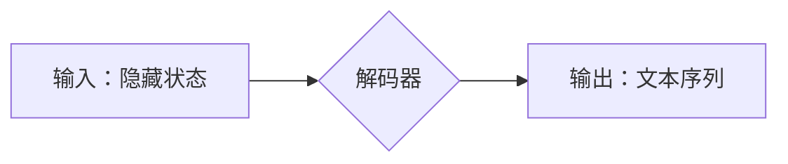

> 大语言模型，解码器，Transformer，自回归，文本生成，自然语言处理

## 1. 背景介绍

近年来，深度学习在自然语言处理（NLP）领域取得了突破性进展，其中大语言模型（LLM）作为其重要组成部分，展现出强大的文本理解和生成能力。LLM能够处理海量文本数据，学习语言的复杂结构和语义关系，从而实现各种自然语言任务，例如文本分类、机器翻译、问答系统等。

解码器作为LLM的核心组件之一，负责将模型的隐藏状态转换为可读的文本输出。本文将深入探讨解码器的原理、架构、算法以及工程实践，帮助读者理解LLM的文本生成机制，并掌握解码器设计和调优的技巧。

## 2. 核心概念与联系

解码器是LLM中负责将模型的隐藏状态转换为文本输出的模块。它通常采用自回归的方式，即根据之前生成的文本片段预测下一个词。

**Mermaid 流程图：**



**核心概念：**

* **隐藏状态：** 编码器将输入文本编码为一个向量表示，称为隐藏状态，它包含了文本的语义信息。
* **自回归：** 解码器采用自回归的方式，即根据之前生成的文本片段预测下一个词。
* **注意力机制：** 解码器通常使用注意力机制来关注输入文本中与当前预测词相关的部分，提高预测的准确性。

## 3. 核心算法原理 & 具体操作步骤

### 3.1  算法原理概述

解码器的核心算法是基于自回归的概率语言模型。它通过学习文本序列的概率分布，预测下一个词的出现概率。

### 3.2  算法步骤详解

1. **初始化：** 设置一个起始标记，例如"<SOS> "。
2. **循环预测：** 对于每个位置，解码器根据之前生成的文本片段和隐藏状态，预测下一个词的概率分布。
3. **采样：** 从概率分布中采样一个词作为下一个预测词。
4. **更新隐藏状态：** 使用采样到的词更新解码器的隐藏状态。
5. **重复步骤2-4：** 直到生成一个结束标记，例如"<EOS> "。

### 3.3  算法优缺点

**优点：**

* 能够生成流畅、连贯的文本。
* 能够处理长文本序列。
* 可以根据上下文生成不同的文本。

**缺点：**

* 训练时间长，计算资源消耗大。
* 容易出现重复或不相关的文本。
* 难以控制生成的文本风格和内容。

### 3.4  算法应用领域

* **机器翻译：** 将一种语言翻译成另一种语言。
* **文本摘要：** 生成文本的简短摘要。
* **对话系统：** 与用户进行自然语言对话。
* **代码生成：** 根据自然语言描述生成代码。

## 4. 数学模型和公式 & 详细讲解 & 举例说明

### 4.1  数学模型构建

解码器通常使用循环神经网络（RNN）或Transformer架构。

**RNN解码器：**

RNN解码器使用循环神经网络来处理文本序列，每个时间步长都根据之前生成的文本片段和隐藏状态预测下一个词。

**Transformer解码器：**

Transformer解码器使用多头注意力机制和前馈神经网络来处理文本序列，能够更好地捕捉长距离依赖关系。

### 4.2  公式推导过程

**概率语言模型：**

解码器的目标是学习文本序列的概率分布，即给定前文，预测下一个词的概率。

$$P(w_t | w_1, w_2, ..., w_{t-1})$$

其中：

* $w_t$ 是第 $t$ 个词。
* $w_1, w_2, ..., w_{t-1}$ 是前文。

**自回归模型：**

自回归模型假设每个词的概率只依赖于前文，即：

$$P(w_t | w_1, w_2, ..., w_{t-1}) = P(w_t | w_{t-1})$$

### 4.3  案例分析与讲解

**例子：**

假设我们有一个文本序列：“The cat sat on the”。

使用自回归模型，我们可以预测下一个词的概率分布：

* $P("mat" | "the")$
* $P("dog" | "the")$
* $P("chair" | "the")$

根据概率分布，我们可以选择最可能的词作为下一个预测词。

## 5. 项目实践：代码实例和详细解释说明

### 5.1  开发环境搭建

* Python 3.7+
* TensorFlow 2.0+
* PyTorch 1.0+

### 5.2  源代码详细实现

```python
import tensorflow as tf

# 定义解码器模型
class Decoder(tf.keras.Model):
    def __init__(self, vocab_size, embedding_dim, hidden_dim):
        super(Decoder, self).__init__()
        self.embedding = tf.keras.layers.Embedding(vocab_size, embedding_dim)
        self.rnn = tf.keras.layers.LSTM(hidden_dim)
        self.dense = tf.keras.layers.Dense(vocab_size)

    def call(self, inputs, hidden_state):
        # 嵌入输入词
        embedded = self.embedding(inputs)
        # 更新隐藏状态
        hidden_state = self.rnn(embedded, initial_state=hidden_state)
        # 预测下一个词的概率分布
        output = self.dense(hidden_state)
        return output, hidden_state

# 实例化解码器模型
decoder = Decoder(vocab_size=10000, embedding_dim=128, hidden_dim=256)
```

### 5.3  代码解读与分析

* **Embedding层：** 将词转换为向量表示。
* **LSTM层：** 处理文本序列，捕捉长距离依赖关系。
* **Dense层：** 预测下一个词的概率分布。

### 5.4  运行结果展示

运行解码器模型，可以生成文本序列。

## 6. 实际应用场景

### 6.1  机器翻译

解码器可以用于机器翻译，将一种语言翻译成另一种语言。

### 6.2  文本摘要

解码器可以用于文本摘要，生成文本的简短摘要。

### 6.3  对话系统

解码器可以用于对话系统，与用户进行自然语言对话。

### 6.4  未来应用展望

* **个性化内容生成：** 根据用户的喜好生成个性化的文本内容。
* **代码自动补全：** 根据代码上下文自动补全代码。
* **创意写作辅助：** 帮助作家生成创意写作内容。

## 7. 工具和资源推荐

### 7.1  学习资源推荐

* **书籍：**
    * 《深度学习》
    * 《自然语言处理》
* **在线课程：**
    * Coursera: Natural Language Processing Specialization
    * Udacity: Deep Learning Nanodegree

### 7.2  开发工具推荐

* **TensorFlow:** 开源深度学习框架。
* **PyTorch:** 开源深度学习框架。
* **Hugging Face Transformers:** 预训练语言模型库。

### 7.3  相关论文推荐

* **Attention Is All You Need:** https://arxiv.org/abs/1706.03762
* **BERT: Pre-training of Deep Bidirectional Transformers for Language Understanding:** https://arxiv.org/abs/1810.04805

## 8. 总结：未来发展趋势与挑战

### 8.1  研究成果总结

近年来，LLM在文本生成领域取得了显著进展，解码器作为其核心组件，也得到了不断改进。

### 8.2  未来发展趋势

* **更强大的模型：** 训练更大规模的LLM，提高文本生成质量。
* **更有效的训练方法：** 开发更有效的训练方法，降低训练成本。
* **更灵活的解码器：** 设计更灵活的解码器，支持多种文本生成任务。

### 8.3  面临的挑战

* **数据稀缺：** 训练高质量的LLM需要大量高质量的文本数据。
* **计算资源消耗：** 训练大型LLM需要大量的计算资源。
* **伦理问题：** LLM可能被用于生成虚假信息或进行恶意攻击，需要关注伦理问题。

### 8.4  研究展望

未来，LLM和解码器技术将继续发展，在更多领域发挥作用，例如教育、医疗、娱乐等。

## 9. 附录：常见问题与解答

**常见问题：**

* **解码器和编码器有什么区别？**
* **如何选择合适的解码器架构？**
* **如何调优解码器参数？**

**解答：**

* 解码器负责将隐藏状态转换为文本输出，而编码器负责将输入文本编码为隐藏状态。
* 选择合适的解码器架构取决于具体的文本生成任务和数据特点。
* 调优解码器参数可以通过交叉验证和评估指标来实现。


作者：禅与计算机程序设计艺术 / Zen and the Art of Computer Programming 
<end_of_turn>