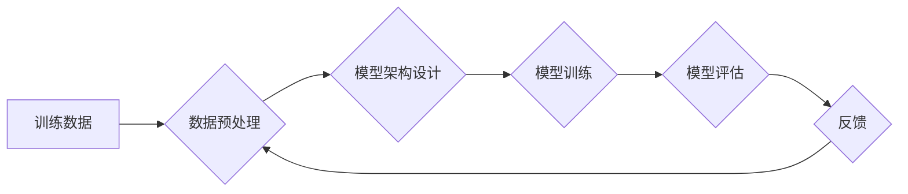

> 大语言模型、偏见、有害性、公平性、伦理、自然语言处理、深度学习、Transformer

## 1. 背景介绍

大语言模型（Large Language Models，LLMs）近年来在自然语言处理（NLP）领域取得了突破性的进展，展现出强大的文本生成、翻译、摘要、问答等能力。这些模型通常基于Transformer架构，训练于海量文本数据上，能够捕捉语言的复杂结构和语义关系。然而，LLMs也面临着一些挑战，其中最关键的是如何减少模型中的偏见和有害性。

偏见是指模型在训练数据中学习到的社会偏见，可能会导致模型生成歧视性、不公平或有害的文本。有害性是指模型生成的文本可能具有攻击性、煽动性或其他负面影响。这些问题不仅损害了模型的可靠性和可信度，也可能对社会造成负面影响。

## 2. 核心概念与联系

**2.1  大语言模型 (LLMs)**

大语言模型是指参数量巨大、训练数据海量的人工智能模型，能够理解和生成人类语言。它们通常基于Transformer架构，并通过大量的文本数据进行预训练，学习语言的语法、语义和上下文关系。

**2.2  偏见和有害性**

* **偏见:** 指模型在训练数据中学习到的社会偏见，可能会导致模型生成歧视性、不公平或有害的文本。例如，如果训练数据中存在性别偏见，模型可能会生成将女性与家务劳动联系在一起的文本。
* **有害性:** 指模型生成的文本可能具有攻击性、煽动性或其他负面影响。例如，模型可能会生成仇恨言论或虚假信息。

**2.3  减少偏见和有害性的关键技术**

* **数据预处理:** 识别和去除训练数据中的偏见和有害内容。
* **模型架构设计:** 设计能够缓解偏见和有害性的模型架构。
* **训练方法:** 使用公平性约束或对抗训练等方法，训练模型减少偏见和有害性。
* **模型评估:** 开发新的评估指标，评估模型的公平性和安全性。

**2.4  Mermaid 流程图**



## 3. 核心算法原理 & 具体操作步骤

### 3.1  算法原理概述

减少LLMs中的偏见和有害性是一个多方面的挑战，需要结合多种技术手段。

* **数据预处理:** 

    * **文本清洗:** 去除停用词、标点符号等无用信息，并规范化文本格式。
    * **敏感词过滤:** 识别和过滤训练数据中的敏感词，例如种族、性别、宗教等。
    * **数据平衡:** 调整训练数据中不同类别样本的比例，避免模型过度偏向某个类别。

* **模型架构设计:**

    * **对抗训练:** 在训练过程中加入对抗样本，训练模型抵抗对抗攻击，从而减少模型的脆弱性。
    * **公平性约束:** 在模型训练过程中加入公平性约束，例如限制模型对不同类别样本的输出差异。

* **训练方法:**

    * **正则化:** 使用正则化技术，例如L1正则化或L2正则化，惩罚模型参数的复杂度，从而减少模型的过拟合和泛化能力。
    * **梯度裁剪:** 限制梯度的大小，避免梯度爆炸，从而稳定模型训练。

### 3.2  算法步骤详解

1. **数据收集和预处理:** 收集大量文本数据，并进行文本清洗、敏感词过滤和数据平衡等预处理步骤。
2. **模型选择和架构设计:** 选择合适的模型架构，例如Transformer，并根据具体任务进行调整。
3. **模型训练:** 使用预处理后的数据训练模型，并根据具体任务选择合适的训练方法，例如对抗训练或公平性约束。
4. **模型评估:** 使用测试数据评估模型的性能，并使用公平性评估指标评估模型的公平性。
5. **模型部署和监控:** 将训练好的模型部署到实际应用场景，并持续监控模型的性能和公平性。

### 3.3  算法优缺点

**优点:**

* 可以有效减少模型中的偏见和有害性。
* 可以提高模型的公平性和安全性。

**缺点:**

* 需要大量的计算资源和时间。
* 需要专业的技术人员进行开发和维护。

### 3.4  算法应用领域

* **文本生成:** 生成不含偏见和有害性的文本，例如新闻报道、广告文案、故事等。
* **机器翻译:** 翻译文本，避免翻译过程中引入偏见和有害性。
* **聊天机器人:** 开发能够进行安全、公平、友好的对话的聊天机器人。
* **搜索引擎:** 提供更加公平、客观、准确的搜索结果。

## 4. 数学模型和公式 & 详细讲解 & 举例说明

### 4.1  数学模型构建

为了减少LLMs中的偏见和有害性，可以构建一个数学模型来衡量模型的公平性。例如，可以使用**均方误差 (MSE)**来衡量模型对不同类别样本的输出差异。

**公式:**

$$MSE = \frac{1}{N} \sum_{i=1}^{N} (y_i - \hat{y}_i)^2$$

其中：

* $N$ 是样本数量。
* $y_i$ 是真实标签。
* $\hat{y}_i$ 是模型预测的输出。

### 4.2  公式推导过程

MSE公式的推导过程如下：

1. 首先，定义模型预测的输出与真实标签之间的误差为：

$$e_i = y_i - \hat{y}_i$$

2. 然后，计算所有样本误差的平方和：

$$\sum_{i=1}^{N} e_i^2$$

3. 最后，将平方和除以样本数量，得到MSE：

$$MSE = \frac{1}{N} \sum_{i=1}^{N} e_i^2$$

### 4.3  案例分析与讲解

假设我们有一个分类模型，用于判断文本是否属于“积极”类别。我们训练了这个模型，并使用测试数据进行评估。

* 对于“积极”类文本，模型的预测准确率为90%。
* 对于“消极”类文本，模型的预测准确率为80%。

我们可以使用MSE公式来衡量模型的公平性。如果我们假设“积极”类和“消极”类文本的数量相等，那么我们可以计算出模型的MSE值。

如果MSE值较低，则表示模型对两种类别文本的预测结果差异较小，模型的公平性较高。反之，如果MSE值较高，则表示模型对两种类别文本的预测结果差异较大，模型的公平性较低。

## 5. 项目实践：代码实例和详细解释说明

### 5.1  开发环境搭建

* **操作系统:** Ubuntu 20.04
* **编程语言:** Python 3.8
* **深度学习框架:** TensorFlow 2.0
* **其他依赖:** numpy, pandas, matplotlib

### 5.2  源代码详细实现

```python
import tensorflow as tf

# 定义模型架构
model = tf.keras.Sequential([
    tf.keras.layers.Embedding(input_dim=10000, output_dim=128),
    tf.keras.layers.LSTM(units=128),
    tf.keras.layers.Dense(units=1, activation='sigmoid')
])

# 定义损失函数和优化器
loss_fn = tf.keras.losses.BinaryCrossentropy()
optimizer = tf.keras.optimizers.Adam(learning_rate=0.001)

# 训练模型
model.compile(loss=loss_fn, optimizer=optimizer)
model.fit(x_train, y_train, epochs=10)

# 评估模型
loss, accuracy = model.evaluate(x_test, y_test)
print('Loss:', loss)
print('Accuracy:', accuracy)
```

### 5.3  代码解读与分析

* **模型架构:** 该模型使用Embedding层将单词映射到向量空间，LSTM层捕捉文本序列的上下文信息，Dense层输出预测结果。
* **损失函数:** 使用BinaryCrossentropy损失函数，用于二分类任务。
* **优化器:** 使用Adam优化器，用于更新模型参数。
* **训练过程:** 使用训练数据训练模型，并使用测试数据评估模型性能。

### 5.4  运行结果展示

运行代码后，会输出模型的损失值和准确率。

## 6. 实际应用场景

### 6.1  文本生成

* **消除偏见:** 使用训练数据中去除偏见的数据训练模型，生成更加公平、客观、公正的文本。
* **生成多样性文本:** 使用对抗训练等技术，训练模型生成更加多样化的文本，避免生成单调、重复的文本。

### 6.2  机器翻译

* **避免文化差异:** 使用训练数据中包含不同文化背景的文本，训练模型避免在翻译过程中引入文化偏见。
* **提高翻译质量:** 使用更先进的机器翻译模型，例如Transformer，提高翻译的准确性和流畅度。

### 6.3  聊天机器人

* **确保安全性和友好性:** 使用公平性约束等技术，训练模型避免生成攻击性、煽动性或其他负面影响的文本。
* **提供个性化服务:** 使用用户数据训练模型，提供更加个性化、贴心的聊天体验。

### 6.4  未来应用展望

随着LLMs技术的不断发展，其在各个领域的应用前景广阔。例如，可以用于医疗诊断、法律咨询、教育培训等领域。

## 7. 工具和资源推荐

### 7.1  学习资源推荐

* **书籍:**
    * 《深度学习》
    * 《自然语言处理》
    * 《Transformer模型》
* **在线课程:**
    * Coursera: 深度学习
    * edX: 自然语言处理
    * fast.ai: 深度学习

### 7.2  开发工具推荐

* **深度学习框架:** TensorFlow, PyTorch, Keras
* **文本处理工具:** NLTK, SpaCy
* **云计算平台:** AWS, Google Cloud, Azure

### 7.3  相关论文推荐

* **BERT:** Devlin et al. (2018)
* **GPT-3:** Brown et al. (2020)
* **T5:** Raffel et al. (2019)

## 8. 总结：未来发展趋势与挑战

### 8.1  研究成果总结

近年来，LLMs取得了显著的进展，在文本生成、机器翻译、聊天机器人等领域展现出强大的能力。

### 8.2  未来发展趋势

* **模型规模和能力的提升:** 随着计算资源的不断发展，LLMs的规模和能力将会进一步提升。
* **多模态LLMs:** 将文本、图像、音频等多种模态信息融合到LLMs中，实现更丰富的交互和理解能力。
* **可解释性增强:** 研究LLMs的决策过程，提高模型的可解释性和透明度。

### 8.3  面临的挑战

* **数据偏见和有害性:** LLMs容易学习训练数据中的偏见和有害性，需要开发更有效的技术来解决这个问题。
* **计算资源消耗:** 训练大型LLMs需要大量的计算资源，这对于资源有限的机构和个人来说是一个挑战。
* **伦理问题:** LLMs的应用可能会带来一些伦理问题，例如隐私泄露、信息操纵等，需要谨慎考虑和规避。

### 8.4  研究展望

未来，LLMs的研究将继续朝着更安全、更公平、更智能的方向发展。

## 9. 附录：常见问题与解答

**Q1: 如何评估LLMs的公平性？**

**A1:** 可以使用MSE、公平性指标等方法评估LL