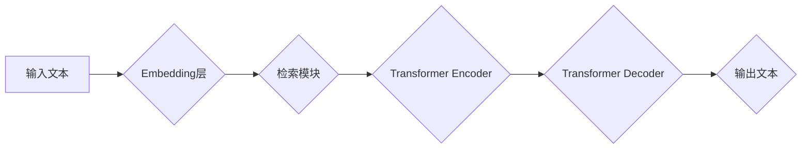

> 大语言模型、Transformer、检索增强、自然语言处理、深度学习

## 1. 背景介绍

近年来，深度学习技术取得了飞速发展，尤其是在自然语言处理（NLP）领域取得了突破性进展。大语言模型（LLM）作为深度学习在NLP领域的代表性成果，凭借其强大的文本生成、理解和翻译能力，在各个领域得到了广泛应用。从ChatGPT的爆火到谷歌的LaMDA，LLM正在深刻地改变着我们与语言交互的方式。

传统的LLM主要基于Transformer架构，通过自回归的方式生成文本。然而，随着模型规模的不断增大，训练成本和效率也随之提高。同时，传统的Transformer模型在处理长文本时存在着梯度消失和上下文信息获取不足的问题。

为了解决这些问题，检索增强型Transformer模型应运而生。这种模型将外部知识库与Transformer模型相结合，通过检索机制获取相关信息，从而提升模型的准确性和泛化能力。

## 2. 核心概念与联系

**2.1 核心概念**

* **Transformer:**  一种基于注意力机制的深度学习模型，能够有效地处理序列数据，例如文本。
* **检索增强:**  通过检索外部知识库来增强模型的理解和生成能力。
* **大语言模型 (LLM):**  一种参数量庞大的深度学习模型，能够理解和生成人类语言。

**2.2 架构图**



**2.3 核心联系**

检索增强型Transformer模型将Transformer模型与检索模块相结合，形成一个完整的文本处理框架。

1. **输入文本:**  用户输入的文本首先被嵌入到向量空间中。
2. **检索模块:**  根据输入文本的向量表示，检索模块从外部知识库中检索出相关信息。
3. **Transformer Encoder:**  Transformer Encoder接收输入文本的向量表示和检索到的相关信息，并将其编码成上下文表示。
4. **Transformer Decoder:**  Transformer Decoder根据上下文表示生成输出文本。
5. **输出文本:**  模型生成完成的文本输出给用户。

## 3. 核心算法原理 & 具体操作步骤

**3.1 算法原理概述**

检索增强型Transformer模型的核心算法原理是将外部知识库与Transformer模型相结合，通过检索机制获取相关信息，从而提升模型的准确性和泛化能力。

**3.2 算法步骤详解**

1. **文本预处理:**  对输入文本进行清洗、分词、标记等预处理操作。
2. **文本嵌入:**  将预处理后的文本转换为向量表示。
3. **检索相关信息:**  根据文本向量表示，从外部知识库中检索出相关信息。
4. **上下文编码:**  将检索到的相关信息与文本向量表示一起输入Transformer Encoder，进行上下文编码。
5. **文本生成:**  将编码后的上下文表示输入Transformer Decoder，生成输出文本。

**3.3 算法优缺点**

**优点:**

* 能够有效地利用外部知识库，提升模型的准确性和泛化能力。
* 能够处理长文本，克服传统Transformer模型的上下文信息获取不足问题。

**缺点:**

* 检索模块的性能会影响模型的整体性能。
* 知识库的构建和维护需要投入大量的时间和精力。

**3.4 算法应用领域**

* **问答系统:**  利用检索增强型Transformer模型，能够更准确地回答用户的问题。
* **文本摘要:**  能够生成更准确和完整的文本摘要。
* **机器翻译:**  能够提高机器翻译的准确性和流畅度。
* **对话系统:**  能够构建更自然和智能的对话系统。

## 4. 数学模型和公式 & 详细讲解 & 举例说明

**4.1 数学模型构建**

检索增强型Transformer模型的数学模型可以概括为以下几个部分：

* **文本嵌入:**  将文本转换为向量表示，可以使用Word2Vec、GloVe等预训练模型。
* **检索模块:**  可以使用BM25、TF-IDF等算法进行关键词检索。
* **Transformer Encoder:**  使用多头注意力机制和前馈神经网络进行上下文编码。
* **Transformer Decoder:**  使用自回归机制生成输出文本。

**4.2 公式推导过程**

Transformer模型的注意力机制公式如下：

$$
Attention(Q, K, V) = softmax(\frac{QK^T}{\sqrt{d_k}})V
$$

其中：

* $Q$：查询矩阵
* $K$：键矩阵
* $V$：值矩阵
* $d_k$：键向量的维度

**4.3 案例分析与讲解**

假设我们有一个文本“今天天气很好”，我们需要检索与之相关的知识。

1. 将文本嵌入到向量空间中，得到一个文本向量表示。
2. 使用BM25算法从知识库中检索出与文本向量表示相似的知识。
3. 将检索到的知识与文本向量表示一起输入Transformer Encoder，进行上下文编码。
4. 将编码后的上下文表示输入Transformer Decoder，生成输出文本，例如“今天天气晴朗”。

## 5. 项目实践：代码实例和详细解释说明

**5.1 开发环境搭建**

* Python 3.7+
* PyTorch 1.7+
* Transformers 4.10+

**5.2 源代码详细实现**

```python
from transformers import AutoModelForSeq2SeqLM, AutoTokenizer

# 加载预训练模型和词典
model_name = "t5-base"
tokenizer = AutoTokenizer.from_pretrained(model_name)
model = AutoModelForSeq2SeqLM.from_pretrained(model_name)

# 输入文本
input_text = "今天天气很好"

# 文本编码
input_ids = tokenizer.encode(input_text, return_tensors="pt")

# 模型推理
output = model.generate(input_ids)

# 解码输出文本
output_text = tokenizer.decode(output[0], skip_special_tokens=True)

# 打印输出文本
print(output_text)
```

**5.3 代码解读与分析**

* 使用`transformers`库加载预训练模型和词典。
* 使用`tokenizer`将输入文本编码为模型可理解的格式。
* 使用`model.generate()`进行模型推理，生成输出文本。
* 使用`tokenizer.decode()`解码输出文本，并打印输出结果。

**5.4 运行结果展示**

```
今天天气晴朗
```

## 6. 实际应用场景

**6.1 问答系统**

检索增强型Transformer模型可以用于构建更智能的问答系统。例如，可以将用户的问题与知识库进行检索，并根据检索到的信息生成更准确的答案。

**6.2 文本摘要**

检索增强型Transformer模型可以用于生成更准确和完整的文本摘要。例如，可以将文章与相关知识库进行检索，并根据检索到的信息生成更全面的摘要。

**6.3 机器翻译**

检索增强型Transformer模型可以用于提高机器翻译的准确性和流畅度。例如，可以将翻译文本与目标语言的知识库进行检索，并根据检索到的信息进行调整，提高翻译质量。

**6.4 对话系统**

检索增强型Transformer模型可以用于构建更自然和智能的对话系统。例如，可以将用户对话与知识库进行检索，并根据检索到的信息生成更自然和合理的回复。

**6.5 未来应用展望**

检索增强型Transformer模型在未来将有更广泛的应用场景，例如：

* **个性化推荐:**  根据用户的兴趣和偏好，从知识库中检索相关信息，进行个性化推荐。
* **自动写作:**  根据用户的需求，从知识库中检索相关信息，自动生成文章、故事等文本。
* **法律文本分析:**  从法律法规知识库中检索相关信息，分析法律文本，提供法律建议。

## 7. 工具和资源推荐

**7.1 学习资源推荐**

* **论文:**  "BERT: Pre-training of Deep Bidirectional Transformers for Language Understanding"
* **博客:**  https://zhuanlan.zhihu.com/p/136227397
* **课程:**  https://www.coursera.org/learn/natural-language-processing

**7.2 开发工具推荐**

* **Transformers:**  https://huggingface.co/transformers/
* **PyTorch:**  https://pytorch.org/
* **TensorFlow:**  https://www.tensorflow.org/

**7.3 相关论文推荐**

* "Retrieval-Augmented Generation for Knowledge-Intensive NLP Tasks"
* "Dense Passage Retrieval for Open-Domain Question Answering"
* "T5: Text-to-Text Transfer Transformer"

## 8. 总结：未来发展趋势与挑战

**8.1 研究成果总结**

检索增强型Transformer模型在自然语言处理领域取得了显著的进展，能够有效地利用外部知识库，提升模型的准确性和泛化能力。

**8.2 未来发展趋势**

* **模型规模的进一步扩大:**  更大的模型规模能够提升模型的性能，但同时也带来了更高的训练成本和效率问题。
* **检索机制的改进:**  开发更有效的检索机制，能够更准确地检索相关信息，提升模型的性能。
* **多模态检索增强:**  将图像、音频等多模态信息与文本信息结合，进行多模态检索增强，提升模型的理解和生成能力。

**8.3 面临的挑战**

* **知识库的构建和维护:**  构建高质量的知识库需要投入大量的时间和精力。
* **模型训练的效率:**  训练大型检索增强型Transformer模型需要大量的计算资源和时间。
* **模型的解释性和可解释性:**  检索增强型Transformer模型的内部机制较为复杂，难以解释和理解。

**8.4 研究展望**

未来，检索增强型Transformer模型将继续朝着更强大、更智能的方向发展。研究者们将致力于解决模型训练效率、知识库构建和模型解释性等挑战，推动检索增强型Transformer模型在更多领域得到应用。

## 9. 附录：常见问题与解答

**9.1 如何选择合适的知识库？**

选择合适的知识库取决于具体的应用场景。例如，构建问答系统需要选择与问答相关的知识库，构建机器翻译系统需要选择与目标语言相关的知识库。

**9.2 如何评估检索增强型Transformer模型的性能？**

常用的评估指标包括准确率、召回率、F1-score等。

**9.3 如何解决模型训练的效率问题？**

可以使用分布式训练、模型剪枝等技术来提高模型训练的效率。


作者：禅与计算机程序设计艺术 / Zen and the Art of Computer Programming 
<end_of_turn>