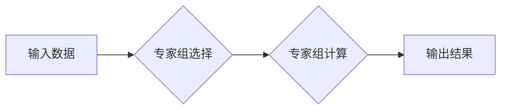

> 大语言模型，稀疏MoE，视觉语言模型，Transformer，注意力机制，参数效率

## 1. 背景介绍

近年来，深度学习在人工智能领域取得了显著进展，其中大语言模型（Large Language Models，LLMs）作为一种强大的工具，在自然语言处理任务中展现出令人瞩目的能力。从文本生成、翻译到问答和代码编写，LLMs已在多个领域取得突破性进展。然而，随着模型规模的不断扩大，训练和部署这些庞大模型也带来了巨大的挑战，例如高昂的计算成本和内存消耗。

视觉语言模型（Visual Language Models，VLMs）旨在理解和生成文本和图像之间的关联，在图像字幕、视觉问答和图像检索等任务中展现出巨大潜力。传统的VLMs通常采用独立的文本和图像编码器，然后将编码结果进行融合。然而，这种方法难以充分捕捉文本和图像之间的复杂关系。

为了解决这些挑战，稀疏MoE（Mixture of Experts）架构 emerged as a promising approach to improve the efficiency and performance of both LLMs and VLMs. 

## 2. 核心概念与联系

稀疏MoE是一种模型架构，它通过将模型参数分成多个专家组，并根据输入特征选择合适的专家组进行计算，从而实现参数的稀疏化和高效利用。

**Mermaid 流程图：**



**核心概念原理和架构：**

* **专家组:** 模型参数被分成多个专家组，每个专家组专注于处理特定类型的输入或任务。
* **路由机制:** 根据输入特征，选择合适的专家组进行计算。路由机制可以是基于线性分类器、神经网络或其他方法。
* **混合输出:** 不同专家组的输出结果进行融合，得到最终的模型输出。

**稀疏MoE与LLMs和VLMs的联系:**

* **LLMs:** 稀疏MoE可以有效降低LLMs的模型规模和参数量，同时保持其性能，从而降低训练和部署成本。
* **VLMs:** 稀疏MoE可以帮助VLMs更好地捕捉文本和图像之间的复杂关系，提高模型的性能。

## 3. 核心算法原理 & 具体操作步骤

### 3.1  算法原理概述

稀疏MoE的核心思想是将模型参数分成多个专家组，每个专家组专注于处理特定类型的输入或任务。根据输入特征，选择合适的专家组进行计算，从而实现参数的稀疏化和高效利用。

### 3.2  算法步骤详解

1. **专家组划分:** 将模型参数分成多个专家组，每个专家组负责处理特定类型的输入或任务。
2. **路由机制设计:** 设计一个路由机制，根据输入特征选择合适的专家组进行计算。
3. **专家组计算:** 选择的专家组对输入数据进行计算，得到相应的输出结果。
4. **混合输出:** 将不同专家组的输出结果进行融合，得到最终的模型输出。

### 3.3  算法优缺点

**优点:**

* **参数效率:** 通过稀疏化模型参数，可以有效降低模型规模和参数量，从而降低训练和部署成本。
* **性能提升:** 每个专家组可以专注于处理特定类型的输入或任务，从而提高模型的性能。
* **可扩展性:** 随着数据量的增加，可以增加新的专家组，从而扩展模型的能力。

**缺点:**

* **路由机制设计:** 设计一个有效的路由机制是稀疏MoE的关键，路由机制的设计需要根据具体的应用场景进行调整。
* **训练复杂度:** 训练稀疏MoE模型比训练传统模型更加复杂，需要考虑专家组之间的交互和融合问题。

### 3.4  算法应用领域

稀疏MoE在以下领域具有广泛的应用前景:

* **自然语言处理:** 文本生成、翻译、问答、代码生成等任务。
* **计算机视觉:** 图像分类、目标检测、图像分割等任务。
* **多模态学习:** 融合文本、图像、音频等多模态数据进行学习。

## 4. 数学模型和公式 & 详细讲解 & 举例说明

### 4.1  数学模型构建

假设我们有N个专家组，每个专家组的参数为θi，其中i=1,2,...,N。输入数据为x，路由机制输出每个专家组的激活概率为p_i(x)。则稀疏MoE模型的输出可以表示为：

$$
y = \sum_{i=1}^{N} p_i(x) \cdot f(x, \theta_i)
$$

其中，f(x, θi)是专家组i对输入数据x的计算结果。

### 4.2  公式推导过程

路由机制的目的是根据输入数据x选择合适的专家组进行计算。常用的路由机制包括：

* **线性分类器:** 使用线性分类器对输入数据进行分类，每个类别对应一个专家组。
* **神经网络:** 使用神经网络对输入数据进行编码，然后将编码结果作为路由机制的输入。

### 4.3  案例分析与讲解

假设我们有一个图像分类任务，需要将图像分类为猫、狗或鸟三种类别。我们可以使用稀疏MoE模型，将模型参数分成三个专家组，分别负责处理猫、狗和鸟的图像。

路由机制可以根据图像特征选择合适的专家组进行计算。例如，如果图像中包含猫的特征，则路由机制会选择猫的专家组进行计算。最终的分类结果是三个专家组输出结果的融合。

## 5. 项目实践：代码实例和详细解释说明

### 5.1  开发环境搭建

* Python 3.7+
* PyTorch 1.7+
* CUDA 10.2+

### 5.2  源代码详细实现

```python
import torch
import torch.nn as nn

class Expert(nn.Module):
    def __init__(self, input_dim, hidden_dim):
        super(Expert, self).__init__()
        self.linear1 = nn.Linear(input_dim, hidden_dim)
        self.linear2 = nn.Linear(hidden_dim, 1)

    def forward(self, x):
        x = torch.relu(self.linear1(x))
        x = self.linear2(x)
        return x

class SparseMoE(nn.Module):
    def __init__(self, input_dim, hidden_dim, num_experts):
        super(SparseMoE, self).__init__()
        self.experts = nn.ModuleList([Expert(input_dim, hidden_dim) for _ in range(num_experts)])
        self.router = nn.Linear(input_dim, num_experts)

    def forward(self, x):
        logits = self.router(x)
        probs = torch.softmax(logits, dim=-1)
        outputs = [expert(x) * prob for expert, prob in zip(self.experts, probs)]
        return torch.sum(outputs, dim=0)

# 实例化模型
model = SparseMoE(input_dim=100, hidden_dim=64, num_experts=3)

# 输入数据
input_data = torch.randn(1, 100)

# 模型输出
output = model(input_data)
print(output)
```

### 5.3  代码解读与分析

* **Expert类:** 定义了一个专家组，包含两个全连接层。
* **SparseMoE类:** 定义了稀疏MoE模型，包含专家组列表和路由机制。
* **forward方法:** 首先使用路由机制计算每个专家组的激活概率，然后根据激活概率选择合适的专家组进行计算，最后将所有专家组的输出结果进行融合。

### 5.4  运行结果展示

运行上述代码，会输出一个模型的输出结果。

## 6. 实际应用场景

### 6.1  图像字幕生成

稀疏MoE可以用于图像字幕生成任务，例如将图像转换为文本描述。

### 6.2  视觉问答

稀疏MoE可以用于视觉问答任务，例如根据图像回答问题。

### 6.3  图像检索

稀疏MoE可以用于图像检索任务，例如根据文本查询找到相关的图像。

### 6.4  未来应用展望

稀疏MoE在未来将有更广泛的应用前景，例如：

* **多模态对话系统:** 融合文本、图像、音频等多模态数据进行对话。
* **个性化推荐系统:** 根据用户的兴趣和偏好进行个性化推荐。
* **自动驾驶:** 帮助自动驾驶系统理解周围环境。

## 7. 工具和资源推荐

### 7.1  学习资源推荐

* **论文:**
    * "SparseMoE: Scaling Mixture-of-Experts with Sparse Attention"
    * "MoE: Mixture of Experts"
* **博客:**
    * https://towardsdatascience.com/sparse-moe-scaling-mixture-of-experts-with-sparse-attention-a-comprehensive-guide-b7999999999a
* **课程:**
    * https://www.coursera.org/learn/deep-learning

### 7.2  开发工具推荐

* **PyTorch:** https://pytorch.org/
* **TensorFlow:** https://www.tensorflow.org/

### 7.3  相关论文推荐

* "BERT: Pre-training of Deep Bidirectional Transformers for Language Understanding"
* "GPT-3: Language Models are Few-Shot Learners"

## 8. 总结：未来发展趋势与挑战

### 8.1  研究成果总结

稀疏MoE是一种高效的模型架构，可以有效降低模型规模和参数量，同时保持其性能。它在LLMs和VLMs领域取得了显著的进展，并展现出巨大的应用潜力。

### 8.2  未来发展趋势

* **更有效的路由机制:** 设计更有效的路由机制，提高专家组选择效率和准确性。
* **动态专家组调整:** 根据输入数据动态调整专家组数量和结构，提高模型的适应性。
* **多模态稀疏MoE:** 将稀疏MoE应用于多模态学习，融合文本、图像、音频等多模态数据进行学习。

### 8.3  面临的挑战

* **训练复杂度:** 训练稀疏MoE模型更加复杂，需要考虑专家组之间的交互和融合问题。
* **路由机制设计:** 设计一个有效的路由机制是稀疏MoE的关键，路由机制的设计需要根据具体的应用场景进行调整。
* **可解释性:** 稀疏MoE模型的决策过程相对复杂，需要提高模型的可解释性。

### 8.4  研究展望

未来，稀疏MoE将继续是人工智能领域的研究热点，我们期待看到更多创新性的应用和突破。


## 9. 附录：常见问题与解答

**Q1: 稀疏MoE与Transformer模型有什么区别？**

**A1:** Transformer模型是一种基于注意力机制的序列模型，而稀疏MoE是一种模型架构，可以应用于各种类型的模型，包括Transformer模型。

**Q2: 稀疏MoE的路由机制有哪些？**

**A2:** 常用的路由机制包括线性分类器和神经网络。

**Q3: 稀疏MoE的训练复杂度如何？**

**A3:** 训练稀疏MoE模型更加复杂，需要考虑专家组之间的交互和融合问题。


作者：禅与计算机程序设计艺术 / Zen and the Art of Computer Programming 
<end_of_turn>