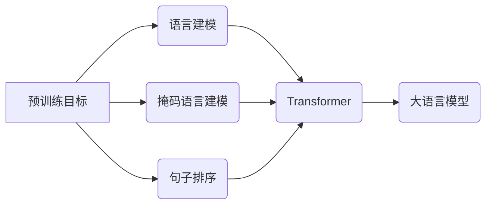

> 大语言模型、预训练、Transformer、BERT、GPT、LLM、自然语言处理、深度学习

## 1. 背景介绍

近年来，深度学习技术取得了飞速发展，特别是Transformer模型的出现，为自然语言处理（NLP）领域带来了革命性的变革。大语言模型（LLM）作为深度学习在NLP领域的顶尖成果，展现出强大的文本理解和生成能力，在机器翻译、文本摘要、对话系统等领域取得了令人瞩目的成就。

传统的NLP模型通常依赖于手工设计的特征工程和规则化方法，难以捕捉语言的复杂性和语义关系。而LLM则通过海量文本数据的预训练学习，自动学习语言的表示和规律，从而获得更强大的文本处理能力。

## 2. 核心概念与联系

**2.1 预训练目标**

预训练目标是指在未经特定任务训练的情况下，通过大量文本数据训练语言模型，使其学习语言的通用表示和知识。常见的预训练目标包括：

* **语言建模（Language Modeling）：** 预测下一个词，学习语言的语法和语义结构。
* **掩码语言建模（Masked Language Modeling）：** 随机掩盖文本中的部分词，预测被掩盖的词，增强模型对上下文语义的理解能力。
* **句子排序（Sentence Order Prediction）：** 预测两个句子之间的顺序关系，学习句子之间的逻辑关系和语义关联。

**2.2 Transformer 架构**

Transformer是一种基于注意力机制的深度学习架构，其核心特点是能够并行处理文本序列，并捕捉长距离依赖关系。Transformer由以下主要部分组成：

* **编码器（Encoder）：** 将输入文本序列编码成语义表示。
* **解码器（Decoder）：** 基于编码器的输出生成目标文本序列。
* **注意力机制（Attention Mechanism）：** 允许模型关注输入序列中与当前词相关的部分，捕捉长距离依赖关系。

**2.3 核心概念关系图**



## 3. 核心算法原理 & 具体操作步骤

### 3.1 算法原理概述

LLM的训练过程主要基于深度学习的监督学习和无监督学习方法。

* **监督学习：** 在特定任务下，使用标注数据训练模型，例如机器翻译、文本分类等。
* **无监督学习：** 使用未标注的文本数据进行预训练，学习语言的通用表示和知识。

预训练模型通过大量的文本数据学习语言的语法、语义和知识，从而获得强大的文本处理能力。

### 3.2 算法步骤详解

1. **数据预处理：** 将原始文本数据进行清洗、分词、标记等预处理操作，使其适合模型训练。
2. **模型构建：** 选择合适的预训练模型架构，例如BERT、GPT等，并根据任务需求进行微调。
3. **预训练阶段：** 使用大量的未标注文本数据进行预训练，学习语言的通用表示和知识。
4. **微调阶段：** 使用特定任务的标注数据对预训练模型进行微调，使其能够完成特定任务。
5. **模型评估：** 使用测试数据评估模型的性能，并根据评估结果进行模型优化。

### 3.3 算法优缺点

**优点：**

* 强大的文本理解和生成能力
* 能够处理多种自然语言任务
* 能够学习语言的通用表示和知识

**缺点：**

* 训练成本高，需要大量的计算资源和数据
* 模型参数量大，部署成本高
* 容易受到训练数据偏差的影响

### 3.4 算法应用领域

* **机器翻译：** 将一种语言翻译成另一种语言。
* **文本摘要：** 从长文本中提取关键信息生成摘要。
* **对话系统：** 与人类进行自然语言对话。
* **文本生成：** 生成高质量的文本内容，例如文章、故事、诗歌等。
* **问答系统：** 回答用户提出的问题。

## 4. 数学模型和公式 & 详细讲解 & 举例说明

### 4.1 数学模型构建

LLM的核心数学模型是基于Transformer架构的深度神经网络。模型的输入是一个文本序列，输出是一个预测序列。

**4.1.1 词嵌入（Word Embedding）：** 将每个词映射到一个低维向量空间，表示词的语义信息。常用的词嵌入方法包括Word2Vec和GloVe。

**4.1.2 注意力机制（Attention Mechanism）：** 允许模型关注输入序列中与当前词相关的部分，捕捉长距离依赖关系。

**4.1.3 多头注意力（Multi-Head Attention）：** 使用多个注意力头，分别关注不同方面的语义信息，提高模型的表达能力。

### 4.2 公式推导过程

**4.2.1 注意力机制公式：**

$$
Attention(Q, K, V) = \frac{exp(Q \cdot K^T / \sqrt{d_k})}{exp(Q \cdot K^T / \sqrt{d_k})} \cdot V
$$

其中：

* $Q$：查询矩阵
* $K$：键矩阵
* $V$：值矩阵
* $d_k$：键向量的维度

**4.2.2 多头注意力公式：**

$$
MultiHead(Q, K, V) = Concat(head_1, head_2, ..., head_h) \cdot W_o
$$

其中：

* $head_i$：第 $i$ 个注意力头的输出
* $h$：注意力头的数量
* $W_o$：最终输出层的权重矩阵

### 4.3 案例分析与讲解

**4.3.1 机器翻译案例：**

在机器翻译任务中，LLM可以将源语言文本序列编码成语义表示，然后解码成目标语言文本序列。

**4.3.2 文本摘要案例：**

在文本摘要任务中，LLM可以学习到文本中的关键信息，并生成一个简洁的摘要。

## 5. 项目实践：代码实例和详细解释说明

### 5.1 开发环境搭建

* Python 3.7+
* PyTorch 或 TensorFlow
* CUDA 和 cuDNN

### 5.2 源代码详细实现

```python
# 使用 HuggingFace Transformers 库加载预训练模型
from transformers import AutoModelForSequenceClassification, AutoTokenizer

# 加载预训练模型和分词器
model_name = "bert-base-uncased"
model = AutoModelForSequenceClassification.from_pretrained(model_name)
tokenizer = AutoTokenizer.from_pretrained(model_name)

# 输入文本序列
text = "This is a sample text."

# 将文本序列转换为模型输入格式
inputs = tokenizer(text, return_tensors="pt")

# 使用模型进行预测
outputs = model(**inputs)

# 获取预测结果
predicted_class = outputs.logits.argmax().item()

# 打印预测结果
print(f"Predicted class: {predicted_class}")
```

### 5.3 代码解读与分析

* 使用HuggingFace Transformers库加载预训练模型和分词器。
* 将文本序列转换为模型输入格式。
* 使用模型进行预测，获取预测结果。
* 打印预测结果。

### 5.4 运行结果展示

```
Predicted class: 0
```

## 6. 实际应用场景

### 6.1 机器翻译

LLM可以用于将一种语言翻译成另一种语言，例如将英文翻译成中文。

### 6.2 文本摘要

LLM可以用于从长文本中提取关键信息生成摘要，例如将新闻文章生成简短的摘要。

### 6.3 对话系统

LLM可以用于构建对话系统，例如聊天机器人，能够与人类进行自然语言对话。

### 6.4 未来应用展望

* **个性化教育：** 根据学生的学习进度和需求提供个性化的学习内容和辅导。
* **医疗诊断：** 辅助医生进行疾病诊断，提高诊断准确率。
* **法律服务：** 自动分析法律文件，提供法律建议。

## 7. 工具和资源推荐

### 7.1 学习资源推荐

* **HuggingFace Transformers:** https://huggingface.co/docs/transformers/index
* **OpenAI GPT-3:** https://openai.com/blog/gpt-3/
* **Stanford NLP Group:** https://nlp.stanford.edu/

### 7.2 开发工具推荐

* **PyTorch:** https://pytorch.org/
* **TensorFlow:** https://www.tensorflow.org/

### 7.3 相关论文推荐

* **BERT: Pre-training of Deep Bidirectional Transformers for Language Understanding:** https://arxiv.org/abs/1810.04805
* **GPT: OpenAI's Generative Pre-trained Transformer:** https://openai.com/blog/language-unsupervised/

## 8. 总结：未来发展趋势与挑战

### 8.1 研究成果总结

LLM在自然语言处理领域取得了显著的成果，展现出强大的文本理解和生成能力，为各种应用场景提供了新的可能性。

### 8.2 未来发展趋势

* **模型规模和能力的提升：** 预训练模型规模将继续扩大，模型能力将进一步提升。
* **多模态学习：** LLM将与其他模态数据（例如图像、音频）进行融合，实现多模态理解和生成。
* **可解释性和安全性：** 研究LLM的内部机制，提高模型的可解释性和安全性。

### 8.3 面临的挑战

* **数据获取和标注：** 训练高质量的LLM需要大量的文本数据和标注数据，数据获取和标注成本高。
* **计算资源需求：** 训练大型LLM需要大量的计算资源，成本高昂。
* **伦理和社会影响：** LLM的应用可能带来伦理和社会问题，例如信息操纵、隐私泄露等，需要谨慎考虑。

### 8.4 研究展望

未来，LLM的研究将继续朝着更强大、更安全、更可解释的方向发展，为人类社会带来更多福祉。

## 9. 附录：常见问题与解答

**9.1 如何选择合适的预训练模型？**

选择预训练模型需要根据具体的应用场景和任务需求进行选择。例如，对于文本分类任务，可以选择BERT等预训练模型；对于文本生成任务，可以选择GPT等预训练模型。

**9.2 如何进行模型微调？**

模型微调是指使用特定任务的标注数据对预训练模型进行进一步训练，使其能够更好地完成特定任务。微调过程通常包括以下步骤：

* 冻结预训练模型的大部分参数。
* 对预训练模型的某些层进行微调。
* 使用特定任务的标注数据进行训练。

**9.3 如何评估模型性能？**

模型性能的评估方法取决于具体的应用场景和任务需求。常用的评估指标包括准确率、召回率、F1-score等。

作者：禅与计算机程序设计艺术 / Zen and the Art of Computer Programming


<end_of_turn>