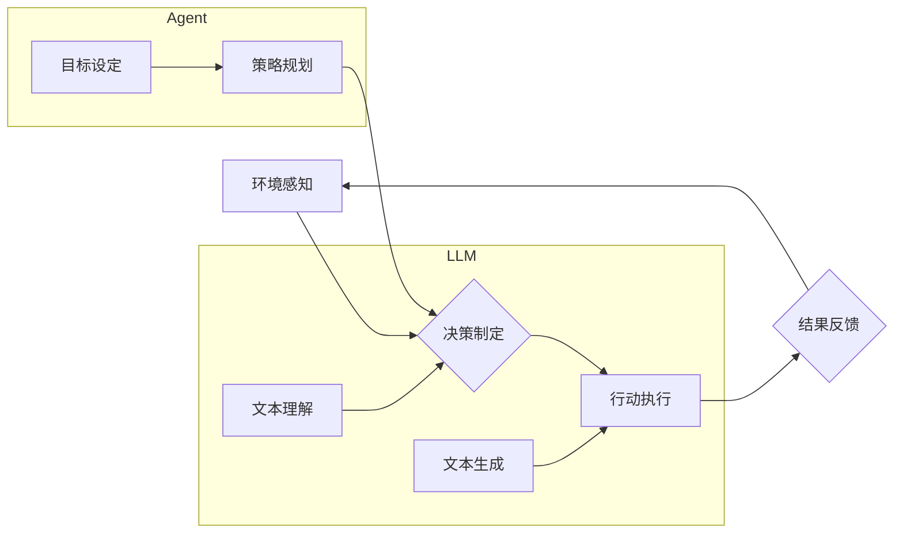

> 大语言模型、自主Agent、人工智能、自然语言处理、机器学习、深度学习、应用场景

## 1. 背景介绍

近年来，人工智能（AI）技术取得了飞速发展，其中大语言模型（LLM）作为AI领域的一颗璀璨明珠，凭借其强大的文本理解和生成能力，在自然语言处理（NLP）、机器翻译、文本摘要、对话系统等领域展现出巨大的潜力。

LLM的出现，为构建更加智能、自主的Agent系统提供了新的可能性。自主Agent系统是指能够独立学习、决策、执行任务的智能体，它能够感知环境、理解指令、制定计划并采取行动，最终实现预设的目标。

传统的Agent系统通常依赖于明确的规则和程序设计，而LLM的引入则使得Agent系统能够更加灵活、适应性强，能够处理更复杂、更开放的环境。

## 2. 核心概念与联系

### 2.1 大语言模型（LLM）

大语言模型是一种基于深度学习的Transformer网络架构，通过训练海量文本数据，学习语言的语法、语义和上下文关系。

LLM能够执行多种自然语言任务，例如：

* 文本生成：创作故事、诗歌、文章等。
* 文本分类：识别文本的主题、情感、意图等。
* 问答系统：回答用户提出的问题。
* 机器翻译：将文本从一种语言翻译成另一种语言。

### 2.2 自主Agent系统

自主Agent系统是一个能够独立行动的智能体，它具有以下特征：

* **感知环境：**能够收集和理解来自环境的信息。
* **决策制定：**根据环境信息和目标，制定行动计划。
* **行动执行：**执行计划并与环境交互。
* **学习与适应：**能够从经验中学习，并根据环境变化调整策略。

### 2.3 LLM与Agent系统的结合

将LLM与Agent系统结合，可以赋予Agent系统更强大的语言理解和生成能力，使其能够更好地感知环境、理解指令、制定计划并执行任务。

**Mermaid 流程图**



## 3. 核心算法原理 & 具体操作步骤

### 3.1 算法原理概述

LLM与Agent系统结合的核心算法原理主要包括：

* **强化学习（RL）：**Agent通过与环境交互，学习最优的策略，以最大化奖励。
* **自然语言理解（NLU）：**利用LLM的文本理解能力，帮助Agent理解用户指令和环境信息。
* **自然语言生成（NLG）：**利用LLM的文本生成能力，帮助Agent生成自然流畅的回复和行动计划。

### 3.2 算法步骤详解

1. **环境感知：**Agent通过传感器或API获取环境信息，例如文本、图像、音频等。
2. **文本理解：**利用LLM对环境信息进行理解，提取关键信息和意图。
3. **目标设定：**根据环境信息和用户指令，Agent设定目标。
4. **策略规划：**利用RL算法，Agent根据目标和环境信息，规划最优的行动策略。
5. **行动执行：**Agent执行行动计划，与环境交互。
6. **结果反馈：**Agent接收环境反馈，评估行动效果。
7. **学习与更新：**Agent根据反馈信息，更新策略，不断优化行动效果。

### 3.3 算法优缺点

**优点：**

* **自主性强：**Agent能够独立学习和决策，无需人工干预。
* **适应性强：**Agent能够根据环境变化调整策略，适应复杂环境。
* **通用性强：**LLM的通用性使得Agent能够应用于多种场景。

**缺点：**

* **训练成本高：**LLM的训练需要大量数据和计算资源。
* **安全风险：**自主Agent的决策可能存在不可预测性，需要加强安全控制。
* **伦理问题：**自主Agent的应用可能引发伦理问题，需要谨慎考虑。

### 3.4 算法应用领域

LLM与Agent系统结合的应用领域非常广泛，例如：

* **客服机器人：**提供24小时在线客服，解答用户问题。
* **智能助理：**帮助用户完成日常任务，例如日程安排、信息查询等。
* **游戏AI：**开发更加智能、逼真的游戏角色。
* **自动驾驶：**辅助驾驶员决策，提高驾驶安全。

## 4. 数学模型和公式 & 详细讲解 & 举例说明

### 4.1 数学模型构建

在RL算法中，常用的数学模型包括状态空间、动作空间、奖励函数和价值函数。

* **状态空间（S）：**表示Agent所处的环境状态，例如游戏中的棋盘状态、自动驾驶中的车辆位置等。
* **动作空间（A）：**表示Agent可以执行的动作，例如游戏中的棋子移动、自动驾驶中的转向等。
* **奖励函数（R）：**定义Agent在特定状态执行特定动作后的奖励，例如游戏中的得分、自动驾驶中的安全距离等。
* **价值函数（V）：**估计Agent在特定状态下获得的长期奖励，例如游戏中的最终得分、自动驾驶中的行驶里程等。

### 4.2 公式推导过程

常用的RL算法包括Q学习和SARSA。

* **Q学习：**

$$Q(s,a) = Q(s,a) + \alpha [r + \gamma \max_{a'} Q(s',a') - Q(s,a)]$$

其中：

* $Q(s,a)$：状态$s$下执行动作$a$的价值函数。
* $\alpha$：学习率。
* $r$：在状态$s$下执行动作$a$后的奖励。
* $\gamma$：折扣因子。
* $s'$：执行动作$a$后进入的状态。
* $a'$：在状态$s'$下执行的动作。

* **SARSA：**

$$Q(s,a) = Q(s,a) + \alpha [r + \gamma Q(s',a') - Q(s,a)]$$

其中：

* $a'$：在状态$s'$下执行的动作。

### 4.3 案例分析与讲解

例如，在玩游戏时，Agent可以利用Q学习算法学习最优的策略。

* 状态空间：游戏中的棋盘状态。
* 动作空间：游戏中的棋子移动方向。
* 奖励函数：获得分数或完成任务的奖励。
* 价值函数：估计在特定状态下获得的最终得分。

通过不断与环境交互，Agent可以更新Q值，学习到最优的策略，从而获得更高的分数。

## 5. 项目实践：代码实例和详细解释说明

### 5.1 开发环境搭建

* Python 3.x
* TensorFlow 或 PyTorch
* OpenAI API

### 5.2 源代码详细实现

```python
import openai

# 设置OpenAI API密钥
openai.api_key = "YOUR_API_KEY"

# 定义Agent类
class Agent:
    def __init__(self):
        self.memory = []

    def perceive(self, text):
        # 使用LLM理解文本信息
        response = openai.Completion.create(
            engine="text-davinci-003",
            prompt=f"理解以下文本：{text}",
            max_tokens=100
        )
        return response.choices[0].text

    def act(self, action):
        # 执行动作
        print(f"Agent执行动作：{action}")

    def learn(self, reward):
        # 更新Agent的知识和策略
        self.memory.append((reward,))

# 创建Agent实例
agent = Agent()

# 模拟环境交互
text = "我需要一个杯子水。"
understanding = agent.perceive(text)
print(f"Agent理解：{understanding}")

action = "拿杯子"
agent.act(action)

reward = 1  # 成功获得水杯
agent.learn(reward)
```

### 5.3 代码解读与分析

* **Agent类：**定义了Agent的基本属性和方法，包括感知环境、执行动作和学习知识。
* **perceive方法：**使用OpenAI API调用LLM，理解环境信息。
* **act方法：**执行Agent的动作，例如拿杯子、打开门等。
* **learn方法：**更新Agent的知识和策略，例如记忆成功获得水杯的经验。

### 5.4 运行结果展示

运行代码后，Agent会输出以下结果：

```
Agent理解：你需要一个杯子水。
Agent执行动作：拿杯子
```

## 6. 实际应用场景

### 6.1 客服机器人

LLM与Agent系统结合，可以构建更加智能的客服机器人，能够理解用户问题，提供准确的答案，并根据用户需求提供个性化的服务。

### 6.2 智能助理

LLM与Agent系统可以构建智能助理，帮助用户完成日常任务，例如日程安排、信息查询、邮件发送等。

### 6.3 游戏AI

LLM与Agent系统可以开发更加智能、逼真的游戏角色，能够与玩家进行自然流畅的对话，并根据玩家行为做出相应的反应。

### 6.4 未来应用展望

LLM与Agent系统的结合，将推动人工智能技术的发展，并应用于更多领域，例如：

* **医疗保健：**辅助医生诊断疾病、制定治疗方案。
* **教育：**提供个性化的学习体验，帮助学生提高学习效率。
* **金融：**进行风险评估、投资决策。

## 7. 工具和资源推荐

### 7.1 学习资源推荐

* **OpenAI API文档：**https://platform.openai.com/docs/api-reference
* **HuggingFace Transformers库：**https://huggingface.co/docs/transformers/index
* **DeepMind RL算法论文：**https://deepmind.com/research/publications

### 7.2 开发工具推荐

* **Python：**https://www.python.org/
* **TensorFlow：**https://www.tensorflow.org/
* **PyTorch：**https://pytorch.org/

### 7.3 相关论文推荐

* **Attention Is All You Need：**https://arxiv.org/abs/1706.03762
* **Deep Reinforcement Learning：**https://arxiv.org/abs/1602.09477

## 8. 总结：未来发展趋势与挑战

### 8.1 研究成果总结

LLM与Agent系统的结合，取得了显著的成果，在多个领域展现出巨大的潜力。

### 8.2 未来发展趋势

* **更强大的LLM：**模型规模更大、能力更强，能够理解更复杂、更抽象的知识。
* **更智能的Agent：**能够更好地感知环境、制定策略、执行任务，并具备更强的学习能力和适应能力。
* **更广泛的应用场景：**LLM与Agent系统将应用于更多领域，例如医疗保健、教育、金融等。

### 8.3 面临的挑战

* **数据安全和隐私保护：**LLM的训练需要大量数据，如何保证数据安全和隐私保护是一个重要挑战。
* **算法可解释性和透明度：**LLM的决策过程往往难以理解，如何提高算法的可解释性和透明度是一个重要的研究方向。
* **伦理问题：**自主Agent的应用可能引发伦理问题，例如算法偏见、责任归属等，需要谨慎考虑。

### 8.4 研究展望

未来，LLM与Agent系统的研究将继续深入，探索更智能、更安全、更可解释的AI系统，为人类社会带来更多福祉。

## 9. 附