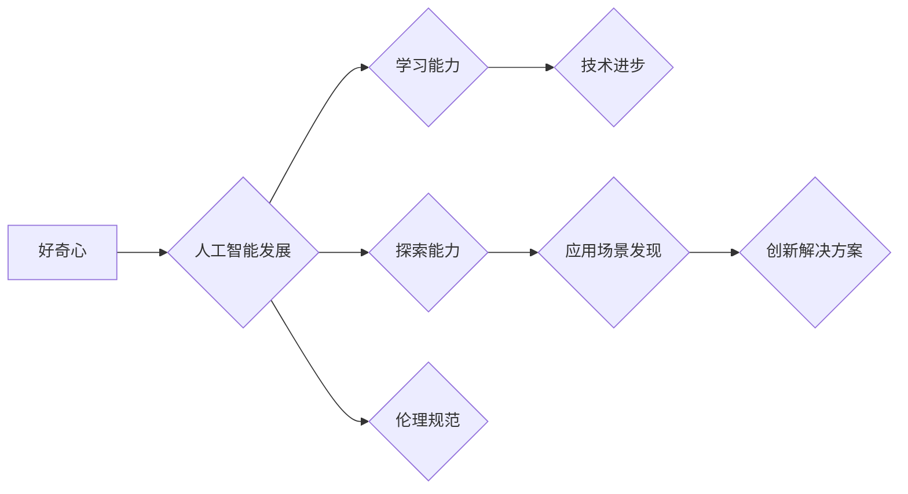

>  好奇心、创新、创造、探索、人工智能、机器学习、深度学习、算法、模型

## 1. 背景介绍

在瞬息万变的科技时代，创新和创造是推动社会进步的引擎。而好奇心，作为人类最原始的驱动力之一，正是创新和创造的源泉。它驱使我们不断去发现新知，探索未知，挑战既有认知，最终推动人类文明的进步。

人工智能（AI）作为科技发展的重要方向，也离不开好奇心的滋养。从最初的符号逻辑到如今的深度学习，每一次突破都是源于对未知的探索和对问题的深入思考。

## 2. 核心概念与联系

好奇心与人工智能之间的联系可以从以下几个方面理解：

* **好奇心是AI发展的动力:** 人工智能的发展离不开对人类认知和行为的模拟，而好奇心正是人类认知和行为的核心驱动力。通过模拟好奇心，我们可以让AI具备更强的学习能力和探索能力，从而推动AI技术的进步。
* **好奇心是AI应用的源泉:** 人工智能的应用场景日益广泛，从医疗保健到金融服务，从教育培训到娱乐休闲，好奇心可以帮助我们发现新的应用场景，并开发出更具创新性的AI解决方案。
* **好奇心是AI伦理的基石:** 人工智能的发展也面临着伦理挑战，好奇心可以帮助我们更好地理解AI的潜在风险和机遇，并制定相应的伦理规范，确保AI技术的发展造福人类。

**Mermaid 流程图:**



## 3. 核心算法原理 & 具体操作步骤

### 3.1  算法原理概述

深度学习算法是人工智能领域的核心算法之一，它能够通过多层神经网络模拟人类大脑的学习过程，从而实现对复杂数据的学习和分析。

### 3.2  算法步骤详解

1. **数据预处理:** 将原始数据进行清洗、转换和特征提取，使其能够被深度学习算法所理解。
2. **网络结构设计:** 根据具体任务需求，设计深度神经网络的结构，包括神经元数量、层数、激活函数等。
3. **参数初始化:** 为神经网络中的参数进行随机初始化，为后续的训练过程奠定基础。
4. **前向传播:** 将输入数据通过神经网络层层传递，最终得到输出结果。
5. **反向传播:** 计算输出结果与真实值的误差，并根据误差反向传播，调整神经网络的参数，使得模型的预测结果越来越准确。
6. **训练与验证:** 将训练数据和验证数据分别用于模型的训练和评估，通过调整模型参数和网络结构，不断提高模型的性能。

### 3.3  算法优缺点

**优点:**

* **强大的学习能力:** 深度学习算法能够学习到复杂数据的非线性关系，从而实现对复杂问题的建模和预测。
* **自动特征提取:** 深度学习算法能够自动从数据中提取特征，无需人工特征工程，降低了开发成本和时间。
* **泛化能力强:** 深度学习模型在训练完成后能够对新的数据进行有效预测，具有较强的泛化能力。

**缺点:**

* **数据依赖性强:** 深度学习算法需要大量的训练数据才能达到较好的性能，数据不足会导致模型性能下降。
* **计算资源消耗大:** 深度学习模型训练需要大量的计算资源，训练时间较长。
* **可解释性差:** 深度学习模型的内部工作机制较为复杂，难以解释模型的决策过程。

### 3.4  算法应用领域

深度学习算法在各个领域都有广泛的应用，例如：

* **图像识别:** 人脸识别、物体检测、图像分类等。
* **自然语言处理:** 文本分类、机器翻译、语音识别等。
* **推荐系统:** 商品推荐、内容推荐等。
* **医疗诊断:** 疾病诊断、影像分析等。
* **金融预测:** 股票预测、风险评估等。

## 4. 数学模型和公式 & 详细讲解 & 举例说明

### 4.1  数学模型构建

深度学习模型的核心是多层神经网络，每个神经元接收多个输入信号，并通过加权求和和激活函数进行处理，最终输出一个信号。

**神经元模型:**

$$
y = f(w_1x_1 + w_2x_2 + ... + w_nx_n + b)
$$

其中：

* $y$ 是神经元的输出信号。
* $x_1, x_2, ..., x_n$ 是输入信号。
* $w_1, w_2, ..., w_n$ 是权重参数。
* $b$ 是偏置参数。
* $f$ 是激活函数。

### 4.2  公式推导过程

深度学习模型的训练过程是通过反向传播算法来实现的。反向传播算法的核心是计算误差信号，并根据误差信号更新模型参数。

**误差函数:**

$$
E = \frac{1}{2} \sum_{i=1}^{N} (y_i - \hat{y}_i)^2
$$

其中：

* $E$ 是误差函数。
* $N$ 是样本数量。
* $y_i$ 是真实值。
* $\hat{y}_i$ 是预测值。

**梯度下降算法:**

$$
\theta = \theta - \alpha \frac{\partial E}{\partial \theta}
$$

其中：

* $\theta$ 是模型参数。
* $\alpha$ 是学习率。
* $\frac{\partial E}{\partial \theta}$ 是误差函数对参数的梯度。

### 4.3  案例分析与讲解

**举例说明:**

假设我们训练一个深度学习模型来识别猫和狗的图片。

1. 我们首先需要收集大量的猫和狗的图片数据，并进行数据预处理。
2. 然后，我们设计一个深度神经网络模型，例如卷积神经网络（CNN）。
3. 我们使用反向传播算法训练模型，并不断调整模型参数，使得模型能够准确识别猫和狗的图片。

## 5. 项目实践：代码实例和详细解释说明

### 5.1  开发环境搭建

* **操作系统:** Ubuntu 18.04 LTS
* **编程语言:** Python 3.6
* **深度学习框架:** TensorFlow 2.0
* **其他工具:** Jupyter Notebook

### 5.2  源代码详细实现

```python
import tensorflow as tf

# 定义模型结构
model = tf.keras.models.Sequential([
    tf.keras.layers.Conv2D(32, (3, 3), activation='relu', input_shape=(28, 28, 1)),
    tf.keras.layers.MaxPooling2D((2, 2)),
    tf.keras.layers.Conv2D(64, (3, 3), activation='relu'),
    tf.keras.layers.MaxPooling2D((2, 2)),
    tf.keras.layers.Flatten(),
    tf.keras.layers.Dense(10, activation='softmax')
])

# 编译模型
model.compile(optimizer='adam',
              loss='sparse_categorical_crossentropy',
              metrics=['accuracy'])

# 加载数据
(x_train, y_train), (x_test, y_test) = tf.keras.datasets.mnist.load_data()

# 数据预处理
x_train = x_train.astype('float32') / 255.0
x_test = x_test.astype('float32') / 255.0
x_train = x_train.reshape((x_train.shape[0], 28, 28, 1))
x_test = x_test.reshape((x_test.shape[0], 28, 28, 1))

# 训练模型
model.fit(x_train, y_train, epochs=5)

# 评估模型
loss, accuracy = model.evaluate(x_test, y_test)
print('Test loss:', loss)
print('Test accuracy:', accuracy)
```

### 5.3  代码解读与分析

* **模型结构:** 代码中定义了一个简单的卷积神经网络模型，包含两层卷积层、两层最大池化层、一层全连接层和一层输出层。
* **模型编译:** 使用Adam优化器、交叉熵损失函数和准确率指标来编译模型。
* **数据加载和预处理:** 使用MNIST数据集，并对数据进行归一化和形状转换。
* **模型训练:** 使用训练数据训练模型，设置训练轮数为5。
* **模型评估:** 使用测试数据评估模型的性能，输出测试损失和准确率。

### 5.4  运行结果展示

运行代码后，可以得到模型的训练过程和测试结果。

## 6. 实际应用场景

### 6.1  图像识别

深度学习算法在图像识别领域取得了突破性的进展，例如：

* **人脸识别:** 用于身份验证、安全监控等场景。
* **物体检测:** 用于自动驾驶、机器人视觉等场景。
* **图像分类:** 用于医疗影像诊断、产品分类等场景。

### 6.2  自然语言处理

深度学习算法在自然语言处理领域也取得了显著的成果，例如：

* **机器翻译:** 将一种语言翻译成另一种语言。
* **文本分类:** 将文本归类到不同的类别，例如情感分析、主题分类等。
* **语音识别:** 将语音转换为文本。

### 6.3  推荐系统

深度学习算法可以用于构建个性化的推荐系统，例如：

* **商品推荐:** 根据用户的购买历史和浏览记录推荐商品。
* **内容推荐:** 根据用户的兴趣爱好推荐文章、视频等内容。

### 6.4  未来应用展望

随着深度学习技术的不断发展，其应用场景将更加广泛，例如：

* **医疗诊断:** 利用深度学习算法辅助医生进行疾病诊断，提高诊断准确率。
* **药物研发:** 利用深度学习算法加速药物研发过程，降低研发成本。
* **个性化教育:** 利用深度学习算法提供个性化的学习方案，提高学习效率。

## 7. 工具和资源推荐

### 7.1  学习资源推荐

* **书籍:**
    * 深度学习 (Deep Learning) - Ian Goodfellow, Yoshua Bengio, Aaron Courville
    * 构建深度学习模型 (Hands-On Machine Learning with Scikit-Learn, Keras & TensorFlow) - Aurélien Géron
* **在线课程:**
    * 深度学习 Specialization - Andrew Ng (Coursera)
    * fast.ai - Practical Deep Learning for Coders
* **博客和网站:**
    * TensorFlow Blog
    * PyTorch Blog
    * Towards Data Science

### 7.2  开发工具推荐

* **深度学习框架:** TensorFlow, PyTorch, Keras
* **编程语言:** Python
* **数据处理工具:** Pandas, NumPy
* **可视化工具:** Matplotlib, Seaborn

### 7.3  相关论文推荐

* **AlexNet:** ImageNet Classification with Deep Convolutional Neural Networks
* **VGGNet:** Very Deep Convolutional Networks for Large-Scale Image Recognition
* **ResNet:** Deep Residual Learning for Image Recognition
* **InceptionNet:** Inception-v3, Inception-ResNet v2

## 8. 总结：未来发展趋势与挑战

### 8.1  研究成果总结

深度学习算法取得了令人瞩目的成果，在图像识别、自然语言处理、推荐系统等领域取得了突破性的进展。

### 8.2  未来发展趋势

* **模型更深更广:** 研究更深