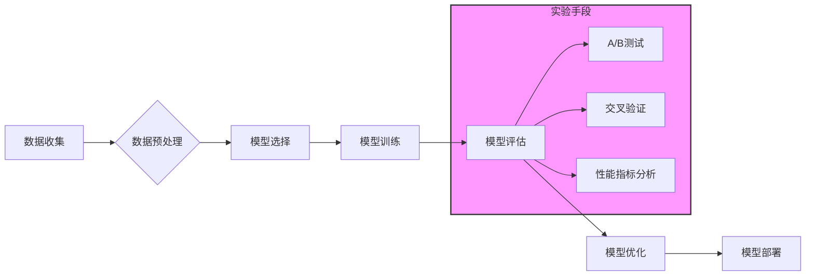

> 
> 实验手段，人工智能，机器学习，模型评估，可重复性，数据驱动，验证，改进

## 1. 背景介绍

人工智能（AI）正以惊人的速度发展，从自动驾驶到医疗诊断，AI技术正在改变着我们生活的方方面面。然而，AI的发展离不开一个关键要素：实验手段。

传统的软件开发流程中，实验手段主要用于验证代码的正确性，而AI的开发则更加复杂，需要通过实验手段来评估模型的性能、验证算法的有效性，以及不断改进模型的精度和鲁棒性。

## 2. 核心概念与联系

实验手段在AI领域扮演着至关重要的角色，它贯穿于整个AI开发流程，从数据收集到模型部署，每个阶段都需要依赖于实验手段来进行验证和优化。

**实验手段的核心概念包括：**

* **可重复性:** 实验结果需要能够被其他人复现，确保实验结果的可靠性和可信度。
* **数据驱动:** 实验设计和结果分析都需要基于数据，通过数据分析来验证假设和评估模型性能。
* **A/B测试:** 将不同的模型或算法进行对比测试，通过数据分析来确定哪种方案更优。
* **交叉验证:** 将数据划分为训练集、验证集和测试集，通过多次交叉验证来评估模型的泛化能力。

**实验手段与AI开发流程的关系:**



## 3. 核心算法原理 & 具体操作步骤

### 3.1  算法原理概述

在AI领域，实验手段通常与机器学习算法密切相关。机器学习算法通过学习数据中的模式来进行预测或分类。常见的机器学习算法包括：

* **线性回归:** 用于预测连续值。
* **逻辑回归:** 用于分类问题。
* **决策树:** 用于分类和回归问题。
* **支持向量机:** 用于分类问题。
* **神经网络:** 用于复杂模式的学习。

### 3.2  算法步骤详解

**以线性回归为例，其算法步骤如下：**

1. **数据收集和预处理:** 收集相关数据，并进行清洗、转换和特征工程等预处理步骤。
2. **模型选择:** 选择线性回归模型。
3. **模型训练:** 使用训练数据训练线性回归模型，学习数据的线性关系。
4. **模型评估:** 使用验证集评估模型的性能，常用的指标包括均方误差（MSE）和R-squared。
5. **模型优化:** 根据评估结果，调整模型参数或选择其他算法，以提高模型性能。

### 3.3  算法优缺点

**线性回归的优点:**

* 计算简单，易于理解和实现。
* 训练速度快。

**线性回归的缺点:**

* 只能处理线性关系。
* 对异常值敏感。

### 3.4  算法应用领域

线性回归广泛应用于各个领域，例如：

* **预测房价:** 根据房屋面积、位置等特征预测房价。
* **预测销售额:** 根据市场趋势、促销活动等因素预测销售额。
* **预测股票价格:** 根据历史数据和市场分析预测股票价格。

## 4. 数学模型和公式 & 详细讲解 & 举例说明

### 4.1  数学模型构建

线性回归模型的数学模型如下：

$$
y = \theta_0 + \theta_1 x_1 + \theta_2 x_2 + ... + \theta_n x_n + \epsilon
$$

其中：

* $y$ 是预测值。
* $\theta_0, \theta_1, ..., \theta_n$ 是模型参数。
* $x_1, x_2, ..., x_n$ 是输入特征。
* $\epsilon$ 是误差项。

### 4.2  公式推导过程

模型参数的求解可以通过最小二乘法来实现。最小二乘法的目标是找到一组参数，使得模型预测值与实际值之间的误差平方和最小。

### 4.3  案例分析与讲解

假设我们想要预测房屋价格，输入特征包括房屋面积、房间数量等。我们可以使用线性回归模型来建立房屋价格预测模型。

通过训练数据，我们可以得到模型参数，例如：

* $\theta_0 = 100000$
* $\theta_1 = 500$
* $\theta_2 = 10000$

这意味着，房屋面积每增加1平方米，价格会增加500元；房间数量每增加1个，价格会增加10000元。

## 5. 项目实践：代码实例和详细解释说明

### 5.1  开发环境搭建

本项目使用Python语言进行开发，需要安装以下软件包：

* NumPy
* Pandas
* Scikit-learn

### 5.2  源代码详细实现

```python
import numpy as np
from sklearn.linear_model import LinearRegression
from sklearn.model_selection import train_test_split

# 加载数据
data = pd.read_csv('house_price.csv')

# 提取特征和目标变量
X = data[['area', 'rooms']]
y = data['price']

# 将数据划分为训练集和测试集
X_train, X_test, y_train, y_test = train_test_split(X, y, test_size=0.2, random_state=42)

# 创建线性回归模型
model = LinearRegression()

# 训练模型
model.fit(X_train, y_train)

# 预测测试集数据
y_pred = model.predict(X_test)

# 评估模型性能
mse = mean_squared_error(y_test, y_pred)
r2 = r2_score(y_test, y_pred)

print(f'均方误差: {mse}')
print(f'R-squared: {r2}')
```

### 5.3  代码解读与分析

* 首先，我们加载数据并提取特征和目标变量。
* 然后，我们将数据划分为训练集和测试集，用于训练和评估模型。
* 创建线性回归模型并使用训练数据进行训练。
* 训练完成后，我们使用测试数据进行预测，并计算模型性能指标，例如均方误差和R-squared。

### 5.4  运行结果展示

运行代码后，会输出模型的均方误差和R-squared值，这些指标可以用来评估模型的性能。

## 6. 实际应用场景

实验手段在AI领域的应用场景非常广泛，例如：

* **推荐系统:** 通过A/B测试比较不同的推荐算法，选择最优的推荐方案。
* **广告投放:** 通过实验手段优化广告投放策略，提高广告点击率和转化率。
* **自然语言处理:** 通过实验手段评估不同语言模型的性能，选择最适合特定任务的模型。

### 6.4  未来应用展望

随着AI技术的不断发展，实验手段在AI领域的应用将更加广泛和深入。例如：

* **强化学习:** 使用实验手段评估强化学习算法的性能，并优化算法参数。
* **联邦学习:** 使用实验手段评估联邦学习算法的安全性、隐私性和效率。
* **自动机器学习:** 使用实验手段自动搜索最优的机器学习模型和参数。

## 7. 工具和资源推荐

### 7.1  学习资源推荐

* **机器学习课程:** Coursera、edX、Udacity等平台提供丰富的机器学习课程。
* **书籍:** 《深入理解机器学习》、《Python机器学习实战》等书籍。
* **博客:** 机器学习相关的博客，例如Andrew Ng的博客、机器之心等。

### 7.2  开发工具推荐

* **Python:** 机器学习开发的常用语言。
* **NumPy:** 数值计算库。
* **Pandas:** 数据分析和处理库。
* **Scikit-learn:** 机器学习库。
* **TensorFlow:** 深度学习框架。
* **PyTorch:** 深度学习框架。

### 7.3  相关论文推荐

* **《机器学习》:** Tom Mitchell 著
* **《深度学习》:** Ian Goodfellow、Yoshua Bengio 和 Aaron Courville 著

## 8. 总结：未来发展趋势与挑战

### 8.1  研究成果总结

实验手段在AI领域的发展取得了显著成果，为AI模型的开发、评估和优化提供了重要的工具和方法。

### 8.2  未来发展趋势

未来，实验手段在AI领域的应用将更加智能化、自动化和可视化。例如：

* **自动实验设计:** 使用机器学习算法自动设计实验方案，提高实验效率。
* **可视化实验结果:** 使用可视化工具直观展示实验结果，方便分析和理解。
* **云端实验平台:** 提供云端实验平台，方便用户进行大规模的实验测试。

### 8.3  面临的挑战

尽管实验手段在AI领域取得了重要进展，但仍然面临一些挑战，例如：

* **实验设计复杂性:** AI实验设计往往需要考虑多种因素，例如数据规模、模型复杂度、评估指标等，设计复杂且耗时。
* **实验结果解释性:** 复杂的AI模型往往难以解释其决策过程，导致实验结果的解释性不足。
* **可重复性问题:** 由于AI实验依赖于数据和环境，导致实验结果的可重复性问题。

### 8.4  研究展望

未来，需要进一步研究和完善实验手段，使其更加智能化、自动化和可解释性强，以更好地支持AI技术的快速发展。

## 9. 附录：常见问题与解答

**常见问题:**

* 如何设计一个有效的AI实验？
* 如何评估AI模型的性能？
* 如何提高实验结果的可重复性？

**解答:**

* 设计有效的AI实验需要考虑数据质量、模型选择、评估指标等因素。
* AI模型的性能可以通过多种指标来评估，例如准确率、召回率、F1-score等。
* 提高实验结果的可重复性需要使用标准化的实验流程、记录实验参数和环境信息等。


作者：禅与计算机程序设计艺术 / Zen and the Art of Computer Programming 
<end_of_turn>