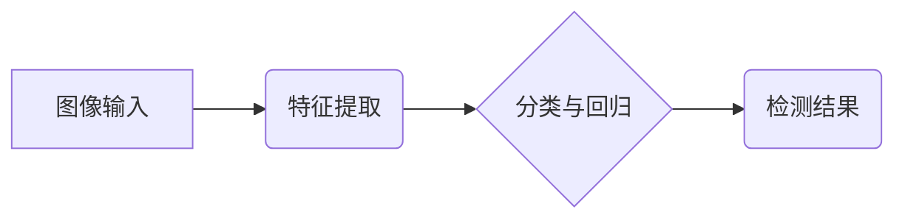

> 对象检测、深度学习、卷积神经网络、YOLO、Faster R-CNN、TensorFlow、PyTorch

## 1. 背景介绍

在计算机视觉领域，对象检测任务是指在图像或视频中识别并定位特定物体的任务。它在自动驾驶、安防监控、医疗诊断、机器人导航等众多领域有着广泛的应用。随着深度学习技术的快速发展，基于深度学习的物体检测算法取得了显著的进展，在精度、速度和鲁棒性方面都取得了突破。

传统的物体检测方法主要依赖手工设计的特征提取器和分类器，例如HOG、SIFT等。这些方法虽然在一定程度上取得了成功，但它们对特征工程的要求较高，并且难以处理复杂场景下的物体检测问题。

深度学习的出现为物体检测领域带来了革命性的变化。深度学习模型能够自动学习图像特征，无需人工设计特征，并且能够处理复杂场景下的物体检测问题。

## 2. 核心概念与联系

**2.1 核心概念**

* **目标检测:** 在图像或视频中识别并定位特定物体的任务。
* **边界框 (Bounding Box):** 用于描述物体在图像中的位置和大小的矩形框。
* **类别标签 (Class Label):** 用于标识物体的类别，例如“人”、“车”、“猫”等。
* **置信度 (Confidence Score):** 表示模型对检测结果的置信度，通常是一个介于0到1之间的值。

**2.2 关系图**



**2.3 核心联系**

目标检测算法通常由以下三个主要部分组成：

1. **特征提取:** 从图像中提取特征，例如颜色、纹理、形状等。
2. **分类与回归:** 对提取的特征进行分类，并预测物体的边界框。
3. **后处理:** 对检测结果进行筛选和优化，例如去除冗余检测结果、合并相邻检测结果等。

## 3. 核心算法原理 & 具体操作步骤

### 3.1  算法原理概述

常见的物体检测算法包括：

* **R-CNN:**  Region-based Convolutional Neural Networks，是一种基于区域的卷积神经网络算法。
* **Fast R-CNN:**  Faster Region-based Convolutional Neural Networks，是R-CNN的改进版本，速度更快。
* **Faster R-CNN:**  Faster Region-based Convolutional Neural Networks，是Fast R-CNN的进一步改进，速度更快，精度更高。
* **YOLO:**  You Only Look Once，一种单阶段的物体检测算法，速度非常快。

### 3.2  算法步骤详解

**3.2.1 R-CNN**

1. **候选区域生成:** 使用selective search算法从图像中生成候选区域。
2. **特征提取:** 对每个候选区域进行卷积神经网络特征提取。
3. **分类与回归:** 使用支持向量机（SVM）对特征进行分类，并使用线性回归预测边界框。
4. **后处理:** 对检测结果进行筛选和优化。

**3.2.2 Fast R-CNN**

1. **候选区域生成:** 与R-CNN相同。
2. **特征提取:** 使用卷积神经网络对整个图像进行特征提取，然后对每个候选区域进行特征映射。
3. **分类与回归:** 使用softmax分类器对特征进行分类，并使用线性回归预测边界框。
4. **后处理:** 与R-CNN相同。

**3.2.3 Faster R-CNN**

1. **候选区域生成:** 使用Region Proposal Network（RPN）生成候选区域。
2. **特征提取:** 与Fast R-CNN相同。
3. **分类与回归:** 与Fast R-CNN相同。
4. **后处理:** 与Fast R-CNN相同。

**3.2.4 YOLO**

1. **特征提取:** 使用卷积神经网络对整个图像进行特征提取。
2. **预测:** 将特征映射到多个网格单元，每个网格单元预测多个边界框和类别标签。
3. **后处理:** 对检测结果进行非极大值抑制（NMS）和边界框回归。

### 3.3  算法优缺点

| 算法 | 优点 | 缺点 |
|---|---|---|
| R-CNN | 精度高 | 速度慢 |
| Fast R-CNN | 比R-CNN快 | 精度略低于R-CNN |
| Faster R-CNN | 比Fast R-CNN快，精度更高 | 训练复杂 |
| YOLO | 速度非常快 | 精度略低于Faster R-CNN |

### 3.4  算法应用领域

* **自动驾驶:** 检测道路上的车辆、行人、交通信号灯等。
* **安防监控:** 检测入侵者、异常行为等。
* **医疗诊断:** 检测病灶、肿瘤等。
* **机器人导航:** 检测障碍物、目标物等。

## 4. 数学模型和公式 & 详细讲解 & 举例说明

### 4.1  数学模型构建

**4.1.1 边界框回归**

边界框回归的目标是预测边界框的四个坐标值：左上角的x和y坐标，以及右下角的x和y坐标。可以使用线性回归模型来进行边界框回归。

**4.1.2 类别分类**

类别分类的目标是预测物体的类别。可以使用softmax函数来进行类别分类。

**4.1.3 损失函数**

常用的损失函数包括：

* **Smooth L1 Loss:** 用于边界框回归。
* **Cross-Entropy Loss:** 用于类别分类。

### 4.2  公式推导过程

**4.2.1 Smooth L1 Loss**

$$
L_{smooth\_L1} = \sum_{i=1}^{N} \left\{
\begin{array}{ll}
0.5(t_i - \hat{t_i})^2, & \text{if } |t_i - \hat{t_i}| < 1 \\
|t_i - \hat{t_i}| - 0.5, & \text{otherwise}
\end{array}
\right.
$$

其中：

* $t_i$ 是真实边界框的坐标值。
* $\hat{t_i}$ 是预测边界框的坐标值。

**4.2.2 Cross-Entropy Loss**

$$
L_{cross\_entropy} = - \sum_{i=1}^{N} y_i \log(\hat{y_i})
$$

其中：

* $y_i$ 是真实类别标签。
* $\hat{y_i}$ 是预测类别标签的概率。

### 4.3  案例分析与讲解

**4.3.1 边界框回归案例**

假设真实边界框的坐标值为 (10, 10, 50, 50)，预测边界框的坐标值为 (9, 9, 49, 49)。使用Smooth L1 Loss计算损失值：

$$
L_{smooth\_L1} = 0.5((10-9)^2 + (10-9)^2 + (50-49)^2 + (50-49)^2) = 1
$$

**4.3.2 类别分类案例**

假设真实类别标签为“人”，预测类别标签的概率为：

* 人：0.9
* 车：0.1

使用Cross-Entropy Loss计算损失值：

$$
L_{cross\_entropy} = -0.9 \log(0.9) - 0.1 \log(0.1) \approx 0.1
$$

## 5. 项目实践：代码实例和详细解释说明

### 5.1  开发环境搭建

* **操作系统:** Ubuntu 18.04
* **Python 版本:** 3.6
* **深度学习框架:** TensorFlow 2.0

### 5.2  源代码详细实现

```python
import tensorflow as tf

# 定义模型结构
model = tf.keras.models.Sequential([
    tf.keras.layers.Conv2D(32, (3, 3), activation='relu', input_shape=(224, 224, 3)),
    tf.keras.layers.MaxPooling2D((2, 2)),
    tf.keras.layers.Conv2D(64, (3, 3), activation='relu'),
    tf.keras.layers.MaxPooling2D((2, 2)),
    tf.keras.layers.Flatten(),
    tf.keras.layers.Dense(10, activation='softmax')
])

# 定义损失函数和优化器
model.compile(optimizer='adam',
              loss='sparse_categorical_crossentropy',
              metrics=['accuracy'])

# 加载训练数据
(x_train, y_train), (x_test, y_test) = tf.keras.datasets.cifar10.load_data()

# 训练模型
model.fit(x_train, y_train, epochs=10)

# 评估模型
loss, accuracy = model.evaluate(x_test, y_test)
print('Test loss:', loss)
print('Test accuracy:', accuracy)
```

### 5.3  代码解读与分析

* **模型结构:** 代码定义了一个简单的卷积神经网络模型，包含两个卷积层、两个最大池化层、一个全连接层和一个softmax输出层。
* **损失函数和优化器:** 使用了交叉熵损失函数和Adam优化器。
* **训练数据:** 使用了CIFAR-10数据集进行训练。
* **训练过程:** 使用fit方法训练模型，训练10个epochs。
* **评估结果:** 使用evaluate方法评估模型在测试集上的性能。

### 5.4  运行结果展示

训练完成后，可以打印出测试集上的损失值和准确率。

## 6. 实际应用场景

### 6.1  自动驾驶

* **车辆检测:** 检测道路上的车辆，判断其速度、距离和方向。
* **行人检测:** 检测道路上的行人，避免车辆碰撞。
* **交通信号灯检测:** 检测交通信号灯的状态，判断车辆是否可以通行。

### 6.2  安防监控

* **入侵检测:** 检测入侵者，报警。
* **异常行为检测:** 检测异常行为，例如暴动、抢劫等。
* **人脸识别:** 识别人员身份，进行身份验证。

### 6.3  医疗诊断

* **病灶检测:** 检测图像中的病灶，辅助医生诊断。
* **肿瘤检测:** 检测图像中的肿瘤，辅助医生治疗。
* **器官分割:** 将图像中的器官分割出来，用于医学研究和手术规划。

### 6.4  未来应用展望

* **更准确的检测:** 随着深度学习技术的不断发展，物体检测算法的精度将会不断提高。
* **更快的检测速度:** 随着硬件性能的提升，物体检测算法的检测速度将会更快。
* **更广泛的应用场景:** 物体检测算法将会应用到更多领域，例如教育、娱乐、金融等。

## 7. 工具和资源推荐

### 7.1  学习资源推荐

* **书籍:**
    * Deep Learning with Python
    * Object Detection with Deep Learning
* **在线课程:**
    * Coursera: Deep Learning Specialization
    * Udacity: Deep Learning Nanodegree

### 7.2  开发工具推荐

* **深度学习框架:** TensorFlow, PyTorch
* **图像处理库:** OpenCV
* **数据标注工具:** LabelImg, VGG Image Annotator

### 7.3  相关论文推荐

* **R-CNN:** Rich feature hierarchies for accurate object detection and semantic segmentation
* **Fast R-CNN:** Fast R-CNN
* **Faster R-CNN:** Faster R-CNN: Towards Real-Time Object Detection with Region Proposal Networks
* **YOLO:** You Only Look Once: Unified, Real-Time Object Detection

## 8. 总结：未来发展趋势与挑战

### 8.1  研究成果总结

近年来，物体检测领域取得了显著的进展，深度学习算法的精度、速度和鲁