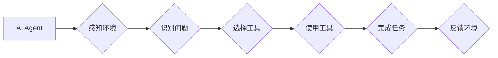

> AI Agent, 工具使用, 智能代理, 知识表示, 决策推理, 规划算法, 问题解决, 认知科学, 人机交互

## 1. 背景介绍

在人工智能领域，AI Agent（智能代理）作为一种能够感知环境、做出决策并采取行动的智能体，一直是研究的热点。AI Agent的目标是能够自主地完成任务，并与环境进行交互，最终实现人类期望的目标。然而，构建一个能够真正智能的AI Agent并非易事，它需要具备强大的知识表示能力、决策推理能力、规划能力以及问题解决能力。

传统的AI Agent通常依赖于预先定义的规则和知识库，但这种方法在面对复杂、动态的环境时显得捉襟见肘。随着人工智能技术的不断发展，研究者们开始探索新的方法来增强AI Agent的能力，其中之一就是利用工具。

工具的使用可以帮助AI Agent扩展其功能，解决更复杂的问题，并更好地适应动态的环境。例如，一个AI Agent可以利用搜索引擎来获取信息，利用计算器来进行计算，利用地图软件来规划路线等等。

## 2. 核心概念与联系

**2.1 AI Agent**

AI Agent是一个能够感知环境、做出决策并采取行动的智能体。它可以是软件程序、机器人或其他任何能够自主操作的系统。

**2.2 工具**

工具是指可以帮助AI Agent完成特定任务的外部资源或系统。工具可以是软件、硬件、数据或其他任何形式的资源。

**2.3 工具使用**

工具使用是指AI Agent能够识别、选择和利用工具来完成任务的过程。

**2.4 知识表示**

知识表示是指将知识以机器可理解的形式表示出来。AI Agent需要能够理解和使用工具的知识表示，才能有效地利用工具。

**2.5 决策推理**

决策推理是指AI Agent根据其知识和环境信息做出决策的过程。AI Agent需要能够推理出使用工具可以帮助其完成任务，并选择最合适的工具。

**2.6 规划算法**

规划算法是指AI Agent根据其目标和环境信息制定行动计划的过程。AI Agent可以使用规划算法来规划使用工具完成任务的步骤。

**2.7 问题解决**

问题解决是指AI Agent能够识别问题、分析问题、制定解决方案并执行解决方案的过程。工具的使用可以帮助AI Agent更有效地解决问题。

**2.8 认知科学**

认知科学研究人类的认知过程，包括感知、记忆、语言、推理和决策等。研究AI Agent的工具使用可以借鉴认知科学的成果，更好地理解人类如何使用工具。

**2.9 人机交互**

人机交互是指人类与计算机系统之间的交互过程。AI Agent可以使用工具来更好地与人类进行交互，例如使用自然语言处理技术来理解人类的指令。

**Mermaid 流程图**



## 3. 核心算法原理 & 具体操作步骤

### 3.1  算法原理概述

工具使用在AI Agent中是一个复杂的过程，涉及到多个方面的知识和能力。常用的算法包括：

* **知识表示和推理:** 将工具的知识表示出来，并使用推理算法来判断使用工具是否可以帮助完成任务。
* **规划算法:** 根据任务目标和环境信息，规划使用工具完成任务的步骤。
* **机器学习:** 使用机器学习算法来学习工具的使用方法，并提高工具使用效率。

### 3.2  算法步骤详解

1. **环境感知:** AI Agent首先需要感知环境，识别需要解决的问题。
2. **问题分析:** AI Agent需要分析问题，确定需要哪些工具才能解决问题。
3. **工具选择:** AI Agent需要从可用的工具中选择最合适的工具。
4. **工具使用:** AI Agent需要使用选择的工具来完成任务。
5. **结果评估:** AI Agent需要评估任务完成的结果，并根据结果进行调整。

### 3.3  算法优缺点

**优点:**

* 能够扩展AI Agent的功能，解决更复杂的问题。
* 能够提高AI Agent的适应性，更好地应对动态的环境。

**缺点:**

* 工具的使用需要额外的资源和计算能力。
* 需要开发复杂的算法来实现工具的使用。
* 工具的使用可能会带来新的风险和挑战。

### 3.4  算法应用领域

* **机器人:** 机器人可以使用工具来完成各种任务，例如抓取物体、焊接、组装等。
* **自动驾驶:** 自动驾驶汽车可以使用工具来感知环境、规划路线、避开障碍物等。
* **医疗保健:** AI Agent可以使用工具来辅助医生诊断疾病、制定治疗方案等。
* **教育:** AI Agent可以使用工具来提供个性化的学习体验、辅助学生学习等。

## 4. 数学模型和公式 & 详细讲解 & 举例说明

### 4.1  数学模型构建

我们可以使用图论模型来表示AI Agent和工具之间的关系。其中，AI Agent作为节点，工具作为节点，连接线表示AI Agent可以使用该工具。

### 4.2  公式推导过程

我们可以使用概率论和统计学来评估AI Agent使用特定工具完成任务的成功概率。

例如，假设AI Agent需要使用工具A来完成任务T，我们可以使用以下公式来计算成功概率：

$$P(T|A) = \frac{P(T \cap A)}{P(A)}$$

其中：

* $P(T|A)$ 是AI Agent使用工具A完成任务T的条件概率。
* $P(T \cap A)$ 是AI Agent使用工具A完成任务T的联合概率。
* $P(A)$ 是AI Agent使用工具A的概率。

### 4.3  案例分析与讲解

假设AI Agent需要使用工具A来完成任务T，我们知道使用工具A完成任务T的成功概率为0.8，使用工具A的概率为0.7。那么，我们可以使用上述公式计算AI Agent使用工具A完成任务T的条件概率：

$$P(T|A) = \frac{P(T \cap A)}{P(A)} = \frac{0.8 \times 0.7}{0.7} = 0.8$$

因此，AI Agent使用工具A完成任务T的条件概率为0.8。

## 5. 项目实践：代码实例和详细解释说明

### 5.1  开发环境搭建

* Python 3.x
* TensorFlow 或 PyTorch
* 其他必要的库，例如NumPy、Pandas等

### 5.2  源代码详细实现

```python
# 工具使用示例代码

class AI_Agent:
    def __init__(self):
        self.tools = {
            "搜索引擎": lambda query: self.search_engine(query),
            "计算器": lambda expression: self.calculator(expression),
        }

    def search_engine(self, query):
        # 模拟使用搜索引擎获取信息
        return f"搜索结果: {query}"

    def calculator(self, expression):
        # 模拟使用计算器进行计算
        return eval(expression)

    def choose_tool(self, task):
        # 根据任务选择合适的工具
        if "搜索" in task:
            return "搜索引擎"
        elif "计算" in task:
            return "计算器"
        else:
            return None

    def use_tool(self, tool_name, task):
        # 使用选择的工具完成任务
        tool = self.tools[tool_name]
        result = tool(task)
        return result

# 示例使用
agent = AI_Agent()
task = "查找Python教程"
tool_name = agent.choose_tool(task)
result = agent.use_tool(tool_name, task)
print(result)
```

### 5.3  代码解读与分析

* 该代码定义了一个AI Agent类，包含了工具字典、工具使用方法以及任务选择方法。
* 工具字典存储了不同的工具及其对应的使用函数。
* choose_tool方法根据任务内容选择合适的工具。
* use_tool方法使用选择的工具完成任务，并返回结果。

### 5.4  运行结果展示

```
搜索结果: Python教程
```

## 6. 实际应用场景

### 6.1  智能客服

AI Agent可以利用工具，例如搜索引擎和知识库，来回答用户的问题，提供更准确和全面的信息。

### 6.2  个性化推荐

AI Agent可以利用工具，例如用户行为数据分析工具和商品信息数据库，来为用户提供个性化的商品推荐。

### 6.3  自动写作

AI Agent可以利用工具，例如文本生成工具和语法检查工具，来辅助用户完成写作任务。

### 6.4  未来应用展望

随着人工智能技术的不断发展，AI Agent的工具使用将会更加广泛和深入。未来，AI Agent可能能够利用更高级的工具，例如虚拟现实环境和机器人手臂，来完成更复杂的任务。

## 7. 工具和资源推荐

### 7.1  学习资源推荐

* **书籍:**
    * 《人工智能：现代方法》
    * 《机器学习》
    * 《深度学习》
* **在线课程:**
    * Coursera
    * edX
    * Udacity

### 7.2  开发工具推荐

* **Python:**
    * TensorFlow
    * PyTorch
    * scikit-learn
* **其他工具:**
    * ROS (机器人操作系统)
    * OpenAI Gym (强化学习环境)

### 7.3  相关论文推荐

* **工具使用在AI Agent中的研究论文:**
    * "Tool Use in Artificial Agents"
    * "Learning to Use Tools in a Simulated Environment"
    * "A Framework for Tool Use in AI Agents"

## 8. 总结：未来发展趋势与挑战

### 8.1  研究成果总结

研究表明，工具的使用可以显著提高AI Agent的能力，使其能够解决更复杂的问题，并更好地适应动态的环境。

### 8.2  未来发展趋势

未来，AI Agent的工具使用将会更加智能化、自动化和个性化。

* **智能化:** AI Agent将能够自动选择和使用最合适的工具。
* **自动化:** AI Agent将能够自动学习和掌握新的工具的使用方法。
* **个性化:** AI Agent将能够根据用户的需求和偏好定制工具的使用方式。

### 8.3  面临的挑战

* **工具表示和推理:** 如何有效地表示工具的知识，并进行推理以选择和使用合适的工具。
* **工具学习和规划:** 如何让AI Agent能够自动学习和掌握新的工具的使用方法，并规划使用工具完成任务的步骤。
* **安全性和可靠性:** 确保AI Agent使用工具的安全性和可靠性，避免出现意外情况。

### 8.4  研究展望

未来，研究者们将继续探索AI Agent的工具使用，开发更智能、更自动化、更安全的工具使用方法，推动AI技术的发展。

## 9. 附录：常见问题与解答

* **Q1: AI Agent如何选择合适的工具？**

* **A1:** AI Agent可以使用知识表示和推理算法来分析任务需求，并根据工具的知识表示选择最合适的工具。

* **Q2: AI Agent如何学习新的工具的使用方法？**

* **A2:** AI Agent可以使用机器学习算法来学习新的工具的使用方法，例如通过模仿人类使用工具的行为，或通过与环境交互学习。

* **Q3: AI Agent使用工具是否安全可靠？**

* **A3:** 为了确保AI Agent使用工具的安全性和可靠性，需要进行充分的测试和评估，并设计相应的安全机制。


作者：禅与计算机程序设计艺术 / Zen and the Art of Computer Programming 
<end_of_turn>