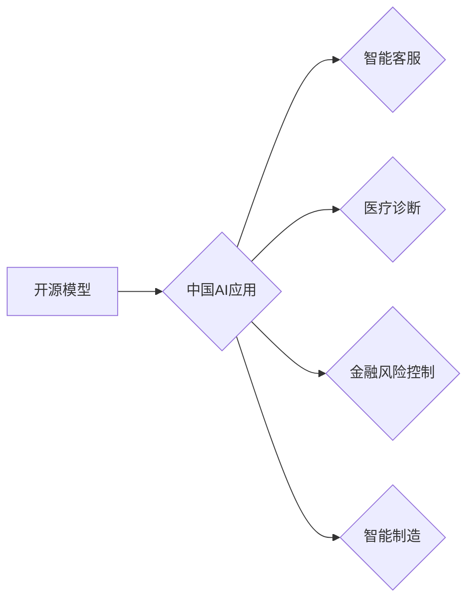

> 开源模型，中国AI，应用场景，发展趋势，挑战

## 1. 背景介绍

人工智能（AI）正以惊人的速度发展，其应用场景不断拓展，深刻地改变着我们的生活和工作方式。在全球范围内，AI技术取得了显著的进展，而中国作为全球最大的AI市场之一，也在AI领域展现出强大的实力和潜力。

开源模型作为AI发展的重要组成部分，在推动中国AI应用发展中发挥着越来越重要的作用。开源模型是指源代码公开可供他人修改和使用的AI模型，其特点是透明、可信、可定制，能够促进AI技术的普及和创新。

## 2. 核心概念与联系

**2.1 开源模型**

开源模型是指源代码公开可供他人修改和使用的AI模型。其特点包括：

* **透明度:**  源代码公开，任何人都可以查看模型的内部结构和工作原理。
* **可信度:**  代码可以被第三方审阅和验证，提高模型的可靠性和安全性。
* **可定制性:**  用户可以根据自己的需求修改模型的结构和参数，使其更适合特定的应用场景。

**2.2 中国AI应用**

中国AI应用涵盖了各个领域，包括：

* **智能客服:**  通过自然语言处理技术，提供智能化的客户服务。
* **医疗诊断:**  利用机器学习算法，辅助医生进行疾病诊断和治疗方案制定。
* **金融风险控制:**  通过数据分析和预测模型，识别和防范金融风险。
* **智能制造:**  利用机器视觉和机器人技术，提高生产效率和产品质量。

**2.3 联系**

开源模型为中国AI应用提供了重要的技术基础和资源支持。

* **降低技术门槛:**  开源模型使得开发者无需从零开始构建模型，可以快速上手并进行应用开发。
* **促进技术创新:**  开源社区的协作和贡献，加速了AI技术的进步和创新。
* **降低开发成本:**  使用开源模型可以节省开发时间和成本，提高项目效率。

**2.4  核心概念原理和架构的 Mermaid 流程图**



## 3. 核心算法原理 & 具体操作步骤

**3.1 算法原理概述**

开源模型通常基于深度学习算法，例如卷积神经网络（CNN）、循环神经网络（RNN）和Transformer等。这些算法能够从海量数据中学习特征，并进行预测或分类。

**3.2 算法步骤详解**

1. **数据收集和预处理:**  收集相关数据并进行清洗、格式化和特征提取等预处理操作。
2. **模型构建:**  根据应用场景选择合适的深度学习模型架构，并设置模型参数。
3. **模型训练:**  使用训练数据训练模型，调整模型参数以最小化预测误差。
4. **模型评估:**  使用测试数据评估模型的性能，例如准确率、召回率和F1-score等指标。
5. **模型部署:**  将训练好的模型部署到实际应用环境中，用于进行预测或分类任务。

**3.3 算法优缺点**

**优点:**

* **高精度:**  深度学习算法能够学习到复杂的特征，实现高精度的预测和分类。
* **自动化:**  模型训练和部署过程可以自动化，提高效率。
* **可扩展性:**  深度学习模型可以处理海量数据，并可以根据需要进行扩展。

**缺点:**

* **数据依赖:**  深度学习算法需要大量的训练数据，否则模型性能会下降。
* **计算资源需求:**  训练深度学习模型需要大量的计算资源，成本较高。
* **可解释性差:**  深度学习模型的内部工作机制比较复杂，难以解释其决策过程。

**3.4 算法应用领域**

深度学习算法广泛应用于各个领域，例如：

* **计算机视觉:**  图像识别、物体检测、图像分割等。
* **自然语言处理:**  文本分类、机器翻译、情感分析等。
* **语音识别:**  语音转文本、语音合成等。
* **推荐系统:**  商品推荐、内容推荐等。

## 4. 数学模型和公式 & 详细讲解 & 举例说明

**4.1 数学模型构建**

深度学习模型通常基于神经网络结构，其数学模型可以表示为一系列的线性变换和非线性激活函数。

**4.2 公式推导过程**

深度学习模型的训练过程基于梯度下降算法，其目标是通过调整模型参数，最小化预测误差。梯度下降算法的核心公式如下：

$$
\theta = \theta - \alpha \nabla L(\theta)
$$

其中：

* $\theta$ 是模型参数
* $\alpha$ 是学习率
* $L(\theta)$ 是损失函数，表示模型预测误差

**4.3 案例分析与讲解**

例如，在图像分类任务中，可以使用卷积神经网络（CNN）模型。CNN模型的结构包括多个卷积层、池化层和全连接层。每个卷积层使用卷积核对输入图像进行卷积操作，提取图像特征。池化层对卷积层的输出进行降维操作，减少计算量。全连接层将提取到的特征进行分类。

## 5. 项目实践：代码实例和详细解释说明

**5.1 开发环境搭建**

使用Python语言和深度学习框架TensorFlow或PyTorch进行开发。

**5.2 源代码详细实现**

```python
import tensorflow as tf

# 定义模型结构
model = tf.keras.models.Sequential([
    tf.keras.layers.Conv2D(32, (3, 3), activation='relu', input_shape=(28, 28, 1)),
    tf.keras.layers.MaxPooling2D((2, 2)),
    tf.keras.layers.Conv2D(64, (3, 3), activation='relu'),
    tf.keras.layers.MaxPooling2D((2, 2)),
    tf.keras.layers.Flatten(),
    tf.keras.layers.Dense(10, activation='softmax')
])

# 编译模型
model.compile(optimizer='adam',
              loss='sparse_categorical_crossentropy',
              metrics=['accuracy'])

# 训练模型
model.fit(x_train, y_train, epochs=5)

# 评估模型
loss, accuracy = model.evaluate(x_test, y_test)
print('Test loss:', loss)
print('Test accuracy:', accuracy)
```

**5.3 代码解读与分析**

这段代码定义了一个简单的卷积神经网络模型，用于手写数字识别任务。模型结构包括两个卷积层、两个池化层和一个全连接层。模型使用Adam优化器、交叉熵损失函数和准确率作为评估指标。

**5.4 运行结果展示**

训练完成后，模型可以用于预测新的手写数字图像。

## 6. 实际应用场景

**6.1 智能客服**

开源模型可以用于构建智能客服系统，通过自然语言处理技术，理解用户的意图并提供相应的回复。

**6.2 医疗诊断**

开源模型可以用于辅助医生进行疾病诊断，例如通过分析医学图像识别肿瘤或其他病变。

**6.3 金融风险控制**

开源模型可以用于识别和防范金融风险，例如通过分析交易数据识别欺诈行为。

**6.4 未来应用展望**

随着开源模型技术的不断发展，其应用场景将更加广泛，例如：

* **个性化教育:**  根据学生的学习情况，提供个性化的学习内容和辅导。
* **智能交通:**  优化交通流量，提高道路安全。
* **环境保护:**  监测环境污染，预测自然灾害。

## 7. 工具和资源推荐

**7.1 学习资源推荐**

* **深度学习框架文档:**  TensorFlow、PyTorch等深度学习框架的官方文档。
* **在线课程:**  Coursera、edX等平台上的深度学习课程。
* **开源社区:**  GitHub、HuggingFace等开源社区，可以找到开源模型和代码示例。

**7.2 开发工具推荐**

* **Python:**  深度学习开发的主要编程语言。
* **Jupyter Notebook:**  交互式编程环境，方便进行深度学习模型开发和调试。
* **TensorBoard:**  TensorFlow的可视化工具，可以监控模型训练过程。

**7.3 相关论文推荐**

* **ImageNet Classification with Deep Convolutional Neural Networks**
* **Attention Is All You Need**
* **BERT: Pre-training of Deep Bidirectional Transformers for Language Understanding**

## 8. 总结：未来发展趋势与挑战

**8.1 研究成果总结**

开源模型在推动中国AI应用发展中发挥着越来越重要的作用，其透明、可信、可定制的特点，降低了技术门槛，促进了技术创新和应用普及。

**8.2 未来发展趋势**

* **模型规模和能力提升:**  未来开源模型将更加强大，能够处理更复杂的任务。
* **多模态模型发展:**  融合文本、图像、音频等多模态数据，构建更智能的模型。
* **联邦学习发展:**  保护数据隐私，实现模型在分布式环境下的协同训练。

**8.3 面临的挑战**

* **数据安全和隐私保护:**  开源模型的训练和应用需要大量数据，如何保证数据安全和隐私保护是一个重要挑战。
* **模型可解释性和信任度:**  深度学习模型的决策过程比较复杂，难以解释，如何提高模型的可解释性和信任度是一个关键问题。
* **人才培养和生态建设:**  开源模型的开发和应用需要大量的技术人才，需要加强人才培养和生态建设。

**8.4 研究展望**

未来，我们将继续关注开源模型在不同领域的应用，并致力于解决其面临的挑战，推动开源模型技术在中国的进一步发展和应用。

## 9. 附录：常见问题与解答

**9.1 如何选择合适的开源模型？**

选择合适的开源模型需要根据具体的应用场景和需求进行考虑，例如：

* **任务类型:**  不同的任务类型需要不同的模型架构，例如图像识别需要使用CNN模型，文本分类需要使用RNN或Transformer模型。
* **数据规模:**  模型的训练数据量会影响其性能，需要选择合适的模型大小和参数数量。
* **计算资源:**  训练大型模型需要大量的计算资源，需要根据实际情况选择合适的模型。

**9.2 如何使用开源模型进行模型训练？**

使用开源模型进行模型训练通常需要以下步骤：

* **下载模型代码和预训练权重:**  从开源社区下载模型代码和预训练权重文件。
* **修改模型结构和参数:**  根据实际需求修改模型结构和参数，例如添加新的层、调整学习率等。
* **准备训练数据:**  收集和预处理训练数据，并将其格式化为模型所需的格式。
* **训练模型:**  使用深度学习框架训练模型，并监控训练过程中的损失函数和准确率。
* **评估模型:**  使用测试数据评估模型的性能，并进行必要的调整。

**9.3 如何部署开源模型？**

部署开源模型可以采用多种方式，例如：

* **云端部署:**  将模型部署到云计算平台，例如AWS、Azure、阿里云等。
* **边缘部署:**  将模型部署到边缘设备，例如手机、物联网设备等。
* **容器化部署:**  将模型打包成容器，方便部署和管理。


作者：禅与计算机程序设计艺术 / Zen and the Art of Computer Programming 
<end_of_turn>