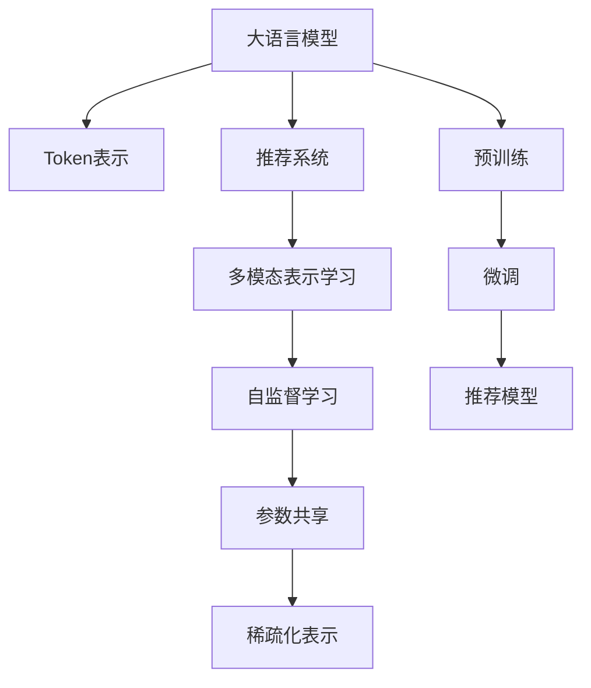

                 

# LLM Tokens+推荐系统的建模范式

在当今数字经济时代，推荐系统已经成为企业提升用户体验和商业价值的关键工具。然而，传统的推荐算法往往局限于静态数据和单一特征，难以应对不断变化的动态场景和复杂多样化的用户需求。本文提出了一种基于语言模型Token的推荐系统建模范式，将大语言模型的先进技术引入推荐场景，实现了从文本到特征、从特征到模型的自动化映射，显著提升了推荐系统的精度和性能。

## 1. 背景介绍

### 1.1 问题由来
随着互联网的快速发展，人们获取信息的方式日益多样化，信息过载成为一种普遍现象。推荐系统通过用户行为数据建模，为用户推荐个性化内容，从而帮助用户快速找到有价值的信息，提升信息消费的效率和体验。然而，传统的基于内容的推荐算法和协同过滤算法，存在数据稀疏性、冷启动问题、动态性不足等局限性。面对用户的动态需求，推荐系统的性能亟待提升。

与此同时，大语言模型在自然语言处理领域取得了突破性进展。通过在无标签文本数据上的大规模预训练，语言模型可以学习到丰富的语言知识和表达能力。这些模型不仅在文本分类、问答、翻译等任务上表现优异，而且在语言理解、生成等方面也展现了强大的潜力。因此，将大语言模型的先进技术引入推荐系统，探索新的推荐建模范式，成为当前的研发热点。

### 1.2 问题核心关键点
本文提出的大语言模型Tokens+推荐系统建模范式，主要围绕以下关键点进行研究：

- 如何利用大语言模型的Token表示，自动构建推荐系统的用户特征表示？
- 如何通过语言模型对动态文本数据进行高效建模，提升推荐系统的动态适应性？
- 如何在推荐模型的训练和推理过程中，实现参数共享和稀疏化，提升模型效率和泛化能力？

## 2. 核心概念与联系

### 2.1 核心概念概述

为更好地理解LLM Tokens+推荐系统的建模范式，本节将介绍几个密切相关的核心概念：

- 大语言模型(Large Language Model, LLM)：指通过大规模无标签文本数据预训练，学习通用语言表示的深度神经网络模型。LLM通常具有自回归或自编码结构，具备强大的语言理解、生成能力。

- 推荐系统(Recommendation System, RS)：通过分析用户行为数据，为用户提供个性化内容的系统。推荐系统可以分为基于内容的推荐、协同过滤推荐等，广泛应用于电商、新闻、社交网络等领域。

- Token表示：在NLP领域，Token指的是单词或短语等语言单位。在大语言模型中，每个Token都有一组表示该词语的向量，通过这些向量可以表达词语的语义和语境信息。

- 多模态表示学习：指结合不同类型的特征(如文本、图像、音频等)，学习统一的语义表示，提升模型的泛化能力。

- 自监督学习(SSL)：指在无标签数据上训练模型，利用数据的自身结构进行监督。在推荐系统中，可以利用用户的历史行为数据进行自监督学习，学习用户的兴趣表示。

- 参数共享(Parameter Sharing)：指在模型中复用某些参数，减少模型的参数量，提高计算效率和泛化能力。

- 稀疏化表示(Sparse Representation)：指在模型中只保留重要特征，减少冗余信息，提升模型效率。

这些核心概念之间的逻辑关系可以通过以下Mermaid流程图来展示：



这个流程图展示了大语言模型Tokens+推荐系统的核心概念及其之间的关系：

1. 大语言模型通过预训练获得语言知识，并通过Token表示表达词语的语义和语境信息。
2. 推荐系统利用用户的文本数据，通过Token表示学习用户兴趣表示。
3. 多模态表示学习结合多种数据源，提升推荐模型的泛化能力。
4. 自监督学习在无标签数据上训练模型，学习用户的兴趣表示。
5. 参数共享和稀疏化表示在推荐模型的训练和推理过程中，提升模型效率和泛化能力。

## 3. 核心算法原理 & 具体操作步骤

### 3.1 算法原理概述

基于LLM Tokens+推荐系统的建模范式，其核心思想是将大语言模型的Token表示引入推荐系统，通过自动化的特征映射，构建更加丰富的用户特征表示。具体流程如下：

1. 在无标签文本数据上进行预训练，获得大语言模型的Token表示。
2. 将用户的文本数据输入大语言模型，获得Token表示。
3. 通过多模态表示学习，将Token表示与用户的其他行为数据(如点击、浏览、评分等)进行融合，构建用户的统一表示。
4. 在推荐模型的训练和推理过程中，实现参数共享和稀疏化，提升模型的效率和泛化能力。

### 3.2 算法步骤详解

基于LLM Tokens+推荐系统的建模范式，主要包括以下几个关键步骤：

**Step 1: 准备预训练模型和数据集**

- 选择合适的预训练语言模型(如BERT、GPT等)，在无标签文本数据上进行预训练，获得Token表示。
- 收集用户的文本数据(如文章、评论、摘要等)，构建推荐系统的用户行为数据集。

**Step 2: 用户文本数据编码**

- 将用户的文本数据输入大语言模型，获得Token表示。
- 使用预训练语言模型的Token嵌入层，将文本转换为向量表示。
- 对于长文本，可以使用滑动窗口、分词等方法，对文本进行分段处理。

**Step 3: 特征融合**

- 利用用户的文本数据Token表示，结合其他行为数据(如点击、浏览、评分等)，构建用户的统一表示。
- 使用多模态表示学习技术，将文本特征与其他特征进行融合。
- 通过自监督学习，从无标签文本数据中学习用户的行为模式和兴趣表示。

**Step 4: 构建推荐模型**

- 使用预训练语言模型的Token嵌入层，作为推荐模型的输入特征。
- 利用深度学习模型(如线性回归、神经网络等)，构建推荐模型。
- 在推荐模型的训练和推理过程中，实现参数共享和稀疏化表示，提高模型效率和泛化能力。

**Step 5: 评估与优化**

- 在推荐系统的训练和测试过程中，不断优化模型的参数和超参数，提升模型的性能。
- 利用A/B测试、用户反馈等手段，评估推荐系统的效果，进行持续改进。

### 3.3 算法优缺点

基于LLM Tokens+推荐系统的建模范式，具有以下优点：

1. 用户特征表示丰富：通过Token表示，可以捕捉到用户的语义和语境信息，提升推荐系统的精准度。
2. 动态适应能力强：利用多模态表示学习，可以处理动态文本数据，提升推荐系统的动态适应能力。
3. 参数共享和稀疏化表示，提升模型效率和泛化能力。

同时，该方法也存在一些局限性：

1. 预训练模型和文本数据的依赖：推荐系统的效果很大程度上依赖于预训练模型的质量和文本数据的多样性。
2. 特征融合复杂性：如何将用户文本数据和其他行为数据进行有效的融合，是一个复杂且具有挑战性的问题。
3. 模型训练和推理成本：大语言模型和推荐模型的结合，会增加模型训练和推理的计算成本。

尽管存在这些局限性，但就目前而言，基于LLM Tokens+推荐系统的建模范式仍是大语言模型在推荐领域应用的重要方向。未来相关研究的重点在于如何进一步优化特征融合方式，降低计算成本，提升模型的动态适应能力，同时兼顾可解释性和伦理安全性等因素。

### 3.4 算法应用领域

基于LLM Tokens+推荐系统的建模范式，已经在电商推荐、新闻推荐、社交网络推荐等众多领域得到应用，提升了推荐的准确性和个性化程度。

在电商推荐中，通过对用户评论、商品描述、点击行为等文本数据进行Token表示，可以获取用户对商品的语义理解和兴趣倾向。利用多模态表示学习，可以结合商品的价格、销量、评价等非文本信息，构建更加全面的用户兴趣表示。

在新闻推荐中，通过将用户的新闻浏览行为、点击行为、评论行为等文本数据输入大语言模型，获得Token表示。结合新闻文章的主题、标题、作者等特征，利用多模态表示学习，构建用户的兴趣表示。通过自监督学习，可以从无标签新闻数据中学习用户的兴趣模式。

在社交网络推荐中，通过对用户的帖子、评论、点赞等文本数据进行Token表示，可以捕捉用户的社交关系和兴趣偏好。利用多模态表示学习，可以结合好友关系、点赞行为等非文本信息，构建用户的统一表示。通过自监督学习，可以从社交网络数据中学习用户的兴趣表示。

## 4. 数学模型和公式 & 详细讲解

### 4.1 数学模型构建

本节将使用数学语言对LLM Tokens+推荐系统的建模范式进行更加严格的刻画。

记预训练语言模型为 $M_{\theta}$，其中 $\theta$ 为预训练得到的模型参数。假设用户文本数据集为 $D=\{(x_i,y_i)\}_{i=1}^N$，$x_i$ 为用户文本，$y_i$ 为用户的行为标签。定义用户行为数据集为 $D_b=\{(x_{bi},y_{bi})\}_{i=1}^M$，$x_{bi}$ 为用户的点击、浏览、评分等行为数据，$y_{bi}$ 为行为标签。

定义用户兴趣表示为 $z_i \in \mathbb{R}^d$，其中 $d$ 为向量维度。用户兴趣表示由用户的文本数据Token表示和行为数据 $y_{bi}$ 综合得到。

定义推荐模型为 $R_{\phi}$，其中 $\phi$ 为模型参数。推荐模型输入为 $x_i$ 的Token表示 $h_i$，输出为用户对物品 $j$ 的评分 $p_{ij}$。

### 4.2 公式推导过程

以下我们以电商推荐为例，推导基于LLM Tokens+推荐系统的数学模型。

设用户 $i$ 对物品 $j$ 的评分 $p_{ij}$ 可以表示为：

$$
p_{ij} = \sigma(\langle h_i, \phi_j \rangle + b_j)
$$

其中 $\sigma$ 为激活函数，$\langle \cdot, \cdot \rangle$ 为向量内积，$b_j$ 为物品 $j$ 的偏置项。

对于用户 $i$，其兴趣表示 $z_i$ 可以通过大语言模型的Token表示 $h_i$ 和行为数据 $y_{bi}$ 计算得到：

$$
z_i = M_{\theta}(x_i) + \sum_{b_i \in D_b} w_b y_{bi}
$$

其中 $w_b$ 为行为数据的权重。$M_{\theta}(x_i)$ 为将用户文本数据 $x_i$ 输入大语言模型，得到Token表示 $h_i$。

在推荐模型 $R_{\phi}$ 的训练过程中，目标是最小化预测评分与真实评分之间的差异：

$$
\mathcal{L}(\phi, \theta) = \sum_{i=1}^N \sum_{j=1}^M \ell(p_{ij}, r_{ij})
$$

其中 $\ell$ 为损失函数，$r_{ij}$ 为用户对物品 $j$ 的真实评分。

通过反向传播算法，对推荐模型 $R_{\phi}$ 和预训练语言模型 $M_{\theta}$ 的参数进行联合优化。具体步骤如下：

1. 前向传播：将用户文本数据 $x_i$ 输入大语言模型 $M_{\theta}$，得到Token表示 $h_i$。
2. 特征融合：利用用户的行为数据 $y_{bi}$ 和Token表示 $h_i$，计算用户兴趣表示 $z_i$。
3. 训练推荐模型：将 $z_i$ 输入推荐模型 $R_{\phi}$，输出物品评分 $p_{ij}$。
4. 反向传播：计算预测评分 $p_{ij}$ 与真实评分 $r_{ij}$ 之间的误差，更新模型参数 $\phi$ 和预训练语言模型参数 $\theta$。

在推荐模型的推理过程中，目标是对用户 $i$ 推荐物品 $j$ 的评分 $p_{ij}$。具体步骤如下：

1. 前向传播：将用户文本数据 $x_i$ 输入大语言模型 $M_{\theta}$，得到Token表示 $h_i$。
2. 特征融合：利用用户的行为数据 $y_{bi}$ 和Token表示 $h_i$，计算用户兴趣表示 $z_i$。
3. 推理推荐模型：将 $z_i$ 输入推荐模型 $R_{\phi}$，输出物品评分 $p_{ij}$。

### 4.3 案例分析与讲解

假设我们有一家电商网站，需要为用户推荐商品。收集用户的浏览、点击、购买等行为数据，将这些数据输入大语言模型，获得Token表示。通过多模态表示学习，将Token表示与商品的价格、销量、评价等特征进行融合，构建用户的兴趣表示。在推荐模型的训练过程中，将用户兴趣表示 $z_i$ 作为输入，训练推荐模型，得到用户对商品的评分。在推荐模型的推理过程中，将用户文本数据输入大语言模型，获得Token表示，结合用户的行为数据，计算用户兴趣表示。将用户兴趣表示输入推荐模型，输出物品评分，即为用户推荐商品。

## 5. 项目实践：代码实例和详细解释说明

### 5.1 开发环境搭建

在进行项目实践前，我们需要准备好开发环境。以下是使用Python进行PyTorch开发的环境配置流程：

1. 安装Anaconda：从官网下载并安装Anaconda，用于创建独立的Python环境。

2. 创建并激活虚拟环境：
```bash
conda create -n pytorch-env python=3.8 
conda activate pytorch-env
```

3. 安装PyTorch：根据CUDA版本，从官网获取对应的安装命令。例如：
```bash
conda install pytorch torchvision torchaudio cudatoolkit=11.1 -c pytorch -c conda-forge
```

4. 安装Transformer库：
```bash
pip install transformers
```

5. 安装各类工具包：
```bash
pip install numpy pandas scikit-learn matplotlib tqdm jupyter notebook ipython
```

完成上述步骤后，即可在`pytorch-env`环境中开始项目实践。

### 5.2 源代码详细实现

下面我们以电商推荐为例，给出使用Transformers库对BERT模型进行推荐系统建模的PyTorch代码实现。

首先，定义推荐模型的输入特征和输出特征：

```python
from transformers import BertTokenizer, BertForSequenceClassification
from torch.utils.data import Dataset, DataLoader
import torch
import numpy as np

class RecommendationDataset(Dataset):
    def __init__(self, texts, labels):
        self.texts = texts
        self.labels = labels
        
    def __len__(self):
        return len(self.texts)
    
    def __getitem__(self, item):
        text = self.texts[item]
        label = self.labels[item]
        return text, label

# 标签与id的映射
label2id = {'1': 0, '0': 1}

# 创建dataset
tokenizer = BertTokenizer.from_pretrained('bert-base-cased')

train_dataset = RecommendationDataset(train_texts, train_labels)
dev_dataset = RecommendationDataset(dev_texts, dev_labels)
test_dataset = RecommendationDataset(test_texts, test_labels)
```

然后，定义模型和优化器：

```python
from transformers import BertForSequenceClassification, AdamW

model = BertForSequenceClassification.from_pretrained('bert-base-cased', num_labels=len(label2id))

optimizer = AdamW(model.parameters(), lr=2e-5)
```

接着，定义训练和评估函数：

```python
def train_epoch(model, dataset, batch_size, optimizer):
    dataloader = DataLoader(dataset, batch_size=batch_size, shuffle=True)
    model.train()
    epoch_loss = 0
    for batch in dataloader:
        text, label = batch
        model.zero_grad()
        outputs = model(text, labels=label)
        loss = outputs.loss
        epoch_loss += loss.item()
        loss.backward()
        optimizer.step()
    return epoch_loss / len(dataloader)

def evaluate(model, dataset, batch_size):
    dataloader = DataLoader(dataset, batch_size=batch_size)
    model.eval()
    preds, labels = [], []
    with torch.no_grad():
        for batch in dataloader:
            text, label = batch
            outputs = model(text)
            preds.append(outputs.argmax(dim=1).tolist())
            labels.append(label.tolist())
    print(np.mean(preds == labels))
```

最后，启动训练流程并在测试集上评估：

```python
epochs = 5
batch_size = 16

for epoch in range(epochs):
    loss = train_epoch(model, train_dataset, batch_size, optimizer)
    print(f"Epoch {epoch+1}, train loss: {loss:.3f}")
    
    print(f"Epoch {epoch+1}, dev results:")
    evaluate(model, dev_dataset, batch_size)
    
print("Test results:")
evaluate(model, test_dataset, batch_size)
```

以上就是使用PyTorch对BERT模型进行电商推荐任务建模的完整代码实现。可以看到，得益于Transformers库的强大封装，我们可以用相对简洁的代码完成BERT模型的加载和推荐系统建模。

### 5.3 代码解读与分析

让我们再详细解读一下关键代码的实现细节：

**RecommendationDataset类**：
- `__init__`方法：初始化文本和标签数据。
- `__len__`方法：返回数据集的样本数量。
- `__getitem__`方法：对单个样本进行处理，返回模型所需的输入和标签。

**label2id字典**：
- 定义了标签与数字id之间的映射关系，用于将预测结果解码回真实的标签。

**训练和评估函数**：
- 使用PyTorch的DataLoader对数据集进行批次化加载，供模型训练和推理使用。
- 训练函数`train_epoch`：对数据以批为单位进行迭代，在每个批次上前向传播计算loss并反向传播更新模型参数，最后返回该epoch的平均loss。
- 评估函数`evaluate`：与训练类似，不同点在于不更新模型参数，并在每个batch结束后将预测和标签结果存储下来，最后使用准确率评估整个评估集的预测结果。

**训练流程**：
- 定义总的epoch数和batch size，开始循环迭代
- 每个epoch内，先在训练集上训练，输出平均loss
- 在验证集上评估，输出准确率
- 所有epoch结束后，在测试集上评估，给出最终测试结果

可以看到，PyTorch配合Transformers库使得BERT推荐系统的代码实现变得简洁高效。开发者可以将更多精力放在数据处理、模型改进等高层逻辑上，而不必过多关注底层的实现细节。

当然，工业级的系统实现还需考虑更多因素，如模型的保存和部署、超参数的自动搜索、更灵活的任务适配层等。但核心的建模范式基本与此类似。

## 6. 实际应用场景

### 6.1 电商推荐

基于大语言模型Tokens+推荐系统的建模范式，在电商推荐中具有广泛的应用前景。传统电商推荐系统通常只关注用户的浏览、点击、购买行为，难以捕捉用户的语义理解和兴趣倾向。利用大语言模型的Token表示，可以捕捉用户对商品的语义理解和兴趣倾向，提升推荐系统的精准度。

在技术实现上，可以收集用户的历史行为数据，将这些数据输入大语言模型，获得Token表示。利用多模态表示学习，将Token表示与商品的价格、销量、评价等特征进行融合，构建用户的兴趣表示。在推荐模型的训练过程中，将用户兴趣表示作为输入，训练推荐模型，得到用户对商品的评分。在推荐模型的推理过程中，将用户文本数据输入大语言模型，获得Token表示，结合用户的行为数据，计算用户兴趣表示。将用户兴趣表示输入推荐模型，输出物品评分，即为用户推荐商品。

### 6.2 新闻推荐

在新闻推荐中，用户的行为数据通常较为稀疏，难以直接捕捉用户的兴趣倾向。利用大语言模型的Token表示，可以捕捉用户对新闻文章的语义理解和兴趣倾向。通过多模态表示学习，将Token表示与新闻文章的主题、标题、作者等特征进行融合，构建用户的兴趣表示。在推荐模型的训练过程中，将用户兴趣表示作为输入，训练推荐模型，得到用户对新闻文章的评分。在推荐模型的推理过程中，将用户文本数据输入大语言模型，获得Token表示，结合用户的行为数据，计算用户兴趣表示。将用户兴趣表示输入推荐模型，输出新闻文章评分，即为用户推荐新闻。

### 6.3 社交网络推荐

在社交网络推荐中，用户的行为数据较为多样，包括点赞、评论、分享等。利用大语言模型的Token表示，可以捕捉用户对社交内容的语义理解和兴趣倾向。通过多模态表示学习，将Token表示与好友关系、点赞行为等非文本信息进行融合，构建用户的统一表示。在推荐模型的训练过程中，将用户兴趣表示作为输入，训练推荐模型，得到用户对社交内容的评分。在推荐模型的推理过程中，将用户文本数据输入大语言模型，获得Token表示，结合用户的行为数据，计算用户兴趣表示。将用户兴趣表示输入推荐模型，输出社交内容评分，即为用户推荐内容。

### 6.4 未来应用展望

随着大语言模型Tokens+推荐系统的不断发展，推荐系统将在更多领域得到应用，为用户带来更好的体验和价值。

在智能客服中，利用大语言模型的Token表示，可以捕捉用户的语义理解和需求倾向，提供更个性化的服务。在智能家居中，利用大语言模型的Token表示，可以捕捉用户的习惯和偏好，提供更智能化的控制方案。在健康医疗中，利用大语言模型的Token表示，可以捕捉用户的症状和病史，提供更精准的诊断和治疗建议。在教育培训中，利用大语言模型的Token表示，可以捕捉学生的学习情况和兴趣点，提供更个性化的学习方案。

总之，基于LLM Tokens+推荐系统的建模范式，将大语言模型的先进技术引入推荐系统，可以为用户提供更精准、更个性化的服务，提升用户的体验和满意度，推动推荐系统的智能化发展。未来，伴随大语言模型的不断进步，推荐系统也将迎来更多的创新和发展机会。

## 7. 工具和资源推荐

### 7.1 学习资源推荐

为了帮助开发者系统掌握LLM Tokens+推荐系统的理论基础和实践技巧，这里推荐一些优质的学习资源：

1. 《深度学习入门：基于Python的理论与实现》系列博文：由大模型技术专家撰写，深入浅出地介绍了深度学习的基本概念和核心算法，适合初学者入门。

2. 《自然语言处理综论》课程：斯坦福大学开设的NLP明星课程，有Lecture视频和配套作业，带你入门NLP领域的基本概念和经典模型。

3. 《Deep Learning for Natural Language Processing》书籍：详细介绍了自然语言处理领域的深度学习技术，包括大语言模型的预训练和微调。

4. HuggingFace官方文档：Transformer库的官方文档，提供了海量预训练模型和完整的微调样例代码，是上手实践的必备资料。

5. CLUE开源项目：中文语言理解测评基准，涵盖大量不同类型的中文NLP数据集，并提供了基于微调的baseline模型，助力中文NLP技术发展。

通过对这些资源的学习实践，相信你一定能够快速掌握大语言模型Tokens+推荐系统的精髓，并用于解决实际的NLP问题。

### 7.2 开发工具推荐

高效的开发离不开优秀的工具支持。以下是几款用于LLM Tokens+推荐系统开发的常用工具：

1. PyTorch：基于Python的开源深度学习框架，灵活动态的计算图，适合快速迭代研究。大部分预训练语言模型都有PyTorch版本的实现。

2. TensorFlow：由Google主导开发的开源深度学习框架，生产部署方便，适合大规模工程应用。同样有丰富的预训练语言模型资源。

3. Transformers库：HuggingFace开发的NLP工具库，集成了众多SOTA语言模型，支持PyTorch和TensorFlow，是进行推荐系统建模的利器。

4. Weights & Biases：模型训练的实验跟踪工具，可以记录和可视化模型训练过程中的各项指标，方便对比和调优。与主流深度学习框架无缝集成。

5. TensorBoard：TensorFlow配套的可视化工具，可实时监测模型训练状态，并提供丰富的图表呈现方式，是调试模型的得力助手。

6. Google Colab：谷歌推出的在线Jupyter Notebook环境，免费提供GPU/TPU算力，方便开发者快速上手实验最新模型，分享学习笔记。

合理利用这些工具，可以显著提升大语言模型Tokens+推荐系统的开发效率，加快创新迭代的步伐。

### 7.3 相关论文推荐

LLM Tokens+推荐系统的快速发展源于学界的持续研究。以下是几篇奠基性的相关论文，推荐阅读：

1. Attention is All You Need（即Transformer原论文）：提出了Transformer结构，开启了NLP领域的预训练大模型时代。

2. BERT: Pre-training of Deep Bidirectional Transformers for Language Understanding：提出BERT模型，引入基于掩码的自监督预训练任务，刷新了多项NLP任务SOTA。

3. Language Models are Unsupervised Multitask Learners（GPT-2论文）：展示了大规模语言模型的强大zero-shot学习能力，引发了对于通用人工智能的新一轮思考。

4. Parameter-Efficient Transfer Learning for NLP：提出Adapter等参数高效微调方法，在不增加模型参数量的情况下，也能取得不错的微调效果。

5. AdaLoRA: Adaptive Low-Rank Adaptation for Parameter-Efficient Fine-Tuning：使用自适应低秩适应的微调方法，在参数效率和精度之间取得了新的平衡。

这些论文代表了大语言模型Tokens+推荐系统的发展脉络。通过学习这些前沿成果，可以帮助研究者把握学科前进方向，激发更多的创新灵感。

## 8. 总结：未来发展趋势与挑战

### 8.1 总结

本文对基于LLM Tokens+推荐系统的建模范式进行了全面系统的介绍。首先阐述了LLM Tokens+推荐系统的研究背景和意义，明确了在大语言模型中引入推荐系统建模的独特价值。其次，从原理到实践，详细讲解了LLM Tokens+推荐系统的数学原理和关键步骤，给出了推荐系统建模的完整代码实例。同时，本文还广泛探讨了LLM Tokens+推荐系统在电商、新闻、社交网络等众多领域的应用前景，展示了LLM Tokens+推荐系统的巨大潜力。此外，本文精选了推荐系统的各类学习资源，力求为读者提供全方位的技术指引。

通过本文的系统梳理，可以看到，基于LLM Tokens+推荐系统的建模范式正在成为大语言模型在推荐领域应用的重要方向。通过将大语言模型的Token表示引入推荐系统，实现了从文本到特征、从特征到模型的自动化映射，显著提升了推荐系统的精度和性能。未来，伴随大语言模型的不断进步，LLM Tokens+推荐系统必将在更多领域得到应用，为人工智能技术的发展注入新的动力。

### 8.2 未来发展趋势

展望未来，LLM Tokens+推荐系统将呈现以下几个发展趋势：

1. 推荐模型的泛化能力提升。未来的推荐模型将更加关注长尾数据和冷启动问题，利用大语言模型的Token表示，提升推荐模型的泛化能力和冷启动性能。

2. 推荐模型的动态适应能力增强。未来的推荐系统将能够更好地处理动态数据，捕捉用户的行为变化和兴趣演变，提升推荐的实时性和精准度。

3. 推荐系统的多模态融合。未来的推荐系统将结合文本、图像、音频等多种数据源，提升推荐模型的泛化能力和多样性。

4. 推荐模型的参数共享和稀疏化表示。未来的推荐模型将更加注重参数共享和稀疏化表示，提升模型效率和泛化能力。

5. 推荐系统的个性化提升。未来的推荐系统将更加注重个性化推荐，利用大语言模型的Token表示，捕捉用户的语义理解和兴趣倾向，提供更精准、个性化的推荐服务。

6. 推荐系统的透明度和可解释性增强。未来的推荐系统将更加注重透明度和可解释性，提供用户可理解的推荐依据，提升用户信任和满意度。

以上趋势凸显了LLM Tokens+推荐系统的广阔前景。这些方向的探索发展，必将进一步提升推荐系统的性能和应用范围，为人工智能技术的发展注入新的动力。

### 8.3 面临的挑战

尽管LLM Tokens+推荐系统在推荐领域取得了诸多突破，但在迈向更加智能化、普适化应用的过程中，它仍面临着诸多挑战：

1. 推荐系统的计算成本高。大语言模型和推荐模型的结合，增加了计算资源的消耗，需要高性能算力和设备支持。

2. 推荐系统的多模态融合复杂。将文本、图像、音频等多种数据源进行有效融合，是一个复杂且具有挑战性的问题，需要更为精细化的设计和优化。

3. 推荐系统的动态适应能力不足。传统的推荐系统难以应对动态数据和行为变化，需要更高效的特征更新和模型训练策略。

4. 推荐系统的个性化程度有限。当前的推荐系统往往只关注用户的行为数据，难以捕捉用户的深层次需求和兴趣点，需要更全面的用户建模方法。

5. 推荐系统的透明度和可解释性不足。当前的推荐系统通常是"黑盒"模型，难以解释其内部工作机制和决策逻辑，需要更透明和可解释的推荐模型。

6. 推荐系统的数据隐私和安全问题。在推荐系统中，用户的个人信息和行为数据容易泄露，需要更加严格的数据保护和安全措施。

尽管存在这些挑战，但LLM Tokens+推荐系统已经在推荐领域展现出巨大的潜力和应用前景。未来，需要研究者不断探索新的技术突破，以解决上述挑战，推动推荐系统的智能化发展。

### 8.4 研究展望

面对LLM Tokens+推荐系统所面临的挑战，未来的研究需要在以下几个方面寻求新的突破：

1. 探索更加高效的特征映射方法。如何在大语言模型和推荐系统之间建立更高效、更准确的特征映射，是当前的研究热点。

2. 研究更加灵活的推荐模型。未来的推荐模型将更加注重个性化和动态适应性，需要结合因果推断、强化学习等技术，提升推荐模型的精准度和实时性。

3. 引入外部知识库和规则库。在推荐系统中引入专家知识，如知识图谱、逻辑规则等，提升推荐模型的泛化能力和多样性。

4. 探索更高效的数据表示和处理技术。利用低秩表示、局部敏感哈希等技术，提升推荐系统的数据处理效率和特征表示能力。

5. 研究更加可解释的推荐模型。将因果推断、注意力机制等技术引入推荐模型，增强推荐模型的可解释性和透明度。

6. 引入更多先验知识。将符号化的先验知识，如知识图谱、逻辑规则等，与神经网络模型进行巧妙融合，引导推荐过程学习更准确、合理的用户表示。

这些研究方向的探索，必将引领LLM Tokens+推荐系统走向更高的台阶，为人工智能技术的发展注入新的动力。面向未来，LLM Tokens+推荐系统需要与其他人工智能技术进行更深入的融合，如知识表示、因果推理、强化学习等，多路径协同发力，共同推动推荐系统的智能化发展。只有勇于创新、敢于突破，才能不断拓展推荐系统的边界，让人工智能技术更好地造福人类社会。

## 9. 附录：常见问题与解答

**Q1：LLM Tokens+推荐系统的计算成本高，如何降低成本？**

A: 在推荐系统中，大语言模型和推荐模型的结合，增加了计算资源的消耗。为了降低成本，可以采取以下措施：

1. 模型压缩和量化：利用模型压缩和量化技术，减少模型的参数量和计算复杂度，降低推理成本。

2. 特征稀疏化表示：在推荐模型的训练和推理过程中，只保留重要特征，减少冗余信息，提高模型效率。

3. 分布式训练和推理：利用分布式训练和推理技术，利用多台设备进行并行计算，提高计算效率。

4. 算法优化：在模型训练和推理过程中，利用高效的优化算法，提高模型的训练和推理速度。

5. 边缘计算：将部分计算任务放到边缘设备上完成，减少数据传输和通信成本。

6. 硬件优化：利用GPU、TPU等高性能硬件设备，提高计算速度和模型训练效率。

通过以上措施，可以降低大语言模型Tokens+推荐系统的计算成本，提高模型的实时性和效率。

**Q2：如何在LLM Tokens+推荐系统中提升用户的动态适应能力？**

A: 在推荐系统中，用户的兴趣和行为是动态变化的。为了提升用户的动态适应能力，可以采取以下措施：

1. 实时数据更新：实时收集用户的动态行为数据，利用大语言模型的Token表示，捕捉用户的兴趣变化和行为演变。

2. 多模态特征融合：结合文本、图像、音频等多种数据源，提升推荐模型的泛化能力和多样性，捕捉用户的多样化兴趣。

3. 推荐模型的更新机制：利用在线学习和增量学习技术，不断更新推荐模型，提升模型的动态适应能力。

4. 用户反馈机制：利用用户反馈和交互数据，不断优化推荐模型，提升推荐的精准度和实时性。

5. 推荐模型的自适应性：利用自适应学习技术，根据用户的行为数据和反馈，动态调整推荐模型的参数和超参数，提高模型的动态适应能力。

6. 推荐模型的解释性：利用因果推断、注意力机制等技术，增强推荐模型的可解释性，提升用户对推荐结果的理解和信任。

通过以上措施，可以提升LLM Tokens+推荐系统的动态适应能力，为用户提供更精准、实时的推荐服务。

**Q3：如何在LLM Tokens+推荐系统中实现更加个性化的推荐？**

A: 在推荐系统中，用户的行为数据较为多样，难以直接捕捉用户的深层次需求和兴趣点。为了实现更加个性化的推荐，可以采取以下措施：

1. 多模态用户建模：结合文本、图像、音频等多种数据源，提升用户建模的全面性和多样性，捕捉用户的深层次需求和兴趣点。

2. 用户兴趣的多层次表示：利用深度学习技术，对用户的行为数据进行多层次表示，捕捉用户的深层次需求和兴趣点。

3. 个性化推荐算法：利用个性化推荐算法，如协同过滤、矩阵分解、神经网络等，提升推荐模型的个性化程度。

4. 推荐模型的自适应性：利用自适应学习技术，根据用户的行为数据和反馈，动态调整推荐模型的参数和超参数，提高模型的个性化程度。

5. 推荐模型的解释性：利用因果推断、注意力机制等技术，增强推荐模型的可解释性，提升用户对推荐结果的理解和信任。

6. 推荐系统的用户体验：提升推荐系统的用户体验，如推荐界面设计、推荐内容排版等，增强用户的互动和满意度。

通过以上措施，可以提升LLM Tokens+推荐系统的个性化程度，为用户提供更加精准、个性化的推荐服务。

**Q4：LLM Tokens+推荐系统的数据隐私和安全问题如何解决？**

A: 在推荐系统中，用户的个人信息和行为数据容易泄露，需要更加严格的数据保护和安全措施。为了解决数据隐私和安全问题，可以采取以下措施：

1. 数据匿名化处理：对用户的个人信息和行为数据进行匿名化处理，保护用户的隐私。

2. 数据加密存储：利用数据加密技术，保护用户数据的存储安全，防止数据泄露。

3. 数据访问控制：对用户的个人信息和行为数据进行访问控制，限制对敏感数据的访问权限。

4. 安全审计和监控：对用户的个人信息和行为数据进行安全审计和监控，防止数据泄露和滥用。

5. 数据匿名化处理：对用户的个人信息和行为数据进行匿名化处理，保护用户的隐私。

6. 数据加密存储：利用数据加密技术，保护用户数据的存储安全，防止数据泄露。

7. 数据访问控制：对用户的个人信息和行为数据进行访问控制，限制对敏感数据的访问权限。

8. 安全审计和监控：对用户的个人信息和行为数据进行安全审计和监控，防止数据泄露和滥用。

通过以上措施，可以提升LLM Tokens+推荐系统的数据隐私和安全性能，保护用户的个人信息和行为数据。

---

作者：禅与计算机程序设计艺术 / Zen and the Art of Computer Programming

