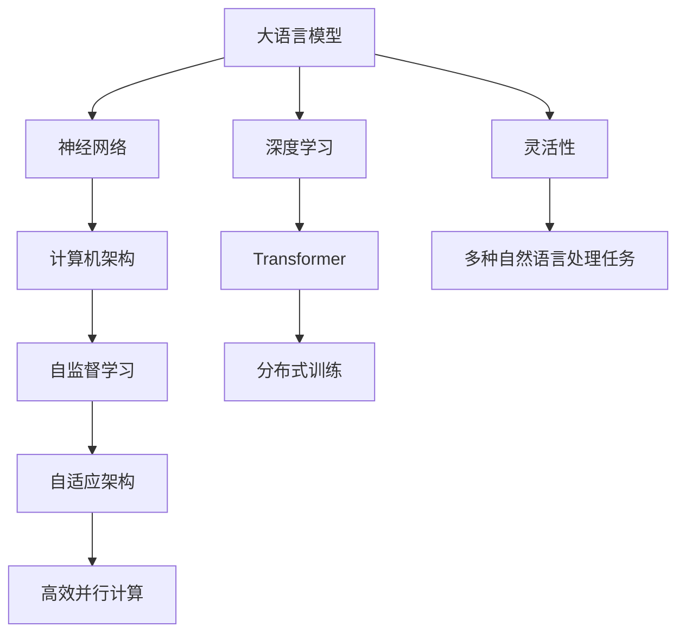

                 

# LLM:计算机架构的新纪元

> 关键词：语言模型,神经网络,深度学习,计算机架构,Transformer

## 1. 背景介绍

### 1.1 问题由来
在过去的几十年里，计算机架构的发展经历了从串行计算到并行计算，再到多核、分布式计算的演进。这些技术进步极大地提升了计算机的处理能力，推动了信息技术在各个领域的广泛应用。然而，随着数据量和模型复杂度的不断提升，现有的计算机架构逐渐显现出其局限性。

大语言模型（Large Language Models, LLMs）的出现，带来了计算机架构的又一次革命。基于深度学习的大语言模型，能够通过预训练的方式，在巨量的数据集上学习复杂的语言规律，实现自然语言处理、机器翻译、文本生成等多种任务。这种模型在性能上远超传统方法，且其可扩展性、通用性和易于部署的特性，使其在实际应用中展现出巨大的潜力。

### 1.2 问题核心关键点
大语言模型之所以能够改变计算机架构的格局，主要依赖于其独特的架构设计。以下是一些核心关键点：

1. **高效并行计算**：LLMs通过大规模并行计算实现高效的计算过程，尤其是在大规模分布式系统中。
2. **自适应架构**：LLMs的架构可以动态调整，以适应不同任务和数据集的需求。
3. **灵活性**：LLMs能够灵活地应用于多种自然语言处理任务，如图像识别、语音识别、对话系统等。
4. **自监督学习**：LLMs通过自监督学习的方式，在无监督条件下进行预训练，减少了对人工标注的依赖。
5. **分布式训练**：LLMs通常使用分布式训练，能够高效地处理大规模数据集。

这些关键点使得大语言模型能够成为计算机架构新纪元的标志性技术，推动了信息技术领域的进一步发展。

## 2. 核心概念与联系

### 2.1 核心概念概述

为了更好地理解大语言模型的架构设计及其对计算机架构的影响，本节将介绍几个密切相关的核心概念：

1. **大语言模型 (Large Language Model, LLM)**：指通过深度学习技术，在大规模数据集上进行预训练，并能够执行自然语言处理任务的模型。
2. **神经网络 (Neural Network, NN)**：一种由多个层次连接的计算单元构成的网络，用于模拟人类大脑的神经元连接方式。
3. **深度学习 (Deep Learning)**：一种基于神经网络，通过多层次数据处理实现的高级机器学习技术。
4. **计算机架构 (Computer Architecture)**：定义计算机系统硬件和软件的层次结构，以及它们如何协同工作。
5. **Transformer**：一种基于自注意力机制的神经网络架构，广泛用于大语言模型的设计和实现。
6. **自监督学习 (Self-supervised Learning)**：使用未标注的数据进行模型训练，从而学习语言的本质规律。
7. **分布式训练 (Distributed Training)**：在多个计算节点上并行训练模型，以提升训练效率。

这些概念之间的逻辑关系可以通过以下Mermaid流程图来展示：



这个流程图展示了各个概念之间的联系：

1. 大语言模型通过深度学习技术，构建在神经网络的基础上。
2. 深度学习使神经网络能够处理更复杂、更抽象的数据特征。
3. 计算机架构为深度学习提供了高效的硬件支持。
4. Transformer架构是构建大语言模型的关键。
5. 自监督学习使模型能够在无标注数据下进行预训练。
6. 分布式训练提升了模型训练的效率和效果。
7. 自适应架构使模型能够灵活应对不同任务的需求。
8. 高效并行计算和大规模分布式系统支持了LLM的高性能计算。
9. 灵活性使得LLM能够应用于多种自然语言处理任务。

这些概念共同构成了大语言模型的核心技术体系，使得LLM能够在大规模计算环境下实现高效、灵活和自适应的功能。

## 3. 核心算法原理 & 具体操作步骤
### 3.1 算法原理概述

大语言模型的架构设计，主要基于Transformer结构。Transformer是一种自注意力机制的神经网络架构，能够在大规模数据集上进行高效计算。其核心思想是通过多头自注意力机制，捕捉输入序列之间的依赖关系，从而实现高效的序列建模。

大语言模型通过预训练的方式，在巨量的未标注数据上学习语言的规律。预训练过程中，模型首先学习语言的基本规律，如词频、语法结构等。然后，通过微调的方式，在特定任务上对模型进行优化，以适应具体的任务需求。

### 3.2 算法步骤详解

大语言模型的构建和微调过程包括以下几个关键步骤：

**Step 1: 数据预处理**
- 收集和清洗大规模未标注数据集。
- 对数据进行分词、标记、标准化等预处理操作。
- 将数据集划分为训练集、验证集和测试集。

**Step 2: 模型构建**
- 选择适当的Transformer架构。
- 设计模型的输入输出接口。
- 定义损失函数和优化器。

**Step 3: 模型预训练**
- 在未标注数据集上进行预训练。
- 使用自监督学习任务，如语言建模、掩码语言建模等。
- 通过反向传播算法，更新模型参数，最小化损失函数。

**Step 4: 模型微调**
- 在特定任务的数据集上进行微调。
- 添加任务适配层，定义任务损失函数。
- 使用监督学习，最小化任务损失函数。

**Step 5: 模型评估**
- 在测试集上评估模型性能。
- 使用评估指标如BLEU、ROUGE、F1-Score等。
- 根据评估结果，调整模型参数和训练策略。

**Step 6: 模型部署**
- 将训练好的模型部署到生产环境中。
- 使用分布式系统进行模型推理。
- 定期更新模型，适应新数据。

### 3.3 算法优缺点

大语言模型的架构设计有以下优点：

1. **高效并行计算**：Transformer结构通过并行计算实现了高效的序列建模，能够在分布式系统中高效运行。
2. **自适应架构**：通过动态调整模型参数，LLM可以适应不同的任务需求。
3. **灵活性**：LLM能够应用于多种自然语言处理任务，如图像识别、语音识别、对话系统等。
4. **自监督学习**：利用未标注数据进行预训练，减少了对人工标注的依赖。
5. **分布式训练**：通过分布式系统，能够在短时间内处理大规模数据集。

同时，大语言模型也存在一些局限性：

1. **高计算需求**：需要大量的计算资源和存储空间。
2. **长尾问题**：对于一些长尾数据，模型可能难以捕捉到其特征。
3. **模型复杂性**：模型参数较多，训练和推理过程复杂。
4. **对抗攻击**：模型可能受到对抗样本的攻击，输出结果不可靠。
5. **泛化能力**：模型可能过度拟合训练数据，泛化能力有限。

尽管存在这些局限性，但大语言模型在性能和应用广度方面展示了巨大的潜力，成为计算机架构新纪元的标志性技术。

### 3.4 算法应用领域

大语言模型已经在多个领域得到了广泛的应用，以下是几个典型例子：

1. **自然语言处理**：用于文本分类、情感分析、机器翻译、问答系统等。
2. **语音识别**：用于语音转文本、语音生成、情感识别等。
3. **图像识别**：用于图像描述、图像生成、图像分类等。
4. **对话系统**：用于智能客服、虚拟助手、聊天机器人等。
5. **推荐系统**：用于个性化推荐、内容推荐、广告推荐等。

除了这些领域，LLM还在医疗、金融、教育、制造等多个行业得到应用，为各行各业带来了新的技术突破和发展机遇。

## 4. 数学模型和公式 & 详细讲解 & 举例说明（备注：数学公式请使用latex格式，latex嵌入文中独立段落使用 $$，段落内使用 $)
### 4.1 数学模型构建

大语言模型的数学模型构建涉及以下几个关键步骤：

1. **输入编码**：将输入序列 $x_1, x_2, ..., x_n$ 转换为模型可以处理的向量表示 $h_1, h_2, ..., h_n$。
2. **自注意力机制**：通过多头自注意力机制，计算输入序列中每个位置的注意力权重 $a_{ij}$，从而得到上下文表示 $c_i$。
3. **输出解码**：将上下文表示 $c_i$ 转换为输出序列 $y_1, y_2, ..., y_m$。

其中，自注意力机制的计算公式如下：

$$
\mathrm{Attention}(Q, K, V) = \frac{1}{\sqrt{d_k}} \sum_{i=1}^N a_{ij}V_i
$$

其中，$Q, K, V$ 分别表示查询、键、值向量，$d_k$ 为向量维度。注意力权重 $a_{ij}$ 计算如下：

$$
a_{ij} = \frac{e^{Q_iK_j^T/\sqrt{d_k}}}{\sum_{k=1}^N e^{Q_iK_k^T/\sqrt{d_k}}}
$$

通过以上步骤，大语言模型能够高效地处理输入序列，并输出相应的上下文表示和输出序列。

### 4.2 公式推导过程

在自注意力机制的基础上，LLM通过多头自注意力机制进一步提升模型的表现。假设输入序列长度为 $n$，输出序列长度为 $m$，模型的自注意力机制参数为 $W_Q, W_K, W_V$，计算公式如下：

$$
Q = XW_Q^T
$$

$$
K = XW_K^T
$$

$$
V = XW_V^T
$$

其中，$X$ 为输入序列，$W_Q, W_K, W_V$ 为线性变换矩阵。计算注意力权重 $a_{ij}$ 的公式如下：

$$
a_{ij} = \frac{e^{Q_iK_j^T/\sqrt{d_k}}}{\sum_{k=1}^N e^{Q_iK_k^T/\sqrt{d_k}}}
$$

通过多头自注意力机制，可以得到 $n$ 个查询向量 $Q_i$，每个查询向量对应输入序列中的一个位置。将 $n$ 个查询向量 $Q_i$ 与 $N$ 个键向量 $K_j$ 进行点积计算，得到 $n\times N$ 个注意力权重矩阵 $a$。将注意力权重矩阵 $a$ 与 $N$ 个值向量 $V_j$ 进行加权求和，得到上下文表示 $c_i$：

$$
c_i = \sum_{j=1}^N a_{ij}V_j
$$

最终，通过一层或多层 Transformer 结构，将上下文表示 $c_i$ 转换为输出序列 $y_i$。

### 4.3 案例分析与讲解

以BERT模型为例，BERT模型通过在两个方向的预训练（Masked Language Modeling 和 Next Sentence Prediction），学习到了丰富的语言知识。在微调阶段，BERT模型通过添加任务适配层，如全连接层和分类器，对特定任务进行优化。具体而言，对于分类任务，BERT模型通过将输出向量 $c_i$ 输入全连接层和softmax分类器，输出分类概率。对于生成任务，BERT模型通过将输出向量 $c_i$ 输入线性解码器，输出生成结果。

通过在特定任务上微调BERT模型，可以在不增加过多参数的情况下，提升模型在该任务上的性能。例如，在文本分类任务上，BERT模型通过微调可以得到较高的准确率和召回率，并且能够在多个数据集上保持一致的性能。

## 5. 项目实践：代码实例和详细解释说明
### 5.1 开发环境搭建

在进行大语言模型开发时，需要搭建一个高性能的计算环境。以下是使用Python和PyTorch搭建开发环境的步骤：

1. 安装Anaconda：从官网下载并安装Anaconda，用于创建独立的Python环境。

2. 创建并激活虚拟环境：
```bash
conda create -n llm-env python=3.8 
conda activate llm-env
```

3. 安装PyTorch：根据CUDA版本，从官网获取对应的安装命令。例如：
```bash
conda install pytorch torchvision torchaudio cudatoolkit=11.1 -c pytorch -c conda-forge
```

4. 安装TensorBoard：用于可视化模型训练过程，监控训练进度。

5. 安装TQDM：用于显示训练进度条。

完成上述步骤后，即可在`llm-env`环境中开始大语言模型开发。

### 5.2 源代码详细实现

这里我们以BERT模型为例，给出使用PyTorch进行微调的代码实现。

首先，定义BERT模型：

```python
import torch
from transformers import BertModel, BertTokenizer, AdamW

tokenizer = BertTokenizer.from_pretrained('bert-base-uncased')
model = BertModel.from_pretrained('bert-base-uncased')
```

然后，定义微调数据集：

```python
from torch.utils.data import Dataset, DataLoader
import numpy as np

class BERTDataset(Dataset):
    def __init__(self, texts, labels):
        self.tokenizer = tokenizer
        self.texts = texts
        self.labels = labels
        
    def __len__(self):
        return len(self.texts)
        
    def __getitem__(self, index):
        text = self.texts[index]
        label = self.labels[index]
        
        encoding = self.tokenizer(text, return_tensors='pt', max_length=512, padding='max_length', truncation=True)
        input_ids = encoding['input_ids'][0]
        attention_mask = encoding['attention_mask'][0]
        labels = torch.tensor(label, dtype=torch.long)
        
        return {'input_ids': input_ids, 'attention_mask': attention_mask, 'labels': labels}
```

接着，定义优化器和训练函数：

```python
from tqdm import tqdm

device = torch.device('cuda') if torch.cuda.is_available() else torch.device('cpu')
model.to(device)
optimizer = AdamW(model.parameters(), lr=2e-5)

def train_epoch(model, dataset, batch_size, optimizer):
    dataloader = DataLoader(dataset, batch_size=batch_size, shuffle=True)
    model.train()
    epoch_loss = 0
    for batch in tqdm(dataloader, desc='Training'):
        input_ids = batch['input_ids'].to(device)
        attention_mask = batch['attention_mask'].to(device)
        labels = batch['labels'].to(device)
        model.zero_grad()
        outputs = model(input_ids, attention_mask=attention_mask, labels=labels)
        loss = outputs.loss
        epoch_loss += loss.item()
        loss.backward()
        optimizer.step()
    return epoch_loss / len(dataloader)

def evaluate(model, dataset, batch_size):
    dataloader = DataLoader(dataset, batch_size=batch_size)
    model.eval()
    preds, labels = [], []
    with torch.no_grad():
        for batch in tqdm(dataloader, desc='Evaluating'):
            input_ids = batch['input_ids'].to(device)
            attention_mask = batch['attention_mask'].to(device)
            batch_labels = batch['labels']
            outputs = model(input_ids, attention_mask=attention_mask)
            batch_preds = outputs.logits.argmax(dim=2).to('cpu').tolist()
            batch_labels = batch_labels.to('cpu').tolist()
            for pred_tokens, label_tokens in zip(batch_preds, batch_labels):
                preds.append(pred_tokens[:len(label_tokens)])
                labels.append(label_tokens)
                
    print(classification_report(labels, preds))
```

最后，启动训练流程并在测试集上评估：

```python
epochs = 5
batch_size = 16

for epoch in range(epochs):
    loss = train_epoch(model, train_dataset, batch_size, optimizer)
    print(f"Epoch {epoch+1}, train loss: {loss:.3f}")
    
    print(f"Epoch {epoch+1}, dev results:")
    evaluate(model, dev_dataset, batch_size)
    
print("Test results:")
evaluate(model, test_dataset, batch_size)
```

以上就是使用PyTorch对BERT模型进行微调的完整代码实现。可以看到，得益于Transformer库的强大封装，我们可以用相对简洁的代码完成BERT模型的加载和微调。

### 5.3 代码解读与分析

让我们再详细解读一下关键代码的实现细节：

**BERTDataset类**：
- `__init__`方法：初始化数据集，包括分词器和数据。
- `__len__`方法：返回数据集的样本数量。
- `__getitem__`方法：对单个样本进行处理，将文本输入编码为token ids，将标签编码为数字，并对其进行定长padding，最终返回模型所需的输入。

**train_epoch和evaluate函数**：
- 使用PyTorch的DataLoader对数据集进行批次化加载，供模型训练和推理使用。
- 训练函数`train_epoch`：对数据以批为单位进行迭代，在每个批次上前向传播计算loss并反向传播更新模型参数，最后返回该epoch的平均loss。
- 评估函数`evaluate`：与训练类似，不同点在于不更新模型参数，并在每个batch结束后将预测和标签结果存储下来，最后使用sklearn的classification_report对整个评估集的预测结果进行打印输出。

**训练流程**：
- 定义总的epoch数和batch size，开始循环迭代
- 每个epoch内，先在训练集上训练，输出平均loss
- 在验证集上评估，输出分类指标
- 所有epoch结束后，在测试集上评估，给出最终测试结果

可以看到，PyTorch配合Transformer库使得BERT微调的代码实现变得简洁高效。开发者可以将更多精力放在数据处理、模型改进等高层逻辑上，而不必过多关注底层的实现细节。

当然，工业级的系统实现还需考虑更多因素，如模型的保存和部署、超参数的自动搜索、更灵活的任务适配层等。但核心的微调范式基本与此类似。

## 6. 实际应用场景
### 6.1 智能客服系统

基于大语言模型微调的对话技术，可以广泛应用于智能客服系统的构建。传统客服往往需要配备大量人力，高峰期响应缓慢，且一致性和专业性难以保证。而使用微调后的对话模型，可以7x24小时不间断服务，快速响应客户咨询，用自然流畅的语言解答各类常见问题。

在技术实现上，可以收集企业内部的历史客服对话记录，将问题和最佳答复构建成监督数据，在此基础上对预训练对话模型进行微调。微调后的对话模型能够自动理解用户意图，匹配最合适的答案模板进行回复。对于客户提出的新问题，还可以接入检索系统实时搜索相关内容，动态组织生成回答。如此构建的智能客服系统，能大幅提升客户咨询体验和问题解决效率。

### 6.2 金融舆情监测

金融机构需要实时监测市场舆论动向，以便及时应对负面信息传播，规避金融风险。传统的人工监测方式成本高、效率低，难以应对网络时代海量信息爆发的挑战。基于大语言模型微调的文本分类和情感分析技术，为金融舆情监测提供了新的解决方案。

具体而言，可以收集金融领域相关的新闻、报道、评论等文本数据，并对其进行主题标注和情感标注。在此基础上对预训练语言模型进行微调，使其能够自动判断文本属于何种主题，情感倾向是正面、中性还是负面。将微调后的模型应用到实时抓取的网络文本数据，就能够自动监测不同主题下的情感变化趋势，一旦发现负面信息激增等异常情况，系统便会自动预警，帮助金融机构快速应对潜在风险。

### 6.3 个性化推荐系统

当前的推荐系统往往只依赖用户的历史行为数据进行物品推荐，无法深入理解用户的真实兴趣偏好。基于大语言模型微调技术，个性化推荐系统可以更好地挖掘用户行为背后的语义信息，从而提供更精准、多样的推荐内容。

在实践中，可以收集用户浏览、点击、评论、分享等行为数据，提取和用户交互的物品标题、描述、标签等文本内容。将文本内容作为模型输入，用户的后续行为（如是否点击、购买等）作为监督信号，在此基础上微调预训练语言模型。微调后的模型能够从文本内容中准确把握用户的兴趣点。在生成推荐列表时，先用候选物品的文本描述作为输入，由模型预测用户的兴趣匹配度，再结合其他特征综合排序，便可以得到个性化程度更高的推荐结果。

### 6.4 未来应用展望

随着大语言模型微调技术的发展，其在实际应用中的前景将更加广阔。以下是对未来应用场景的展望：

1. **医疗领域**：基于大语言模型的医疗问答、病历分析、药物研发等应用将提升医疗服务的智能化水平，辅助医生诊疗，加速新药开发进程。
2. **教育领域**：微调技术可应用于作业批改、学情分析、知识推荐等方面，因材施教，促进教育公平，提高教学质量。
3. **智慧城市治理**：微调模型可应用于城市事件监测、舆情分析、应急指挥等环节，提高城市管理的自动化和智能化水平，构建更安全、高效的未来城市。
4. **企业生产**：在生产过程中，通过微调模型进行实时监控和预警，提高生产效率和安全性。
5. **社会治理**：在社会治理中，通过微调模型进行舆情分析和预测，提高政府决策的科学性和有效性。

## 7. 工具和资源推荐
### 7.1 学习资源推荐

为了帮助开发者系统掌握大语言模型微调的理论基础和实践技巧，这里推荐一些优质的学习资源：

1. 《深度学习》课程：斯坦福大学开设的深度学习课程，提供了深度学习的理论基础和实践方法，适合入门学习。
2. 《自然语言处理基础》书籍：介绍自然语言处理的基本概念和常用技术，是学习大语言模型的基础读物。
3. 《Transformer论文》：介绍Transformer架构的设计和原理，是理解大语言模型的重要资料。
4. 《BERT论文》：介绍BERT模型的预训练和微调过程，是学习大语言模型的重要参考资料。
5. 《LLM实战教程》：提供大语言模型在实际应用中的开发和部署教程，适合实践操作。

通过对这些资源的学习实践，相信你一定能够快速掌握大语言模型微调的精髓，并用于解决实际的NLP问题。
###  7.2 开发工具推荐

高效的开发离不开优秀的工具支持。以下是几款用于大语言模型微调开发的常用工具：

1. PyTorch：基于Python的开源深度学习框架，灵活动态的计算图，适合快速迭代研究。
2. TensorFlow：由Google主导开发的开源深度学习框架，生产部署方便，适合大规模工程应用。
3. Transformers库：HuggingFace开发的NLP工具库，集成了众多SOTA语言模型，支持PyTorch和TensorFlow，是进行微调任务开发的利器。
4. Weights & Biases：模型训练的实验跟踪工具，可以记录和可视化模型训练过程中的各项指标，方便对比和调优。
5. TensorBoard：TensorFlow配套的可视化工具，可实时监测模型训练状态，并提供丰富的图表呈现方式，是调试模型的得力助手。
6. Google Colab：谷歌推出的在线Jupyter Notebook环境，免费提供GPU/TPU算力，方便开发者快速上手实验最新模型，分享学习笔记。

合理利用这些工具，可以显著提升大语言模型微调任务的开发效率，加快创新迭代的步伐。

### 7.3 相关论文推荐

大语言模型和微调技术的发展源于学界的持续研究。以下是几篇奠基性的相关论文，推荐阅读：

1. Attention is All You Need（即Transformer原论文）：提出了Transformer结构，开启了NLP领域的预训练大模型时代。
2. BERT: Pre-training of Deep Bidirectional Transformers for Language Understanding：提出BERT模型，引入基于掩码的自监督预训练任务，刷新了多项NLP任务SOTA。
3. Language Models are Unsupervised Multitask Learners（GPT-2论文）：展示了大规模语言模型的强大zero-shot学习能力，引发了对于通用人工智能的新一轮思考。
4. Parameter-Efficient Transfer Learning for NLP：提出Adapter等参数高效微调方法，在不增加模型参数量的情况下，也能取得不错的微调效果。
5. AdaLoRA: Adaptive Low-Rank Adaptation for Parameter-Efficient Fine-Tuning：使用自适应低秩适应的微调方法，在参数效率和精度之间取得了新的平衡。
6. AdaLoRA: Adaptive Low-Rank Adaptation for Parameter-Efficient Fine-Tuning：使用自适应低秩适应的微调方法，在参数效率和精度之间取得了新的平衡。

这些论文代表了大语言模型微调技术的发展脉络。通过学习这些前沿成果，可以帮助研究者把握学科前进方向，激发更多的创新灵感。

## 8. 总结：未来发展趋势与挑战
### 8.1 总结

本文对基于大语言模型的计算机架构设计进行了全面系统的介绍。首先阐述了LLM的发展背景和重要性，明确了其在大规模计算环境下的高效性能和灵活性。其次，从原理到实践，详细讲解了大语言模型的构建和微调过程，给出了微调任务开发的完整代码实例。同时，本文还广泛探讨了LLM在多个领域的应用前景，展示了其巨大的应用潜力。

通过本文的系统梳理，可以看到，大语言模型通过其高效的并行计算和自适应架构，已经成为了计算机架构新纪元的标志性技术，极大地推动了信息技术领域的进一步发展。

### 8.2 未来发展趋势

展望未来，大语言模型的架构设计将呈现以下几个发展趋势：

1. **更高并行度**：随着计算资源的不断提升，大语言模型的并行度将进一步提高，能够处理更大规模的数据集。
2. **更灵活的架构设计**：通过动态调整模型参数和层级结构，实现更高效的计算和推理。
3. **更高的可扩展性**：大语言模型将能够更好地适应不同规模和复杂度的任务需求，支持更广泛的应用场景。
4. **更强大的推理能力**：通过引入推理引擎和优化技术，提升大语言模型的推理速度和准确性。
5. **更高效的存储和传输**：通过压缩和编码技术，降低模型的存储空间和传输带宽需求。

### 8.3 面临的挑战

尽管大语言模型在性能和应用广度方面展示了巨大的潜力，但在迈向更加智能化、普适化应用的过程中，它仍面临着诸多挑战：

1. **计算资源瓶颈**：大语言模型的计算需求依然较高，需要大量的计算资源和存储空间。
2. **长尾问题**：对于一些长尾数据，模型可能难以捕捉到其特征。
3. **模型复杂性**：模型参数较多，训练和推理过程复杂。
4. **对抗攻击**：模型可能受到对抗样本的攻击，输出结果不可靠。
5. **泛化能力**：模型可能过度拟合训练数据，泛化能力有限。

尽管存在这些局限性，但大语言模型在性能和应用广度方面展示了巨大的潜力，成为计算机架构新纪元的标志性技术。

### 8.4 研究展望

面对大语言模型面临的挑战，未来的研究需要在以下几个方面寻求新的突破：

1. **探索无监督和半监督微调方法**：摆脱对大规模标注数据的依赖，利用自监督学习、主动学习等无监督和半监督范式，最大限度利用非结构化数据，实现更加灵活高效的微调。
2. **研究参数高效和计算高效的微调范式**：开发更加参数高效的微调方法，在固定大部分预训练参数的同时，只更新极少量的任务相关参数。同时优化微调模型的计算图，减少前向传播和反向传播的资源消耗，实现更加轻量级、实时性的部署。
3. **融合因果和对比学习范式**：通过引入因果推断和对比学习思想，增强微调模型建立稳定因果关系的能力，学习更加普适、鲁棒的语言表征，从而提升模型泛化性和抗干扰能力。
4. **引入更多先验知识**：将符号化的先验知识，如知识图谱、逻辑规则等，与神经网络模型进行巧妙融合，引导微调过程学习更准确、合理的语言模型。同时加强不同模态数据的整合，实现视觉、语音等多模态信息与文本信息的协同建模。
5. **结合因果分析和博弈论工具**：将因果分析方法引入微调模型，识别出模型决策的关键特征，增强输出解释的因果性和逻辑性。借助博弈论工具刻画人机交互过程，主动探索并规避模型的脆弱点，提高系统稳定性。
6. **纳入伦理道德约束**：在模型训练目标中引入伦理导向的评估指标，过滤和惩罚有偏见、有害的输出倾向。同时加强人工干预和审核，建立模型行为的监管机制，确保输出符合人类价值观和伦理道德。

这些研究方向的探索，必将引领大语言模型架构设计的进一步发展，为构建安全、可靠、可解释、可控的智能系统铺平道路。面向未来，大语言模型架构设计还需要与其他人工智能技术进行更深入的融合，如知识表示、因果推理、强化学习等，多路径协同发力，共同推动自然语言理解和智能交互系统的进步。只有勇于创新、敢于突破，才能不断拓展语言模型的边界，让智能技术更好地造福人类社会。

## 9. 附录：常见问题与解答

**Q1：大语言模型微调是否适用于所有NLP任务？**

A: 大语言模型微调在大多数NLP任务上都能取得不错的效果，特别是对于数据量较小的任务。但对于一些特定领域的任务，如医学、法律等，仅仅依靠通用语料预训练的模型可能难以很好地适应。此时需要在特定领域语料上进一步预训练，再进行微调，才能获得理想效果。此外，对于一些需要时效性、个性化很强的任务，如对话、推荐等，微调方法也需要针对性的改进优化。

**Q2：微调过程中如何选择合适的学习率？**

A: 微调的学习率一般要比预训练时小1-2个数量级，如果使用过大的学习率，容易破坏预训练权重，导致过拟合。一般建议从1e-5开始调参，逐步减小学习率，直至收敛。也可以使用warmup策略，在开始阶段使用较小的学习率，再逐渐过渡到预设值。需要注意的是，不同的优化器(如AdamW、Adafactor等)以及不同的学习率调度策略，可能需要设置不同的学习率阈值。

**Q3：采用大语言模型微调时会面临哪些资源瓶颈？**

A: 目前主流的预训练大模型动辄以亿计的参数规模，对算力、内存、存储都提出了很高的要求。GPU/TPU等高性能设备是必不可少的，但即便如此，超大批次的训练和推理也可能遇到显存不足的问题。因此需要采用一些资源优化技术，如梯度积累、混合精度训练、模型并行等，来突破硬件瓶颈。同时，模型的存储和读取也可能占用大量时间和空间，需要采用模型压缩、稀疏化存储等方法进行优化。

**Q4：如何缓解微调过程中的过拟合问题？**

A: 过拟合是微调面临的主要挑战，尤其是在标注数据不足的情况下。常见的缓解策略包括：
1. 数据增强：通过回译、近义替换等方式扩充训练集
2. 正则化：使用L2正则、Dropout、Early Stopping等避免过拟合
3. 对抗训练：引入对抗样本，提高模型鲁棒性
4. 参数高效微调：只调整少量参数(如Adapter、Prefix等)，减小过拟合风险
5. 多模型集成：训练多个微调模型，取平均输出，抑制过拟合

这些策略往往需要根据具体任务和数据特点进行灵活组合。只有在数据、模型、训练、推理等各环节进行全面优化，才能最大限度地发挥大语言模型微调的威力。

**Q5：微调模型在落地部署时需要注意哪些问题？**

A: 将微调模型转化为实际应用，还需要考虑以下因素：
1. 模型裁剪：去除不必要的层和参数，减小模型尺寸，加快推理速度
2. 量化加速：将浮点模型转为定点模型，压缩存储空间，提高计算效率
3. 服务化封装：将模型封装为标准化服务接口，便于集成调用
4. 弹性伸缩：根据请求流量动态调整资源配置，平衡服务质量和成本
5. 监控告警：实时采集系统指标，设置异常告警阈值，确保服务稳定性
6. 安全防护：采用访问鉴权、数据脱敏等措施，保障数据和模型安全

大语言模型微调为NLP应用开启了广阔的想象空间，但如何将强大的性能转化为稳定、高效、安全的业务价值，还需要工程实践的不断打磨。唯有从数据、算法、工程、业务等多个维度协同发力，才能真正实现人工智能技术在垂直行业的规模化落地。总之，微调需要开发者根据具体任务，不断迭代和优化模型、数据和算法，方能得到理想的效果。

---

作者：禅与计算机程序设计艺术 / Zen and the Art of Computer Programming

