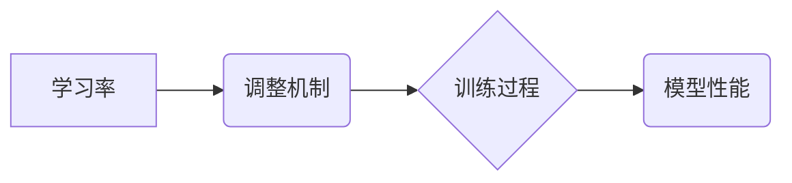

> 强化学习, 学习率, 调整机制, 算法原理, 应用场景, 代码实例, 未来趋势

## 1. 背景介绍

强化学习 (Reinforcement Learning, RL) 作为机器学习领域的重要分支，近年来在解决复杂决策问题方面取得了显著进展。从自动驾驶到游戏AI，从机器人控制到医疗诊断，RL的应用场景日益广泛。然而，RL算法的训练过程往往需要漫长的探索和学习，学习率作为训练过程中的关键参数，直接影响着学习效率和最终性能。

传统的RL算法通常采用固定学习率，但这种方法在实际应用中存在一些弊端：

* **过大的学习率会导致模型震荡，甚至发散；**
* **过小的学习率会导致训练过程过慢，难以收敛。**

因此，如何有效地调整学习率，使其在训练过程中保持最佳状态，成为RL算法研究和应用中的重要课题。

## 2. 核心概念与联系

学习率 (Learning Rate) 是RL算法更新权重时所使用的步长，它决定了模型在更新方向上的变化幅度。学习率过大，模型更新过于激进，容易导致震荡或发散；学习率过小，模型更新过于缓慢，难以收敛。

**学习率调整机制** 的目标是根据训练过程中的信息，动态地调整学习率，使其在训练过程中保持最佳状态。

**核心概念与联系：**



## 3. 核心算法原理 & 具体操作步骤

### 3.1  算法原理概述

学习率调整机制的原理是根据训练过程中的信息，动态地调整学习率，使其在训练过程中保持最佳状态。常见的学习率调整机制包括：

* **固定学习率:**  这种方法是最简单的，学习率在整个训练过程中保持不变。
* **衰减学习率:**  这种方法在训练过程中逐渐降低学习率，可以帮助模型收敛到更优的解。
* **自适应学习率:**  这种方法根据训练过程中的梯度信息，动态地调整学习率。

### 3.2  算法步骤详解

**1. 固定学习率:**

* 选择一个固定的学习率。
* 在训练过程中，使用该学习率更新模型参数。

**2. 衰减学习率:**

* 选择一个初始学习率和衰减率。
* 在训练过程中，每次迭代后，将学习率乘以衰减率。

**3. 自适应学习率:**

* 选择一个自适应学习率算法，例如Adam、RMSprop等。
* 在训练过程中，使用该算法根据梯度信息动态地调整学习率。

### 3.3  算法优缺点

| 算法类型 | 优点 | 缺点 |
|---|---|---|
| 固定学习率 | 简单易实现 | 难以找到最佳学习率，容易震荡或发散 |
| 衰减学习率 | 可以帮助模型收敛到更优的解 | 需要手动设置衰减率 |
| 自适应学习率 | 可以自动调整学习率，适应不同的训练过程 | 计算复杂度较高 |

### 3.4  算法应用领域

* **强化学习:**  学习率调整机制在强化学习算法的训练中至关重要，可以提高训练效率和最终性能。
* **深度学习:**  自适应学习率算法在深度学习模型的训练中也得到了广泛应用，可以加速模型收敛速度。
* **其他机器学习算法:**  一些其他机器学习算法，例如梯度下降法，也需要使用学习率调整机制。

## 4. 数学模型和公式 & 详细讲解 & 举例说明

### 4.1  数学模型构建

学习率调整机制的数学模型通常基于梯度信息和模型损失函数。

**损失函数:**

$$
L(\theta) = \sum_{i=1}^{N} \mathcal{L}(y_i, \hat{y}_i)
$$

其中：

* $\theta$ 是模型参数
* $N$ 是样本数量
* $\mathcal{L}$ 是单个样本的损失函数
* $y_i$ 是真实标签
* $\hat{y}_i$ 是模型预测值

**梯度:**

$$
\nabla_{\theta} L(\theta) = \left[ \frac{\partial L(\theta)}{\partial \theta_1}, \frac{\partial L(\theta)}{\partial \theta_2}, ..., \frac{\partial L(\theta)}{\partial \theta_m} \right]
$$

其中：

* $\nabla_{\theta} L(\theta)$ 是损失函数关于参数 $\theta$ 的梯度向量
* $m$ 是参数数量

### 4.2  公式推导过程

自适应学习率算法，例如Adam，会根据梯度信息和历史梯度信息，动态地调整学习率。

**Adam算法的更新公式:**

$$
\theta_{t+1} = \theta_t - \alpha_t \frac{m_t}{v_t + \epsilon}
$$

其中：

* $\theta_t$ 是第 $t$ 次迭代的参数值
* $\alpha_t$ 是第 $t$ 次迭代的学习率
* $m_t$ 是第 $t$ 次迭代的梯度均值
* $v_t$ 是第 $t$ 次迭代的梯度方差
* $\epsilon$ 是一个小的常数

### 4.3  案例分析与讲解

假设我们训练一个简单的线性回归模型，目标是预测房价。

* 使用固定学习率，可能会导致模型震荡或发散。
* 使用衰减学习率，可以帮助模型收敛到更优的解，但需要手动设置衰减率。
* 使用Adam算法，可以自动调整学习率，适应不同的训练过程，通常可以获得更好的性能。

## 5. 项目实践：代码实例和详细解释说明

### 5.1  开发环境搭建

* Python 3.x
* TensorFlow 或 PyTorch

### 5.2  源代码详细实现

```python
import tensorflow as tf

# 定义模型
model = tf.keras.models.Sequential([
    tf.keras.layers.Dense(units=1, input_shape=[1])
])

# 定义损失函数和优化器
optimizer = tf.keras.optimizers.Adam(learning_rate=0.01)
loss_fn = tf.keras.losses.MeanSquaredError()

# 训练模型
for epoch in range(100):
    for x, y in train_data:
        with tf.GradientTape() as tape:
            predictions = model(x)
            loss = loss_fn(y, predictions)
        gradients = tape.gradient(loss, model.trainable_variables)
        optimizer.apply_gradients(zip(gradients, model.trainable_variables))

    print(f"Epoch {epoch+1}, Loss: {loss.numpy()}")
```

### 5.3  代码解读与分析

* 代码首先定义了一个简单的线性回归模型。
* 然后定义了损失函数和优化器，这里使用Adam优化器，学习率设置为0.01。
* 训练模型的循环中，使用梯度下降法更新模型参数。
* 每次迭代后，打印当前的损失值。

### 5.4  运行结果展示

训练完成后，可以将模型应用于新的数据进行预测。

## 6. 实际应用场景

* **游戏AI:**  RL算法可以训练游戏AI，使其能够学习玩游戏并取得高分。学习率调整机制可以帮助游戏AI更快地学习和改进策略。
* **机器人控制:**  RL算法可以训练机器人控制系统，使其能够在复杂环境中执行任务。学习率调整机制可以帮助机器人更快地学习和适应环境变化。
* **推荐系统:**  RL算法可以训练推荐系统，使其能够根据用户的历史行为推荐更相关的商品或内容。学习率调整机制可以帮助推荐系统更快地学习用户偏好。

### 6.4  未来应用展望

* **医疗诊断:**  RL算法可以用于辅助医生进行医疗诊断，例如识别病灶或预测疾病风险。
* **金融交易:**  RL算法可以用于开发自动交易系统，使其能够根据市场变化进行交易决策。
* **自动驾驶:**  RL算法可以用于训练自动驾驶系统，使其能够在复杂道路环境中安全驾驶。

## 7. 工具和资源推荐

### 7.1  学习资源推荐

* **书籍:**
    * Reinforcement Learning: An Introduction by Richard S. Sutton and Andrew G. Barto
    * Deep Reinforcement Learning Hands-On by Maxim Lapan
* **在线课程:**
    * Coursera: Reinforcement Learning Specialization by David Silver
    * Udacity: Deep Reinforcement Learning Nanodegree

### 7.2  开发工具推荐

* **TensorFlow:**  https://www.tensorflow.org/
* **PyTorch:**  https://pytorch.org/
* **OpenAI Gym:**  https://gym.openai.com/

### 7.3  相关论文推荐

* **Deep Q-Network (DQN):**  https://arxiv.org/abs/1312.5602
* **Proximal Policy Optimization (PPO):**  https://arxiv.org/abs/1707.06347
* **Trust Region Policy Optimization (TRPO):**  https://arxiv.org/abs/1502.05477

## 8. 总结：未来发展趋势与挑战

### 8.1  研究成果总结

近年来，RL算法取得了显著进展，在许多领域取得了成功应用。学习率调整机制是RL算法训练中至关重要的环节，其发展推动了RL算法的性能提升和应用范围的扩展。

### 8.2  未来发展趋势

* **更有效的学习率调整机制:**  研究更有效的学习率调整机制，例如基于模型架构和任务类型的自适应学习率算法。
* **多智能体强化学习:**  研究多智能体强化学习中的学习率调整机制，使其能够协调多个智能体的学习过程。
* **迁移学习:**  研究如何将预训练的RL模型迁移到新的任务，并设计相应的学习率调整机制。

### 8.3  面临的挑战

* **样本效率:**  RL算法通常需要大量的样本数据进行训练，如何提高RL算法的样本效率仍然是一个挑战。
* **可解释性:**  RL算法的决策过程往往难以解释，如何提高RL算法的可解释性也是一个重要的研究方向。
* **安全性和鲁棒性:**  RL算法在实际应用中需要保证安全性和鲁棒性，如何设计安全的RL算法仍然是一个挑战。

### 8.4  研究展望

未来，RL算法和学习率调整机制的研究将继续深入，推动RL算法在更多领域得到应用，并解决更多现实世界的问题。


## 9. 附录：常见问题与解答

**1. 什么是学习率？**

学习率是RL算法更新权重时所使用的步长，它决定了模型在更新方向上的变化幅度。

**2. 为什么需要学习率调整机制？**

因为固定学习率在实际应用中存在一些弊端，例如过大容易震荡，过小容易收敛慢。学习率调整机制可以根据训练过程中的信息，动态地调整学习率，使其在训练过程中保持最佳状态。

**3. 什么是Adam算法？**

Adam算法是一种自适应学习率算法，它根据梯度信息和历史梯度信息，动态地调整学习率。

**4. 如何选择合适的学习率？**

学习率的选择是一个经验性的问题，需要根据具体的任务和模型进行调整。可以使用网格搜索或随机搜索等方法进行学习率调优。

**5. 学习率调整机制的未来发展趋势是什么？**

未来，学习率调整机制的研究将更加注重模型架构和任务类型的自适应性，以及多智能体强化学习中的协调性。


作者：禅与计算机程序设计艺术 / Zen and the Art of Computer Programming 
<end_of_turn>