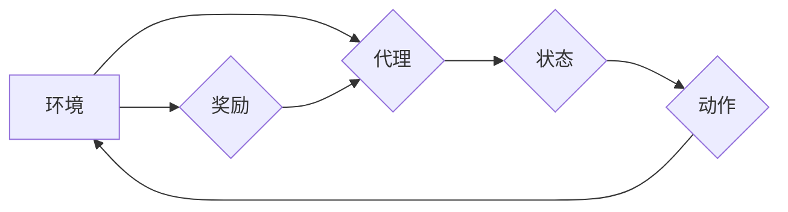

> 强化学习，自然语言处理，深度学习，强化学习算法，NLP应用

## 1. 背景介绍

自然语言处理（NLP）是人工智能领域的一个重要分支，旨在使计算机能够理解、处理和生成人类语言。近年来，深度学习在NLP领域取得了显著的进展，例如机器翻译、文本摘要、情感分析等任务都取得了突破性的成果。然而，传统的深度学习方法主要依赖于监督学习，需要大量的标注数据，这在实际应用中往往难以获得。

强化学习（RL）作为一种无需大量标注数据的学习方法，近年来在NLP领域也展现出巨大的潜力。RL算法通过与环境交互，学习最优的策略，以最大化累积的奖励。这种学习方式与人类的学习过程相似，能够更好地适应复杂、动态变化的NLP任务。

## 2. 核心概念与联系

**2.1 强化学习核心概念**

* **环境 (Environment):**  RL系统所处的外部世界，提供状态信息和奖励信号。
* **代理 (Agent):**  与环境交互的智能体，根据当前状态采取行动。
* **状态 (State):**  环境的当前状态，描述了系统所处的环境信息。
* **动作 (Action):**  代理可以采取的行动，影响环境状态。
* **奖励 (Reward):**  环境对代理动作的反馈，可以是正向奖励或负向惩罚。
* **策略 (Policy):**  代理根据当前状态选择动作的策略，可以是确定性策略或概率性策略。
* **价值函数 (Value Function):**  评估状态或状态-动作对的长期价值，指导代理选择最优动作。

**2.2 强化学习与NLP的联系**

在NLP领域，环境可以是文本语料库，代理可以是语言模型，状态可以是文本序列，动作可以是预测下一个词，奖励可以是预测准确性的指标。通过强化学习，可以训练语言模型生成更流畅、更符合语义的文本。

**2.3 强化学习在NLP中的应用场景**

* **机器翻译:**  训练模型生成更准确、更自然流畅的翻译文本。
* **文本摘要:**  训练模型生成更简洁、更准确的文本摘要。
* **对话系统:**  训练模型进行更自然、更流畅的对话。
* **文本生成:**  训练模型生成不同风格、不同类型的文本，例如诗歌、小说、新闻报道等。

**2.4 Mermaid 流程图**



## 3. 核心算法原理 & 具体操作步骤

### 3.1 算法原理概述

强化学习算法的核心是通过不断与环境交互，学习最优的策略，以最大化累积的奖励。常见的强化学习算法包括：

* **Q-学习:**  通过学习状态-动作对的价值函数，选择最优动作。
* **SARSA:**  与Q-学习类似，但更新价值函数时使用当前策略的行动。
* **Deep Q-Network (DQN):**  将深度神经网络应用于Q-学习，能够处理高维状态空间。
* **Policy Gradient:**  直接优化策略函数，避免学习价值函数。

### 3.2 算法步骤详解

以Q-学习为例，其基本步骤如下：

1. 初始化Q-表，将所有状态-动作对的价值函数初始化为0。
2. 在环境中进行交互，观察当前状态和采取动作。
3. 根据环境反馈获得奖励。
4. 更新Q-表，根据Bellman方程更新状态-动作对的价值函数。
5. 重复步骤2-4，直到达到收敛条件。

### 3.3 算法优缺点

**优点:**

* 不需要大量标注数据。
* 可以学习复杂、动态变化的任务。
* 能够适应环境变化。

**缺点:**

* 训练过程可能比较慢。
* 容易陷入局部最优解。
* 需要设计合理的奖励函数。

### 3.4 算法应用领域

* 机器学习
* 游戏人工智能
* 自动驾驶
* 医疗诊断
* 金融投资

## 4. 数学模型和公式 & 详细讲解 & 举例说明

### 4.1 数学模型构建

强化学习的数学模型主要包括状态空间、动作空间、奖励函数和价值函数。

* **状态空间 (S):**  所有可能的系统状态的集合。
* **动作空间 (A):**  代理可以采取的所有动作的集合。
* **奖励函数 (R):**  从状态s采取动作a后获得的奖励。
* **价值函数 (V):**  评估状态s的长期价值。

### 4.2 公式推导过程

**Bellman方程:**

$$
V(s) = \max_a \left[ R(s, a) + \gamma \sum_{s'} P(s' | s, a) V(s') \right]
$$

其中:

* $V(s)$ 是状态s的价值函数。
* $R(s, a)$ 是从状态s采取动作a后获得的奖励。
* $\gamma$ 是折扣因子，控制未来奖励的权重。
* $P(s' | s, a)$ 是从状态s采取动作a后到达状态s'的概率。

**Q-学习更新公式:**

$$
Q(s, a) = Q(s, a) + \alpha \left[ R(s, a) + \gamma \max_{a'} Q(s', a') - Q(s, a) \right]
$$

其中:

* $Q(s, a)$ 是状态s采取动作a的价值函数。
* $\alpha$ 是学习率，控制学习速度。

### 4.3 案例分析与讲解

假设有一个机器人需要学习在迷宫中找到出口。我们可以将迷宫视为环境，机器人视为代理，每个位置视为状态，每个动作视为前进、后退、左转、右转。

* 状态空间: 迷宫中的所有位置。
* 动作空间: 前进、后退、左转、右转。
* 奖励函数: 找到出口获得最大奖励，迷宫中其他位置获得较小奖励，撞墙获得惩罚。

通过Q-学习算法，机器人可以学习最优的策略，找到最短路径到达出口。

## 5. 项目实践：代码实例和详细解释说明

### 5.1 开发环境搭建

* Python 3.x
* TensorFlow 或 PyTorch

### 5.2 源代码详细实现

```python
import tensorflow as tf

# 定义Q网络
class QNetwork(tf.keras.Model):
    def __init__(self):
        super(QNetwork, self).__init__()
        self.dense1 = tf.keras.layers.Dense(64, activation='relu')
        self.dense2 = tf.keras.layers.Dense(64, activation='relu')
        self.output = tf.keras.layers.Dense(4)

    def call(self, state):
        x = self.dense1(state)
        x = self.dense2(x)
        return self.output(x)

# 定义强化学习环境
class Env:
    # ...

# 初始化Q网络和强化学习算法
q_network = QNetwork()
optimizer = tf.keras.optimizers.Adam(learning_rate=0.001)

# 训练循环
for episode in range(num_episodes):
    state = env.reset()
    done = False
    while not done:
        # 选择动作
        action = tf.argmax(q_network(state), axis=-1)
        # 执行动作
        next_state, reward, done = env.step(action)
        # 更新Q网络
        with tf.GradientTape() as tape:
            q_values = q_network(state)
            target_q_values = reward + gamma * tf.reduce_max(q_network(next_state), axis=-1)
            loss = tf.keras.losses.MSE(target_q_values, q_values[0, action])
        gradients = tape.gradient(loss, q_network.trainable_variables)
        optimizer.apply_gradients(zip(gradients, q_network.trainable_variables))
        state = next_state

```

### 5.3 代码解读与分析

* **Q网络:**  使用深度神经网络来估计状态-动作对的价值函数。
* **强化学习环境:**  模拟真实世界环境，提供状态、动作、奖励等信息。
* **训练循环:**  通过与环境交互，不断更新Q网络的权重，学习最优策略。

### 5.4 运行结果展示

训练完成后，可以将训练好的Q网络应用于实际场景，例如在迷宫中控制机器人找到出口。

## 6. 实际应用场景

### 6.1 机器翻译

强化学习可以用于训练机器翻译模型，生成更流畅、更自然流畅的翻译文本。例如，Google Translate使用强化学习来提高翻译质量。

### 6.2 文本摘要

强化学习可以用于训练文本摘要模型，生成更简洁、更准确的文本摘要。例如，BART模型使用强化学习来生成高质量的文本摘要。

### 6.3 对话系统

强化学习可以用于训练对话系统，使对话更自然、更流畅。例如，OpenAI的ChatGPT使用强化学习来训练对话模型。

### 6.4 文本生成

强化学习可以用于训练文本生成模型，生成不同风格、不同类型的文本，例如诗歌、小说、新闻报道等。例如，GPT-3模型使用强化学习来生成高质量的文本。

### 6.5 未来应用展望

强化学习在NLP领域还有很大的发展潜力，未来可能应用于更多领域，例如：

* **代码生成:**  训练模型自动生成代码。
* **问答系统:**  训练模型回答更复杂、更开放式的问答。
* **文本情感分析:**  训练模型更准确地识别文本的情感。
* **文本风格迁移:**  训练模型改变文本的风格。

## 7. 工具和资源推荐

### 7.1 学习资源推荐

* **书籍:**
    * Reinforcement Learning: An Introduction by Richard S. Sutton and Andrew G. Barto
    * Deep Reinforcement Learning Hands-On by Maxim Lapan
* **在线课程:**
    * Deep Reinforcement Learning Specialization by DeepLearning.AI
    * Reinforcement Learning by David Silver (University of DeepMind)

### 7.2 开发工具推荐

* **TensorFlow:**  开源深度学习框架，支持强化学习算法。
* **PyTorch:**  开源深度学习框架，支持强化学习算法。
* **OpenAI Gym:**  强化学习环境库，提供各种标准的强化学习任务。

### 7.3 相关论文推荐

* **Deep Reinforcement Learning with Double Q-learning**
* **Asynchronous Methods for Deep Reinforcement Learning**
* **Proximal Policy Optimization Algorithms**

## 8. 总结：未来发展趋势与挑战

### 8.1 研究成果总结

强化学习在NLP领域取得了显著的进展，例如机器翻译、文本摘要、对话系统等任务都取得了突破性的成果。

### 8.2 未来发展趋势

* **更强大的模型:**  开发更强大的强化学习模型，能够处理更复杂、更大型的NLP任务。
* **更有效的算法:**  开发更有效的强化学习算法，提高训练效率和收敛速度。
* **更丰富的应用场景:**  将强化学习应用于更多NLP领域，例如代码生成、问答系统、文本情感分析等。

### 8.3 面临的挑战

* **数据效率:**  强化学习算法通常需要大量的训练数据，这在NLP领域仍然是一个挑战。
* **可解释性:**  强化学习模型的决策过程往往难以解释，这限制了其在一些安全关键应用中的应用。
* **样本复杂性:**  强化学习算法的样本复杂性较高，需要大量的样本才能达到良好的性能。

### 8.4 研究展望

未来，强化学习在NLP领域将继续发展，并取得更多突破。研究者将继续探索更强大的模型、更有效的算法和更丰富的应用场景，推动强化学习