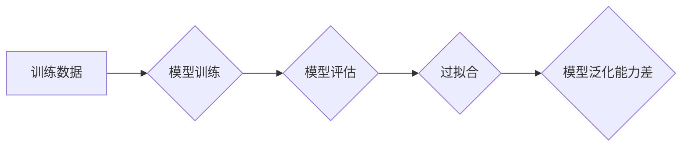

> 强化学习，过拟合，正则化，数据增强，模型剪枝，早停，贝叶斯优化

## 1. 背景介绍

强化学习（Reinforcement Learning，RL）作为机器学习领域的重要分支，旨在训练智能体在环境中通过与环境交互学习最优策略，以最大化累积奖励。RL算法在游戏、机器人控制、推荐系统等领域取得了显著成果。然而，与监督学习和无监督学习类似，RL算法也面临着过拟合的风险。过拟合是指模型在训练数据上表现良好，但在未见过的数据上表现较差，这会严重影响模型的泛化能力。

## 2. 核心概念与联系

过拟合是机器学习模型在训练过程中学习了训练数据中的噪声和随机性，导致模型对训练数据过分拟合，而无法很好地泛化到新的数据。在强化学习中，过拟合是指模型学习到的策略在训练环境中表现良好，但在实际应用环境中表现不佳。

**Mermaid 流程图**



## 3. 核心算法原理 & 具体操作步骤

### 3.1  算法原理概述

防止强化学习过拟合的策略主要包括以下几种：

* **正则化:** 在模型训练过程中加入惩罚项，限制模型复杂度，从而降低过拟合风险。常见的正则化方法包括L1正则化和L2正则化。
* **数据增强:** 通过对训练数据进行各种变换，例如随机旋转、缩放、裁剪等，增加训练数据的多样性，从而提高模型的泛化能力。
* **模型剪枝:** 通过移除模型中不重要的参数或连接，减少模型复杂度，从而降低过拟合风险。
* **早停:** 在训练过程中，定期评估模型在验证集上的性能，如果性能不再提升，则停止训练，避免模型过拟合训练数据。
* **贝叶斯优化:** 使用贝叶斯方法优化超参数，找到最优的模型参数组合，从而提高模型的泛化能力。

### 3.2  算法步骤详解

**正则化:**

1. 在损失函数中添加惩罚项，惩罚项与模型参数的绝对值或平方值相关。
2. 训练模型时，最小化损失函数，同时考虑惩罚项的影响。

**数据增强:**

1. 对训练数据进行各种变换，例如随机旋转、缩放、裁剪等。
2. 使用增强后的数据训练模型。

**模型剪枝:**

1. 使用一些剪枝算法，例如逐层剪枝、随机剪枝等，移除模型中不重要的参数或连接。
2. 训练剪枝后的模型。

**早停:**

1. 在训练过程中，定期评估模型在验证集上的性能。
2. 如果性能不再提升，则停止训练。

**贝叶斯优化:**

1. 使用贝叶斯方法构建一个模型，用来预测模型性能。
2. 根据模型预测，选择最优的超参数组合。
3. 使用选定的超参数组合训练模型。

### 3.3  算法优缺点

| 算法 | 优点 | 缺点 |
|---|---|---|
| 正则化 | 简单易实现，有效降低过拟合风险 | 可能过分限制模型复杂度，导致模型性能下降 |
| 数据增强 | 增加训练数据的多样性，提高模型泛化能力 | 需要额外的计算资源和时间 |
| 模型剪枝 | 减少模型复杂度，提高模型效率 | 需要选择合适的剪枝算法，避免模型性能下降 |
| 早停 | 简单易实现，避免模型过拟合训练数据 | 可能过早停止训练，导致模型性能下降 |
| 贝叶斯优化 | 可以找到最优的超参数组合，提高模型性能 | 需要一定的数学基础，计算复杂度较高 |

### 3.4  算法应用领域

* **游戏:** RL算法可以训练智能体玩游戏，例如AlphaGo、AlphaStar等。
* **机器人控制:** RL算法可以训练机器人完成各种任务，例如导航、抓取等。
* **推荐系统:** RL算法可以训练推荐系统，推荐用户感兴趣的内容。
* **医疗保健:** RL算法可以用于辅助诊断、制定治疗方案等。

## 4. 数学模型和公式 & 详细讲解 & 举例说明

### 4.1  数学模型构建

强化学习的核心是**马尔可夫决策过程 (MDP)**。MDP由以下五个要素组成：

* **状态空间 (S):** 环境可能处于的所有状态。
* **动作空间 (A):** 智能体在每个状态下可以采取的所有动作。
* **转移概率 (P):** 从一个状态执行一个动作后转移到另一个状态的概率。
* **奖励函数 (R):** 智能体在每个状态执行一个动作后获得的奖励。
* **折扣因子 (γ):** 用于权衡未来奖励和当前奖励的因子。

### 4.2  公式推导过程

强化学习的目标是找到一个策略 π，使得智能体在与环境交互的过程中获得最大的累积奖励。策略 π 是一个映射关系，将每个状态映射到一个动作。

**Bellman方程**是强化学习的核心公式，用于计算状态价值函数 V(s)。状态价值函数 V(s) 表示在状态 s 下，按照策略 π 执行动作，获得的累积奖励的期望值。

$$
V^{\pi}(s) = \max_{a \in A} \left[ R(s, a) + \gamma \sum_{s' \in S} P(s' | s, a) V^{\pi}(s') \right]
$$

其中：

* $R(s, a)$ 是在状态 s 执行动作 a 后获得的奖励。
* $P(s' | s, a)$ 是从状态 s 执行动作 a 后转移到状态 s' 的概率。
* $\gamma$ 是折扣因子。

### 4.3  案例分析与讲解

假设有一个简单的强化学习问题，智能体在一个环境中移动，目标是到达终点。环境中有障碍物，智能体需要避开障碍物才能到达终点。

我们可以使用 Bellman方程来计算每个状态的价值函数。例如，如果状态 s 是终点，那么 V(s) = 1 (因为到达终点获得奖励 1)。如果状态 s 是障碍物，那么 V(s) = 0 (因为到达障碍物不会获得奖励)。对于其他状态，我们可以根据 Bellman方程迭代计算 V(s)。

## 5. 项目实践：代码实例和详细解释说明

### 5.1  开发环境搭建

* Python 3.x
* TensorFlow 或 PyTorch

### 5.2  源代码详细实现

```python
import tensorflow as tf

# 定义模型
model = tf.keras.Sequential([
    tf.keras.layers.Dense(128, activation='relu'),
    tf.keras.layers.Dense(64, activation='relu'),
    tf.keras.layers.Dense(1)
])

# 定义损失函数和优化器
loss_fn = tf.keras.losses.MeanSquaredError()
optimizer = tf.keras.optimizers.Adam()

# 训练模型
for epoch in range(100):
    # 训练数据
    x_train = ...
    y_train = ...

    # 计算损失和梯度
    with tf.GradientTape() as tape:
        predictions = model(x_train)
        loss = loss_fn(y_train, predictions)

    # 更新模型参数
    gradients = tape.gradient(loss, model.trainable_variables)
    optimizer.apply_gradients(zip(gradients, model.trainable_variables))

    # 打印损失
    print(f'Epoch {epoch+1}, Loss: {loss.numpy()}')
```

### 5.3  代码解读与分析

* 代码首先定义了一个简单的深度神经网络模型。
* 然后定义了损失函数和优化器。
* 训练模型时，使用训练数据计算损失和梯度，并使用优化器更新模型参数。
* 训练结束后，可以评估模型在测试集上的性能。

### 5.4  运行结果展示

训练完成后，可以将模型应用于实际问题中，例如预测股票价格、识别图像等。

## 6. 实际应用场景

* **游戏:** RL算法可以训练智能体玩游戏，例如AlphaGo、AlphaStar等。
* **机器人控制:** RL算法可以训练机器人完成各种任务，例如导航、抓取等。
* **推荐系统:** RL算法可以训练推荐系统，推荐用户感兴趣的内容。
* **医疗保健:** RL算法可以用于辅助诊断、制定治疗方案等。

### 6.4  未来应用展望

* **自动驾驶:** RL算法可以用于训练自动驾驶汽车，使其能够在复杂环境中安全行驶。
* **个性化教育:** RL算法可以用于个性化教育，根据学生的学习进度和能力定制学习方案。
* **金融市场:** RL算法可以用于金融市场交易，例如股票投资、风险管理等。

## 7. 工具和资源推荐

### 7.1  学习资源推荐

* **书籍:**
    * Reinforcement Learning: An Introduction by Richard S. Sutton and Andrew G. Barto
    * Deep Reinforcement Learning Hands-On by Maxim Lapan
* **在线课程:**
    * Coursera: Reinforcement Learning Specialization by David Silver
    * Udacity: Deep Reinforcement Learning Nanodegree

### 7.2  开发工具推荐

* **TensorFlow:** https://www.tensorflow.org/
* **PyTorch:** https://pytorch.org/
* **OpenAI Gym:** https://gym.openai.com/

### 7.3  相关论文推荐

* **Deep Q-Network (DQN):** https://arxiv.org/abs/1312.5602
* **Proximal Policy Optimization (PPO):** https://arxiv.org/abs/1707.06347
* **Trust Region Policy Optimization (TRPO):** https://arxiv.org/abs/1502.05477

## 8. 总结：未来发展趋势与挑战

### 8.1  研究成果总结

近年来，强化学习取得了显著进展，在许多领域取得了成功应用。例如，AlphaGo在围棋领域战胜了世界冠军，AlphaStar在星际争霸2中战胜了职业玩家。

### 8.2  未来发展趋势

* **更强大的算法:** 研究人员正在开发更强大的强化学习算法，例如基于模型的强化学习算法，能够更好地处理复杂环境。
* **更广泛的应用:** 强化学习将在更多领域得到应用，例如自动驾驶、个性化教育、金融市场等。
* **更安全的强化学习:** 研究人员正在研究如何使强化学习算法更安全可靠，避免出现意外情况。

### 8.3  面临的挑战

* **数据效率:** 强化学习算法通常需要大量的训练数据，这在某些领域可能难以获得。
* **样本复杂性:** 强化学习算法的样本复杂性较高，这意味着需要更多的训练样本才能达到良好的性能。
* **可解释性:** 强化学习算法的决策过程通常难以解释，这可能会阻碍其在一些领域应用。

### 8.4  研究展望

未来，强化学习的研究将继续朝着更强大、更安全、更可解释的方向发展。


## 9. 附录：常见问题与解答

**Q1: 强化学习和监督学习有什么区别？**

**A1:** 强化学习和监督学习都是机器学习的范畴，但它们的目标和训练方式不同。监督学习的目标是学习一个函数，将输入映射到输出，而强化学习的目标是学习一个策略，使得智能体在与环境交互的过程中获得最大的累积奖励。

**Q2: 如何防止强化学习过拟合？**

**A2:** 可以使用正则化、数据增强、模型剪枝、早停和贝叶斯优化等方法来防止强化学习过拟合。

**Q3: 强化学习的应用领域有哪些？**

**A3:** 强化学习的应用领域非常广泛，例如游戏、机器人控制、推荐系统、医疗保健等。


作者：禅与计算机程序设计艺术 / Zen and the