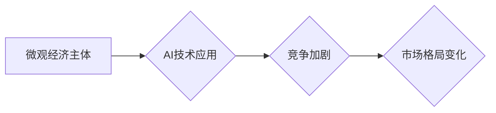

>  人工智能、微观经济学、竞争加剧、算法优化、数据驱动、市场格局、技术创新

## 1. 背景介绍

在当今数字经济时代，人工智能（AI）技术飞速发展，正在深刻地改变着各行各业。从自动驾驶到个性化推荐，从医疗诊断到金融交易，AI技术的应用场景日益广泛。然而，随着AI技术的普及，也引发了一系列新的挑战和问题，其中之一就是微观经济主体间的竞争加剧。

传统经济学认为，市场竞争是推动经济发展的重要动力。然而，在AI时代，竞争的规则和方式发生了根本性的变化。一方面，AI技术的应用使得企业能够以更低的成本、更高的效率进行生产和服务，从而降低了市场准入门槛，加速了新企业的涌现。另一方面，AI技术的应用也使得企业能够更精准地了解用户的需求，提供更个性化的产品和服务，从而增强了企业的竞争力。

这种双重作用使得微观经济主体间的竞争更加激烈，企业需要不断创新和升级，才能在激烈的市场竞争中立于不败之地。

## 2. 核心概念与联系

**2.1 微观经济主体**

微观经济学研究的是个体经济主体的行为，包括消费者、企业和政府。在AI时代，微观经济主体也发生了变化，除了传统的经济主体外，还出现了新的主体，例如AI算法、数据平台等。

**2.2 竞争加剧**

竞争加剧是指市场竞争的强度增加，企业之间的竞争更加激烈。在AI时代，竞争加剧主要表现为以下几个方面：

* **技术竞争:** 企业为了获得竞争优势，不断投入研发，开发新的AI技术和应用。
* **数据竞争:** 数据是AI技术的核心资源，企业为了获取更多数据，进行数据采集、分析和利用。
* **人才竞争:** AI人才稀缺，企业为了吸引和留住人才，不断提高薪酬和福利。

**2.3 AI技术与竞争**

AI技术是推动竞争加剧的重要因素。AI技术的应用可以帮助企业提高效率、降低成本、个性化服务，从而增强企业的竞争力。

**2.4 竞争格局**

AI技术的应用正在改变传统的市场格局，一些新兴的企业凭借AI技术迅速崛起，而一些传统企业则面临着挑战。

**2.5  Mermaid 流程图**



## 3. 核心算法原理 & 具体操作步骤

**3.1 算法原理概述**

在AI时代，微观经济主体间的竞争加剧，需要采用更先进的算法来分析和预测市场趋势，优化资源配置，提高竞争力。一些常用的算法包括：

* **机器学习算法:** 用于从数据中学习模式，预测未来趋势。
* **深度学习算法:** 用于处理复杂的数据，例如图像、文本、语音等。
* **强化学习算法:** 用于训练智能体，使其在特定环境中做出最优决策。

**3.2 算法步骤详解**

以机器学习算法为例，其基本步骤包括：

1. **数据收集:** 收集相关数据，例如用户行为数据、市场价格数据、产品销售数据等。
2. **数据预处理:** 对数据进行清洗、转换、特征提取等操作，使其适合算法训练。
3. **模型选择:** 选择合适的机器学习算法，例如线性回归、逻辑回归、决策树、支持向量机等。
4. **模型训练:** 使用训练数据训练模型，调整模型参数，使其能够准确预测目标变量。
5. **模型评估:** 使用测试数据评估模型的性能，例如准确率、召回率、F1-score等。
6. **模型部署:** 将训练好的模型部署到生产环境中，用于预测和决策。

**3.3 算法优缺点**

不同的算法具有不同的优缺点，需要根据具体应用场景选择合适的算法。

* **优点:** 能够从数据中学习模式，预测未来趋势，提高决策效率。
* **缺点:** 需要大量的数据进行训练，算法的性能受数据质量影响较大，解释性较差。

**3.4 算法应用领域**

机器学习算法广泛应用于各个领域，例如：

* **电商:** 商品推荐、价格预测、用户画像
* **金融:** 风险评估、欺诈检测、投资决策
* **医疗:** 疾病诊断、药物研发、患者管理

## 4. 数学模型和公式 & 详细讲解 & 举例说明

**4.1 数学模型构建**

我们可以用微观经济学模型来描述微观经济主体间的竞争。例如，我们可以用一个简单的供求模型来描述市场价格和数量的动态变化。

**4.2 公式推导过程**

假设市场上存在n个生产者，每个生产者都拥有相同的生产函数，市场需求函数为Q=D(P)，其中Q表示市场需求量，P表示市场价格。

根据供求平衡原理，市场价格和数量的决定满足以下方程：

$$
\sum_{i=1}^{n} Q_i = D(P)
$$

其中，$Q_i$表示第i个生产者的产量。

**4.3 案例分析与讲解**

假设市场上存在两个生产者，他们的生产函数分别为：

* 生产者1：$Q_1 = L_1^{0.5}$
* 生产者2：$Q_2 = L_2^{0.5}$

其中，$L_1$和$L_2$分别表示生产者1和生产者2的投入量。

市场需求函数为：$Q = 100 - 2P$

我们可以将以上公式代入供求平衡方程，并求解市场价格和数量。

## 5. 项目实践：代码实例和详细解释说明

**5.1 开发环境搭建**

可以使用Python语言和相关的库来实现上述模型。

**5.2 源代码详细实现**

```python
import numpy as np

# 定义生产函数
def production_function_1(L):
  return L**0.5

def production_function_2(L):
  return L**0.5

# 定义市场需求函数
def demand_function(P):
  return 100 - 2*P

# 设置生产者投入量
L1 = 100
L2 = 100

# 计算生产者产量
Q1 = production_function_1(L1)
Q2 = production_function_2(L2)

# 计算市场总供给量
Q_supply = Q1 + Q2

# 计算市场均衡价格和数量
P = demand_function(Q_supply)
Q = Q_supply

# 打印结果
print("市场均衡价格:", P)
print("市场均衡数量:", Q)
```

**5.3 代码解读与分析**

这段代码首先定义了生产函数、市场需求函数和生产者投入量。然后，计算了生产者产量、市场总供给量、市场均衡价格和数量。最后，打印了结果。

**5.4 运行结果展示**

运行这段代码后，可以得到市场均衡价格和数量。

## 6. 实际应用场景

**6.1 市场预测**

AI算法可以分析历史数据，预测未来的市场趋势，帮助企业制定更有效的市场策略。

**6.2 产品推荐**

AI算法可以根据用户的行为数据，推荐个性化的产品，提高用户体验和转化率。

**6.3 价格优化**

AI算法可以分析市场价格和需求数据，帮助企业优化产品定价，提高利润率。

**6.4 未来应用展望**

随着AI技术的不断发展，其在微观经济主体间竞争中的应用场景将会更加广泛，例如：

* **个性化营销:** AI算法可以根据用户的个人特征和行为数据，进行精准的营销推广。
* **智能合约:** AI算法可以自动执行智能合约，提高交易效率和安全性。
* **自动决策:** AI算法可以自动进行决策，例如自动定价、自动交易等。

## 7. 工具和资源推荐

**7.1 学习资源推荐**

* **在线课程:** Coursera、edX、Udacity等平台提供丰富的AI课程。
* **书籍:** 《深度学习》、《机器学习实战》等书籍。
* **开源项目:** TensorFlow、PyTorch等开源项目。

**7.2 开发工具推荐**

* **Python:** 广泛应用于AI开发的编程语言。
* **Jupyter Notebook:** 用于编写和运行Python代码的交互式环境。
* **TensorFlow:** 开源深度学习框架。
* **PyTorch:** 开源深度学习框架。

**7.3 相关论文推荐**

* **《深度学习》**
* **《机器学习》**
* **《强化学习》**

## 8. 总结：未来发展趋势与挑战

**8.1 研究成果总结**

AI技术在微观经济主体间竞争中的应用取得了显著成果，例如：

* **提高了市场预测的准确性。**
* **增强了产品推荐的个性化程度。**
* **优化了产品定价策略。**

**8.2 未来发展趋势**

未来，AI技术在微观经济主体间竞争中的应用将会更加广泛和深入，例如：

* **更加精准的市场预测。**
* **更加个性化的产品和服务。**
* **更加智能的决策系统。**

**8.3 面临的挑战**

AI技术在微观经济主体间竞争中的应用也面临着一些挑战，例如：

* **数据安全和隐私保护。**
* **算法的公平性和可解释性。**
* **AI技术的伦理问题。**

**8.4 研究展望**

未来，需要进一步研究如何解决AI技术在微观经济主体间竞争中的挑战，使其更好地服务于经济社会发展。

## 9. 附录：常见问题与解答

**9.1 如何选择合适的AI算法？**

选择合适的AI算法需要根据具体应用场景和数据特点进行选择。

**9.2 如何保证AI算法的公平性和可解释性？**

需要采用公平的算法设计原则，并进行算法的可解释性分析。

**9.3 如何解决AI技术带来的伦理问题？**

需要制定相应的伦理规范和法律法规，引导AI技术健康发展。

作者：禅与计算机程序设计艺术 / Zen and the Art of Computer Programming


<end_of_turn>