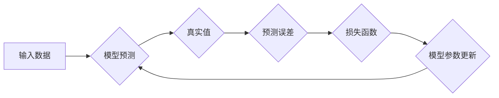

> 损失函数，机器学习，深度学习，优化算法，梯度下降，反向传播，代码实例

## 1. 背景介绍

在机器学习和深度学习领域，训练模型的核心目标是找到最优的参数，使得模型的预测结果与真实值之间的差距最小化。而损失函数 (Loss Function) 正是用来衡量模型预测结果与真实值之间差异的函数。它为模型训练提供了一个目标，指导模型参数的更新方向。

损失函数的选择对模型的训练效果至关重要。不同的任务类型，不同的模型结构，都需要选择合适的损失函数。本文将深入探讨损失函数的原理、常见类型以及代码实例，帮助读者理解损失函数在机器学习中的作用。

## 2. 核心概念与联系

损失函数是机器学习模型训练的核心概念之一，它连接了模型的预测结果和真实值，为模型训练提供目标。

**核心概念：**

* **模型预测:** 模型根据输入数据，利用学习到的参数进行预测，得到输出结果。
* **真实值:** 实际的、已知的正确答案或目标值。
* **预测误差:** 模型预测结果与真实值之间的差异。
* **损失函数:**  一个函数，将预测误差映射到一个标量值，用来衡量模型预测的准确性。

**联系：**

模型训练的目标是找到最优的参数，使得损失函数的值最小化。

**Mermaid 流程图：**



## 3. 核心算法原理 & 具体操作步骤

### 3.1  算法原理概述

损失函数的本质是一个数学函数，它将模型预测结果与真实值之间的差异映射到一个标量值。这个标量值越小，表示模型的预测结果越接近真实值，模型的性能越好。

损失函数的计算过程通常包括以下步骤：

1. **计算预测值:** 模型根据输入数据和学习到的参数，生成预测结果。
2. **计算预测误差:** 将模型预测结果与真实值进行比较，计算两者之间的差异。
3. **计算损失值:** 将预测误差输入到损失函数中，得到一个标量值，表示模型预测的准确性。

### 3.2  算法步骤详解

1. **数据准备:** 首先需要准备训练数据，包括输入数据和对应的真实值。
2. **模型初始化:** 初始化模型的参数，通常采用随机初始化。
3. **前向传播:** 将输入数据输入到模型中，进行前向传播计算，得到模型的预测结果。
4. **损失函数计算:** 将模型预测结果与真实值进行比较，计算损失值。
5. **反向传播:** 利用梯度下降算法，根据损失函数的梯度，更新模型的参数。
6. **迭代训练:** 重复步骤3-5，直到损失函数的值达到预设的阈值或训练次数达到上限。

### 3.3  算法优缺点

**优点:**

* 能够有效地衡量模型的预测准确性。
* 提供了模型训练的目标，指导模型参数的更新方向。
* 能够根据不同的任务类型选择合适的损失函数。

**缺点:**

* 不同的损失函数可能存在局限性，例如对异常值敏感或难以收敛。
* 选择合适的损失函数需要一定的经验和技巧。

### 3.4  算法应用领域

损失函数广泛应用于各种机器学习和深度学习任务，例如：

* **分类问题:** 使用交叉熵损失函数、hinge loss等。
* **回归问题:** 使用均方误差损失函数、绝对值损失函数等。
* **图像识别:** 使用交叉熵损失函数、结构相似度损失函数等。
* **自然语言处理:** 使用交叉熵损失函数、困惑度等。

## 4. 数学模型和公式 & 详细讲解 & 举例说明

### 4.1  数学模型构建

损失函数通常是一个数学函数，它将模型预测结果与真实值之间的差异映射到一个标量值。

**数学模型:**

$$L(y, \hat{y})$$

其中：

* $L$ 表示损失函数。
* $y$ 表示真实值。
* $\hat{y}$ 表示模型预测值。

### 4.2  公式推导过程

损失函数的具体公式取决于具体的任务类型和模型结构。

**举例说明:**

**均方误差损失函数 (Mean Squared Error, MSE):**

$$L(y, \hat{y}) = \frac{1}{n} \sum_{i=1}^{n} (y_i - \hat{y}_i)^2$$

其中：

* $n$ 表示样本数量。
* $y_i$ 表示第 $i$ 个样本的真实值。
* $\hat{y}_i$ 表示第 $i$ 个样本的模型预测值。

**交叉熵损失函数 (Cross-Entropy Loss):**

$$L(y, \hat{y}) = - \sum_{i=1}^{n} y_i \log(\hat{y}_i)$$

其中：

* $y_i$ 表示第 $i$ 个样本的真实标签 (0 或 1)。
* $\hat{y}_i$ 表示模型预测第 $i$ 个样本属于正类的概率。

### 4.3  案例分析与讲解

**案例分析:**

假设我们训练一个图像分类模型，目标是识别猫和狗的图片。

**损失函数选择:**

由于这是一个分类问题，我们可以选择交叉熵损失函数。

**损失函数计算:**

模型预测一张图片属于猫的概率为 0.8，真实标签为 1 (猫)。则损失函数值为：

$$L(1, 0.8) = -1 \log(0.8) \approx 0.22$$

**模型训练:**

通过反向传播算法，根据损失函数的梯度，更新模型的参数，使得损失函数的值逐渐减小。

## 5. 项目实践：代码实例和详细解释说明

### 5.1  开发环境搭建

* Python 3.x
* TensorFlow 或 PyTorch

### 5.2  源代码详细实现

```python
import tensorflow as tf

# 定义模型
model = tf.keras.models.Sequential([
    tf.keras.layers.Flatten(input_shape=(28, 28)),
    tf.keras.layers.Dense(128, activation='relu'),
    tf.keras.layers.Dense(10, activation='softmax')
])

# 定义损失函数
loss_fn = tf.keras.losses.SparseCategoricalCrossentropy()

# 定义优化器
optimizer = tf.keras.optimizers.Adam()

# 训练模型
model.compile(loss=loss_fn, optimizer=optimizer, metrics=['accuracy'])
model.fit(x_train, y_train, epochs=10)
```

### 5.3  代码解读与分析

* **模型定义:** 使用 TensorFlow 的 Keras API 定义了一个简单的多层感知机模型。
* **损失函数定义:** 使用 `SparseCategoricalCrossentropy` 损失函数，适用于多分类问题。
* **优化器定义:** 使用 Adam 优化器，是一种常用的优化算法。
* **模型训练:** 使用 `model.fit()` 方法训练模型，传入训练数据、 epochs 数目等参数。

### 5.4  运行结果展示

训练完成后，可以评估模型的性能，例如准确率等。

## 6. 实际应用场景

损失函数在机器学习和深度学习的各个领域都有广泛的应用，例如：

* **图像识别:** 使用交叉熵损失函数训练图像分类模型，识别不同物体。
* **自然语言处理:** 使用交叉熵损失函数训练文本分类模型，识别文本的类别。
* **推荐系统:** 使用均方误差损失函数训练推荐模型，预测用户对物品的评分。
* **机器翻译:** 使用交叉熵损失函数训练机器翻译模型，将文本从一种语言翻译成另一种语言。

### 6.4  未来应用展望

随着机器学习和深度学习技术的不断发展，损失函数的研究也将更加深入。未来，可能会出现更加灵活、高效、鲁棒的损失函数，能够更好地解决实际问题。

## 7. 工具和资源推荐

### 7.1  学习资源推荐

* **书籍:**
    * 深度学习 (Deep Learning) - Ian Goodfellow, Yoshua Bengio, Aaron Courville
    * 机器学习 (Machine Learning) - Tom Mitchell
* **在线课程:**
    * Coursera: 深度学习 Specialization
    * Udacity: 机器学习 Engineer Nanodegree

### 7.2  开发工具推荐

* **TensorFlow:** 开源深度学习框架
* **PyTorch:** 开源深度学习框架
* **Keras:** 高级深度学习API

### 7.3  相关论文推荐

* **On the Importance of Initialization and Momentum in Deep Learning**
* **Adam: A Method for Stochastic Optimization**
* **Gradient-Based Learning Applied to Document Recognition**

## 8. 总结：未来发展趋势与挑战

### 8.1  研究成果总结

损失函数是机器学习和深度学习的核心概念之一，它为模型训练提供了目标，指导模型参数的更新方向。

### 8.2  未来发展趋势

* **更加灵活、高效、鲁棒的损失函数:** 能够更好地解决实际问题，例如处理异常值、提高收敛速度等。
* **个性化损失函数:** 根据不同的任务类型和数据特点，定制化的损失函数。
* **自适应损失函数:** 根据模型训练过程中的情况，动态调整损失函数的权重或结构。

### 8.3  面临的挑战

* **损失函数的设计和选择:** 需要根据具体的任务类型和数据特点进行选择，缺乏统一的标准。
* **损失函数的解释性:** 许多损失函数的内部机制难以理解，难以解释模型的决策过程。
* **损失函数的计算效率:** 一些复杂的损失函数计算量较大，难以在实际应用中使用。

### 8.4  研究展望

未来，损失函数的研究将继续深入，探索更加灵活、高效、鲁棒的损失函数，以及提高损失函数的解释性和计算效率的方法。


## 9. 附录：常见问题与解答

**常见问题:**

* **如何选择合适的损失函数？**

**解答:**

选择合适的损失函数需要根据具体的任务类型和数据特点进行选择。例如，对于分类问题，可以使用交叉熵损失函数；对于回归问题，可以使用均方误差损失函数。

* **如何理解损失函数的梯度？**

**解答:**

损失函数的梯度表示损失函数在当前参数值处的变化率。反向传播算法利用梯度信息，更新模型参数，使得损失函数的值逐渐减小。

* **如何评估损失函数的性能？**

**解答:**

可以通过评估模型的性能指标，例如准确率、召回率、F1-score等，来评估损失函数的性能。

作者：禅与计算机程序设计艺术 / Zen and the Art of Computer Programming


<end_of_turn>