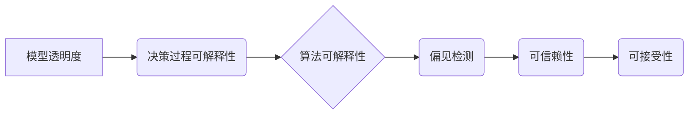

> 模型透明度，可解释人工智能，决策过程，机器学习，深度学习，算法可解释性，偏见检测

## 1. 背景介绍

在人工智能（AI）领域蓬勃发展的今天，机器学习（ML）和深度学习（DL）模型在各个领域取得了令人瞩目的成就。从医疗诊断到金融预测，从自动驾驶到自然语言处理，AI模型正在改变着我们的生活。然而，随着模型复杂度的不断增加，其决策过程的“黑盒”性质也日益成为一个令人担忧的问题。

模型的“黑盒”性质是指我们无法完全理解模型是如何得出最终决策的。尽管模型能够准确地预测结果，但我们无法解释其背后的逻辑和推理过程。这不仅阻碍了对模型的信任和可接受性，也使得在某些情况下，例如医疗诊断或法律判决，难以进行有效的审计和责任追究。

因此，提高模型决策过程的透明度成为一个至关重要的研究方向。可解释人工智能（XAI）应运而生，旨在开发能够解释AI模型决策的方法和技术，使模型的决策过程更加透明、可理解和可信赖。

## 2. 核心概念与联系

**2.1 可解释人工智能 (XAI)**

可解释人工智能 (XAI) 旨在使人工智能系统及其决策过程更加透明、可理解和可信赖。XAI 的目标是开发能够解释 AI 模型决策的方法和技术，以便人类能够理解模型是如何得出最终结果的。

**2.2 模型透明度**

模型透明度是指我们能够理解模型的内部工作机制，包括其输入、输出、决策过程以及潜在的偏见。透明度越高，我们对模型的理解就越深刻，也就越能够信任其决策结果。

**2.3 决策过程可解释性**

决策过程可解释性是指我们能够理解模型是如何从输入数据到最终决策的整个过程。这包括理解模型使用的特征、特征的重要性以及模型的推理逻辑。

**2.4 算法可解释性**

算法可解释性是指我们能够理解算法的内部工作机制，包括其算法原理、计算过程以及决策规则。

**2.5 偏见检测**

偏见检测是指识别和评估模型中潜在的偏见，例如基于种族、性别、年龄等特征的偏见。

**2.6 相关概念图**



## 3. 核心算法原理 & 具体操作步骤

### 3.1  算法原理概述

可解释人工智能 (XAI) 涵盖多种算法和技术，旨在提高模型决策过程的透明度。以下是一些常用的 XAI 算法：

* **LIME (Local Interpretable Model-agnostic Explanations):** LIME 是一种模型无关的局部解释方法，它通过在模型预测附近构建一个简单的可解释模型来解释模型的决策。

* **SHAP (SHapley Additive exPlanations):** SHAP 基于博弈论中的 Shapley 值，它为每个特征分配一个权重，表示该特征对模型预测的影响。

* **Partial Dependence Plots (PDP):** PDP 通过绘制特征对模型预测的影响的平均值来解释特征的重要性。

* **Individual Conditional Expectation (ICE):** ICE 通过绘制每个样本特征对模型预测的影响来解释特征的重要性。

### 3.2  算法步骤详解

以 LIME 算法为例，其具体操作步骤如下：

1. **选择一个样本点:** 从模型预测的样本集中选择一个样本点。

2. **构建局部邻域:** 在该样本点附近构建一个局部邻域，包含与该样本点相似的样本。

3. **训练一个简单模型:** 在局部邻域中训练一个简单可解释模型，例如线性回归模型。

4. **解释模型决策:** 使用简单模型解释该样本点被分类或预测为特定结果的原因。

### 3.3  算法优缺点

**LIME 算法:**

* **优点:** 模型无关，易于理解和解释。
* **缺点:** 局部解释，可能无法反映全局特征重要性。

**SHAP 算法:**

* **优点:** 全局解释，能够反映特征的重要性。
* **缺点:** 计算复杂度较高。

### 3.4  算法应用领域

XAI 算法在各个领域都有广泛的应用，例如：

* **医疗诊断:** 解释 AI 模型在诊断疾病时的决策过程，提高医生对模型结果的信任。
* **金融风险评估:** 解释 AI 模型在评估风险时的决策过程，帮助金融机构更好地管理风险。
* **自动驾驶:** 解释 AI 模型在驾驶决策时的决策过程，提高自动驾驶系统的安全性。

## 4. 数学模型和公式 & 详细讲解 & 举例说明

### 4.1  数学模型构建

**LIME 算法的数学模型:**

假设我们有一个黑盒模型 f(x)，其中 x 是输入特征向量，f(x) 是模型的预测结果。LIME 算法的目标是构建一个局部可解释模型 g(x) 来近似 f(x) 在样本点 x_0 附近的决策过程。

**局部邻域:**

LIME 算法首先构建一个局部邻域 N(x_0)，包含与样本点 x_0 相似的样本。

**简单模型训练:**

然后，在局部邻域 N(x_0) 中训练一个简单可解释模型 g(x)，例如线性回归模型。

**损失函数:**

LIME 算法使用以下损失函数来评估 g(x) 与 f(x) 的拟合程度:

$$
L(g, f) = \sum_{x \in N(x_0)} (f(x) - g(x))^2
$$

**正则化项:**

为了防止模型过拟合，LIME 算法还添加了一个正则化项:

$$
L_reg(g) = \lambda ||w||^2
$$

其中 w 是简单模型 g(x) 的权重向量，λ 是正则化参数。

**目标函数:**

LIME 算法的目标函数是最小化损失函数和正则化项的加权和:

$$
L_{total}(g) = L(g, f) + L_reg(g)
$$

### 4.2  公式推导过程

LIME 算法的目标是找到一个最优的简单模型 g(x) 来最小化目标函数 L_{total}(g)。可以使用梯度下降法等优化算法来求解该目标函数。

### 4.3  案例分析与讲解

假设我们有一个黑盒模型用于预测房价，我们想要解释模型在预测某一特定房价时的决策过程。

1. **选择样本点:** 选择该特定房价的样本点。

2. **构建局部邻域:** 在该样本点附近构建一个局部邻域，包含与该样本点相似的房源信息。

3. **训练简单模型:** 在局部邻域中训练一个线性回归模型，该模型将房源特征作为输入，预测房价。

4. **解释模型决策:** 使用线性回归模型解释该特定房价被预测为该值的原因，例如，哪些特征对房价预测的影响最大。

## 5. 项目实践：代码实例和详细解释说明

### 5.1  开发环境搭建

* Python 3.6+
* scikit-learn
* lime
* shap

### 5.2  源代码详细实现

```python
from sklearn.ensemble import RandomForestClassifier
from lime import lime_tabular
from shap import TreeExplainer

# 加载数据
# ...

# 训练模型
model = RandomForestClassifier()
model.fit(X_train, y_train)

# 使用 LIME 解释模型决策
explainer = lime_tabular.LimeTabularExplainer(X_train, feature_names=X_train.columns, class_names=y_train.unique())
explanation = explainer.explain_instance(X_test[0], model.predict_proba, top_labels=1)
explanation.as_list()

# 使用 SHAP 解释模型决策
explainer = TreeExplainer(model)
shap_values = explainer.shap_values(X_test)
shap.summary_plot(shap_values, X_test, feature_names=X_train.columns)
```

### 5.3  代码解读与分析

* **模型训练:** 使用 scikit-learn 库训练一个随机森林分类模型。
* **LIME 解释:** 使用 LIME 库解释模型在预测某个样本的决策过程。
* **SHAP 解释:** 使用 SHAP 库解释模型在预测所有样本的决策过程。

### 5.4  运行结果展示

* **LIME 解释:** 显示该样本点哪些特征对模型预测的影响最大。
* **SHAP 解释:** 显示所有样本点每个特征对模型预测的影响的平均值。

## 6. 实际应用场景

### 6.1  医疗诊断

* 解释 AI 模型在诊断疾病时的决策过程，提高医生对模型结果的信任。
* 帮助医生识别模型可能存在的偏见，避免误诊。

### 6.2  金融风险评估

* 解释 AI 模型在评估风险时的决策过程，帮助金融机构更好地管理风险。
* 识别模型中潜在的偏见，避免歧视性决策。

### 6.3  自动驾驶

* 解释 AI 模型在驾驶决策时的决策过程，提高自动驾驶系统的安全性。
* 帮助开发人员识别模型可能存在的缺陷，提高自动驾驶系统的可靠性。

### 6.4  未来应用展望

随着 AI 技术的不断发展，XAI 技术将发挥越来越重要的作用。未来，XAI 技术将被应用于更多领域，例如：

* **法律判决:** 解释 AI 模型在判决案件时的决策过程，提高司法公正性。
* **教育领域:** 解释 AI 模型在个性化学习推荐时的决策过程，提高学习效率。
* **社会科学研究:** 解释 AI 模型在分析社会现象时的决策过程，帮助我们更好地理解社会问题。

## 7. 工具和资源推荐

### 7.1  学习资源推荐

* **书籍:**
    * "Interpretable Machine Learning" by Christoph Molnar
    * "The Master Algorithm" by Pedro Domingos
* **在线课程:**
    * Coursera: "Machine Learning" by Andrew Ng
    * edX: "Artificial Intelligence" by Columbia University

### 7.2  开发工具推荐

* **LIME:** https://github.com/marcotcr/lime
* **SHAP:** https://github.com/slundberg/shap
* **TensorBoard:** https://www.tensorflow.org/tensorboard

### 7.3  相关论文推荐

* **"Local Interpretable Model-agnostic Explanations"** by Marco Tulio Ribeiro, Sameer Singh, and Carlos Guestrin
* **"SHAP: A Unified Approach to Interpreting Model Predictions"** by Scott Lundberg and Su-In Lee

## 8. 总结：未来发展趋势与挑战

### 8.1  研究成果总结

近年来，可解释人工智能 (XAI) 取得了显著进展，开发了许多有效的解释模型和技术。这些技术能够帮助我们更好地理解 AI 模型的决策过程，提高模型的可信赖性和可接受性。

### 8.2  未来发展趋势

* **更强大的解释模型:** 开发更强大、更准确的解释模型，能够解释更复杂、更深层的 AI 模型。
* **更广泛的应用场景:** 将 XAI 技术应用于更多领域，例如法律、教育、社会科学等。
* **更易于使用的解释工具:** 开发更易于使用的解释工具，使 XAI 技术更易于推广和应用。

### 8.3  面临的挑战

* **解释模型的准确性:** 确保解释模型能够准确地反映 AI 模型的决策过程。
* **解释模型的可理解性:** 使解释模型的结果更容易被人类理解和解释。
* **解释模型的效率:** 提高解释模型的效率，使其能够在实际应用中使用。

### 8.4  研究展望

未来，XAI 研究将继续朝着更强大、更广泛、更易