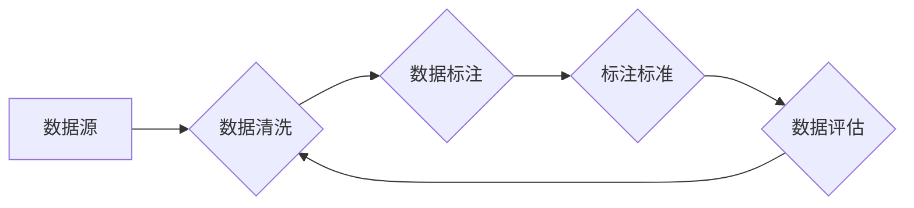

> 数据采集, 数据标注, 机器学习, 深度学习, 自然语言处理, 计算机视觉, 数据质量, 代码实战

## 1. 背景介绍

在人工智能领域蓬勃发展的今天，数据已成为推动技术进步的基石。机器学习和深度学习算法的训练离不开海量高质量的数据支撑。数据采集与标注作为人工智能领域的基础环节，对于模型的性能和应用效果至关重要。

数据采集是指从各种来源收集所需的数据，而数据标注是指对采集到的数据进行人工标记和分类，使其能够被机器学习算法理解和学习。高质量的数据标注是训练出准确、可靠的机器学习模型的关键。

然而，数据采集与标注过程也面临着诸多挑战，例如数据获取成本高、标注效率低、数据质量难以保证等。因此，深入了解数据采集与标注的原理和方法，并掌握相应的技术手段，对于推动人工智能技术的发展具有重要意义。

## 2. 核心概念与联系

数据采集与标注是一个相互关联、环环相扣的过程，其核心概念包括：

* **数据源:** 数据采集的起点，可以是网络、数据库、传感器、图像、音频等各种形式。
* **数据清洗:** 对采集到的原始数据进行处理，去除噪声、重复数据、错误数据等，提高数据质量。
* **数据标注:** 对数据进行人工标记，例如图像识别中的物体标注、文本分类中的标签分配等。
* **标注标准:** 标注过程的规范和规则，确保标注结果的一致性和准确性。
* **数据评估:** 对标注结果进行评估，例如标注准确率、标注一致性等，并根据评估结果进行改进。

**数据采集与标注流程图:**



## 3. 核心算法原理 & 具体操作步骤

### 3.1  算法原理概述

数据标注算法主要分为以下几种类型：

* **规则型标注:** 基于预先定义的规则进行标注，例如根据文本中的关键词进行分类。
* **监督学习型标注:** 利用已标注好的数据训练机器学习模型，然后使用模型对新数据进行标注。
* **半监督学习型标注:** 利用少量标注数据和大量未标注数据进行标注，提高标注效率。
* **主动学习型标注:** 通过选择最难标注的数据进行标注，提高标注质量。

### 3.2  算法步骤详解

以监督学习型标注为例，其具体步骤如下：

1. **数据收集:** 收集相关领域的标注数据，并进行清洗和预处理。
2. **特征提取:** 从数据中提取特征，例如文本中的词语、图像中的颜色、形状等。
3. **模型训练:** 利用训练数据训练机器学习模型，例如支持向量机、决策树、神经网络等。
4. **模型评估:** 使用测试数据评估模型的性能，例如准确率、召回率、F1-score等。
5. **模型调优:** 根据评估结果调整模型参数，提高模型性能。
6. **数据标注:** 使用训练好的模型对新数据进行标注。

### 3.3  算法优缺点

**监督学习型标注:**

* **优点:** 准确率高，可以学习到复杂的模式。
* **缺点:** 需要大量的标注数据，标注成本高。

### 3.4  算法应用领域

数据标注算法广泛应用于以下领域：

* **自然语言处理:** 文本分类、情感分析、机器翻译等。
* **计算机视觉:** 图像识别、目标检测、图像分割等。
* **语音识别:** 语音转文本、语音合成等。
* **推荐系统:** 商品推荐、用户画像等。

## 4. 数学模型和公式 & 详细讲解 & 举例说明

### 4.1  数学模型构建

在监督学习型数据标注中，常用的数学模型是分类模型。假设我们有一个包含N个样本的数据集D，每个样本包含特征向量x和标签y。分类模型的目标是学习一个函数f(x)，能够将输入的特征向量映射到相应的标签。

### 4.2  公式推导过程

常用的分类模型包括逻辑回归、支持向量机、决策树等。

**逻辑回归:**

逻辑回归模型使用sigmoid函数将线性模型的输出映射到0到1之间，表示样本属于某个类别的概率。

$$
p(y=1|x) = \frac{1}{1 + e^{-(w^Tx + b)}}
$$

其中，w是权重向量，b是偏置项，x是特征向量，p(y=1|x)是样本属于类别1的概率。

**支持向量机:**

支持向量机模型试图找到一个超平面，将不同类别的样本分开，并使超平面到最近样本的距离最大化。

### 4.3  案例分析与讲解

**举例说明:**

假设我们有一个包含猫和狗的图像数据集，目标是训练一个图像分类模型，能够将猫和狗进行区分。

我们可以使用监督学习型数据标注算法，例如逻辑回归或支持向量机，将图像特征作为输入，类别标签作为输出，训练模型。

## 5. 项目实践：代码实例和详细解释说明

### 5.1  开发环境搭建

本项目使用Python语言进行开发，所需的库包括NumPy、Pandas、Scikit-learn等。

### 5.2  源代码详细实现

```python
# 导入必要的库
import numpy as np
from sklearn.linear_model import LogisticRegression
from sklearn.model_selection import train_test_split
from sklearn.metrics import accuracy_score

# 加载数据
data = np.loadtxt("data.csv", delimiter=",")
X = data[:, :-1]  # 特征向量
y = data[:, -1]  # 类别标签

# 将数据划分为训练集和测试集
X_train, X_test, y_train, y_test = train_test_split(X, y, test_size=0.2, random_state=42)

# 创建逻辑回归模型
model = LogisticRegression()

# 训练模型
model.fit(X_train, y_train)

# 对测试集进行预测
y_pred = model.predict(X_test)

# 计算模型准确率
accuracy = accuracy_score(y_test, y_pred)
print("模型准确率:", accuracy)
```

### 5.3  代码解读与分析

* 首先，导入必要的库。
* 然后，加载数据，并将数据划分为特征向量和类别标签。
* 接着，将数据划分为训练集和测试集。
* 接下来，创建逻辑回归模型，并使用训练集训练模型。
* 然后，使用训练好的模型对测试集进行预测。
* 最后，计算模型的准确率。

### 5.4  运行结果展示

运行上述代码后，会输出模型的准确率。

## 6. 实际应用场景

数据采集与标注在人工智能领域有着广泛的应用场景，例如：

* **图像识别:** 用于自动识别图像中的物体、场景、人物等，应用于自动驾驶、医疗诊断、安防监控等领域。
* **自然语言处理:** 用于理解和生成人类语言，应用于机器翻译、聊天机器人、文本摘要等领域。
* **语音识别:** 用于将语音转换为文本，应用于语音助手、语音搜索、语音识别等领域。

### 6.4  未来应用展望

随着人工智能技术的不断发展，数据采集与标注将发挥更加重要的作用。未来，数据采集与标注技术将朝着以下方向发展：

* **自动化:** 利用机器学习算法自动完成数据采集和标注任务，提高效率和准确性。
* **智能化:** 开发更智能的数据标注工具，能够自动识别数据中的异常和错误，并提供更精准的标注建议。
* **多样化:** 支持更多类型的标注任务，例如视频标注、音频标注等。

## 7. 工具和资源推荐

### 7.1  学习资源推荐

* **书籍:**
    * 《数据标注与机器学习》
    * 《深度学习》
* **在线课程:**
    * Coursera: Machine Learning
    * Udacity: Deep Learning Nanodegree

### 7.2  开发工具推荐

* **LabelImg:** 用于图像标注的开源工具。
* **BRAT:** 用于文本标注的开源工具。
* **Amazon Mechanical Turk:** 用于众包标注的平台。

### 7.3  相关论文推荐

* **《数据标注的挑战与机遇》**
* **《深度学习中的数据标注方法》**

## 8. 总结：未来发展趋势与挑战

### 8.1  研究成果总结

数据采集与标注技术已经取得了显著的进展，但仍然面临着诸多挑战。

### 8.2  未来发展趋势

未来，数据采集与标注技术将朝着自动化、智能化、多样化方向发展。

### 8.3  面临的挑战

* 数据质量问题
* 标注成本高
* 标注效率低

### 8.4  研究展望

未来研究将重点关注以下几个方面:

* 开发更智能的数据标注工具
* 探索自动化数据标注的方法
* 研究数据标注的成本效益

## 9. 附录：常见问题与解答

**常见问题:**

* 数据标注的成本如何控制？
* 如何保证数据标注的质量？
* 如何选择合适的标注工具？

**解答:**

* 数据标注的成本可以通过自动化标注、众包标注等方式进行控制。
* 数据标注的质量可以通过制定严格的标注标准、进行标注人员培训、采用多轮标注等方式保证。
* 选择合适的标注工具需要根据具体的标注任务和数据类型进行选择。


作者：禅与计算机程序设计艺术 / Zen and the Art of Computer Programming 
<end_of_turn>