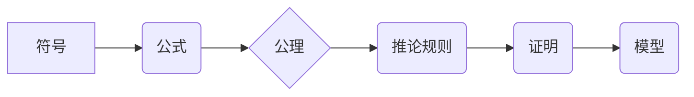

> 数理逻辑，形式系统，公理，推论，证明，模型，完备性，一致性， Gödel 不完备性定理

## 1. 背景介绍

形式数学系统是数理逻辑的核心内容之一，它为数学的严密性和形式化提供了基础。形式系统通过抽象化数学概念，将其转化为符号和规则，从而建立一个严密的逻辑框架，在这个框架内，我们可以进行推理和证明。

形式数学系统的出现，标志着数学从直觉和经验向逻辑和形式化的转变。它为数学提供了更精确的语言和更严格的推理方法，使得数学的证明更加可靠和严谨。

## 2. 核心概念与联系

形式数学系统由以下核心概念组成：

* **符号**: 用于表示数学概念的符号，例如数字、运算符、变量等。
* **公式**: 由符号按照一定的规则组合而成的表达式，例如“2+2=4”。
* **公理**: 被认为是自明的真命题，不需要证明的假设。
* **推论规则**: 用于从已知公式推导出新公式的规则，例如modus ponens 和 modus tollens。
* **模型**: 一个解释形式系统中符号含义的结构，例如自然数集可以作为整数的模型。

**Mermaid 流程图**



## 3. 核心算法原理 & 具体操作步骤

### 3.1  算法原理概述

形式系统的核心算法是**证明算法**，它用于根据公理和推论规则，从已知公式推导出新的公式，最终证明某个命题的真值。

### 3.2  算法步骤详解

1. **定义公理**: 首先，需要确定形式系统的公理，即被认为是自明的真命题。
2. **定义推论规则**: 然后，需要定义形式系统的推论规则，即用于从已知公式推导出新公式的规则。
3. **构造证明**: 为了证明某个命题，需要根据公理和推论规则，构造一个从已知公式到目标命题的推理链。
4. **验证证明**: 最后，需要验证证明的合法性，确保每个步骤都符合公理和推论规则。

### 3.3  算法优缺点

**优点**:

* **严密性**: 形式系统的证明算法保证了证明的严密性和可靠性。
* **形式化**: 形式系统的证明过程可以完全形式化，便于计算机辅助证明。
* **通用性**: 形式系统的证明算法可以应用于各种数学领域。

**缺点**:

* **复杂性**: 形式系统的证明过程可能非常复杂，需要大量的逻辑推理和符号操作。
* **效率**: 形式系统的证明算法可能效率较低，特别是对于复杂的问题。

### 3.4  算法应用领域

形式系统的证明算法广泛应用于以下领域：

* **数学证明**: 形式化数学证明，提高证明的可靠性和严密性。
* **计算机科学**: 验证软件和硬件的正确性，证明算法的正确性和效率。
* **人工智能**: 开发逻辑推理和知识表示系统。

## 4. 数学模型和公式 & 详细讲解 & 举例说明

### 4.1  数学模型构建

形式数学系统可以看作是一个数学模型，它由符号、公式、公理和推论规则组成。这个模型可以用来描述和研究数学的逻辑结构和推理过程。

### 4.2  公式推导过程

形式系统的推论规则可以用来从已知公式推导出新的公式。例如，**modus ponens** 规则指出，如果已知公式 A 蕴含 B，并且已知 A 为真，那么 B 也为真。

$$
A \Rightarrow B, A \vdash B
$$

### 4.3  案例分析与讲解

**例子**: 证明命题“所有自然数的平方都是非负数”。

1. **公理**: 自然数的定义，加法和乘法的定义。
2. **推论规则**: 
    * **定义消去**: 如果 a = b，那么可以将 a 代替 b。
    * **加法结合律**: (a + b) + c = a + (b + c)。
3. **证明**:
    * 假设 n 是一个自然数。
    * 根据自然数的定义，n 可以表示为 1 + 1 + ... + 1 (n 个 1)。
    * 因此，n^2 = (1 + 1 + ... + 1)^2。
    * 根据加法结合律，n^2 可以展开为一系列加法项。
    * 由于每个加法项都是非负数，因此 n^2 也是非负数。

## 5. 项目实践：代码实例和详细解释说明

### 5.1  开发环境搭建

可以使用任何支持逻辑推理的编程语言，例如 Python 或 Prolog。

### 5.2  源代码详细实现

```python
# Python 代码示例

# 定义公理
axioms = [
    "A implies B",
    "A",
]

# 定义推论规则
rules = [
    "modus ponens",
]

# 构造证明
def prove(goal):
    # ...

# 运行证明
result = prove("B")

# 打印结果
print(result)
```

### 5.3  代码解读与分析

代码首先定义了公理和推论规则，然后使用一个名为 `prove` 的函数来构造证明。该函数接受目标公式作为输入，并返回证明结果。

### 5.4  运行结果展示

运行代码后，如果证明成功，则会输出证明过程和结论；否则，会输出证明失败的信息。

## 6. 实际应用场景

形式数学系统在实际应用中具有广泛的应用场景，例如：

* **软件验证**: 使用形式方法验证软件的正确性，确保软件能够满足其设计规范。
* **硬件设计**: 使用形式方法设计和验证硬件电路，提高硬件的可靠性和安全性。
* **人工智能**: 开发逻辑推理和知识表示系统，用于人工智能的决策和推理过程。

### 6.4  未来应用展望

随着人工智能和计算能力的不断发展，形式数学系统将在更多领域得到应用，例如：

* **自动证明**: 开发能够自动进行数学证明的系统，提高数学研究的效率。
* **科学发现**: 使用形式方法进行科学推理和探索，帮助科学家发现新的科学规律。
* **法律推理**: 使用形式方法进行法律推理和分析，提高法律的准确性和公平性。

## 7. 工具和资源推荐

### 7.1  学习资源推荐

* **《数学逻辑》**:  由 Herbert Enderton 撰写的经典数学逻辑教材。
* **《形式系统》**: 由  Alfred Tarski 撰写的形式系统理论著作。
* **在线课程**:  Coursera、edX 等平台提供形式逻辑和数学证明的在线课程。

### 7.2  开发工具推荐

* **Coq**:  一个用于形式验证的交互式证明助手。
* **Isabelle**:  一个用于形式验证的逻辑证明系统。
* **Lean**:  一个用于形式验证的编程语言和证明助手。

### 7.3  相关论文推荐

* **Gödel's Incompleteness Theorems**:  Kurt Gödel 的不完备性定理。
* **The Church-Turing Thesis**:  Church-Turing 论题。
* **The Halting Problem**:  停机问题。

## 8. 总结：未来发展趋势与挑战

### 8.1  研究成果总结

形式数学系统的发展取得了显著成果，为数学的严密性和形式化提供了基础，并广泛应用于软件验证、硬件设计和人工智能等领域。

### 8.2  未来发展趋势

未来，形式数学系统将朝着以下方向发展：

* **自动化**: 开发能够自动进行数学证明的系统，提高数学研究的效率。
* **扩展性**: 将形式数学系统扩展到更广泛的领域，例如科学发现和法律推理。
* **交互性**: 开发更具交互性的形式数学系统，方便用户进行探索和发现。

### 8.3  面临的挑战

形式数学系统的发展也面临着一些挑战：

* **复杂性**: 形式系统的证明过程可能非常复杂，需要大量的逻辑推理和符号操作。
* **效率**: 形式系统的证明算法可能效率较低，特别是对于复杂的问题。
* **可解释性**: 形式系统的证明结果可能难以理解，需要开发更具可解释性的证明方法。

### 8.4  研究展望

未来，需要继续研究和探索形式数学系统的理论基础和应用方法，以克服其面临的挑战，并将其应用于更广泛的领域。

## 9. 附录：常见问题与解答

**常见问题**:

* **什么是形式系统？**
* **形式系统的证明算法是如何工作的？**
* **形式数学系统有哪些应用场景？**

**解答**:

* **什么是形式系统？**

形式系统是一个由符号、公式、公理和推论规则组成的数学模型，用于描述和研究数学的逻辑结构和推理过程。

* **形式系统的证明算法是如何工作的？**

形式系统的证明算法用于根据公理和推论规则，从已知公式推导出新的公式，最终证明某个命题的真值。

* **形式数学系统有哪些应用场景？**

形式数学系统广泛应用于软件验证、硬件设计、人工智能等领域。


作者：禅与计算机程序设计艺术 / Zen and the Art of Computer Programming 
<end_of_turn>