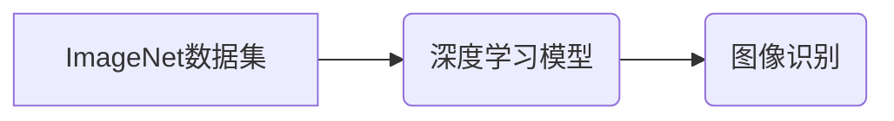

> ImageNet, 深度学习, 计算机视觉, 图像分类, 大规模数据集, 迁移学习

## 1. 背景介绍

计算机视觉领域一直是人工智能研究的热点之一，其目标是让计算机能够像人类一样理解和解释图像信息。然而，由于图像数据的复杂性和多样性，计算机视觉任务的实现一直面临着巨大的挑战。

在20世纪90年代，随着深度学习技术的兴起，计算机视觉领域迎来了新的突破。深度学习模型能够自动学习图像特征，并取得了显著的性能提升。然而，深度学习模型的训练需要大量的标注数据，而获取高质量标注数据的成本很高。

2009年，斯坦福大学教授李飞飞领导的团队创建了ImageNet数据集，这是一个包含超过1400万张图像的巨大图像数据库，并将其用于举办每年一次的ImageNet图像识别挑战赛。ImageNet数据集的发布和挑战赛的举办极大地推动了深度学习在计算机视觉领域的应用，并促进了该领域的研究和发展。

## 2. 核心概念与联系

ImageNet数据集包含了来自不同类别的大量图像，每个图像都经过人工标注，并被分配到相应的类别。ImageNet挑战赛的目标是训练一个能够准确识别图像内容的模型。

**ImageNet数据集与深度学习模型之间的关系：**



**ImageNet数据集的贡献：**

* 提供了大量的标注数据，为深度学习模型的训练提供了充足的素材。
* 促进了深度学习算法的创新和发展，例如AlexNet、VGGNet、ResNet等模型的提出。
* 促进了计算机视觉领域的应用，例如图像识别、目标检测、图像分割等。

## 3. 核心算法原理 & 具体操作步骤

### 3.1  算法原理概述

ImageNet挑战赛中使用的深度学习模型主要基于卷积神经网络（CNN）架构。CNN能够自动学习图像特征，并进行分类识别。

CNN的结构通常包含多个卷积层、池化层和全连接层。卷积层负责提取图像特征，池化层负责降低特征维度，全连接层负责进行分类决策。

### 3.2  算法步骤详解

1. **数据预处理:** 将图像数据预处理，例如调整大小、归一化等。
2. **卷积层:** 使用卷积核对图像进行卷积运算，提取图像特征。
3. **池化层:** 对卷积层的输出进行池化操作，例如最大池化、平均池化等，降低特征维度。
4. **全连接层:** 将池化层的输出连接到全连接层，进行分类决策。
5. **损失函数:** 使用交叉熵损失函数计算模型的预测结果与真实标签之间的差异。
6. **优化算法:** 使用梯度下降算法优化模型参数，降低损失函数的值。

### 3.3  算法优缺点

**优点:**

* 能够自动学习图像特征，无需人工特征工程。
* 性能优异，在图像识别任务中取得了显著的成果。

**缺点:**

* 训练数据量大，需要大量的标注数据。
* 计算量大，训练时间长。

### 3.4  算法应用领域

* **图像识别:** 识别图像中的物体、场景、人物等。
* **目标检测:** 在图像中定位和识别目标。
* **图像分割:** 将图像分割成不同的区域。
* **图像生成:** 生成新的图像。

## 4. 数学模型和公式 & 详细讲解 & 举例说明

### 4.1  数学模型构建

深度学习模型的数学模型主要基于神经网络的结构和激活函数。

**神经网络结构:**

神经网络由多个层组成，每层包含多个神经元。神经元之间通过权重连接，传递信息。

**激活函数:**

激活函数用于将神经元的输入转换为输出，并引入非线性特性。常见的激活函数包括ReLU、Sigmoid、Tanh等。

### 4.2  公式推导过程

深度学习模型的训练过程基于梯度下降算法，其目标是最小化损失函数。

**损失函数:**

损失函数用于衡量模型的预测结果与真实标签之间的差异。常见的损失函数包括交叉熵损失函数、均方误差损失函数等。

**梯度下降算法:**

梯度下降算法通过迭代更新模型参数，降低损失函数的值。

**更新公式:**

```latex
\theta = \theta - \alpha \nabla L(\theta)
```

其中，$\theta$表示模型参数，$\alpha$表示学习率，$\nabla L(\theta)$表示损失函数对模型参数的梯度。

### 4.3  案例分析与讲解

以ImageNet挑战赛中使用的AlexNet模型为例，其结构包含5个卷积层、3个池化层和3个全连接层。

AlexNet模型的训练过程使用了大量的ImageNet数据集，并采用了ReLU激活函数和Dropout正则化技术。

通过训练，AlexNet模型能够准确识别图像中的物体，并在ImageNet挑战赛中取得了显著的成绩。

## 5. 项目实践：代码实例和详细解释说明

### 5.1  开发环境搭建

使用Python语言和深度学习框架TensorFlow或PyTorch搭建开发环境。

### 5.2  源代码详细实现

使用TensorFlow或PyTorch框架实现AlexNet模型的代码实现。

### 5.3  代码解读与分析

解释AlexNet模型代码的结构和功能，包括卷积层、池化层、全连接层、激活函数、损失函数等。

### 5.4  运行结果展示

使用ImageNet数据集对AlexNet模型进行测试，并展示模型的识别准确率和运行时间。

## 6. 实际应用场景

### 6.1  图像识别

* **自动驾驶:** 识别道路上的车辆、行人、交通信号灯等。
* **医疗诊断:** 识别医学图像中的病灶，辅助医生诊断疾病。
* **安防监控:** 识别入侵者、监控人员行为。

### 6.2  目标检测

* **无人零售:** 检测商品的种类和数量，自动结算。
* **智能制造:** 检测产品缺陷，提高生产效率。
* **智能交通:** 检测车辆违规行为，提高交通安全。

### 6.3  图像分割

* **医学图像分析:** 将医学图像分割成不同的组织或器官，辅助医生进行诊断和治疗。
* **遥感图像分析:** 将遥感图像分割成不同的地物类型，用于土地利用规划和环境监测。
* **自动驾驶:** 将道路分割成不同的区域，例如车道、人行道等，辅助车辆导航。

### 6.4  未来应用展望

* **更精准的图像识别:** 能够识别更细粒度的物体和场景。
* **更强大的目标检测:** 能够检测更复杂的场景和目标。
* **更灵活的图像分割:** 能够分割更复杂的图像和场景。
* **更广泛的应用场景:** 能够应用于更多领域，例如教育、娱乐、金融等。

## 7. 工具和资源推荐

### 7.1  学习资源推荐

* **书籍:**
    * 《深度学习》
    * 《计算机视觉：算法与应用》
* **在线课程:**
    * Coursera上的深度学习课程
    * Udacity上的计算机视觉课程

### 7.2  开发工具推荐

* **深度学习框架:** TensorFlow, PyTorch
* **图像处理库:** OpenCV, Pillow

### 7.3  相关论文推荐

* **ImageNet Classification with Deep Convolutional Neural Networks**
* **Deep Residual Learning for Image Recognition**
* **Attention Is All You Need**

## 8. 总结：未来发展趋势与挑战

### 8.1  研究成果总结

ImageNet数据集和挑战赛极大地推动了深度学习在计算机视觉领域的应用，并促进了该领域的研究和发展。

### 8.2  未来发展趋势

* **模型更深更广:** 探索更深层次和更广阔的网络结构，提高模型的表达能力和泛化能力。
* **数据更丰富更多样:** 收集和构建更丰富、更多样化的图像数据集，提高模型的鲁棒性和适应性。
* **算法更智能更高效:** 研究更智能、更有效的深度学习算法，提高模型的训练效率和推理速度。

### 8.3  面临的挑战

* **数据标注成本高:** 获取高质量标注数据的成本仍然很高，限制了深度学习模型的训练和应用。
* **模型解释性差:** 深度学习模型的内部机制难以理解，这限制了模型的信任度和可解释性。
* **模型安全性问题:** 深度学习模型容易受到攻击，例如对抗样本攻击，这需要进一步研究和解决。

### 8.4  研究展望

未来，深度学习在计算机视觉领域将继续取得突破性进展，并应用于更多领域，为人类社会带来更多福祉。


## 9. 附录：常见问题与解答

### 9.1  常见问题

* **ImageNet数据集的规模有多大？**
* **ImageNet挑战赛的规则是什么？**
* **如何使用深度学习模型进行图像识别？**

### 9.2  解答

* ImageNet数据集包含超过1400万张图像。
* ImageNet挑战赛的目标是训练一个能够准确识别图像内容的模型。
* 使用深度学习框架TensorFlow或PyTorch，并训练一个深度学习模型，例如AlexNet模型。

作者：禅与计算机程序设计艺术 / Zen and the Art of Computer Programming


<end_of_turn>