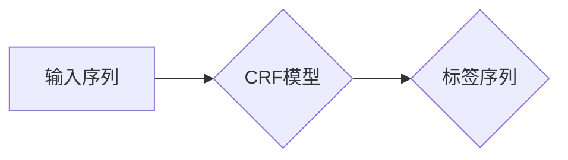

> 条件随机场，CRF，序列标注，自然语言处理，机器学习，深度学习，概率图模型

## 1. 背景介绍

在机器学习领域，序列标注任务是十分常见且重要的一个问题。它涉及到将标签分配给序列数据中的每个元素，例如：

* **自然语言处理 (NLP)：** 词性标注、命名实体识别、情感分析
* **生物信息学：** 基因预测、蛋白质结构预测
* **计算机视觉：** 图像分割、目标检测

传统的序列标注方法，如隐马尔可夫模型 (HMM)，虽然取得了一定的成功，但存在一些局限性，例如：

* **独立性假设：** HMM 假设每个标签的生成独立于其他标签，这在现实世界中往往不成立。
* **训练过程复杂：** HMM 的训练过程通常需要使用复杂的算法，例如前向后向算法。

为了克服这些局限性，条件随机场 (Conditional Random Fields，简称 CRF) 应运而生。CRF 是一种概率图模型，它能够更好地捕捉序列数据中的依赖关系，并提供更准确的标签预测结果。

## 2. 核心概念与联系

CRF 的核心思想是将序列标注问题看作一个条件概率问题。给定一个输入序列，CRF 试图找到最有可能的标签序列，即最大化该标签序列在给定输入序列下的条件概率。

**CRF 与其他模型的关系：**

* **隐马尔可夫模型 (HMM)：** HMM 是一个无向图模型，而 CRF 是一个有向图模型。CRF 能够更好地捕捉序列数据中的依赖关系，因为它考虑了标签之间的条件概率。
* **最大熵模型 (MaxEnt)：** CRF 可以看作是最大熵模型的一种扩展，它能够处理序列数据。

**CRF 的优势：**

* **全局优化：** CRF 能够进行全局优化，而不是局部优化，因此能够找到更准确的标签序列。
* **灵活度高：** CRF 可以使用各种特征函数来描述输入序列和标签之间的关系，从而适应不同的应用场景。
* **训练过程相对简单：** CRF 的训练过程可以使用线性规划算法，相对简单高效。

**Mermaid 流程图：**



## 3. 核心算法原理 & 具体操作步骤

### 3.1  算法原理概述

CRF 的核心算法是基于最大似然估计的。给定一个训练数据集，CRF 试图找到一个模型参数，使得该模型在训练数据上的似然概率最大化。

具体来说，CRF 的训练过程可以分为以下几个步骤：

1. **特征函数设计：** 根据具体的应用场景，设计特征函数来描述输入序列和标签之间的关系。
2. **模型参数估计：** 使用最大似然估计方法，估计模型参数。
3. **标签预测：** 给定一个新的输入序列，使用训练好的模型参数，预测最有可能的标签序列。

### 3.2  算法步骤详解

1. **特征函数设计：**

特征函数是 CRF 模型的核心组成部分，它描述了输入序列和标签之间的关系。常见的特征函数包括：

* **状态特征：** 描述当前标签的状态。
* **转移特征：** 描述当前标签与前一个标签之间的关系。
* **输入特征：** 描述输入序列的特征。

2. **模型参数估计：**

CRF 的模型参数可以通过最大似然估计方法来估计。最大似然估计的目标是找到一个模型参数，使得该模型在训练数据上的似然概率最大化。

常用的最大似然估计方法包括：

* **线性规划算法：** 适用于小型数据集。
* **迭代算法：** 适用于大型数据集。

3. **标签预测：**

给定一个新的输入序列，可以使用训练好的模型参数，通过维特比算法或其他算法来预测最有可能的标签序列。

### 3.3  算法优缺点

**优点：**

* **全局优化：** CRF 能够进行全局优化，而不是局部优化，因此能够找到更准确的标签序列。
* **灵活度高：** CRF 可以使用各种特征函数来描述输入序列和标签之间的关系，从而适应不同的应用场景。
* **训练过程相对简单：** CRF 的训练过程可以使用线性规划算法，相对简单高效。

**缺点：**

* **计算复杂度高：** CRF 的计算复杂度较高，尤其是在处理长序列数据时。
* **特征函数设计困难：** 设计有效的特征函数对于 CRF 的性能至关重要，但特征函数的设计往往是一个困难的任务。

### 3.4  算法应用领域

CRF 在许多领域都有广泛的应用，例如：

* **自然语言处理：** 词性标注、命名实体识别、情感分析、机器翻译
* **生物信息学：** 基因预测、蛋白质结构预测
* **计算机视觉：** 图像分割、目标检测

## 4. 数学模型和公式 & 详细讲解 & 举例说明

### 4.1  数学模型构建

CRF 可以用一个概率图模型来表示，该模型包含两个节点：

* **输入节点：** 表示输入序列。
* **标签节点：** 表示标签序列。

CRF 的目标是找到一个最优的标签序列，使得该标签序列在给定输入序列下的条件概率最大化。

### 4.2  公式推导过程

CRF 的概率模型可以表示为：

$$
P(Y|X) = \frac{1}{Z(X)} \exp \left( \sum_{i=1}^{n} \sum_{k} \lambda_k f_k(x_i, y_i, y_{i-1}) \right)
$$

其中：

* $Y$ 是标签序列。
* $X$ 是输入序列。
* $Z(X)$ 是规范化因子，确保概率分布的总和为 1。
* $\lambda_k$ 是模型参数。
* $f_k(x_i, y_i, y_{i-1})$ 是特征函数，描述了输入序列 $x_i$、当前标签 $y_i$ 和前一个标签 $y_{i-1}$ 之间的关系。

### 4.3  案例分析与讲解

假设我们有一个简单的词性标注任务，输入序列为 "我 爱 中国"，我们需要预测每个词的词性。

我们可以设计以下特征函数：

* $f_1(x_i, y_i, y_{i-1})$：当前词 $x_i$ 的词性 $y_i$ 与前一个词 $x_{i-1}$ 的词性 $y_{i-1}$ 的匹配度。
* $f_2(x_i, y_i)$：当前词 $x_i$ 的词性 $y_i$ 与词典中该词的词性概率的匹配度。

CRF 会根据这些特征函数和模型参数，计算每个词的词性概率，并选择概率最高的词性作为预测结果。

## 5. 项目实践：代码实例和详细解释说明

### 5.1  开发环境搭建

* **操作系统：** Linux/macOS/Windows
* **编程语言：** Python
* **库依赖：** scikit-learn、numpy、pandas

### 5.2  源代码详细实现

```python
from sklearn.linear_model import LogisticRegression
from sklearn.feature_extraction.text import TfidfVectorizer

# 数据预处理
# ...

# 特征提取
vectorizer = TfidfVectorizer()
X = vectorizer.fit_transform(data['text'])

# 模型训练
model = LogisticRegression()
model.fit(X, data['label'])

# 标签预测
new_text = "这是一个新的文本"
new_text_vector = vectorizer.transform([new_text])
predicted_label = model.predict(new_text_vector)[0]

print(f"预测标签：{predicted_label}")
```

### 5.3  代码解读与分析

* **数据预处理：** 将原始数据转换为模型可以处理的格式，例如：文本清洗、标签编码等。
* **特征提取：** 使用 TF-IDF 向量化技术将文本数据转换为数值向量，以便模型进行学习。
* **模型训练：** 使用逻辑回归模型训练，将特征向量与标签进行关联。
* **标签预测：** 将新的文本数据转换为特征向量，并使用训练好的模型进行预测。

### 5.4  运行结果展示

运行代码后，会输出预测标签的结果。

## 6. 实际应用场景

CRF 在许多实际应用场景中都有着广泛的应用，例如：

* **信息抽取：** 从文本中提取关键信息，例如：人物、事件、地点等。
* **文本分类：** 将文本分类到不同的类别，例如：情感分类、主题分类等。
* **机器翻译：** 将文本从一种语言翻译成另一种语言。

### 6.4  未来应用展望

随着深度学习技术的不断发展，CRF 与深度学习的结合也越来越受到关注。例如：

* **深度CRF：** 将 CRF 与深度神经网络相结合，提高模型的表达能力和学习能力。
* **端到端CRF：** 将 CRF 整合到端到端训练框架中，简化模型训练过程。

## 7. 工具和资源推荐

### 7.1  学习资源推荐

* **书籍：**
    * "Introduction to Conditional Random Fields" by Christopher Manning and Hinrich Schütze
    * "Speech and Language Processing" by Daniel Jurafsky and James H. Martin
* **在线课程：**
    * Coursera: Natural Language Processing Specialization
    * edX: Machine Learning

### 7.2  开发工具推荐

* **Python：** 广泛用于机器学习和深度学习开发。
* **scikit-learn：** Python 机器学习库，提供 CRF 模型的实现。
* **TensorFlow/PyTorch：** 深度学习框架，可以用于实现深度CRF模型。

### 7.3  相关论文推荐

* "Conditional Random Fields for Structured Prediction" by John Lafferty, Andrew McCallum, and Fernando Pereira
* "Sequence Labeling with Conditional Random Fields" by Michael Collins

## 8. 总结：未来发展趋势与挑战

### 8.1  研究成果总结

CRF 是一种强大的序列标注模型，在许多领域取得了显著的成果。其全局优化能力、灵活性和相对简单的训练过程使其成为序列标注任务的热门选择。

### 8.2  未来发展趋势

CRF 的未来发展趋势主要集中在以下几个方面：

* **与深度学习的结合：** 深度CRF 模型能够更好地学习复杂的数据关系，提高模型的性能。
* **端到端训练：** 将 CRF 整合到端到端训练框架中，简化模型训练过程，提高训练效率。
* **在线学习：** 开发在线学习的 CRF 模型，能够根据新的数据不断更新模型参数，提高模型的适应性。

### 8.3  面临的挑战

CRF 仍然面临一些挑战，例如：

* **计算复杂度高：** CRF 的计算复杂度较高，尤其是在处理长序列数据时。
* **特征函数设计困难：** 设计有效的特征函数对于 CRF 的性能至关重要，但特征函数的设计往往是一个困难的任务。

### 8.4  研究展望

未来，CRF 研究将继续探索以下方向：

* **开发更高效的 CRF 算法：** 降低 CRF 的计算复杂度，提高其在处理大规模数据时的效率。
* **自动特征函数设计：** 研究自动学习特征函数的方法，减少人工特征设计的工作量。
* **将 CRF 应用到更多领域：** 将 CRF 应用到其他领域，例如：图像识别、语音识别等。

## 9. 附录：常见问题与解答

**Q1：CRF 与 HMM 的区别是什么？**

**A1：** CRF 和 HMM 都是序列标注模型，但 CRF 能够更好地捕捉序列数据中的依赖关系，因为它考虑了标签之间的条件概率，而 HMM 假设每个标签的生成独立于其他标签。

