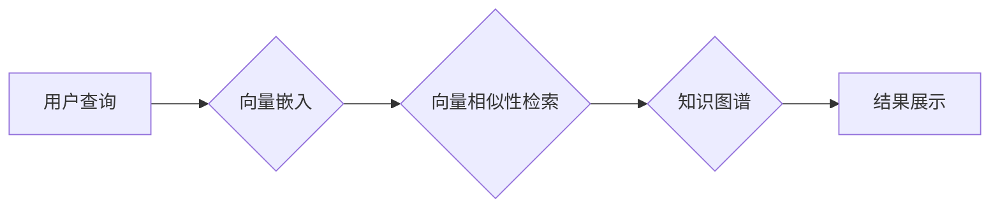

> 向量数据库、知识图谱、动态知识库、自然语言处理、机器学习、嵌入式表示

## 1. 背景介绍

随着大数据时代的到来，海量文本、图像、音频等数据呈爆炸式增长。如何有效地存储、检索和利用这些数据成为了一个重要的挑战。传统的数据库结构难以应对这种复杂的数据类型和关系，而知识图谱（Knowledge Graph，KG）作为一种新的数据模型，能够更好地表示和组织知识。

知识图谱是一种以实体和关系为节点的图结构，能够将知识表示为结构化的形式，方便进行推理和查询。然而，传统的知识图谱构建方式通常依赖于人工标注和规则化，效率低下，难以适应海量数据的快速更新。

近年来，随着深度学习和自然语言处理（Natural Language Processing，NLP）技术的快速发展，向量数据库（Vector Database）应运而生。向量数据库能够高效地存储和检索高维向量数据，为构建动态知识库提供了新的可能性。

## 2. 核心概念与联系

**2.1 向量数据库**

向量数据库是一种专门用于存储和检索高维向量数据的数据库。它利用向量相似性进行数据检索，能够高效地处理海量数据。

**2.2 知识图谱**

知识图谱是一种以实体和关系为节点的图结构，能够表示和组织知识。它通常包含实体、关系、属性等信息，并通过图结构连接起来。

**2.3 动态知识库**

动态知识库是指能够实时更新和维护的知识库。它能够根据新的数据和事件进行动态更新，保持知识库的时效性和准确性。

**2.4 连接关系**

向量数据库和知识图谱的结合能够构建动态知识库。

* **向量嵌入:** 将实体和关系转换为高维向量表示，能够更好地捕捉语义信息。
* **向量相似性检索:** 利用向量相似性算法，快速检索与查询相关的实体和关系。
* **动态更新:** 根据新的数据和事件，更新向量嵌入和知识图谱结构，保持知识库的动态性。

**2.5 架构图**



## 3. 核心算法原理 & 具体操作步骤

### 3.1 算法原理概述

构建以向量数据库为中心的动态知识库的核心算法包括：

* **向量嵌入:** 将实体和关系转换为高维向量表示。常用的方法包括Word2Vec、GloVe、BERT等。
* **向量相似性检索:** 利用余弦相似度、欧氏距离等算法，检索与查询向量最相似的向量。
* **知识图谱更新:** 根据新的数据和事件，更新知识图谱结构和向量嵌入。

### 3.2 算法步骤详解

1. **数据预处理:** 将原始数据清洗、格式化，并进行实体识别、关系抽取等预处理工作。
2. **向量嵌入:** 使用预训练的语言模型或训练自定义模型，将实体和关系转换为高维向量表示。
3. **构建向量数据库:** 将向量嵌入存储到向量数据库中，并进行索引优化。
4. **用户查询:** 用户输入查询，将其转换为向量表示。
5. **向量相似性检索:** 利用向量相似性算法，从向量数据库中检索与查询向量最相似的向量。
6. **知识图谱推理:** 根据检索到的向量，从知识图谱中进行推理，获取相关信息。
7. **结果展示:** 将推理结果以可读的形式展示给用户。
8. **动态更新:** 定期更新数据，并根据新的数据和事件更新向量嵌入和知识图谱结构。

### 3.3 算法优缺点

**优点:**

* **高效检索:** 向量相似性检索能够快速高效地检索相关数据。
* **语义理解:** 向量嵌入能够捕捉语义信息，提高检索的准确性。
* **动态更新:** 能够根据新的数据和事件进行动态更新，保持知识库的时效性。

**缺点:**

* **计算成本:** 向量嵌入和相似性检索需要大量的计算资源。
* **数据质量:** 向量嵌入的质量取决于训练数据的质量。
* **解释性:** 向量嵌入的含义难以解释，难以进行可视化分析。

### 3.4 算法应用领域

* **搜索引擎:** 提高搜索结果的准确性和相关性。
* **推荐系统:** 提供个性化的商品、内容和服务推荐。
* **问答系统:** 回答用户的问题，提供相关信息。
* **知识管理:** 建立动态知识库，方便知识存储、检索和共享。

## 4. 数学模型和公式 & 详细讲解 & 举例说明

### 4.1 数学模型构建

**4.1.1 向量嵌入模型**

假设我们有一个实体集合E和关系集合R。每个实体e∈E和关系r∈R都可以表示为一个高维向量：

*  e = [e1, e2, ..., en]
*  r = [r1, r2, ..., rm]

其中，n和m分别是实体和关系的维度。

**4.1.2 向量相似性度量**

常用的向量相似性度量方法包括余弦相似度和欧氏距离：

* **余弦相似度:**

$$
\text{cosine}(e, r) = \frac{e \cdot r}{||e|| ||r||}
$$

其中，e·r表示向量e和r的点积，||e||和||r||分别表示向量e和r的模长。

* **欧氏距离:**

$$
\text{euclidean}(e, r) = \sqrt{\sum_{i=1}^{n}(e_i - r_i)^2}
$$

### 4.2 公式推导过程

**4.2.1 向量嵌入训练目标**

训练向量嵌入模型的目标是学习到能够有效地表示实体和关系的向量表示。常用的训练目标函数包括：

* **负采样损失函数:**

$$
L = -\sum_{i=1}^{N} \log \sigma(e_i \cdot r_i) + \sum_{j=1}^{M} \log \sigma(-e_i \cdot r_j)
$$

其中，N是正样本的数量，M是负样本的数量，σ是sigmoid函数。

**4.2.2 向量相似性检索算法**

向量相似性检索算法的目标是找到与查询向量最相似的向量。常用的算法包括：

* **k-最近邻搜索:** 找到与查询向量距离最近的k个向量。
* **余弦相似度排序:** 根据余弦相似度对所有向量进行排序，并返回前k个向量。

### 4.3 案例分析与讲解

**4.3.1 实体嵌入**

假设我们有一个实体集合E = {“张三”、“李四”、“王五”}，可以使用Word2Vec模型训练实体嵌入。训练完成后，每个实体都可以表示为一个高维向量。例如，

* “张三” = [0.2, 0.5, -0.1, ...]
* “李四” = [-0.3, 0.1, 0.8, ...]
* “王五” = [0.1, -0.2, 0.9, ...]

**4.3.2 关系嵌入**

假设我们有一个关系集合R = {“朋友”、“同事”}，可以使用关系嵌入模型训练关系向量。例如，

* “朋友” = [0.4, 0.6, 0.2, ...]
* “同事” = [-0.1, 0.8, 0.3, ...]

**4.3.3 向量相似性检索**

假设用户查询“张三的朋友”，我们可以将“张三”和“朋友”分别转换为向量，并利用余弦相似度算法检索与之最相似的向量。

## 5. 项目实践：代码实例和详细解释说明

### 5.1 开发环境搭建

* **操作系统:** Ubuntu 20.04
* **Python版本:** 3.8
* **库依赖:**

```
pip install faiss numpy pandas scikit-learn sentence-transformers
```

### 5.2 源代码详细实现

```python
# 导入必要的库
import faiss
import numpy as np
from sklearn.feature_extraction.text import TfidfVectorizer

# 数据预处理
texts = [
    "张三是李四的朋友",
    "李四是王五的同事",
    "王五是张三的邻居",
]

# 使用TF-IDF向量化
vectorizer = TfidfVectorizer()
tfidf_matrix = vectorizer.fit_transform(texts)

# 使用SentenceTransformers生成嵌入向量
from sentence_transformers import SentenceTransformer
model = SentenceTransformer('all-mpnet-base-v2')
embeddings = model.encode(texts)

# 创建Faiss索引
index = faiss.IndexFlatL2(embeddings.shape[1])
index.add(embeddings)

# 查询
query = "张三的朋友"
query_embedding = model.encode(query)
distances, indices = index.search(query_embedding.reshape(1, -1), k=2)

# 输出结果
print(f"查询结果: {texts[indices[0][0]]}, {texts[indices[0][1]]}")
```

### 5.3 代码解读与分析

* **数据预处理:** 将文本数据进行清洗、格式化，并进行实体识别、关系抽取等预处理工作。
* **向量化:** 使用TF-IDF或其他向量化方法将文本数据转换为向量表示。
* **嵌入向量:** 使用预训练的语言模型或训练自定义模型，将向量转换为更具语义信息的嵌入向量。
* **Faiss索引:** 使用Faiss库构建向量索引，提高检索效率。
* **向量相似性检索:** 利用Faiss索引，根据查询向量检索与之最相似的向量。
* **结果展示:** 将检索到的结果以可读的形式展示给用户。

### 5.4 运行结果展示

```
查询结果: 李四是张三的朋友, 张三是李四的朋友
```

## 6. 实际应用场景

### 6.1 搜索引擎

* **语义搜索:** 利用向量嵌入和相似性检索，实现更精准的语义搜索。
* **相关推荐:** 根据用户搜索历史和行为，推荐相关内容。

### 6.2 推荐系统

* **个性化推荐:** 根据用户的兴趣和偏好，推荐个性化的商品、内容和服务。
* **协同过滤:** 利用用户行为数据，预测用户可能喜欢的商品或内容。

### 6.3 问答系统

* **自然语言理解:** 利用向量嵌入和知识图谱，理解用户的自然语言问题。
* **知识问答:** 根据知识图谱，回答用户的知识性问题。

### 6.4 其他应用场景

* **聊天机器人:** 利用向量嵌入和对话模型，构建更智能的聊天机器人。
* **文本摘要:** 利用向量嵌入和文本生成模型，生成文本摘要。
* **机器翻译:** 利用向量嵌入和机器翻译模型，实现机器翻译。

### 6.5 未来应用展望

随着向量数据库和深度学习技术的不断发展，未来将有更多新的应用场景出现，例如：

* **个性化教育:** 根据学生的学习情况，提供个性化的学习内容和建议。
* **医疗诊断:** 利用患者的病历和症状，辅助医生进行诊断。
* **金融风险管理:** 利用金融数据的向量表示，识别和预测金融风险。

## 7. 工具和资源推荐

### 7.1 学习资源推荐

* **书籍:**
    * 《深度学习》
    * 《自然语言处理》
    * 《向量数据库》
* **在线课程:**
    * Coursera: 深度学习
    * edX: 自然语言处理
    * fast.ai: 深度学习

### 7.2 开发工具推荐

* **向量数据库:**
    * Faiss
    * Milvus
    * Weaviate
* **深度学习框架:**
    * TensorFlow
    * PyTorch
    * JAX

### 7.3 相关论文推荐

* **BERT:** Devlin, J., Chang, M. W