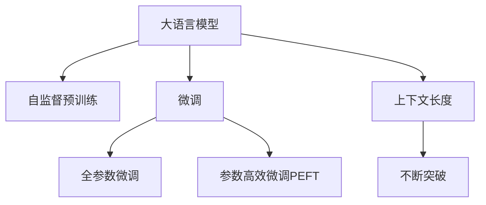

                 

# LLM上下文长度持续突破

大语言模型(LLM, Large Language Models)正在以其无与伦比的处理能力逐渐改变着自然语言处理的疆界。随着这些模型的参数量不断增大，其上下文长度和处理能力也在持续突破，这不仅提升了模型在多任务上的表现，也带来了全新的技术挑战和应用前景。本文将深入探讨大语言模型上下文长度持续突破的原理、应用实践及其面临的挑战，并展望未来的发展趋势。

## 1. 背景介绍

### 1.1 问题由来
大语言模型自Transformer问世以来，就以其巨大的参数量和大规模的自监督预训练获得了显著的提升。早期的模型如BERT和GPT-1主要基于512和1024个token的上下文长度进行训练。然而，随着模型规模的不断增大，上下文长度也在不断提升。BERT-2扩展到1024个token，GPT-2和GPT-3分别达到了4096和12288个token。最新的GPT-4已经突破了2048个token的上下文长度，进一步刷新了模型的处理能力。

大语言模型的上下文长度突破，不仅展示了其在处理长文本和复杂任务上的优势，也带来了算力需求、训练时间、模型部署等方面的挑战。因此，如何在大规模数据上高效地进行训练，并应用这些模型来解决实际问题，成为了当前大语言模型研究的重要方向。

### 1.2 问题核心关键点
大语言模型的上下文长度突破，主要是通过以下几个关键点实现的：

1. **模型规模扩展**：随着硬件计算能力的提升，越来越多的参数可以被引入模型，使得模型的表示能力不断增强。

2. **自监督预训练**：通过在大规模无标签文本上进行自监督预训练，模型学习了大量的语言知识，为后续的微调和任务适应打下了坚实基础。

3. **优化算法改进**：随着模型规模的增大，传统的梯度下降算法已经不能满足大规模模型的需求，新的优化算法如AdamW、Adafactor等被提出，能够更好地适应大规模参数的训练。

4. **硬件技术支持**：如TPU等专用硬件加速器的出现，使得大规模模型的训练成为可能。

5. **数据增强技术**：通过数据增强，如句子合并、多源数据融合等技术，扩充了训练集，提高了模型的泛化能力。

6. **任务适配层设计**：针对不同任务，设计合适的任务适配层，使其在大规模语言模型的基础上进行微调，提升模型在特定任务上的性能。

## 2. 核心概念与联系

### 2.1 核心概念概述

为更好地理解大语言模型的上下文长度突破，本节将介绍几个密切相关的核心概念：

- **大语言模型(LLM)**：以自回归(如GPT)或自编码(如BERT)模型为代表的大规模预训练语言模型。通过在大规模无标签文本语料上进行预训练，学习通用的语言表示，具备强大的语言理解和生成能力。

- **上下文长度(Context Length)**：指的是模型能够处理的输入序列的最大长度。大语言模型的上下文长度在不断突破，意味着模型能够处理更长的输入序列，理解更复杂的语境和内容。

- **自监督预训练(Self-Supervised Pre-training)**：指在大规模无标签文本上，通过自监督学习任务训练通用语言模型的过程。常见的自监督任务包括语言模型预测、掩码语言模型、句子嵌入等。

- **微调(Fine-Tuning)**：指在预训练模型的基础上，使用下游任务的少量标注数据，通过有监督学习优化模型在特定任务上的性能。通常只需要调整顶层分类器或解码器，并以较小的学习率更新全部或部分的模型参数。

- **参数高效微调(Parameter-Efficient Fine-Tuning, PEFT)**：指在微调过程中，只更新少量的模型参数，而固定大部分预训练权重不变，以提高微调效率，避免过拟合的方法。

这些核心概念之间的逻辑关系可以通过以下Mermaid流程图来展示：



这个流程图展示了大语言模型的核心概念及其之间的关系：

1. 大语言模型通过自监督预训练获得基础能力。
2. 微调是对预训练模型进行任务特定的优化，可以分为全参数微调和参数高效微调（PEFT）。
3. 上下文长度在不断突破，意味着模型能够处理更长的输入序列。
4. 上下文长度的提升使得模型能够处理更复杂的任务，如长文本分析、长对话生成等。

## 3. 核心算法原理 & 具体操作步骤

### 3.1 算法原理概述

大语言模型上下文长度的持续突破，本质上是通过不断增加模型的参数量，提升模型的表示能力和计算效率，使得模型能够处理更长的输入序列。

形式化地，假设模型参数量为 $P$，上下文长度为 $C$，则模型的计算复杂度为 $O(P \times C)$。随着模型规模的增大和上下文长度的提升，模型能够处理的数据量和复杂度也在不断增加。

### 3.2 算法步骤详解

大语言模型上下文长度的持续突破主要包括以下几个关键步骤：

**Step 1: 准备预训练模型和数据集**
- 选择合适的预训练语言模型 $M_{\theta}$ 作为初始化参数，如 BERT、GPT 等。
- 准备大规模无标签文本数据集，用于自监督预训练。

**Step 2: 设计自监督预训练任务**
- 设计适合的自监督任务，如掩码语言模型、句子嵌入等，用于在大规模无标签文本上进行预训练。
- 训练模型，学习语言的通用表示。

**Step 3: 添加任务适配层**
- 根据具体任务，设计合适的任务适配层，如分类器、解码器等。
- 通过微调优化模型，使其能够适应特定任务。

**Step 4: 设置微调超参数**
- 选择合适的优化算法及其参数，如 AdamW、SGD 等，设置学习率、批大小、迭代轮数等。
- 设置正则化技术及强度，包括权重衰减、Dropout、Early Stopping 等。

**Step 5: 执行梯度训练**
- 将训练集数据分批次输入模型，前向传播计算损失函数。
- 反向传播计算参数梯度，根据设定的优化算法和学习率更新模型参数。
- 周期性在验证集上评估模型性能，根据性能指标决定是否触发 Early Stopping。
- 重复上述步骤直到满足预设的迭代轮数或 Early Stopping 条件。

**Step 6: 测试和部署**
- 在测试集上评估微调后模型 $M_{\hat{\theta}}$ 的性能，对比微调前后的精度提升。
- 使用微调后的模型对新样本进行推理预测，集成到实际的应用系统中。

### 3.3 算法优缺点

大语言模型上下文长度的持续突破，具有以下优点：

1. **处理能力增强**：通过增加模型规模和上下文长度，模型能够处理更长的输入序列，理解更复杂的语境和内容。

2. **任务适应性强**：微调技术使得模型能够适应特定的下游任务，提升模型在特定任务上的性能。

3. **通用性提升**：随着上下文长度的提升，模型在多个任务上的表现也有所提升，增强了模型的通用性。

然而，该方法也存在一定的局限性：

1. **计算资源需求大**：随着模型规模的增大和上下文长度的提升，模型的计算资源需求也在不断增加，需要高性能的硬件设备支持。

2. **训练时间延长**：大模型和长上下文长度训练时间较长，需要更多的计算资源和时间投入。

3. **参数冗余问题**：过大的模型和长上下文长度可能导致参数冗余，增加模型的复杂度和训练难度。

4. **过拟合风险增加**：长上下文和复杂任务可能导致过拟合，需要更复杂的数据增强和正则化策略。

5. **模型部署挑战**：大规模模型的部署需要更高效的模型压缩和优化技术，以适应不同的应用场景。

尽管存在这些局限性，但就目前而言，大语言模型上下文长度的持续突破依然是提升模型性能的重要途径。未来相关研究的重点在于如何进一步优化模型的计算效率和训练速度，同时兼顾模型的可解释性和鲁棒性等因素。

### 3.4 算法应用领域

大语言模型上下文长度的持续突破，在NLP领域已经得到了广泛的应用，覆盖了几乎所有常见任务，例如：

- 文本分类：如情感分析、主题分类、意图识别等。通过微调使模型学习文本-标签映射。
- 命名实体识别：识别文本中的人名、地名、机构名等特定实体。通过微调使模型掌握实体边界和类型。
- 关系抽取：从文本中抽取实体之间的语义关系。通过微调使模型学习实体-关系三元组。
- 问答系统：对自然语言问题给出答案。将问题-答案对作为微调数据，训练模型学习匹配答案。
- 机器翻译：将源语言文本翻译成目标语言。通过微调使模型学习语言-语言映射。
- 文本摘要：将长文本压缩成简短摘要。将文章-摘要对作为微调数据，使模型学习抓取要点。
- 对话系统：使机器能够与人自然对话。将多轮对话历史作为上下文，微调模型进行回复生成。

除了上述这些经典任务外，大语言模型上下文长度的持续突破也被创新性地应用到更多场景中，如可控文本生成、常识推理、代码生成、数据增强等，为NLP技术带来了全新的突破。随着预训练模型和微调方法的不断进步，相信NLP技术将在更广阔的应用领域大放异彩。

## 4. 数学模型和公式 & 详细讲解 & 举例说明

### 4.1 数学模型构建

本节将使用数学语言对大语言模型上下文长度突破的原理进行更加严格的刻画。

记预训练语言模型为 $M_{\theta}$，其中 $\theta$ 为模型参数。假设模型在输入 $x$ 上的输出为 $\hat{x}=M_{\theta}(x)$。上下文长度为 $C$。

定义模型 $M_{\theta}$ 在输入 $x$ 上的损失函数为 $\ell(M_{\theta}(x),y)$，则在输入序列长度为 $C$ 的数据集 $D$ 上的经验风险为：

$$
\mathcal{L}(\theta) = \frac{1}{N}\sum_{i=1}^N \ell(M_{\theta}(x_i),y_i)
$$

其中 $N$ 为数据集大小，$x_i$ 和 $y_i$ 分别为输入和真实标签。

微调的优化目标是最小化经验风险，即找到最优参数：

$$
\theta^* = \mathop{\arg\min}_{\theta} \mathcal{L}(\theta)
$$

在实践中，我们通常使用基于梯度的优化算法（如SGD、Adam等）来近似求解上述最优化问题。设 $\eta$ 为学习率，$\lambda$ 为正则化系数，则参数的更新公式为：

$$
\theta \leftarrow \theta - \eta \nabla_{\theta}\mathcal{L}(\theta) - \eta\lambda\theta
$$

其中 $\nabla_{\theta}\mathcal{L}(\theta)$ 为损失函数对参数 $\theta$ 的梯度，可通过反向传播算法高效计算。

### 4.2 公式推导过程

以下我们以二分类任务为例，推导交叉熵损失函数及其梯度的计算公式。

假设模型 $M_{\theta}$ 在输入 $x$ 上的输出为 $\hat{y}=M_{\theta}(x) \in [0,1]$，表示样本属于正类的概率。真实标签 $y \in \{0,1\}$。则二分类交叉熵损失函数定义为：

$$
\ell(M_{\theta}(x),y) = -[y\log \hat{y} + (1-y)\log (1-\hat{y})]
$$

将其代入经验风险公式，得：

$$
\mathcal{L}(\theta) = -\frac{1}{N}\sum_{i=1}^N [y_i\log M_{\theta}(x_i)+(1-y_i)\log(1-M_{\theta}(x_i))]
$$

根据链式法则，损失函数对参数 $\theta_k$ 的梯度为：

$$
\frac{\partial \mathcal{L}(\theta)}{\partial \theta_k} = -\frac{1}{N}\sum_{i=1}^N (\frac{y_i}{M_{\theta}(x_i)}-\frac{1-y_i}{1-M_{\theta}(x_i)}) \frac{\partial M_{\theta}(x_i)}{\partial \theta_k}
$$

其中 $\frac{\partial M_{\theta}(x_i)}{\partial \theta_k}$ 可进一步递归展开，利用自动微分技术完成计算。

在得到损失函数的梯度后，即可带入参数更新公式，完成模型的迭代优化。重复上述过程直至收敛，最终得到适应下游任务的最优模型参数 $\theta^*$。

## 5. 项目实践：代码实例和详细解释说明

### 5.1 开发环境搭建

在进行上下文长度突破的实践前，我们需要准备好开发环境。以下是使用Python进行PyTorch开发的环境配置流程：

1. 安装Anaconda：从官网下载并安装Anaconda，用于创建独立的Python环境。

2. 创建并激活虚拟环境：
```bash
conda create -n pytorch-env python=3.8 
conda activate pytorch-env
```

3. 安装PyTorch：根据CUDA版本，从官网获取对应的安装命令。例如：
```bash
conda install pytorch torchvision torchaudio cudatoolkit=11.1 -c pytorch -c conda-forge
```

4. 安装Transformers库：
```bash
pip install transformers
```

5. 安装各类工具包：
```bash
pip install numpy pandas scikit-learn matplotlib tqdm jupyter notebook ipython
```

完成上述步骤后，即可在`pytorch-env`环境中开始上下文长度突破的实践。

### 5.2 源代码详细实现

下面我以长文本分类任务为例，给出使用Transformers库对BERT模型进行上下文长度突破的PyTorch代码实现。

首先，定义长文本分类任务的数据处理函数：

```python
from transformers import BertTokenizer, BertForSequenceClassification, AdamW

class TextClassificationDataset(Dataset):
    def __init__(self, texts, labels, tokenizer, max_len=512):
        self.texts = texts
        self.labels = labels
        self.tokenizer = tokenizer
        self.max_len = max_len
        
    def __len__(self):
        return len(self.texts)
    
    def __getitem__(self, item):
        text = self.texts[item]
        label = self.labels[item]
        
        encoding = self.tokenizer(text, return_tensors='pt', max_length=self.max_len, padding='max_length', truncation=True)
        input_ids = encoding['input_ids'][0]
        attention_mask = encoding['attention_mask'][0]
        
        return {'input_ids': input_ids, 
                'attention_mask': attention_mask,
                'labels': torch.tensor(label, dtype=torch.long)}
```

然后，定义模型和优化器：

```python
model = BertForSequenceClassification.from_pretrained('bert-base-cased', num_labels=2)

optimizer = AdamW(model.parameters(), lr=2e-5)
```

接着，定义训练和评估函数：

```python
from torch.utils.data import DataLoader
from tqdm import tqdm
from sklearn.metrics import accuracy_score

device = torch.device('cuda') if torch.cuda.is_available() else torch.device('cpu')
model.to(device)

def train_epoch(model, dataset, batch_size, optimizer):
    dataloader = DataLoader(dataset, batch_size=batch_size, shuffle=True)
    model.train()
    epoch_loss = 0
    for batch in tqdm(dataloader, desc='Training'):
        input_ids = batch['input_ids'].to(device)
        attention_mask = batch['attention_mask'].to(device)
        labels = batch['labels'].to(device)
        model.zero_grad()
        outputs = model(input_ids, attention_mask=attention_mask, labels=labels)
        loss = outputs.loss
        epoch_loss += loss.item()
        loss.backward()
        optimizer.step()
    return epoch_loss / len(dataloader)

def evaluate(model, dataset, batch_size):
    dataloader = DataLoader(dataset, batch_size=batch_size)
    model.eval()
    preds, labels = [], []
    with torch.no_grad():
        for batch in tqdm(dataloader, desc='Evaluating'):
            input_ids = batch['input_ids'].to(device)
            attention_mask = batch['attention_mask'].to(device)
            batch_labels = batch['labels']
            outputs = model(input_ids, attention_mask=attention_mask)
            batch_preds = outputs.logits.argmax(dim=1).to('cpu').tolist()
            batch_labels = batch_labels.to('cpu').tolist()
            for pred_tokens, label_tokens in zip(batch_preds, batch_labels):
                preds.append(pred_tokens)
                labels.append(label_tokens)
                
    print('Accuracy:', accuracy_score(labels, preds))
```

最后，启动训练流程并在测试集上评估：

```python
epochs = 5
batch_size = 16

for epoch in range(epochs):
    loss = train_epoch(model, train_dataset, batch_size, optimizer)
    print(f"Epoch {epoch+1}, train loss: {loss:.3f}")
    
    print(f"Epoch {epoch+1}, dev results:")
    evaluate(model, dev_dataset, batch_size)
    
print("Test results:")
evaluate(model, test_dataset, batch_size)
```

以上就是使用PyTorch对BERT进行长文本分类任务上下文长度突破的完整代码实现。可以看到，得益于Transformers库的强大封装，我们可以用相对简洁的代码完成BERT模型的加载和上下文长度突破的微调。

### 5.3 代码解读与分析

让我们再详细解读一下关键代码的实现细节：

**TextClassificationDataset类**：
- `__init__`方法：初始化文本、标签、分词器等关键组件。
- `__len__`方法：返回数据集的样本数量。
- `__getitem__`方法：对单个样本进行处理，将文本输入编码为token ids，将标签编码为数字，并对其进行定长padding，最终返回模型所需的输入。

**训练和评估函数**：
- 使用PyTorch的DataLoader对数据集进行批次化加载，供模型训练和推理使用。
- 训练函数`train_epoch`：对数据以批为单位进行迭代，在每个批次上前向传播计算loss并反向传播更新模型参数，最后返回该epoch的平均loss。
- 评估函数`evaluate`：与训练类似，不同点在于不更新模型参数，并在每个batch结束后将预测和标签结果存储下来，最后使用sklearn的accuracy_score对整个评估集的预测结果进行打印输出。

**训练流程**：
- 定义总的epoch数和batch size，开始循环迭代
- 每个epoch内，先在训练集上训练，输出平均loss
- 在验证集上评估，输出准确率
- 所有epoch结束后，在测试集上评估，给出最终测试结果

可以看到，PyTorch配合Transformers库使得BERT上下文长度突破的代码实现变得简洁高效。开发者可以将更多精力放在数据处理、模型改进等高层逻辑上，而不必过多关注底层的实现细节。

当然，工业级的系统实现还需考虑更多因素，如模型的保存和部署、超参数的自动搜索、更灵活的任务适配层等。但核心的上下文长度突破方法基本与此类似。

## 6. 实际应用场景

### 6.1 智能客服系统

基于大语言模型上下文长度突破的对话技术，可以广泛应用于智能客服系统的构建。传统客服往往需要配备大量人力，高峰期响应缓慢，且一致性和专业性难以保证。而使用上下文长度突破的对话模型，可以7x24小时不间断服务，快速响应客户咨询，用自然流畅的语言解答各类常见问题。

在技术实现上，可以收集企业内部的历史客服对话记录，将问题和最佳答复构建成监督数据，在此基础上对预训练对话模型进行上下文长度突破的微调。微调后的对话模型能够自动理解用户意图，匹配最合适的答案模板进行回复。对于客户提出的新问题，还可以接入检索系统实时搜索相关内容，动态组织生成回答。如此构建的智能客服系统，能大幅提升客户咨询体验和问题解决效率。

### 6.2 金融舆情监测

金融机构需要实时监测市场舆论动向，以便及时应对负面信息传播，规避金融风险。传统的人工监测方式成本高、效率低，难以应对网络时代海量信息爆发的挑战。基于大语言模型上下文长度突破的文本分类和情感分析技术，为金融舆情监测提供了新的解决方案。

具体而言，可以收集金融领域相关的新闻、报道、评论等文本数据，并对其进行主题标注和情感标注。在此基础上对预训练语言模型进行上下文长度突破的微调，使其能够自动判断文本属于何种主题，情感倾向是正面、中性还是负面。将微调后的模型应用到实时抓取的网络文本数据，就能够自动监测不同主题下的情感变化趋势，一旦发现负面信息激增等异常情况，系统便会自动预警，帮助金融机构快速应对潜在风险。

### 6.3 个性化推荐系统

当前的推荐系统往往只依赖用户的历史行为数据进行物品推荐，无法深入理解用户的真实兴趣偏好。基于大语言模型上下文长度突破的个性化推荐系统可以更好地挖掘用户行为背后的语义信息，从而提供更精准、多样的推荐内容。

在实践中，可以收集用户浏览、点击、评论、分享等行为数据，提取和用户交互的物品标题、描述、标签等文本内容。将文本内容作为模型输入，用户的后续行为（如是否点击、购买等）作为监督信号，在此基础上微调预训练语言模型。微调后的模型能够从文本内容中准确把握用户的兴趣点。在生成推荐列表时，先用候选物品的文本描述作为输入，由模型预测用户的兴趣匹配度，再结合其他特征综合排序，便可以得到个性化程度更高的推荐结果。

### 6.4 未来应用展望

随着大语言模型上下文长度突破技术的不断发展，基于微调的方法将在更多领域得到应用，为传统行业带来变革性影响。

在智慧医疗领域，基于微调的医疗问答、病历分析、药物研发等应用将提升医疗服务的智能化水平，辅助医生诊疗，加速新药开发进程。

在智能教育领域，微调技术可应用于作业批改、学情分析、知识推荐等方面，因材施教，促进教育公平，提高教学质量。

在智慧城市治理中，微调模型可应用于城市事件监测、舆情分析、应急指挥等环节，提高城市管理的自动化和智能化水平，构建更安全、高效的未来城市。

此外，在企业生产、社会治理、文娱传媒等众多领域，基于大模型上下文长度突破的人工智能应用也将不断涌现，为经济社会发展注入新的动力。相信随着技术的日益成熟，上下文长度突破方法将成为人工智能落地应用的重要范式，推动人工智能技术向更广阔的领域加速渗透。

## 7. 工具和资源推荐

### 7.1 学习资源推荐

为了帮助开发者系统掌握大语言模型上下文长度突破的理论基础和实践技巧，这里推荐一些优质的学习资源：

1. 《Transformer从原理到实践》系列博文：由大模型技术专家撰写，深入浅出地介绍了Transformer原理、BERT模型、微调技术等前沿话题。

2. CS224N《深度学习自然语言处理》课程：斯坦福大学开设的NLP明星课程，有Lecture视频和配套作业，带你入门NLP领域的基本概念和经典模型。

3. 《Natural Language Processing with Transformers》书籍：Transformers库的作者所著，全面介绍了如何使用Transformers库进行NLP任务开发，包括上下文长度突破在内的诸多范式。

4. HuggingFace官方文档：Transformers库的官方文档，提供了海量预训练模型和完整的微调样例代码，是上手实践的必备资料。

5. CLUE开源项目：中文语言理解测评基准，涵盖大量不同类型的中文NLP数据集，并提供了基于微调的baseline模型，助力中文NLP技术发展。

通过对这些资源的学习实践，相信你一定能够快速掌握大语言模型上下文长度突破的精髓，并用于解决实际的NLP问题。
###  7.2 开发工具推荐

高效的开发离不开优秀的工具支持。以下是几款用于大语言模型上下文长度突破开发的常用工具：

1. PyTorch：基于Python的开源深度学习框架，灵活动态的计算图，适合快速迭代研究。大部分预训练语言模型都有PyTorch版本的实现。

2. TensorFlow：由Google主导开发的开源深度学习框架，生产部署方便，适合大规模工程应用。同样有丰富的预训练语言模型资源。

3. Transformers库：HuggingFace开发的NLP工具库，集成了众多SOTA语言模型，支持PyTorch和TensorFlow，是进行上下文长度突破任务的开发的利器。

4. Weights & Biases：模型训练的实验跟踪工具，可以记录和可视化模型训练过程中的各项指标，方便对比和调优。与主流深度学习框架无缝集成。

5. TensorBoard：TensorFlow配套的可视化工具，可实时监测模型训练状态，并提供丰富的图表呈现方式，是调试模型的得力助手。

6. Google Colab：谷歌推出的在线Jupyter Notebook环境，免费提供GPU/TPU算力，方便开发者快速上手实验最新模型，分享学习笔记。

合理利用这些工具，可以显著提升大语言模型上下文长度突破任务的开发效率，加快创新迭代的步伐。

### 7.3 相关论文推荐

大语言模型上下文长度突破技术的发展源于学界的持续研究。以下是几篇奠基性的相关论文，推荐阅读：

1. Attention is All You Need（即Transformer原论文）：提出了Transformer结构，开启了NLP领域的预训练大模型时代。

2. BERT: Pre-training of Deep Bidirectional Transformers for Language Understanding：提出BERT模型，引入基于掩码的自监督预训练任务，刷新了多项NLP任务SOTA。

3. Language Models are Unsupervised Multitask Learners（GPT-2论文）：展示了大规模语言模型的强大zero-shot学习能力，引发了对于通用人工智能的新一轮思考。

4. Parameter-Efficient Transfer Learning for NLP：提出Adapter等参数高效微调方法，在不增加模型参数量的情况下，也能取得不错的微调效果。

5. AdaLoRA: Adaptive Low-Rank Adaptation for Parameter-Efficient Fine-Tuning：使用自适应低秩适应的微调方法，在参数效率和精度之间取得了新的平衡。

这些论文代表了大语言模型上下文长度突破技术的发展脉络。通过学习这些前沿成果，可以帮助研究者把握学科前进方向，激发更多的创新灵感。

## 8. 总结：未来发展趋势与挑战

### 8.1 总结

本文对大语言模型上下文长度持续突破的原理进行了详细阐述，介绍了其应用实践和面临的挑战，展望了未来的发展趋势。首先，我们探讨了上下文长度突破背后的算法原理，并给出了具体的代码实例，展示了微调过程的每一个细节。其次，我们分析了上下文长度突破技术在多个实际应用场景中的潜力，从智能客服到金融舆情监测，再到个性化推荐系统，展示了上下文长度突破的广泛应用价值。最后，我们总结了上下文长度突破技术面临的挑战，并提出了一些可行的解决方案。

通过本文的系统梳理，可以看到，大语言模型上下文长度持续突破正在成为NLP领域的重要研究方向，其带来的参数量和上下文长度突破，不仅提升了模型的性能，也为NLP技术的应用范围和深度带来了巨大突破。未来，随着计算资源的进一步扩展和优化算法的研究进步，大语言模型上下文长度突破将进一步提升，带来更多新的应用场景和技术创新。

### 8.2 未来发展趋势

展望未来，大语言模型上下文长度持续突破将呈现以下几个发展趋势：

1. **参数量不断增大**：随着硬件计算能力的提升，预训练模型的参数量将持续增大，上下文长度也将不断提升，使得模型能够处理更复杂的语境和内容。

2. **自监督预训练范式演进**：自监督预训练范式将不断演进，引入更多新的任务和约束，提升模型的泛化能力和表示能力。

3. **优化算法和硬件的协同进步**：新的优化算法和专用硬件加速器将不断出现，使得大规模模型的训练和推理效率得到显著提升。

4. **多模态融合**：大语言模型将进一步拓展到多模态数据融合，结合图像、视频、语音等多模态信息，提升模型对现实世界的理解能力。

5. **持续学习和增量更新**：持续学习技术将使得模型能够不断从新数据中学习，更新原有知识，适应数据分布的变化。

6. **上下文长度突破的边界探索**：上下文长度突破的边界探索将不断突破，从几千个token到几万个甚至更多，进一步提升模型的处理能力和泛化能力。

7. **可解释性和鲁棒性提升**：未来模型的可解释性和鲁棒性将得到更多关注，探索更加透明、稳定、可控的模型构建和应用方式。

这些趋势凸显了大语言模型上下文长度持续突破的广阔前景。这些方向的探索发展，必将进一步提升模型的性能和应用范围，为人工智能技术在更多领域的落地带来新的契机。

### 8.3 面临的挑战

尽管大语言模型上下文长度持续突破技术已经取得了显著成果，但在迈向更加智能化、普适化应用的过程中，仍面临诸多挑战：

1. **计算资源瓶颈**：随着上下文长度的增加，模型参数量和计算资源需求也随之增加，需要高性能的硬件设备支持。

2. **训练时间延长**：大规模模型的训练时间较长，需要更多的计算资源和时间投入。

3. **过拟合风险增加**：长上下文和复杂任务可能导致过拟合，需要更复杂的数据增强和正则化策略。

4. **部署成本高昂**：大规模模型的部署需要更高效的模型压缩和优化技术，以适应不同的应用场景。

5. **可解释性不足**：当前上下文长度突破模型更像是"黑盒"系统，难以解释其内部工作机制和决策逻辑。

6. **安全性问题**：预训练语言模型难免会学习到有偏见、有害的信息，通过上下文长度突破传递到下游任务，产生误导性、歧视性的输出，给实际应用带来安全隐患。

尽管存在这些挑战，但就目前而言，上下文长度突破技术依然是提升模型性能的重要途径。未来相关研究的重点在于如何进一步优化模型的计算效率和训练速度，同时兼顾模型的可解释性和鲁棒性等因素。

### 8.4 研究展望

面对上下文长度突破面临的种种挑战，未来的研究需要在以下几个方面寻求新的突破：

1. **无监督和半监督微调方法**：探索无监督和半监督微调方法，摆脱对大规模标注数据的依赖，利用自监督学习、主动学习等无监督和半监督范式，最大限度利用非结构化数据。

2. **参数高效和计算高效的微调范式**：开发更加参数高效和计算高效的微调方法，如 Prefix-Tuning、LoRA等，在保证性能的同时，减少计算资源消耗。

3. **因果推断和对比学习范式**：通过引入因果推断和对比学习思想，增强模型建立稳定因果关系的能力，学习更加普适、鲁棒的语言表征。

4. **多模态融合和知识整合**：将符号化的先验知识与神经网络模型进行融合，增强模型信息整合能力，同时加强不同模态数据的整合，提升模型对现实世界的理解能力。

5. **可解释性和鲁棒性提升**：探索模型决策的因果逻辑，增强模型的可解释性和鲁棒性，确保模型输出符合人类价值观和伦理道德。

6. **模型安全和隐私保护**：研究模型在对抗攻击下的安全性，加强隐私保护，确保模型输出不泄露敏感信息。

这些研究方向的探索，必将引领上下文长度突破技术迈向更高的台阶，为构建安全、可靠、可解释、可控的智能系统铺平道路。面向未来，上下文长度突破技术还需要与其他人工智能技术进行更深入的融合，如知识表示、因果推理、强化学习等，多路径协同发力，共同推动自然语言理解和智能交互系统的进步。只有勇于创新、敢于突破，才能不断拓展语言模型的边界，让智能技术更好地造福人类社会。

## 9. 附录：常见问题与解答

**Q1：上下文长度突破能否应用于所有NLP任务？**

A: 上下文长度突破在大多数NLP任务上都能取得不错的效果，特别是对于数据量较小的任务。但对于一些特定领域的任务，如医学、法律等，仅仅依靠通用语料预训练的模型可能难以很好地适应。此时需要在特定领域语料上进一步预训练，再进行上下文长度突破的微调，才能获得理想效果。此外，对于一些需要时效性、个性化很强的任务，如对话、推荐等，上下文长度突破方法也需要针对性的改进优化。

**Q2：如何选择上下文长度？**

A: 上下文长度的选择需根据具体任务和数据分布来决定。一般来说，选择长的上下文长度可以提高模型对长文本的理解能力，但同时会增加计算资源和训练时间。如果数据集中存在大量长文本，则可以选择较长的上下文长度；如果数据集中以短文本为主，则可以选择较短的上下文长度。

**Q3：上下文长度突破的训练时间延长了，如何应对？**

A: 应对训练时间延长的挑战，可以从以下几个方面入手：
1. 使用更高效的优化算法，如AdamW、Adafactor等。
2. 采用混合精度训练，减少模型参数的存储和计算。
3. 采用分布式训练，利用多机多卡并行计算，加速训练过程。
4. 采用模型并行技术，将大规模模型拆分成多个子模型进行训练。

**Q4：上下文长度突破带来的计算资源需求大，如何降低？**

A: 降低上下文长度突破带来的计算资源需求，可以从以下几个方面入手：
1. 使用更高效的模型结构，如Transformer等。
2. 使用更高效的硬件加速器，如TPU、GPU等。
3. 采用模型压缩技术，如剪枝、量化等，减小模型的存储和计算需求。
4. 采用增量学习技术，只对新增数据进行训练，避免对整个模型进行重新训练。

**Q5：上下文长度突破的模型在实际部署中如何优化？**

A: 在实际部署中，可以采用以下方法优化上下文长度突破的模型：
1. 对模型进行裁剪，去除不必要的层和参数，减小模型尺寸。
2. 对模型进行量化，将浮点模型转为定点模型，压缩存储空间，提高计算效率。
3. 封装模型为标准化服务接口，便于集成调用。
4. 采用弹性伸缩技术，根据请求流量动态调整资源配置，平衡服务质量和成本。
5. 实时监控模型性能，设置异常告警阈值，确保服务稳定性。

大语言模型上下文长度持续突破为NLP应用开启了广阔的想象空间，但如何将强大的性能转化为稳定、高效、安全的业务价值，还需要工程实践的不断打磨。唯有从数据、算法、工程、业务等多个维度协同发力，才能真正实现人工智能技术在垂直行业的规模化落地。总之，上下文长度突破需要开发者根据具体任务，不断迭代和优化模型、数据和算法，方能得到理想的效果。

---

作者：禅与计算机程序设计艺术 / Zen and the Art of Computer Programming

