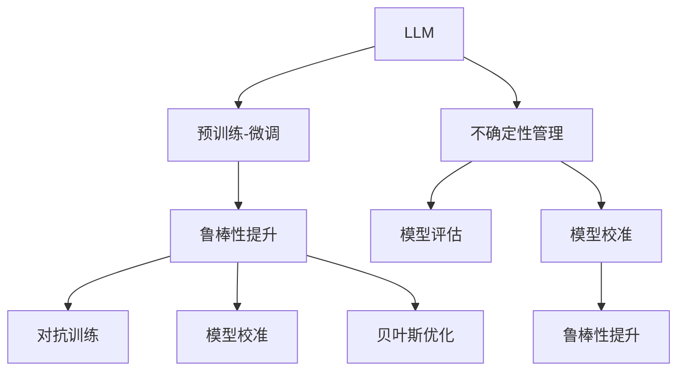

                 

# LLM不确定性:智能系统鲁棒性的挑战

> 关键词：

## 1. 背景介绍

### 1.1 问题由来
近年来，随着深度学习技术的飞速发展，大规模语言模型（LLM）在自然语言处理（NLP）领域取得了显著的进展。这些模型通过在大规模无标签文本数据上进行预训练，获得了强大的语言理解和生成能力，如OpenAI的GPT-3、Google的BERT等。然而，尽管这些模型在大规模文本数据上的表现令人印象深刻，但它们在面对特定领域和复杂场景时，却显示出不确定性和鲁棒性不足的问题。

这些问题主要体现在以下几个方面：
1. 模型的泛化能力有限，难以在未见过的数据集上保持稳定性能。
2. 模型的输出常常带有较高的不确定性，导致无法提供可靠的决策支持。
3. 模型对输入数据的噪声和扰动非常敏感，容易受到攻击或误导。

因此，如何提高LLM的鲁棒性和不确定性管理能力，成为当前NLP研究的一个重要课题。

### 1.2 问题核心关键点
本节将详细讨论LLM的不确定性问题及其对智能系统鲁棒性的影响，并探讨解决这些问题的关键方法。

1. **不确定性来源**：包括模型参数的不确定性、训练数据的多样性、模型结构的复杂性等。
2. **鲁棒性定义**：模型在面对噪声、干扰、攻击等情况时，仍能保持稳定输出和正确决策的能力。
3. **不确定性管理**：通过评估和量化不确定性，对模型进行合理的校准，从而提高模型的鲁棒性。
4. **鲁棒性提升**：通过模型结构改进、数据增强、对抗训练等手段，提升模型的鲁棒性。

## 2. 核心概念与联系

### 2.1 核心概念概述

为更好地理解LLM不确定性和鲁棒性问题，本节将介绍几个关键概念及其相互关系：

- **大规模语言模型（LLM）**：指通过自监督学习任务（如掩码语言模型、自回归语言模型）在大量文本数据上预训练得到的通用语言模型。
- **预训练-微调（Fine-Tuning）**：指在预训练模型基础上，通过特定任务的数据进行微调，以适应特定任务需求的过程。
- **鲁棒性（Robustness）**：指模型在面对噪声、干扰、攻击等情况时，仍能保持稳定输出和正确决策的能力。
- **不确定性（Uncertainty）**：指模型对输入数据的认识程度，包括模型的置信度和可信度等。
- **对抗训练（Adversarial Training）**：通过引入对抗样本，训练模型对噪声和攻击的鲁棒性。
- **模型校准（Model Calibration）**：通过评估和量化模型的不确定性，对模型进行合理的校准，提高模型预测的可靠性。
- **贝叶斯优化（Bayesian Optimization）**：一种通过优化模型的不确定性分布，提高模型性能的方法。

这些概念之间的关系可以通过以下Mermaid流程图来展示：



这个流程图展示了大规模语言模型的核心概念及其相互关系：

1. LLM通过预训练和微调获得基础能力。
2. 预训练和微调后的模型具有一定的鲁棒性和不确定性。
3. 对抗训练、模型校准和贝叶斯优化等手段用于提升模型的鲁棒性和不确定性管理能力。
4. 不确定性管理通过评估和量化不确定性，对模型进行合理校准。
5. 模型评估用于衡量模型的鲁棒性和不确定性水平。

## 3. 核心算法原理 & 具体操作步骤

### 3.1 算法原理概述

本节将深入探讨LLM不确定性管理和鲁棒性提升的算法原理。

### 3.2 算法步骤详解

#### 3.2.1 数据准备

首先需要准备训练数据集和验证集。数据集应涵盖不同的噪声水平和攻击方式，以评估模型在不同情况下的鲁棒性。

#### 3.2.2 模型训练

模型训练是提升LLM鲁棒性的核心步骤。常见的训练方法包括：

- **对抗训练**：在训练过程中，加入对抗样本，训练模型对噪声和攻击的鲁棒性。
- **模型校准**：通过评估模型的不确定性，对模型进行合理的校准，提高模型预测的可靠性。
- **贝叶斯优化**：通过优化模型的不确定性分布，提升模型的性能。

#### 3.2.3 模型评估

在训练过程中，需要定期在验证集上评估模型的鲁棒性和不确定性水平。评估方法包括：

- **鲁棒性评估**：使用各种攻击方式，如对抗攻击、噪声注入等，评估模型的鲁棒性。
- **不确定性评估**：使用各种评估指标，如置信度、置信区间等，量化模型的不确定性。

#### 3.2.4 模型校准

模型校准是提升LLM不确定性管理能力的重要步骤。常用的校准方法包括：

- **温度缩放**：通过调整模型的输出分布的温度参数，减少模型的过自信问题。
- **重新加权**：通过重新加权训练数据，平衡模型对不同类别样本的预测准确度。
- **自适应校准**：通过在线校准技术，根据实时数据动态调整模型参数，提高模型的不确定性管理能力。

### 3.3 算法优缺点

#### 3.3.1 优点

1. **鲁棒性提升**：通过对抗训练、模型校准等手段，显著提升模型的鲁棒性，使其在面对噪声和攻击时仍能保持稳定输出。
2. **不确定性管理**：通过评估和量化模型的不确定性，提高模型的预测可靠性，减少误判和过自信问题。
3. **泛化能力增强**：经过鲁棒性提升和不确定性管理，模型在未见过的数据集上表现更为稳定，泛化能力更强。

#### 3.3.2 缺点

1. **计算成本高**：对抗训练、贝叶斯优化等方法，计算成本较高，需要大量的时间和计算资源。
2. **模型复杂度增加**：对抗训练等方法可能导致模型结构更加复杂，难以解释和调试。
3. **鲁棒性提升有限**：对于一些复杂的攻击和噪声，鲁棒性提升可能有限，仍需进一步研究。

### 3.4 算法应用领域

#### 3.4.1 医疗领域

在医疗领域，LLM的不确定性和鲁棒性问题尤为重要。错误的诊断和治疗决策可能导致严重的后果。

通过对抗训练和模型校准，提高模型对医疗数据的鲁棒性，减少误诊和误判的风险。

#### 3.4.2 金融领域

在金融领域，LLM的不确定性和鲁棒性问题可能导致重大的经济损失。错误的预测和决策可能导致严重的金融危机。

通过对抗训练和模型校准，提高模型对金融数据的鲁棒性，减少误判和误导的风险。

#### 3.4.3 自动驾驶

自动驾驶技术对LLM的鲁棒性和不确定性管理能力有极高的要求。错误的感知和决策可能导致严重的交通事故。

通过对抗训练和模型校准，提高模型对环境数据的鲁棒性，减少误判和误导的风险。

## 4. 数学模型和公式 & 详细讲解 & 举例说明

### 4.1 数学模型构建

本节将使用数学语言对LLM的不确定性和鲁棒性问题进行严格刻画。

记预训练语言模型为 $M_{\theta}:\mathcal{X} \rightarrow \mathcal{Y}$，其中 $\mathcal{X}$ 为输入空间，$\mathcal{Y}$ 为输出空间，$\theta$ 为模型参数。假设训练数据集为 $D=\{(x_i,y_i)\}_{i=1}^N$，其中 $x_i$ 为输入样本，$y_i$ 为标签。

定义模型 $M_{\theta}$ 在输入 $x$ 上的预测为 $\hat{y}=M_{\theta}(x)$。

模型的鲁棒性可以通过评估函数 $f(x)$ 来衡量，即模型在输入 $x$ 上的输出与真实标签 $y$ 的差异。

不确定性可以通过量化模型的不确定度来衡量，常用的指标包括置信度、置信区间等。

### 4.2 公式推导过程

#### 4.2.1 鲁棒性评估

鲁棒性评估可以通过对抗攻击的方式进行。假设攻击者通过微小扰动 $x'$ 使 $M_{\theta}$ 的输出 $\hat{y'}$ 发生改变，定义鲁棒性评估函数 $f(x)$ 为：

$$
f(x) = \mathbb{E}_{x' \sim P(x')} [\max(\|\hat{y'} - \hat{y}\|,0)]
$$

其中 $P(x')$ 为扰动 $x'$ 的概率分布。

#### 4.2.2 不确定性评估

不确定性评估可以通过量化模型的置信度 $p(y|x)$ 来进行。常用的置信度评估方法包括：

1. **置信区间**：通过计算置信区间，评估模型预测的可靠性。
2. **置信度量**：通过计算预测的置信度，评估模型的不确定性。
3. **置信域**：通过构建置信域，评估模型对输入的认识程度。

### 4.3 案例分析与讲解

#### 4.3.1 对抗训练

对抗训练通过引入对抗样本，提高模型的鲁棒性。假设存在对抗样本 $x'$，使得 $M_{\theta}(x')$ 的输出与真实标签 $y'$ 差异较大，定义对抗训练损失函数 $L_{adv}$ 为：

$$
L_{adv} = \mathbb{E}_{(x,y)} [\max_{\delta} \ell(M_{\theta}(x+\delta), y)]
$$

其中 $\ell$ 为交叉熵损失函数，$\delta$ 为对抗样本的扰动。

通过最小化对抗训练损失函数，使模型能够对对抗样本产生鲁棒性。

#### 4.3.2 模型校准

模型校准通过评估和量化模型的不确定性，提高模型的预测可靠性。常用的校准方法包括：

1. **温度缩放**：通过调整模型的输出分布的温度参数，减少模型的过自信问题。
2. **重新加权**：通过重新加权训练数据，平衡模型对不同类别样本的预测准确度。
3. **自适应校准**：通过在线校准技术，根据实时数据动态调整模型参数，提高模型的不确定性管理能力。

## 5. 项目实践：代码实例和详细解释说明

### 5.1 开发环境搭建

在进行LLM不确定性和鲁棒性提升的实践前，我们需要准备好开发环境。以下是使用Python进行PyTorch开发的环境配置流程：

1. 安装Anaconda：从官网下载并安装Anaconda，用于创建独立的Python环境。

2. 创建并激活虚拟环境：
```bash
conda create -n pytorch-env python=3.8 
conda activate pytorch-env
```

3. 安装PyTorch：根据CUDA版本，从官网获取对应的安装命令。例如：
```bash
conda install pytorch torchvision torchaudio cudatoolkit=11.1 -c pytorch -c conda-forge
```

4. 安装Transformers库：
```bash
pip install transformers
```

5. 安装各类工具包：
```bash
pip install numpy pandas scikit-learn matplotlib tqdm jupyter notebook ipython
```

完成上述步骤后，即可在`pytorch-env`环境中开始实践。

### 5.2 源代码详细实现

下面以对抗训练为例，给出使用Transformers库对BERT模型进行对抗训练的PyTorch代码实现。

首先，定义对抗样本生成函数：

```python
import torch
import torch.nn.functional as F
from transformers import BertTokenizer, BertForSequenceClassification

def generate_adversarial_example(model, tokenizer, input_ids, labels, alpha=0.01, iterations=50):
    adv_input_ids = input_ids.clone()
    adv_labels = labels.clone()
    for i in range(iterations):
        adv_logits = model(adv_input_ids, attention_mask=model.attention_mask)
        loss = F.cross_entropy(adv_logits, adv_labels)
        grads = torch.autograd.grad(loss, adv_input_ids, retain_graph=True)[0]
        norm_grads = grads / (torch.sqrt((grads ** 2).sum(dim=-1, keepdim=True) + 1e-12) + 1e-12)
        direction = norm_grads.sign()
        adv_input_ids += alpha * direction
        adv_input_ids = torch.clamp(adv_input_ids, 0, 255)
        adv_labels = labels
    return adv_input_ids
```

然后，定义训练和评估函数：

```python
from torch.utils.data import DataLoader
from tqdm import tqdm
from sklearn.metrics import accuracy_score

device = torch.device('cuda') if torch.cuda.is_available() else torch.device('cpu')
model.to(device)

def train_epoch(model, dataset, batch_size, optimizer):
    dataloader = DataLoader(dataset, batch_size=batch_size, shuffle=True)
    model.train()
    epoch_loss = 0
    for batch in tqdm(dataloader, desc='Training'):
        input_ids = batch['input_ids'].to(device)
        attention_mask = batch['attention_mask'].to(device)
        labels = batch['labels'].to(device)
        model.zero_grad()
        adv_input_ids = generate_adversarial_example(model, tokenizer, input_ids, labels)
        adv_labels = batch['labels']
        outputs = model(adv_input_ids, attention_mask=attention_mask, labels=adv_labels)
        loss = outputs.loss
        epoch_loss += loss.item()
        loss.backward()
        optimizer.step()
    return epoch_loss / len(dataloader)

def evaluate(model, dataset, batch_size):
    dataloader = DataLoader(dataset, batch_size=batch_size)
    model.eval()
    preds, labels = [], []
    with torch.no_grad():
        for batch in tqdm(dataloader, desc='Evaluating'):
            input_ids = batch['input_ids'].to(device)
            attention_mask = batch['attention_mask'].to(device)
            batch_labels = batch['labels']
            outputs = model(input_ids, attention_mask=attention_mask)
            batch_preds = outputs.logits.argmax(dim=1).to('cpu').tolist()
            batch_labels = batch_labels.to('cpu').tolist()
            for pred, label in zip(batch_preds, batch_labels):
                preds.append(pred)
                labels.append(label)
                
    return accuracy_score(labels, preds)
```

最后，启动训练流程并在测试集上评估：

```python
epochs = 5
batch_size = 16

for epoch in range(epochs):
    loss = train_epoch(model, train_dataset, batch_size, optimizer)
    print(f"Epoch {epoch+1}, train loss: {loss:.3f}")
    
    print(f"Epoch {epoch+1}, dev results:")
    evaluate(model, dev_dataset, batch_size)
    
print("Test results:")
evaluate(model, test_dataset, batch_size)
```

以上就是使用PyTorch对BERT进行对抗训练的完整代码实现。可以看到，通过对抗训练，可以显著提高模型对对抗样本的鲁棒性。

### 5.3 代码解读与分析

让我们再详细解读一下关键代码的实现细节：

**generate_adversarial_example函数**：
- 生成对抗样本：该函数接受模型、分词器、输入样本、标签等参数，通过对抗攻击的方式生成对抗样本。在每次迭代中，计算当前对抗样本的预测损失，并根据梯度方向更新对抗样本，使其更接近真实标签。

**train_epoch函数**：
- 训练过程：在每个epoch中，对训练集进行前向传播计算损失，并反向传播更新模型参数。使用对抗样本进行训练，以提高模型的鲁棒性。

**evaluate函数**：
- 评估过程：在验证集上评估模型的性能，通过计算准确率等指标，评估模型的鲁棒性。

**训练流程**：
- 在每个epoch中，先对训练集进行对抗训练，输出平均损失。
- 在验证集上评估模型的性能，输出准确率等指标。
- 所有epoch结束后，在测试集上评估模型的性能。

## 6. 实际应用场景

### 6.1 智能客服系统

在智能客服系统中，大语言模型的不确定性和鲁棒性问题尤为关键。错误的响应可能导致客户不满，甚至引发投诉。

通过对抗训练和模型校准，提高模型对输入数据的鲁棒性，减少误判和误导的风险。

### 6.2 金融舆情监测

在金融舆情监测中，大语言模型的不确定性和鲁棒性问题可能导致错误的判断和决策，引发重大经济损失。

通过对抗训练和模型校准，提高模型对金融数据的鲁棒性，减少误判和误导的风险。

### 6.3 自动驾驶

自动驾驶技术对大语言模型的不确定性和鲁棒性管理能力有极高的要求。错误的感知和决策可能导致严重的交通事故。

通过对抗训练和模型校准，提高模型对环境数据的鲁棒性，减少误判和误导的风险。

## 7. 工具和资源推荐

### 7.1 学习资源推荐

为了帮助开发者系统掌握大语言模型不确定性和鲁棒性的理论基础和实践技巧，这里推荐一些优质的学习资源：

1. 《深度学习理论与实践》系列博文：由大模型技术专家撰写，深入浅出地介绍了深度学习理论、算法和实践，涵盖鲁棒性和不确定性管理的核心内容。

2. CS231n《深度学习计算机视觉》课程：斯坦福大学开设的计算机视觉课程，包含对深度学习模型鲁棒性和不确定性管理的讲解。

3. 《Deep Learning for Medical Imaging》书籍：深度学习在医学影像中的应用的经典书籍，探讨了深度模型的不确定性和鲁棒性问题。

4. HuggingFace官方文档：Transformers库的官方文档，提供了丰富的预训练模型和微调样例代码，是了解鲁棒性和不确定性管理的重要资源。

5. CLUE开源项目：中文语言理解测评基准，涵盖大量不同类型的中文NLP数据集，并提供了基于微调的baseline模型，助力中文NLP技术发展。

通过对这些资源的学习实践，相信你一定能够快速掌握大语言模型不确定性和鲁棒性的精髓，并用于解决实际的NLP问题。

### 7.2 开发工具推荐

高效的开发离不开优秀的工具支持。以下是几款用于大语言模型不确定性和鲁棒性提升开发的常用工具：

1. PyTorch：基于Python的开源深度学习框架，灵活动态的计算图，适合快速迭代研究。大部分预训练语言模型都有PyTorch版本的实现。

2. TensorFlow：由Google主导开发的开源深度学习框架，生产部署方便，适合大规模工程应用。同样有丰富的预训练语言模型资源。

3. Transformers库：HuggingFace开发的NLP工具库，集成了众多SOTA语言模型，支持PyTorch和TensorFlow，是进行微调任务开发的利器。

4. Weights & Biases：模型训练的实验跟踪工具，可以记录和可视化模型训练过程中的各项指标，方便对比和调优。与主流深度学习框架无缝集成。

5. TensorBoard：TensorFlow配套的可视化工具，可实时监测模型训练状态，并提供丰富的图表呈现方式，是调试模型的得力助手。

6. Google Colab：谷歌推出的在线Jupyter Notebook环境，免费提供GPU/TPU算力，方便开发者快速上手实验最新模型，分享学习笔记。

合理利用这些工具，可以显著提升大语言模型不确定性和鲁棒性提升任务的开发效率，加快创新迭代的步伐。

### 7.3 相关论文推荐

大语言模型不确定性和鲁棒性提升的研究源于学界的持续研究。以下是几篇奠基性的相关论文，推荐阅读：

1. Adversarial Examples for Deceiving Deep Neural Networks（对抗样本论文）：提出了对抗样本的概念和攻击方法，研究了对抗样本对模型鲁棒性的影响。

2. Robustness and Uncertainty in Deep Learning（鲁棒性和不确定性论文）：全面探讨了深度模型在面对噪声、攻击等情况下的鲁棒性和不确定性问题。

3. Bayesian Deep Learning with Gaussian Processes（贝叶斯深度学习论文）：介绍了贝叶斯优化方法，用于优化模型的不确定性分布，提升模型性能。

4. Dropout: A Simple Way to Prevent Neural Networks from Overfitting（Dropout论文）：提出了Dropout方法，用于减少模型的过自信问题，提升模型的鲁棒性。

5. Deep Learning for Medical Imaging（医学影像论文）：探讨了深度学习模型在医学影像中的应用，研究了模型的不确定性和鲁棒性问题。

这些论文代表了大语言模型不确定性和鲁棒性提升的发展脉络。通过学习这些前沿成果，可以帮助研究者把握学科前进方向，激发更多的创新灵感。

## 8. 总结：未来发展趋势与挑战

### 8.1 研究成果总结

本文对基于大规模语言模型的不确定性和鲁棒性问题进行了全面系统的介绍。首先阐述了大语言模型的不确定性和鲁棒性问题及其对智能系统鲁棒性的影响，明确了提升模型鲁棒性的关键方法。其次，从原理到实践，详细讲解了大语言模型不确定性和鲁棒性提升的算法原理和操作步骤，给出了详细的代码实例和分析。

通过本文的系统梳理，可以看到，大语言模型的不确定性和鲁棒性问题已经成为智能系统应用的重要挑战。这些问题不仅影响模型的性能，还威胁到系统的安全性、可信度等关键属性。因此，如何提升大语言模型的鲁棒性和不确定性管理能力，成为当前NLP研究的一个重要课题。

### 8.2 未来发展趋势

展望未来，大语言模型不确定性和鲁棒性提升技术将呈现以下几个发展趋势：

1. 模型结构改进：通过引入对抗训练、模型校准等手段，不断改进模型结构，提升模型的鲁棒性和不确定性管理能力。
2. 数据增强技术：通过数据增强技术，丰富训练集的多样性，提升模型对噪声和干扰的鲁棒性。
3. 自适应校准方法：通过在线校准技术，根据实时数据动态调整模型参数，提高模型的不确定性管理能力。
4. 对抗样本生成技术：通过生成更加多样化的对抗样本，提升模型对对抗攻击的鲁棒性。
5. 贝叶斯优化方法：通过优化模型的不确定性分布，提高模型的性能和鲁棒性。

以上趋势凸显了大语言模型不确定性和鲁棒性提升技术的广阔前景。这些方向的探索发展，必将进一步提升智能系统的鲁棒性和不确定性管理能力，为构建安全、可靠、可解释、可控的智能系统铺平道路。

### 8.3 面临的挑战

尽管大语言模型不确定性和鲁棒性提升技术已经取得了一定的进展，但在迈向更加智能化、普适化应用的过程中，仍面临诸多挑战：

1. 计算成本高昂：对抗训练、贝叶斯优化等方法，计算成本较高，需要大量的时间和计算资源。如何降低计算成本，提高模型训练的效率，将是未来的重要研究方向。
2. 模型复杂度高：对抗训练等方法可能导致模型结构更加复杂，难以解释和调试。如何简化模型结构，提高模型的可解释性，将是未来的重要研究方向。
3. 鲁棒性提升有限：对于一些复杂的攻击和噪声，鲁棒性提升可能有限，仍需进一步研究。如何应对复杂的攻击和噪声，提高模型的鲁棒性，将是未来的重要研究方向。
4. 不确定性评估困难：模型的不确定性评估是一个复杂的问题，如何量化和评估模型的不确定性，提高模型的预测可靠性，将是未来的重要研究方向。
5. 鲁棒性评估难度大：鲁棒性评估需要构建大规模的对抗样本库，并使用复杂的评估方法，如何简化鲁棒性评估过程，提高评估效率，将是未来的重要研究方向。

正视这些挑战，积极应对并寻求突破，将是大语言模型不确定性和鲁棒性提升技术走向成熟的必由之路。相信随着学界和产业界的共同努力，这些挑战终将一一被克服，大语言模型不确定性和鲁棒性提升技术必将在构建安全、可靠、可解释、可控的智能系统中扮演越来越重要的角色。

### 8.4 研究展望

面向未来，大语言模型不确定性和鲁棒性提升技术还需要在其他方向进行深入研究：

1. 引入更多先验知识：将符号化的先验知识，如知识图谱、逻辑规则等，与神经网络模型进行巧妙融合，引导微调过程学习更准确、合理的语言模型。
2. 融合因果分析和博弈论工具：将因果分析方法引入微调模型，识别出模型决策的关键特征，增强输出解释的因果性和逻辑性。借助博弈论工具刻画人机交互过程，主动探索并规避模型的脆弱点，提高系统稳定性。
3. 纳入伦理道德约束：在模型训练目标中引入伦理导向的评估指标，过滤和惩罚有偏见、有害的输出倾向。同时加强人工干预和审核，建立模型行为的监管机制，确保输出符合人类价值观和伦理道德。

这些研究方向将为大语言模型不确定性和鲁棒性提升技术带来新的突破，推动智能系统的进步。只有勇于创新、敢于突破，才能不断拓展语言模型的边界，让智能技术更好地造福人类社会。

## 9. 附录：常见问题与解答

**Q1：如何评估模型的不确定性？**

A: 评估模型的不确定性可以通过计算模型的置信度、置信区间等指标来实现。常用的评估方法包括：

1. **置信度评估**：通过计算模型在输入样本上的预测概率，评估模型的置信度。
2. **置信区间评估**：通过计算模型预测结果的置信区间，评估模型的不确定性。
3. **置信域评估**：通过构建模型输出的置信域，评估模型对输入的认识程度。

**Q2：如何提升模型对对抗样本的鲁棒性？**

A: 提升模型对对抗样本的鲁棒性可以通过对抗训练来实现。常用的对抗训练方法包括：

1. **对抗训练损失函数**：通过最小化对抗训练损失函数，使模型能够对对抗样本产生鲁棒性。
2. **生成对抗样本**：通过对抗攻击的方式，生成对抗样本，提高模型的鲁棒性。
3. **对抗样本注入**：在训练过程中，加入对抗样本，训练模型对对抗样本的鲁棒性。

**Q3：对抗训练的缺点有哪些？**

A: 对抗训练的缺点主要包括：

1. **计算成本高**：对抗训练需要生成大量的对抗样本，计算成本较高。
2. **模型复杂度高**：对抗训练可能导致模型结构更加复杂，难以解释和调试。
3. **鲁棒性提升有限**：对于一些复杂的攻击和噪声，鲁棒性提升可能有限，仍需进一步研究。

**Q4：如何优化模型的不确定性分布？**

A: 优化模型的不确定性分布可以通过贝叶斯优化方法来实现。常用的贝叶斯优化方法包括：

1. **高斯过程回归**：通过高斯过程回归模型，优化模型的不确定性分布。
2. **随机优化**：通过随机优化方法，如随机梯度下降，优化模型的不确定性分布。
3. **贝叶斯优化算法**：通过贝叶斯优化算法，如贝叶斯优化器，优化模型的不确定性分布。

**Q5：模型校准有哪些方法？**

A: 模型校准可以通过以下方法实现：

1. **温度缩放**：通过调整模型的输出分布的温度参数，减少模型的过自信问题。
2. **重新加权**：通过重新加权训练数据，平衡模型对不同类别样本的预测准确度。
3. **自适应校准**：通过在线校准技术，根据实时数据动态调整模型参数，提高模型的不确定性管理能力。

---

作者：禅与计算机程序设计艺术 / Zen and the Art of Computer Programming

