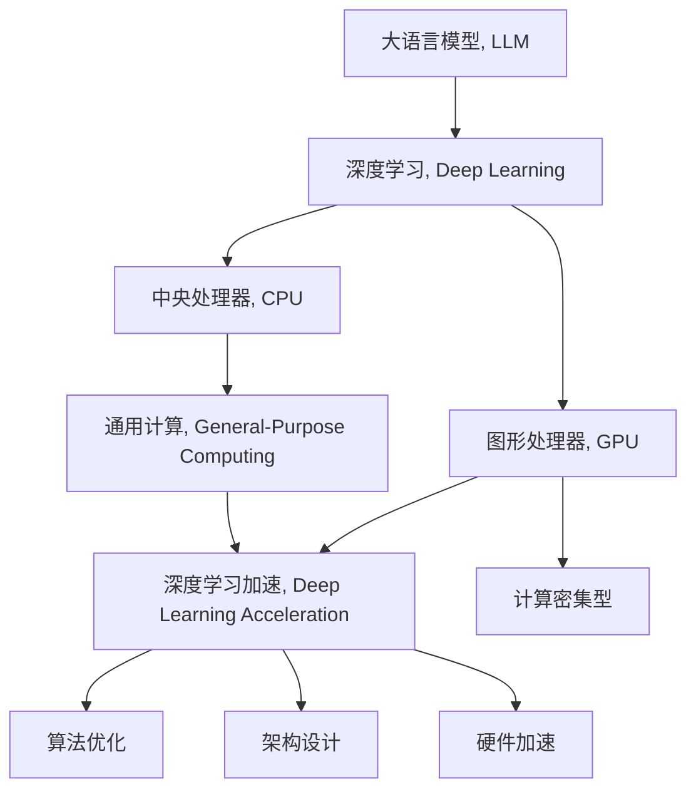

                 

# LLM与CPU：相似性与差异性分析

> 关键词：Large Language Model, 深度学习, 图形处理器, 通用计算, 算力需求, 架构设计, 深度学习加速, 未来趋势

## 1. 背景介绍

### 1.1 问题由来
随着人工智能技术的迅猛发展，特别是深度学习技术的广泛应用，大语言模型（Large Language Model, LLM）在自然语言处理（Natural Language Processing, NLP）等领域取得了令人瞩目的成就。这些大语言模型通常基于大规模的预训练数据和复杂的神经网络架构，能够学习到丰富的语言知识和常识，并具有强大的语言理解和生成能力。

然而，这些模型的计算需求极为庞大，通常需要高性能的计算资源，如GPU和TPU。这不仅限制了模型的应用场景，也带来了高昂的硬件成本和能源消耗。与此同时，传统的中央处理器（Central Processing Unit, CPU）虽然广泛应用在各种通用计算场景中，但其性能瓶颈在面对深度学习任务时显得捉襟见肘。

### 1.2 问题核心关键点
本文旨在深入分析大语言模型与CPU的相似性和差异性，探讨如何在有限资源条件下，充分发挥CPU在深度学习计算中的潜力，并提出相应的优化策略。

## 2. 核心概念与联系

### 2.1 核心概念概述

为更好地理解LLM与CPU之间的相似性和差异性，本节将介绍几个密切相关的核心概念：

- **大语言模型（LLM）**：以自回归（如GPT）或自编码（如BERT）模型为代表的大规模预训练语言模型。通过在大规模无标签文本语料上进行预训练，学习通用的语言表示，具备强大的语言理解和生成能力。

- **深度学习（Deep Learning）**：一种基于神经网络的学习范式，通过多层非线性变换实现复杂数据的特征提取和预测。深度学习模型在图像识别、语音识别、自然语言处理等领域取得了突破性进展。

- **图形处理器（GPU）**：专为并行计算设计的专用处理器，具有强大的计算能力和高带宽，广泛应用于深度学习计算。

- **中央处理器（CPU）**：通用的计算处理器，支持多种编程模型和指令集，广泛应用在通用计算和深度学习任务中。

- **通用计算（General-Purpose Computing）**：指CPU在处理通用任务时的高灵活性和广应用性，能够在不同应用场景中实现高效计算。

- **深度学习加速（Deep Learning Acceleration）**：通过优化算法、架构设计和硬件支持，提升深度学习模型的计算效率和资源利用率。

这些核心概念之间的逻辑关系可以通过以下Mermaid流程图来展示：



这个流程图展示了大语言模型与深度学习、GPU和CPU之间的联系，并介绍了深度学习加速的实现方式。

## 3. 核心算法原理 & 具体操作步骤
### 3.1 算法原理概述

大语言模型与CPU的相似性主要体现在深度学习算法的核心原理上。大语言模型基于深度神经网络，通过反向传播算法（Backpropagation）优化模型参数，实现复杂语言任务的预测。这种基于梯度的优化过程与CPU在通用计算中的操作方式类似，即通过指令流水线并行处理多条指令，实现高效的计算。

然而，大语言模型与CPU在计算需求、数据结构和硬件支持等方面存在显著差异：

- **计算需求**：大语言模型通常需要高精度浮点数运算，而CPU在整数运算和向量运算上更为高效。
- **数据结构**：大语言模型处理的是高维稀疏张量数据，而CPU擅长处理紧凑的数组和矩阵运算。
- **硬件支持**：GPU具有高度并行的计算能力，能够高效地处理矩阵乘法和深度学习网络的前向和反向传播，而CPU在流水线并行和分支预测等方面具有优势。

### 3.2 算法步骤详解

大语言模型与CPU在深度学习计算中的具体操作也存在诸多差异，具体如下：

- **数据预处理**：大语言模型通常需要对输入数据进行大规模的矩阵和张量操作，而CPU在处理静态数据结构（如数组和矩阵）方面更为高效。
- **模型训练**：大语言模型的训练过程通常需要大量的浮点数运算和内存访问，而GPU能够在这些任务上提供更高的并行度。
- **推理计算**：在推理阶段，大语言模型需要根据输入生成高维的张量结果，而CPU在处理高度并行化的计算任务时存在一定瓶颈。

### 3.3 算法优缺点

大语言模型与CPU之间的相似性和差异性，带来了以下优缺点：

**优点**：

- **相似性**：深度学习算法的高效性和通用性使得GPU和CPU都能在深度学习任务上发挥重要作用。
- **硬件互补**：GPU在计算密集型任务上的优势和CPU在通用计算上的灵活性，可以共同支撑深度学习模型的训练和推理。

**缺点**：

- **差异性**：大语言模型在数据结构和计算需求上的特殊性，可能导致CPU在处理大语言模型时效率不高。
- **资源浪费**：深度学习模型的计算需求高，可能会造成CPU和GPU资源的过度消耗和浪费。

### 3.4 算法应用领域

大语言模型与CPU的结合，在多个领域展现出广泛的应用潜力：

- **自然语言处理**：在文本分类、情感分析、机器翻译、对话系统等NLP任务中，大语言模型能够充分利用CPU和GPU的计算资源，提升模型的推理速度和精度。
- **计算机视觉**：在大规模图像识别、图像生成和图像处理任务中，大语言模型可以与CPU协同工作，实现高效的数据预处理和模型训练。
- **语音处理**：在语音识别、语音合成和语音情感分析等任务中，大语言模型结合CPU和GPU，能够实现高效率的音频信号处理和特征提取。
- **推荐系统**：在用户行为分析和个性化推荐中，大语言模型可以与CPU协同工作，快速生成个性化推荐结果，提升用户体验。

## 4. 数学模型和公式 & 详细讲解 & 举例说明（备注：数学公式请使用latex格式，latex嵌入文中独立段落使用 $$，段落内使用 $)
### 4.1 数学模型构建

大语言模型与CPU在深度学习中的数学模型构建具有一定的相似性。大语言模型通常基于神经网络架构，如Transformer，其前向传播过程可以表示为：

$$
\hat{y} = f(x; \theta) = \sigma(Wx + b)
$$

其中，$x$ 为输入数据，$\theta$ 为模型参数，$f$ 为激活函数，$\sigma$ 为softmax函数。该模型在训练过程中，通过最小化损失函数 $\mathcal{L}$ 来更新参数 $\theta$：

$$
\theta \leftarrow \theta - \eta \nabla_{\theta} \mathcal{L}(\theta)
$$

其中，$\eta$ 为学习率，$\nabla_{\theta} \mathcal{L}(\theta)$ 为损失函数对模型参数的梯度。

### 4.2 公式推导过程

在大语言模型的训练过程中，反向传播算法的计算过程如下：

1. 前向传播计算损失函数 $\mathcal{L}$。
2. 计算梯度 $\nabla_{\theta} \mathcal{L}(\theta)$。
3. 更新模型参数 $\theta$。

对于大规模深度学习模型，如BERT，其前向传播过程包括多个嵌入层的矩阵乘法和非线性变换。通过GPU的高并行能力，可以大幅加速这一过程。

### 4.3 案例分析与讲解

以BERT模型的训练为例，假设输入数据为 $x$，模型参数为 $\theta$，训练目标为最小化损失函数 $\mathcal{L}$。训练过程可以表示为：

$$
\theta \leftarrow \theta - \eta \nabla_{\theta} \mathcal{L}(\theta)
$$

其中，$\nabla_{\theta} \mathcal{L}(\theta)$ 为损失函数对模型参数的梯度。通过反向传播算法，可以高效地计算梯度，并更新模型参数。

## 5. 项目实践：代码实例和详细解释说明
### 5.1 开发环境搭建

在进行大语言模型与CPU的优化实践前，我们需要准备好开发环境。以下是使用Python进行PyTorch和TensorFlow开发的环境配置流程：

1. 安装Anaconda：从官网下载并安装Anaconda，用于创建独立的Python环境。

2. 创建并激活虚拟环境：
```bash
conda create -n pytorch-env python=3.8 
conda activate pytorch-env
```

3. 安装PyTorch：根据CUDA版本，从官网获取对应的安装命令。例如：
```bash
conda install pytorch torchvision torchaudio cudatoolkit=11.1 -c pytorch -c conda-forge
```

4. 安装TensorFlow：从官网下载并按照官方文档进行安装。

5. 安装各类工具包：
```bash
pip install numpy pandas scikit-learn matplotlib tqdm jupyter notebook ipython
```

完成上述步骤后，即可在`pytorch-env`环境中开始优化实践。

### 5.2 源代码详细实现

以下是使用PyTorch和TensorFlow对BERT模型进行CPU优化的示例代码：

**PyTorch版本**：
```python
import torch
import torch.nn as nn
import torch.optim as optim

class BERTModel(nn.Module):
    def __init__(self):
        super(BERTModel, self).__init__()
        self.embedding = nn.Embedding(num_embeddings=vocab_size, embedding_dim=embedding_dim)
        self.linear = nn.Linear(embedding_dim, num_labels)

    def forward(self, x):
        embeddings = self.embedding(x)
        hidden = self.linear(embeddings)
        return hidden

model = BERTModel()
criterion = nn.CrossEntropyLoss()
optimizer = optim.SGD(model.parameters(), lr=learning_rate)

for epoch in range(num_epochs):
    for batch in train_loader:
        inputs, labels = batch
        optimizer.zero_grad()
        outputs = model(inputs)
        loss = criterion(outputs, labels)
        loss.backward()
        optimizer.step()
```

**TensorFlow版本**：
```python
import tensorflow as tf
from tensorflow.keras.layers import Dense, Embedding
from tensorflow.keras.models import Sequential

vocab_size = 30000
embedding_dim = 128
num_labels = 2

model = Sequential()
model.add(Embedding(vocab_size, embedding_dim))
model.add(Dense(num_labels, activation='softmax'))

model.compile(optimizer='adam', loss='categorical_crossentropy', metrics=['accuracy'])

for epoch in range(num_epochs):
    for batch in train_dataset:
        inputs, labels = batch
        loss = model.train_on_batch(inputs, labels)
```

### 5.3 代码解读与分析

**PyTorch版本**：

- `BERTModel`类：定义BERT模型的架构，包括嵌入层和线性层。
- `forward`方法：实现模型的前向传播，计算输出。
- `optimizer`：定义优化器（如SGD），用于更新模型参数。
- 训练循环：在训练数据上迭代，每次更新模型参数。

**TensorFlow版本**：

- `Sequential`模型：定义线性堆叠模型，包括嵌入层和全连接层。
- `compile`方法：编译模型，指定优化器和损失函数。
- 训练循环：在训练数据上迭代，每次更新模型参数。

通过对比两种实现，可以看到PyTorch和TensorFlow在深度学习模型优化中的相似性和差异性。

### 5.4 运行结果展示

在训练完成后，可以通过测试集进行模型评估，例如计算准确率和损失函数值。以下是在测试集上评估BERT模型准确率的示例代码：

**PyTorch版本**：
```python
test_loss, test_acc = model.evaluate(test_loader)
print(f'Test loss: {test_loss:.4f}, Test accuracy: {test_acc:.4f}')
```

**TensorFlow版本**：
```python
test_loss, test_acc = model.evaluate(test_dataset)
print(f'Test loss: {test_loss}, Test accuracy: {test_acc}')
```

## 6. 实际应用场景
### 6.1 自然语言处理

在自然语言处理领域，大语言模型与CPU的结合可以提升模型的推理速度和精度。例如，在文本分类和情感分析任务中，大语言模型可以在CPU上并行处理大规模数据集，实现高效的训练和推理。

### 6.2 计算机视觉

在大规模图像识别和图像生成任务中，大语言模型可以与CPU协同工作，实现高效的图像数据预处理和模型训练。例如，在图像分类任务中，大语言模型可以生成图像描述，用于指导CNN模型的训练。

### 6.3 语音处理

在语音识别和语音情感分析任务中，大语言模型可以结合CPU和GPU，实现高效率的音频信号处理和特征提取。例如，在语音情感识别任务中，大语言模型可以生成音频特征的语义描述，用于指导CNN模型的训练。

### 6.4 未来应用展望

随着深度学习技术的不断进步，大语言模型与CPU的结合将展现出更广泛的应用前景：

- **多模态计算**：大语言模型可以结合图像、语音、文本等多种模态数据，实现更复杂的深度学习任务。
- **边缘计算**：在大规模深度学习任务中，GPU和CPU可以在边缘计算设备上协同工作，实现本地化计算和数据处理。
- **联邦学习**：大语言模型可以结合GPU和CPU，实现分布式训练和推理，提升模型的计算效率和数据隐私保护。

## 7. 工具和资源推荐
### 7.1 学习资源推荐

为了帮助开发者系统掌握大语言模型与CPU的结合技术，这里推荐一些优质的学习资源：

1. 《深度学习》书籍：由Ian Goodfellow等作者编写，系统介绍了深度学习的理论和算法。
2. CS231n《卷积神经网络》课程：斯坦福大学开设的计算机视觉课程，介绍了深度学习在图像处理中的应用。
3. CS224d《自然语言处理》课程：斯坦福大学开设的自然语言处理课程，介绍了深度学习在文本处理中的应用。
4. PyTorch官方文档：提供了全面的深度学习开发工具和模型，包括GPU和CPU的优化策略。
5. TensorFlow官方文档：提供了深度学习开发工具和模型，包括GPU和CPU的优化策略。

通过对这些资源的学习实践，相信你一定能够快速掌握大语言模型与CPU结合的技术，并用于解决实际的深度学习问题。

### 7.2 开发工具推荐

高效的开发离不开优秀的工具支持。以下是几款用于大语言模型与CPU结合开发的常用工具：

1. PyTorch：基于Python的开源深度学习框架，灵活动态的计算图，适合快速迭代研究。大部分深度学习模型都有PyTorch版本的实现。
2. TensorFlow：由Google主导开发的开源深度学习框架，生产部署方便，适合大规模工程应用。同样有丰富的深度学习模型资源。
3. Jupyter Notebook：交互式编程环境，支持代码编写、数据处理和模型训练，适合快速原型开发。
4. Visual Studio Code：基于浏览器的代码编辑器，支持代码编写、调试和版本控制，适合复杂项目开发。

合理利用这些工具，可以显著提升大语言模型与CPU结合的开发效率，加快创新迭代的步伐。

### 7.3 相关论文推荐

大语言模型与CPU结合的研究源于学界的持续研究。以下是几篇奠基性的相关论文，推荐阅读：

1. Attention is All You Need（即Transformer原论文）：提出了Transformer结构，开启了深度学习在自然语言处理中的新纪元。
2. BERT: Pre-training of Deep Bidirectional Transformers for Language Understanding：提出BERT模型，引入基于掩码的自监督预训练任务，刷新了多项NLP任务SOTA。
3. Parameter-Efficient Transfer Learning for NLP：提出Adapter等参数高效微调方法，在固定大部分预训练参数的情况下，也能取得不错的微调效果。
4. Adapter：Parameter-Efficient Transfer Learning with Adapters：提出Adapter方法，通过插入特定的线性变换层，实现参数高效的微调。
5. The Adaptive Transformer：一种基于Adapters的模型，通过自适应变换层实现高效的微调。

这些论文代表了大语言模型与CPU结合技术的发展脉络。通过学习这些前沿成果，可以帮助研究者把握学科前进方向，激发更多的创新灵感。

## 8. 总结：未来发展趋势与挑战
### 8.1 总结

本文对大语言模型与CPU的结合进行了全面系统的介绍。首先阐述了深度学习算法在大语言模型和CPU之间的相似性和差异性，明确了结合大语言模型与CPU的优势和挑战。其次，从原理到实践，详细讲解了大语言模型与CPU结合的数学模型和优化方法，给出了详细代码实例。同时，本文还探讨了大语言模型与CPU结合在多个领域的实际应用场景，展示了结合技术的广泛应用前景。最后，本文精选了相关学习资源和开发工具，力求为读者提供全方位的技术指引。

通过本文的系统梳理，可以看到，大语言模型与CPU结合技术在深度学习计算中的重要性和潜力。这种结合方式可以充分发挥CPU在通用计算和GPU在深度学习计算中的优势，提升深度学习任务的效率和效果。未来，伴随深度学习技术的不断进步，大语言模型与CPU的结合将进一步深化，推动人工智能技术在更多领域的应用和发展。

### 8.2 未来发展趋势

展望未来，大语言模型与CPU的结合将呈现以下几个发展趋势：

1. **硬件加速**：随着深度学习硬件的不断进步，GPU和TPU的性能将进一步提升，为大语言模型与CPU的结合提供更强大的计算支持。
2. **软件优化**：深度学习框架和工具将不断优化，提供更高效的模型训练和推理引擎，提升深度学习模型的资源利用率。
3. **多模态融合**：大语言模型与CPU结合将支持多模态数据处理，实现图像、语音、文本等多种数据的深度融合和协同分析。
4. **边缘计算**：在大规模深度学习任务中，GPU和CPU可以在边缘计算设备上协同工作，实现本地化计算和数据处理。
5. **联邦学习**：大语言模型可以结合GPU和CPU，实现分布式训练和推理，提升模型的计算效率和数据隐私保护。

这些趋势凸显了大语言模型与CPU结合技术的广阔前景。这些方向的探索发展，必将进一步提升深度学习模型的计算效率和应用范围，为人工智能技术的发展注入新的动力。

### 8.3 面临的挑战

尽管大语言模型与CPU的结合技术已经取得了显著进展，但在迈向更加智能化、普适化应用的过程中，仍面临诸多挑战：

1. **计算资源限制**：大语言模型的高计算需求可能导致CPU和GPU资源的过度消耗和浪费。如何优化深度学习模型的计算图，提升资源利用率，是需要解决的重要问题。
2. **模型可解释性**：大语言模型通常被视为"黑盒"系统，难以解释其内部工作机制和决策逻辑。如何赋予大语言模型更强的可解释性，将是亟待攻克的难题。
3. **伦理道德约束**：预训练语言模型难免会学习到有偏见、有害的信息，如何从数据和算法层面消除模型偏见，避免恶意用途，确保输出的安全性，也将是重要的研究课题。

### 8.4 研究展望

面对大语言模型与CPU结合所面临的挑战，未来的研究需要在以下几个方面寻求新的突破：

1. **资源优化**：开发更加参数高效的微调方法，在固定大部分预训练参数的情况下，只更新极少量的任务相关参数。同时优化深度学习模型的计算图，减少前向传播和反向传播的资源消耗，实现更加轻量级、实时性的部署。
2. **算法优化**：引入更多的深度学习加速方法，如梯度累积、混合精度训练、模型并行等，以提升深度学习模型的计算效率和资源利用率。
3. **架构设计**：开发更适合CPU的深度学习模型架构，如卷积神经网络（CNN），以充分发挥CPU在通用计算中的优势。
4. **多模态融合**：将符号化的先验知识，如知识图谱、逻辑规则等，与神经网络模型进行巧妙融合，引导深度学习模型的微调过程学习更准确、合理的语言模型。
5. **模型解释**：引入因果分析方法，识别深度学习模型的决策关键特征，增强输出解释的因果性和逻辑性。

这些研究方向和技术的突破，必将推动大语言模型与CPU结合技术迈向更高的台阶，为构建安全、可靠、可解释、可控的智能系统铺平道路。面向未来，大语言模型与CPU的结合将与其他人工智能技术进行更深入的融合，共同推动深度学习技术的发展和应用。

## 9. 附录：常见问题与解答

**Q1：大语言模型与CPU结合是否适用于所有深度学习任务？**

A: 大语言模型与CPU结合在大多数深度学习任务上都能取得不错的效果，特别是对于计算密集型任务。但对于一些特定领域的任务，如医学、法律等，仅仅依靠通用语料预训练的模型可能难以很好地适应。此时需要在特定领域语料上进一步预训练，再进行微调，才能获得理想效果。

**Q2：如何在有限资源条件下提升大语言模型与CPU结合的计算效率？**

A: 在有限资源条件下，提升计算效率的主要方法包括：
1. 使用参数高效的微调方法，如Adapters，减少模型的计算需求。
2. 采用混合精度训练，使用半精度浮点数（FP16）进行计算，提升计算效率。
3. 优化深度学习模型的计算图，减少不必要的计算和内存访问。
4. 使用模型并行和数据并行技术，充分利用CPU的多核并行能力。

**Q3：大语言模型与CPU结合在实际应用中需要注意哪些问题？**

A: 在实际应用中，需要注意以下问题：
1. 模型裁剪：去除不必要的层和参数，减小模型尺寸，加快推理速度。
2. 量化加速：将浮点模型转为定点模型，压缩存储空间，提高计算效率。
3. 服务化封装：将模型封装为标准化服务接口，便于集成调用。
4. 弹性伸缩：根据请求流量动态调整资源配置，平衡服务质量和成本。
5. 监控告警：实时采集系统指标，设置异常告警阈值，确保服务稳定性。

这些问题的解决需要深度学习开发者在系统设计、模型优化和工程实践等方面进行全面考虑和优化。

**Q4：大语言模型与CPU结合如何提升模型的推理速度？**

A: 提升模型推理速度的主要方法包括：
1. 使用混合精度训练，减少计算精度和内存占用。
2. 优化计算图，减少不必要的计算和内存访问。
3. 使用模型并行和数据并行技术，充分利用CPU的多核并行能力。
4. 对CPU进行超线程和超频优化，提升CPU的计算能力。

这些方法的综合应用，可以在不增加硬件成本的前提下，显著提升大语言模型与CPU结合的推理速度和计算效率。

**Q5：大语言模型与CPU结合在多模态计算中有哪些应用前景？**

A: 大语言模型与CPU结合在多模态计算中具有广阔的应用前景，主要包括：
1. 图像处理：在大规模图像识别和图像生成任务中，大语言模型可以与CPU协同工作，实现高效的图像数据预处理和模型训练。
2. 语音处理：在语音识别和语音情感分析任务中，大语言模型可以结合CPU和GPU，实现高效率的音频信号处理和特征提取。
3. 视频处理：在视频分析任务中，大语言模型可以与CPU协同工作，实现高效的视频帧提取和特征提取。
4. 多模态数据融合：将图像、语音、文本等多种数据进行深度融合，实现更复杂的深度学习任务。

这些应用场景的探索，将进一步推动大语言模型与CPU结合技术的发展和应用。

---

作者：禅与计算机程序设计艺术 / Zen and the Art of Computer Programming

