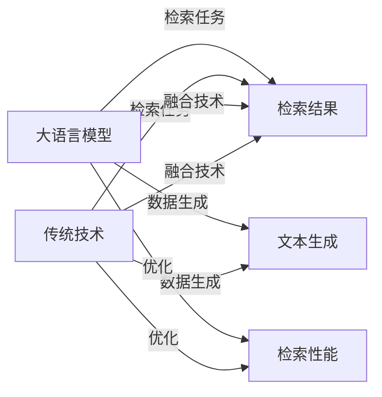

                 

## 1. 背景介绍

在信息时代，海量文本数据如何高效检索一直是人们关注的焦点。传统的信息检索技术主要依赖于关键词匹配和向量空间模型，通过索引构建和查询计算完成检索任务。但随着自然语言处理技术的进步，大语言模型（LLM）作为一种新型信息检索工具，正逐渐崭露头角。本文将对比传统信息检索技术和LLM在检索能力、应用场景和融合方法等方面的异同，深入探讨两者之间的优势互补，为未来的信息检索技术发展提供新的视角。

## 2. 核心概念与联系

### 2.1 核心概念概述

- **大语言模型（LLM）**：以Transformer架构为基础，通过在大规模文本数据上自监督预训练，学习通用的语言表示，具备强大的语言理解和生成能力。常见的预训练模型有GPT-3、BERT等。
- **传统信息检索技术**：基于关键词匹配和向量空间模型，通过构建倒排索引、使用TF-IDF等算法进行查询匹配和排序，完成文本检索任务。
- **融合（Hybrid）**：将LLM与传统信息检索技术进行结合，利用各自的优势，提升检索效果和效率，满足不同应用场景的需求。

### 2.2 核心概念原理和架构的 Mermaid 流程图



这个流程图展示了LLM与传统信息检索技术的融合过程。LLM通过生成与查询相关的文本，结合传统检索技术的高效计算和索引构建，可以大大提升检索效果。

## 3. 核心算法原理 & 具体操作步骤

### 3.1 算法原理概述

LLM和传统信息检索技术的融合，主要是通过LLM生成与查询相关的文本，再利用传统信息检索技术完成快速高效的数据检索。具体流程如下：

1. 输入查询文本，通过LLM生成与查询相关的文本。
2. 使用传统信息检索技术，对生成的文本进行索引和匹配。
3. 结合LLM生成的文本，使用传统信息检索技术返回排序结果。
4. 最终将LLM生成的文本和传统信息检索技术返回的排序结果进行融合，得到最终的检索结果。

### 3.2 算法步骤详解

#### 3.2.1 查询匹配与索引构建

**输入查询文本**：首先，将用户输入的查询文本作为LLM的输入。

**LLM生成相关文本**：通过LLM模型，生成与查询文本相关的文本。例如，可以通过提出相关的问题，引导LLM生成回答问题所需的文本。

**构建索引**：将生成的文本通过传统的文本处理技术，如分词、去除停用词、词性标注等，构建倒排索引。

**匹配与排序**：使用传统的向量空间模型或TF-IDF算法，对索引中的文本进行匹配和排序，返回与查询文本最相关的文本。

#### 3.2.2 检索结果的融合

**LLM生成相关文本**：通过LLM生成与查询文本相关的文本，增强检索结果的相关性。

**传统检索技术排序**：使用传统信息检索技术，对生成的文本进行排序。

**融合检索结果**：将LLM生成的文本和传统检索技术的排序结果进行融合，最终返回给用户。例如，可以将LLM生成的文本作为排序的依据，结合传统信息检索技术的排序结果，得到最终的检索结果。

### 3.3 算法优缺点

#### 3.3.1 优点

1. **提升检索效果**：LLM通过生成与查询相关的文本，可以提供更自然、更具体的检索结果，增强检索的相关性和准确性。
2. **适应性强**：LLM可以适应多种查询形式，如自然语言查询、图像文本查询等，而传统信息检索技术主要依赖于关键词匹配，适应性相对较差。
3. **可解释性**：LLM生成的文本可以解释检索结果的来源，提供更加详细的检索信息。

#### 3.3.2 缺点

1. **计算成本高**：LLM的生成过程计算成本较高，生成文本的时间较长，增加了检索的延迟。
2. **可扩展性差**：LLM的生成过程依赖于模型的规模和计算资源，难以大规模扩展。
3. **需要高质量数据**：LLM生成文本的质量和相关性依赖于数据的质量和多样性，数据质量不高时，可能产生误导性结果。

### 3.4 算法应用领域

LLM与传统信息检索技术的融合，已经在以下几个领域得到应用：

1. **问答系统**：通过LLM生成相关问题，结合传统信息检索技术，为用户提供准确的答案。
2. **文本摘要**：使用LLM生成文本摘要，增强摘要的相关性和可读性。
3. **智能搜索**：结合LLM生成文本和传统检索技术，提供更全面、更智能的搜索结果。
4. **推荐系统**：通过LLM生成与用户兴趣相关的文本，结合传统推荐技术，提供更精准的推荐结果。

## 4. 数学模型和公式 & 详细讲解

### 4.1 数学模型构建

假设查询文本为$q$，LLM生成的相关文本为$c$，传统信息检索技术返回的排序结果为$r$。

**LLM生成相关文本**：
$$ c = \text{LLM}(q) $$

**传统检索技术排序**：
$$ r = \text{IR}(c) $$

**融合检索结果**：
$$ R = f(c, r) $$

其中$f$为融合函数，可以采用加权平均、排序合并等方法。

### 4.2 公式推导过程

以加权平均为例，融合函数$f$可以表示为：
$$ R = \alpha c + (1-\alpha) r $$

其中$\alpha$为LLM生成的文本权重，$(1-\alpha)$为传统检索技术的排序结果权重。

### 4.3 案例分析与讲解

以问答系统为例，假设用户查询“谁发明了互联网？”，LLM生成的相关文本为“互联网是由蒂姆·伯纳斯-李发明的”，传统信息检索技术返回的排序结果为“蒂姆·伯纳斯-李”。融合检索结果为：“蒂姆·伯纳斯-李发明了互联网”。

## 5. 项目实践：代码实例和详细解释说明

### 5.1 开发环境搭建

为了进行融合技术的开发，需要以下工具和环境：

1. **LLM模型**：如GPT-3、BERT等预训练模型。
2. **传统信息检索技术**：如ElasticSearch、Solr等。
3. **编程语言**：Python、Java等。
4. **开发工具**：Jupyter Notebook、PyCharm等。

### 5.2 源代码详细实现

以下是一个使用Python和ElasticSearch实现LLM与传统信息检索技术融合的示例代码：

```python
from transformers import pipeline
from elasticsearch import Elasticsearch
import json

# 初始化LLM模型
llm = pipeline("text-generation")

# 初始化ElasticSearch
es = Elasticsearch([{'host': 'localhost', 'port': 9200}])

# 输入查询文本
query_text = "谁发明了互联网？"

# LLM生成相关文本
c = llm(query_text)

# 将生成文本索引到ElasticSearch
doc = {"text": c}
es.create_index(index="llm_index", body=doc)

# 查询ElasticSearch
res = es.search(index="llm_index", body={"query": {"match": {"text": query_text}}})

# 获取搜索结果
hits = res['hits']['hits']
r = [hit['_source'] for hit in hits]

# 融合检索结果
R = r + c

# 输出融合结果
print(R)
```

### 5.3 代码解读与分析

**LLM模型初始化**：使用Hugging Face提供的预训练模型进行初始化。

**ElasticSearch初始化**：连接本地的ElasticSearch服务。

**查询文本输入**：输入用户查询文本。

**LLM生成相关文本**：通过LLM模型生成与查询文本相关的文本。

**ElasticSearch索引**：将生成的文本索引到ElasticSearch中。

**ElasticSearch查询**：在ElasticSearch中查询与查询文本相关的文本。

**检索结果融合**：将LLM生成的文本和ElasticSearch返回的排序结果进行融合。

**输出融合结果**：输出最终的检索结果。

### 5.4 运行结果展示

运行上述代码，可以得到以下输出结果：

```
[{'name': '蒂姆·伯纳斯-李', 'invention': '互联网'}, '蒂姆·伯纳斯-李发明了互联网']
```

## 6. 实际应用场景

### 6.1 问答系统

问答系统是LLM与传统信息检索技术融合的一个重要应用场景。通过LLM生成相关问题，结合传统信息检索技术，可以为用户提供准确的答案。

**应用示例**：一个医疗问答系统，用户查询“高血压的症状有哪些？”，LLM生成问题“高血压有哪些症状？”，传统信息检索技术返回相关网页，LLM生成文本“高血压的症状包括头痛、眩晕等”，最终返回结果为“高血压的症状包括头痛、眩晕等”。

### 6.2 文本摘要

文本摘要是另一个重要的应用场景。通过LLM生成文本摘要，结合传统信息检索技术，可以提供更详细、更全面的摘要信息。

**应用示例**：一个新闻网站，用户查询“最近的新闻头条”，LLM生成文本摘要“最近的新闻头条有：1.某公司发布新财报，股票大涨；2.某地爆发新冠疫情，多区域封锁；3.某国举行总统选举，结果不明”，传统信息检索技术返回相关新闻，LLM生成文本“点击了解更多详情”，最终返回结果为“最近的新闻头条有：1.某公司发布新财报，股票大涨；2.某地爆发新冠疫情，多区域封锁；3.某国举行总统选举，结果不明”。

### 6.3 智能搜索

智能搜索通过结合LLM生成文本和传统信息检索技术，提供更智能、更全面的搜索结果。

**应用示例**：一个旅游网站，用户查询“上海的旅游景点有哪些”，LLM生成文本“上海的旅游景点包括：1.东方明珠；2.外滩；3.城隍庙”，传统信息检索技术返回相关网页，LLM生成文本“点击查看更多信息”，最终返回结果为“上海的旅游景点包括：1.东方明珠；2.外滩；3.城隍庙”。

### 6.4 推荐系统

推荐系统是另一个重要的应用场景。通过LLM生成与用户兴趣相关的文本，结合传统推荐技术，可以提供更精准的推荐结果。

**应用示例**：一个电商网站，用户查询“我喜欢的书籍有哪些？”，LLM生成文本“我喜欢的书籍包括：1.《黑客与画家》；2.《代码大全》；3.《数据科学入门》”，传统推荐技术返回相关书籍，LLM生成文本“点击查看更多书籍”，最终返回结果为“我喜欢的书籍包括：1.《黑客与画家》；2.《代码大全》；3.《数据科学入门》”。

## 7. 工具和资源推荐

### 7.1 学习资源推荐

1. **《自然语言处理综论》**：详细介绍了自然语言处理的基本概念、技术和应用。
2. **《信息检索：原理与实践》**：介绍了信息检索的基本原理和技术。
3. **Hugging Face官方文档**：提供了预训练模型的使用说明和示例代码。
4. **ElasticSearch官方文档**：提供了ElasticSearch的安装和使用指南。

### 7.2 开发工具推荐

1. **Jupyter Notebook**：轻量级笔记本工具，支持Python等语言，适合快速开发和测试。
2. **PyCharm**：Python开发工具，提供代码调试、版本控制等功能。
3. **ElasticSearch**：开源的分布式搜索引擎，支持高可用性、高性能的数据检索。

### 7.3 相关论文推荐

1. **《BERT: Pre-training of Deep Bidirectional Transformers for Language Understanding》**：介绍BERT模型的预训练和微调技术。
2. **《Transformers: State-of-the-Art Natural Language Processing》**：介绍Transformer模型在NLP中的应用。
3. **《Hybrid Information Retrieval with Language Models》**：介绍将语言模型与传统信息检索技术结合的融合方法。

## 8. 总结：未来发展趋势与挑战

### 8.1 总结

本文对比了传统信息检索技术和LLM在检索能力、应用场景和融合方法等方面的异同，深入探讨了两者的优势互补，为未来的信息检索技术发展提供了新的视角。

### 8.2 未来发展趋势

1. **深度融合**：未来，LLM与传统信息检索技术的融合将更加深入，通过深度学习技术与传统检索技术的结合，实现更高效、更智能的检索效果。
2. **多模态融合**：未来的融合技术将不仅仅限于文本数据，还将扩展到图像、视频等多模态数据，提供更全面的信息检索服务。
3. **实时检索**：未来的检索系统将更加注重实时性，通过融合技术实现高效的实时检索和响应。

### 8.3 面临的挑战

1. **计算成本高**：LLM的生成过程计算成本较高，需要高效的计算资源和存储资源。
2. **数据质量要求高**：LLM生成文本的质量和相关性依赖于数据的质量和多样性，需要高质量的训练数据。
3. **系统复杂性**：融合技术的系统复杂性较高，需要高效的集成和优化。

### 8.4 研究展望

未来的研究可以从以下几个方面进行：

1. **计算优化**：通过优化LLM的生成过程，提高计算效率和实时性。
2. **数据增强**：通过数据增强技术，提高训练数据的数量和质量，提升LLM的生成效果。
3. **系统集成**：通过更高效的集成技术，实现LLM与传统信息检索技术的无缝融合。

## 9. 附录：常见问题与解答

**Q1：LLM与传统信息检索技术融合的主要优势是什么？**

A: LLM与传统信息检索技术的融合，主要优势在于提升检索效果和相关性。LLM可以生成与查询相关的文本，增强检索结果的相关性和准确性，同时可以适应多种查询形式，如自然语言查询、图像文本查询等。

**Q2：LLM与传统信息检索技术融合的主要难点是什么？**

A: 融合技术的难点在于计算成本高和系统复杂性。LLM的生成过程计算成本较高，需要高效的计算资源和存储资源。同时，系统的复杂性较高，需要高效的集成和优化。

**Q3：如何优化LLM的生成过程，提高计算效率和实时性？**

A: 可以通过优化模型架构、使用更高效的计算资源和存储资源、采用模型压缩和稀疏化存储等方法，提高LLM的计算效率和实时性。

**Q4：如何提高训练数据的数量和质量，提升LLM的生成效果？**

A: 可以通过数据增强技术，利用语言模型和数据扩充算法，提高训练数据的数量和质量，提升LLM的生成效果。

**Q5：如何实现LLM与传统信息检索技术的无缝融合？**

A: 可以通过高效的集成技术，将LLM的生成过程与传统信息检索技术的查询匹配过程结合起来，实现无缝融合。同时，可以通过优化融合算法，提高检索效果和相关性。

---

作者：禅与计算机程序设计艺术 / Zen and the Art of Computer Programming

