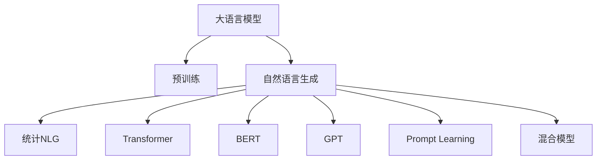
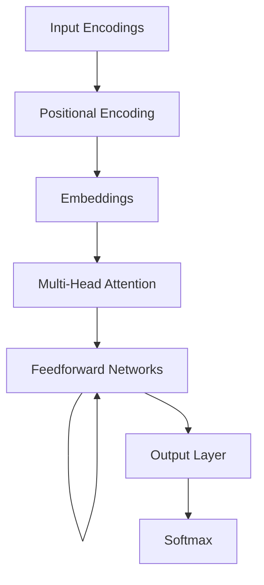

                 

# LLM与传统自然语言生成技术的对比与融合

> 关键词：大语言模型(LLM)、自然语言生成(NLG)、传统NLG技术、Transformer、BERT、GPT、Prompt Learning、混合模型

## 1. 背景介绍

在自然语言处理(NLP)领域，自然语言生成(NLG)技术一直是研究的热点。传统NLG技术基于规则或统计方法，可以生成结构化、格式化的文本。然而，随着深度学习和大数据技术的发展，基于神经网络的自然语言生成技术开始崭露头角，并在多个领域得到应用。尤其是大语言模型(LLM)的出现，更是引发了NLG技术的新一轮变革。

大语言模型是指通过大规模无标签文本数据进行预训练，学习到丰富的语言知识和表示，从而具备语言理解和生成能力的模型。与传统的统计NLG技术相比，LLM具有以下几个显著优势：

1. **自适应学习能力**：LLM可以自动适应新的语言现象和表达方式，不需要手工编写规则或模板。
2. **高质量语言生成**：通过大量的数据预训练，LLM可以生成高质量、流畅自然的文本。
3. **广泛的语言知识**：LLM不仅限于单一领域的知识，而是具备跨领域的广泛语言知识。
4. **高效开发**：通过微调技术，LLM可以快速适应特定领域和任务，极大降低了开发成本和周期。

目前，LLM已经在对话生成、文本摘要、机器翻译、问答系统等多个领域展示了其强大的能力。

## 2. 核心概念与联系

### 2.1 核心概念概述

- **大语言模型(LLM)**：以自回归(如GPT)或自编码(如BERT)模型为代表的大规模预训练语言模型。通过在大规模无标签文本语料上进行预训练，学习通用的语言表示，具备强大的语言理解和生成能力。

- **自然语言生成(NLG)**：利用计算模型将信息转换为自然语言文本的过程。传统NLG技术通常基于模板或统计语言模型，而LLM则通过神经网络模型进行生成。

- **Transformer**：一种基于自注意力机制的神经网络结构，广泛应用于深度学习领域，尤其是NLP任务。

- **BERT(Bidirectional Encoder Representations from Transformers)**：由Google提出的预训练语言模型，通过双向上下文表示，提升语言表示的质量。

- **GPT(Generative Pre-trained Transformer)**：由OpenAI提出的预训练语言模型，以自回归方式进行预训练和生成。

- **Prompt Learning**：通过精心设计输入文本的格式，引导LLM进行特定任务的推理和生成，无需更新模型参数。

- **混合模型**：将传统统计NLG技术和LLM进行融合，利用二者的优势，提升生成文本的质量和灵活性。

这些核心概念之间的逻辑关系可以通过以下Mermaid流程图来展示：



这个流程图展示了大语言模型与NLG技术的关键概念及其之间的关系：

1. 大语言模型通过预训练获得基础能力。
2. 自然语言生成技术利用模型进行文本生成。
3. 统计NLG技术通常基于模板和统计模型，而Transformer、BERT、GPT等基于神经网络的模型则是LLM的代表。
4. Prompt Learning是一种不更新模型参数的方法，可以实现少样本学习和零样本学习。
5. 混合模型是将传统NLG和LLM进行结合，取长补短。

## 3. 核心算法原理 & 具体操作步骤
### 3.1 算法原理概述

基于神经网络的自然语言生成技术主要分为两个步骤：预训练和微调。预训练通过大规模无标签数据学习通用的语言表示，微调则通过特定任务的少量标注数据进行模型适配，提升模型在该任务上的性能。

大语言模型通常采用自回归或自编码的方式进行预训练。自回归模型（如GPT）以单词为输入，前向计算得到下一个单词的概率分布。自编码模型（如BERT）通过掩码语言模型任务，预测被掩码的单词。

微调过程通常包括：
1. 选择预训练模型。
2. 添加任务适配层，如分类器、解码器等。
3. 设置微调超参数，如学习率、批大小、迭代轮数等。
4. 执行梯度训练，前向传播计算损失函数，反向传播更新参数。
5. 在验证集上评估模型性能，根据性能调整学习率等参数。
6. 在测试集上评估最终模型性能。

### 3.2 算法步骤详解

以下以GPT-2为例，详细说明基于神经网络的大语言模型微调步骤：

**Step 1: 准备预训练模型和数据集**

- 选择GPT-2作为预训练模型。
- 准备下游任务的标注数据集，如情感分类数据集。

**Step 2: 添加任务适配层**

- 在GPT-2的顶层添加线性分类器，将输出映射到标签空间。
- 定义交叉熵损失函数，计算模型预测和真实标签的差异。

**Step 3: 设置微调超参数**

- 设置AdamW优化器，学习率为1e-5。
- 设置批大小为32，迭代轮数为10。
- 使用Dropout正则化，防止过拟合。

**Step 4: 执行梯度训练**

- 将训练集数据分批次输入模型，前向传播计算损失函数。
- 反向传播计算参数梯度，根据AdamW更新模型参数。
- 周期性在验证集上评估模型性能，根据性能调整学习率。
- 重复上述步骤直至满足预设的迭代轮数或性能要求。

**Step 5: 测试和部署**

- 在测试集上评估微调后模型性能，对比微调前后的精度提升。
- 使用微调后的模型对新样本进行推理预测，集成到实际的应用系统中。

### 3.3 算法优缺点

基于神经网络的大语言模型微调方法具有以下优点：
1. 可以生成高质量、流畅自然的文本。
2. 可以适应多种下游任务，提升模型性能。
3. 利用预训练语言知识，快速开发新任务模型。
4. 可以处理多种语言，具备跨领域知识。

同时，该方法也存在一些局限性：
1. 依赖标注数据，对数据量要求较高。
2. 微调过程复杂，需要设置较多超参数。
3. 难以解释模型内部决策过程。
4. 训练和推理计算成本较高。

尽管存在这些局限性，但基于神经网络的大语言模型微调方法已经在多个NLP任务上取得了显著成效，成为当前NLG技术的重要范式。

### 3.4 算法应用领域

基于大语言模型微调的NLG技术，已经在多个领域得到了广泛应用，例如：

- **对话生成**：如智能客服、虚拟助手、智能写作等。通过微调生成对话文本，提升人机交互的自然性和流畅性。
- **文本摘要**：如新闻摘要、技术文档总结等。通过微调生成精炼的文本摘要，减少人工工作量。
- **机器翻译**：如跨语言交流、文档翻译等。通过微调生成高质量的翻译文本，突破语言障碍。
- **自然语言推理**：如问答系统、逻辑推理等。通过微调生成推理文本，提升问题解答的准确性。
- **文本生成**：如创意写作、诗歌创作等。通过微调生成富有创造力的文本内容，拓宽艺术创作的可能性。

除了上述这些经典任务外，基于大语言模型微调的NLG技术还在更多创新应用中得到探索，如代码生成、图像描述、视频解说等，为NLP技术带来了新的突破。

## 4. 数学模型和公式 & 详细讲解 & 举例说明

### 4.1 数学模型构建

基于神经网络的自然语言生成技术主要依赖于Transformer结构进行建模。以下是Transformer的结构示意图：



其中，输入编码层将原始文本转换为向量表示，位置编码层添加位置信息，嵌入层将向量映射到高维空间，多头注意力机制进行自注意力计算，前馈网络进行非线性变换，输出层进行线性映射，softmax层进行概率分布计算。

### 4.2 公式推导过程

以GPT-2为例，其生成过程可以表示为：

$$
\begin{aligned}
\text{Encoder Output} &= \text{Embedding}(\text{Input}) \times W_{emb} + \text{Positional Encoding} \\
\text{Attention Output} &= \text{Softmax}(\text{Encoder Output} \cdot \text{Attention Query}) \\
\text{Attention Weight} &= \text{Softmax}(\text{Attention Output} \cdot \text{Attention Key}) \\
\text{Attention Context} &= \text{Attention Output} \times \text{Attention Weight} \\
\text{Attention Context} &= \text{Attention Context} \cdot W_{att} + \text{Feedforward}(\text{Attention Context}) \\
\text{Decoder Output} &= \text{Softmax}(\text{Attention Context} \cdot W_{dec}) \\
\text{Next Word Probability} &= \text{Decoder Output} \cdot W_{out}
\end{aligned}
$$

其中，$\text{Embedding}$为嵌入层，$\text{Positional Encoding}$为位置编码，$\text{Softmax}$为softmax函数，$\text{Attention Query}$和$\text{Attention Key}$为注意力查询和注意力键，$\text{Attention Output}$和$\text{Attention Weight}$为注意力输出和注意力权重，$\text{Feedforward}$为前馈网络，$\text{W}_{emb}$、$\text{W}_{att}$、$\text{W}_{dec}$和$\text{W}_{out}$为可学习参数。

### 4.3 案例分析与讲解

以情感分类任务为例，假设输入文本为“I love this movie”，输出为“positive”。微调过程包括：

1. 输入文本经过嵌入层和位置编码，转换为向量表示。
2. 模型利用注意力机制计算上下文向量，通过前馈网络进行非线性变换。
3. 上下文向量经过输出层线性映射，得到logits向量。
4. 使用softmax函数计算logits向量对应的概率分布，得到每个标签的概率。
5. 选取概率最大的标签作为预测结果。

## 5. 项目实践：代码实例和详细解释说明

### 5.1 开发环境搭建

在进行微调实践前，我们需要准备好开发环境。以下是使用Python进行PyTorch开发的环境配置流程：

1. 安装Anaconda：从官网下载并安装Anaconda，用于创建独立的Python环境。

2. 创建并激活虚拟环境：
```bash
conda create -n pytorch-env python=3.8 
conda activate pytorch-env
```

3. 安装PyTorch：根据CUDA版本，从官网获取对应的安装命令。例如：
```bash
conda install pytorch torchvision torchaudio cudatoolkit=11.1 -c pytorch -c conda-forge
```

4. 安装Transformers库：
```bash
pip install transformers
```

5. 安装各类工具包：
```bash
pip install numpy pandas scikit-learn matplotlib tqdm jupyter notebook ipython
```

完成上述步骤后，即可在`pytorch-env`环境中开始微调实践。

### 5.2 源代码详细实现

下面我们以情感分类任务为例，给出使用Transformers库对GPT-2模型进行微调的PyTorch代码实现。

首先，定义情感分类任务的数据处理函数：

```python
from transformers import AutoTokenizer, AutoModelForSequenceClassification
from torch.utils.data import Dataset, DataLoader
import torch

class SentimentDataset(Dataset):
    def __init__(self, texts, labels):
        self.texts = texts
        self.labels = labels
        
    def __len__(self):
        return len(self.texts)
    
    def __getitem__(self, item):
        text = self.texts[item]
        label = self.labels[item]
        encoding = tokenizer(text, return_tensors='pt')
        return {'input_ids': encoding['input_ids'], 'attention_mask': encoding['attention_mask'], 'labels': torch.tensor(label, dtype=torch.long)}

tokenizer = AutoTokenizer.from_pretrained('gpt2')
model = AutoModelForSequenceClassification.from_pretrained('gpt2', num_labels=2)

device = torch.device('cuda') if torch.cuda.is_available() else torch.device('cpu')
model.to(device)
```

然后，定义训练和评估函数：

```python
from sklearn.metrics import accuracy_score
import torch.nn.functional as F

def train_epoch(model, dataset, batch_size, optimizer):
    model.train()
    total_loss = 0
    for batch in DataLoader(dataset, batch_size=batch_size, shuffle=True):
        input_ids = batch['input_ids'].to(device)
        attention_mask = batch['attention_mask'].to(device)
        labels = batch['labels'].to(device)
        optimizer.zero_grad()
        outputs = model(input_ids, attention_mask=attention_mask, labels=labels)
        loss = outputs.loss
        total_loss += loss.item()
        loss.backward()
        optimizer.step()
    return total_loss / len(dataset)

def evaluate(model, dataset, batch_size):
    model.eval()
    correct = 0
    total = 0
    for batch in DataLoader(dataset, batch_size=batch_size):
        input_ids = batch['input_ids'].to(device)
        attention_mask = batch['attention_mask'].to(device)
        labels = batch['labels'].to(device)
        with torch.no_grad():
            outputs = model(input_ids, attention_mask=attention_mask)
            logits = outputs.logits
            preds = logits.argmax(dim=1)
            correct += (preds == labels).sum().item()
            total += preds.size(0)
    accuracy = correct / total
    print(f'Accuracy: {accuracy:.2f}')
```

最后，启动训练流程并在测试集上评估：

```python
epochs = 5
batch_size = 16
learning_rate = 2e-5

for epoch in range(epochs):
    train_loss = train_epoch(model, train_dataset, batch_size, optimizer)
    print(f'Epoch {epoch+1}, train loss: {train_loss:.4f}')
    
    evaluate(model, dev_dataset, batch_size)

print('Test results:')
evaluate(model, test_dataset, batch_size)
```

以上就是使用PyTorch对GPT-2进行情感分类任务微调的完整代码实现。可以看到，得益于Transformers库的强大封装，我们可以用相对简洁的代码完成GPT-2模型的加载和微调。

### 5.3 代码解读与分析

让我们再详细解读一下关键代码的实现细节：

**SentimentDataset类**：
- `__init__`方法：初始化文本和标签。
- `__len__`方法：返回数据集的样本数量。
- `__getitem__`方法：对单个样本进行处理，将文本输入编码为token ids，将标签转换为标签张量。

**训练和评估函数**：
- 使用PyTorch的DataLoader对数据集进行批次化加载，供模型训练和推理使用。
- 训练函数`train_epoch`：对数据以批为单位进行迭代，在每个批次上前向传播计算损失函数并反向传播更新模型参数。
- 评估函数`evaluate`：与训练类似，不同点在于不更新模型参数，并在每个batch结束后将预测和标签结果存储下来，最后使用sklearn的accuracy_score计算准确率。

**训练流程**：
- 定义总的epoch数和batch size，开始循环迭代。
- 每个epoch内，先在训练集上训练，输出平均loss。
- 在验证集上评估，输出准确率。
- 所有epoch结束后，在测试集上评估，给出最终测试结果。

可以看到，PyTorch配合Transformers库使得GPT-2微调的代码实现变得简洁高效。开发者可以将更多精力放在数据处理、模型改进等高层逻辑上，而不必过多关注底层的实现细节。

## 6. 实际应用场景

### 6.1 对话生成

基于大语言模型的对话生成技术，可以广泛应用于智能客服、虚拟助手、智能写作等场景。传统客服往往需要配备大量人力，高峰期响应缓慢，且一致性和专业性难以保证。而使用基于GPT-2等模型进行微调的对话模型，可以7x24小时不间断服务，快速响应客户咨询，用自然流畅的语言解答各类常见问题。

在技术实现上，可以收集企业内部的历史客服对话记录，将问题和最佳答复构建成监督数据，在此基础上对预训练对话模型进行微调。微调后的对话模型能够自动理解用户意图，匹配最合适的答案模板进行回复。对于客户提出的新问题，还可以接入检索系统实时搜索相关内容，动态组织生成回答。如此构建的智能客服系统，能大幅提升客户咨询体验和问题解决效率。

### 6.2 文本摘要

基于大语言模型的文本摘要技术，可以广泛应用于新闻摘要、技术文档总结等场景。传统的文本摘要方法通常基于规则或统计方法，生成的摘要可能缺乏连贯性和自然性。而使用GPT-2等模型进行微调，可以生成高质量、流畅自然的摘要，减少人工工作量。

在技术实现上，可以收集大量文本摘要数据，标注出摘要位置和长度，在此基础上对预训练模型进行微调。微调后的模型能够自动识别出文本的关键信息和摘要位置，生成精炼的摘要。对于长文档，可以分段进行摘要，并结合全局信息生成更完整的摘要。

### 6.3 机器翻译

基于大语言模型的机器翻译技术，可以广泛应用于跨语言交流、文档翻译等场景。传统的机器翻译方法通常基于统计模型或神经网络模型，生成的翻译质量难以保证。而使用GPT-2等模型进行微调，可以生成高质量的翻译文本，突破语言障碍。

在技术实现上，可以收集双语语料，标注出源语言和目标语言的对应关系，在此基础上对预训练模型进行微调。微调后的模型能够自动学习源语言和目标语言之间的映射关系，生成流畅自然的翻译文本。对于长句子，可以分词翻译后再合并，保证翻译的准确性和连贯性。

### 6.4 未来应用展望

随着大语言模型和微调方法的不断发展，基于微调范式将在更多领域得到应用，为NLP技术带来新的突破。

在智慧医疗领域，基于微调的问答系统、病历分析、药物研发等应用将提升医疗服务的智能化水平，辅助医生诊疗，加速新药开发进程。

在智能教育领域，微调技术可应用于作业批改、学情分析、知识推荐等方面，因材施教，促进教育公平，提高教学质量。

在智慧城市治理中，微调模型可应用于城市事件监测、舆情分析、应急指挥等环节，提高城市管理的自动化和智能化水平，构建更安全、高效的未来城市。

此外，在企业生产、社会治理、文娱传媒等众多领域，基于大语言模型微调的人工智能应用也将不断涌现，为NLP技术带来更多的可能性。

## 7. 工具和资源推荐
### 7.1 学习资源推荐

为了帮助开发者系统掌握大语言模型微调的理论基础和实践技巧，这里推荐一些优质的学习资源：

1. 《Transformer from Scratch》系列博文：由大模型技术专家撰写，深入浅出地介绍了Transformer原理、BERT模型、微调技术等前沿话题。

2. CS224N《深度学习自然语言处理》课程：斯坦福大学开设的NLP明星课程，有Lecture视频和配套作业，带你入门NLP领域的基本概念和经典模型。

3. 《Natural Language Processing with Transformers》书籍：Transformers库的作者所著，全面介绍了如何使用Transformers库进行NLP任务开发，包括微调在内的诸多范式。

4. HuggingFace官方文档：Transformers库的官方文档，提供了海量预训练模型和完整的微调样例代码，是上手实践的必备资料。

5. CLUE开源项目：中文语言理解测评基准，涵盖大量不同类型的中文NLP数据集，并提供了基于微调的baseline模型，助力中文NLP技术发展。

通过对这些资源的学习实践，相信你一定能够快速掌握大语言模型微调的精髓，并用于解决实际的NLP问题。

### 7.2 开发工具推荐

高效的开发离不开优秀的工具支持。以下是几款用于大语言模型微调开发的常用工具：

1. PyTorch：基于Python的开源深度学习框架，灵活动态的计算图，适合快速迭代研究。大部分预训练语言模型都有PyTorch版本的实现。

2. TensorFlow：由Google主导开发的开源深度学习框架，生产部署方便，适合大规模工程应用。同样有丰富的预训练语言模型资源。

3. Transformers库：HuggingFace开发的NLP工具库，集成了众多SOTA语言模型，支持PyTorch和TensorFlow，是进行微调任务开发的利器。

4. Weights & Biases：模型训练的实验跟踪工具，可以记录和可视化模型训练过程中的各项指标，方便对比和调优。与主流深度学习框架无缝集成。

5. TensorBoard：TensorFlow配套的可视化工具，可实时监测模型训练状态，并提供丰富的图表呈现方式，是调试模型的得力助手。

6. Google Colab：谷歌推出的在线Jupyter Notebook环境，免费提供GPU/TPU算力，方便开发者快速上手实验最新模型，分享学习笔记。

合理利用这些工具，可以显著提升大语言模型微调任务的开发效率，加快创新迭代的步伐。

### 7.3 相关论文推荐

大语言模型和微调技术的发展源于学界的持续研究。以下是几篇奠基性的相关论文，推荐阅读：

1. Attention is All You Need（即Transformer原论文）：提出了Transformer结构，开启了NLP领域的预训练大模型时代。

2. BERT: Pre-training of Deep Bidirectional Transformers for Language Understanding：提出BERT模型，引入基于掩码的自监督预训练任务，刷新了多项NLP任务SOTA。

3. Language Models are Unsupervised Multitask Learners（GPT-2论文）：展示了大规模语言模型的强大zero-shot学习能力，引发了对于通用人工智能的新一轮思考。

4. Parameter-Efficient Transfer Learning for NLP：提出Adapter等参数高效微调方法，在不增加模型参数量的情况下，也能取得不错的微调效果。

5. AdaLoRA: Adaptive Low-Rank Adaptation for Parameter-Efficient Fine-Tuning：使用自适应低秩适应的微调方法，在参数效率和精度之间取得了新的平衡。

这些论文代表了大语言模型微调技术的发展脉络。通过学习这些前沿成果，可以帮助研究者把握学科前进方向，激发更多的创新灵感。

## 8. 总结：未来发展趋势与挑战

### 8.1 总结

本文对基于神经网络的大语言模型微调方法进行了全面系统的介绍。首先阐述了大语言模型和微调技术的研究背景和意义，明确了微调在拓展预训练模型应用、提升下游任务性能方面的独特价值。其次，从原理到实践，详细讲解了微调的数学模型和关键步骤，给出了微调任务开发的完整代码实例。同时，本文还广泛探讨了微调方法在多个行业领域的应用前景，展示了微调范式的巨大潜力。此外，本文精选了微调技术的各类学习资源，力求为读者提供全方位的技术指引。

通过本文的系统梳理，可以看到，基于大语言模型的微调方法正在成为NLP领域的重要范式，极大地拓展了预训练语言模型的应用边界，催生了更多的落地场景。受益于大规模语料的预训练，微调模型以更低的时间和标注成本，在小样本条件下也能取得不错的效果，有力推动了NLP技术的产业化进程。未来，伴随预训练语言模型和微调方法的持续演进，相信NLP技术将在更广阔的应用领域大放异彩，深刻影响人类的生产生活方式。

### 8.2 未来发展趋势

展望未来，大语言模型微调技术将呈现以下几个发展趋势：

1. 模型规模持续增大。随着算力成本的下降和数据规模的扩张，预训练语言模型的参数量还将持续增长。超大规模语言模型蕴含的丰富语言知识，有望支撑更加复杂多变的下游任务微调。

2. 微调方法日趋多样。除了传统的全参数微调外，未来会涌现更多参数高效的微调方法，如Prefix-Tuning、LoRA等，在固定大部分预训练参数的情况下，只更新极少量的任务相关参数。同时优化微调模型的计算图，减少前向传播和反向传播的资源消耗，实现更加轻量级、实时性的部署。

3. 持续学习成为常态。随着数据分布的不断变化，微调模型也需要持续学习新知识以保持性能。如何在不遗忘原有知识的同时，高效吸收新样本信息，将成为重要的研究课题。

4. 标注样本需求降低。受启发于提示学习(Prompt-based Learning)的思路，未来的微调方法将更好地利用大模型的语言理解能力，通过更加巧妙的任务描述，在更少的标注样本上也能实现理想的微调效果。

5. 多模态微调崛起。当前的微调主要聚焦于纯文本数据，未来会进一步拓展到图像、视频、语音等多模态数据微调。多模态信息的融合，将显著提升语言模型对现实世界的理解和建模能力。

6. 模型通用性增强。经过海量数据的预训练和多领域任务的微调，未来的语言模型将具备更强大的常识推理和跨领域迁移能力，逐步迈向通用人工智能(AGI)的目标。

以上趋势凸显了大语言模型微调技术的广阔前景。这些方向的探索发展，必将进一步提升NLP系统的性能和应用范围，为人类认知智能的进化带来深远影响。

### 8.3 面临的挑战

尽管大语言模型微调技术已经取得了瞩目成就，但在迈向更加智能化、普适化应用的过程中，它仍面临着诸多挑战：

1. 标注成本瓶颈。虽然微调大大降低了标注数据的需求，但对于长尾应用场景，难以获得充足的高质量标注数据，成为制约微调性能的瓶颈。如何进一步降低微调对标注样本的依赖，将是一大难题。

2. 模型鲁棒性不足。当前微调模型面对域外数据时，泛化性能往往大打折扣。对于测试样本的微小扰动，微调模型的预测也容易发生波动。如何提高微调模型的鲁棒性，避免灾难性遗忘，还需要更多理论和实践的积累。

3. 推理效率有待提高。大规模语言模型虽然精度高，但在实际部署时往往面临推理速度慢、内存占用大等效率问题。如何在保证性能的同时，简化模型结构，提升推理速度，优化资源占用，将是重要的优化方向。

4. 可解释性亟需加强。当前微调模型更像是"黑盒"系统，难以解释其内部工作机制和决策逻辑。对于医疗、金融等高风险应用，算法的可解释性和可审计性尤为重要。如何赋予微调模型更强的可解释性，将是亟待攻克的难题。

5. 安全性有待保障。预训练语言模型难免会学习到有偏见、有害的信息，通过微调传递到下游任务，产生误导性、歧视性的输出，给实际应用带来安全隐患。如何从数据和算法层面消除模型偏见，避免恶意用途，确保输出的安全性，也将是重要的研究课题。

6. 知识整合能力不足。现有的微调模型往往局限于任务内数据，难以灵活吸收和运用更广泛的先验知识。如何让微调过程更好地与外部知识库、规则库等专家知识结合，形成更加全面、准确的信息整合能力，还有很大的想象空间。

正视微调面临的这些挑战，积极应对并寻求突破，将是大语言模型微调走向成熟的必由之路。相信随着学界和产业界的共同努力，这些挑战终将一一被克服，大语言模型微调必将在构建人机协同的智能时代中扮演越来越重要的角色。

### 8.4 未来突破

面对大语言模型微调所面临的种种挑战，未来的研究需要在以下几个方面寻求新的突破：

1. 探索无监督和半监督微调方法。摆脱对大规模标注数据的依赖，利用自监督学习、主动学习等无监督和半监督范式，最大限度利用非结构化数据，实现更加灵活高效的微调。

2. 研究参数高效和计算高效的微调范式。开发更加参数高效的微调方法，在固定大部分预训练参数的同时，只更新极少量的任务相关参数。同时优化微调模型的计算图，减少前向传播和反向传播的资源消耗，实现更加轻量级、实时性的部署。

3. 融合因果和对比学习范式。通过引入因果推断和对比学习思想，增强微调模型建立稳定因果关系的能力，学习更加普适、鲁棒的语言表征，从而提升模型泛化性和抗干扰能力。

4. 引入更多先验知识。将符号化的先验知识，如知识图谱、逻辑规则等，与神经网络模型进行巧妙融合，引导微调过程学习更准确、合理的语言模型。同时加强不同模态数据的整合，实现视觉、语音等多模态信息与文本信息的协同建模。

5. 结合因果分析和博弈论工具。将因果分析方法引入微调模型，识别出模型决策的关键特征，增强输出解释的因果性和逻辑性。借助博弈论工具刻画人机交互过程，主动探索并规避模型的脆弱点，提高系统稳定性。

6. 纳入伦理道德约束。在模型训练目标中引入伦理导向的评估指标，过滤和惩罚有偏见、有害的输出倾向。同时加强人工干预和审核，建立模型行为的监管机制，确保输出符合人类价值观和伦理道德。

这些研究方向的探索，必将引领大语言模型微调技术迈向更高的台阶，为构建安全、可靠、可解释、可控的智能系统铺平道路。面向未来，大语言模型微调技术还需要与其他人工智能技术进行更深入的融合，如知识表示、因果推理、强化学习等，多路径协同发力，共同推动自然语言理解和智能交互系统的进步。只有勇于创新、敢于突破，才能不断拓展语言模型的边界，让智能技术更好地造福人类社会。

## 9. 附录：常见问题与解答

**Q1：大语言模型微调是否适用于所有NLP任务？**

A: 大语言模型微调在大多数NLP任务上都能取得不错的效果，特别是对于数据量较小的任务。但对于一些特定领域的任务，如医学、法律等，仅仅依靠通用语料预训练的模型可能难以很好地适应。此时需要在特定领域语料上进一步预训练，再进行微调，才能获得理想效果。此外，对于一些需要时效性、个性化很强的任务，如对话、推荐等，微调方法也需要针对性的改进优化。

**Q2：微调过程中如何选择合适的学习率？**

A: 微调的学习率一般要比预训练时小1-2个数量级，如果使用过大的学习率，容易破坏预训练权重，导致过拟合。一般建议从1e-5开始调参，逐步减小学习率，直至收敛。也可以使用warmup策略，在开始阶段使用较小的学习率，再逐渐过渡到预设值。需要注意的是，不同的优化器(如AdamW、Adafactor等)以及不同的学习率调度策略，可能需要设置不同的学习率阈值。

**Q3：采用大模型微调时会面临哪些资源瓶颈？**

A: 目前主流的预训练大模型动辄以亿计的参数规模，对算力、内存、存储都提出了很高的要求。GPU/TPU等高性能设备是必不可少的，但即便如此，超大批次的训练和推理也可能遇到显存不足的问题。因此需要采用一些资源优化技术，如梯度积累、混合精度训练、模型并行等，来突破硬件瓶颈。同时，模型的存储和读取也可能占用大量时间和空间，需要采用模型压缩、稀疏化存储等方法进行优化。

**Q4：如何缓解微调过程中的过拟合问题？**

A: 过拟合是微调面临的主要挑战，尤其是在标注数据不足的情况下。常见的缓解策略包括：
1. 数据增强：通过回译、近义替换等方式扩充训练集
2. 正则化：使用L2正则、Dropout、Early Stopping等避免过拟合
3. 对抗训练：引入对抗样本，提高模型鲁棒性
4. 参数高效微调：只调整少量参数(如Adapter、Prefix等)，减小过拟合风险
5. 多模型集成：训练多个微调模型，取平均输出，抑制过拟合

这些策略往往需要根据具体任务和数据特点进行灵活组合。只有在数据、模型、训练、推理等各环节进行全面优化，才能最大限度地发挥大模型微调的威力。

**Q5：微调模型在落地部署时需要注意哪些问题？**

A: 将微调模型转化为实际应用，还需要考虑以下因素：
1. 模型裁剪：去除不必要的层和参数，减小模型尺寸，加快推理速度
2. 量化加速：将浮点模型转为定点模型，压缩存储空间，提高计算效率
3. 服务化封装：将模型封装为标准化服务接口，便于集成调用
4. 弹性伸缩：根据请求流量动态调整资源配置，平衡服务质量和成本
5. 监控告警：实时采集系统指标，设置异常告警阈值，确保服务稳定性
6. 安全防护：采用访问鉴权、数据脱敏等措施，保障数据和模型安全

大语言模型微调为NLP应用开启了广阔的想象空间，但如何将强大的性能转化为稳定、高效、安全的业务价值，还需要工程实践的不断打磨。唯有从数据、算法、工程、业务等多个维度协同发力，才能真正实现人工智能技术在垂直行业的规模化落地。总之，微调需要开发者根据具体任务，不断迭代和优化模型、数据和算法，方能得到理想的效果。

---

作者：禅与计算机程序设计艺术 / Zen and the Art of Computer Programming

