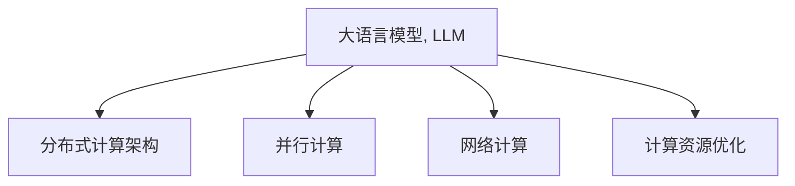

                 

# LLM与传统计算架构的根本差异

> 关键词：大语言模型(LLM), 传统计算架构, 计算模型, 分布式系统, 并行计算, 网络计算, 计算资源优化

## 1. 背景介绍

### 1.1 问题由来
随着人工智能技术的快速发展，大语言模型(LLM)逐渐成为NLP领域的新范式，其强大的语言理解和生成能力颠覆了传统机器学习的固有框架。然而，LLM的架构理念和运行机制与传统的计算架构截然不同，这对现有IT基础设施带来了诸多挑战。本文旨在探讨LLM与传统计算架构的根本差异，并提出未来计算架构的演进方向。

### 1.2 问题核心关键点
LLM的核心关键点在于其大规模并行训练和推理、高效分布式计算、算法优化以及计算资源的优化配置。与之相对，传统计算架构往往聚焦于单机的串行计算和有限的计算资源，难以应对LLM带来的巨大计算需求。

## 2. 核心概念与联系

### 2.1 核心概念概述

为更好理解LLM与传统计算架构的差异，本节将介绍几个关键概念：

- 大语言模型(LLM)：基于Transformer模型的大型预训练语言模型，如GPT-3、BERT等，具有强大的语言理解与生成能力。

- 分布式计算架构：通过将计算任务分配给多个节点，并行执行以提升计算效率的计算模式，如MapReduce、Spark等。

- 并行计算：指在多个处理器或计算机上同时执行同一份计算任务，以提升计算速度的计算方式，如CPU、GPU、TPU等。

- 网络计算：通过分布式计算环境中的数据共享和通信，提升计算任务的执行效率，如云计算、边缘计算等。

- 计算资源优化：通过算法优化和资源分配策略，提高计算任务的执行效率和资源利用率，如模型压缩、异构计算等。

这些概念之间的逻辑关系可以通过以下Mermaid流程图来展示：



这个流程图展示了大语言模型的核心概念及其与传统计算架构的关系：

1. LLM通过大规模并行训练和推理，具备强大的计算需求。
2. 分布式计算架构通过任务并行和节点协同，提供高效的计算能力。
3. 并行计算指通过多处理器执行同一任务，以提高计算速度。
4. 网络计算通过数据共享和通信，优化任务执行效率。
5. 计算资源优化旨在提升资源利用率和计算效率。

## 3. 核心算法原理 & 具体操作步骤

### 3.1 算法原理概述

LLM与传统计算架构的根本差异主要体现在其大规模并行计算和分布式计算的算法原理上。传统计算架构往往聚焦于单机的串行计算，难以处理LLM的巨大计算需求。LLM通过并行计算和分布式计算，实现高效的大规模训练和推理，其算法原理概述如下：

- 并行计算：通过将计算任务分解为多个子任务，同时分配给多个处理器执行，提高计算效率。

- 分布式计算：通过将数据和计算任务分布到多个节点，实现计算任务的并行执行，提升整体计算性能。

- 模型压缩：通过降低模型参数量和结构复杂度，减少计算资源消耗，提升计算效率。

- 异构计算：通过结合不同硬件设备的计算优势，优化计算任务执行效率，如GPU+TPU、CPU+GPU等。

### 3.2 算法步骤详解

以下是LLM与传统计算架构差异的具体操作步骤：

**Step 1: 数据准备与分治**
- 准备大规模预训练和微调数据集，分割成多个小的数据块。
- 使用分布式存储系统，如Hadoop、Ceph等，存储和管理数据块。

**Step 2: 模型划分与并行训练**
- 将大模型划分为多个子模型，每个子模型在各自的节点上进行训练。
- 使用多节点并行计算框架，如TensorFlow、PyTorch等，并行执行训练任务。

**Step 3: 参数同步与优化**
- 通过参数服务器或中心化调度器，同步不同节点上的模型参数。
- 使用异步优化算法，如SGD、Adam等，优化模型参数。

**Step 4: 模型评估与优化**
- 在多个节点上同时进行模型评估，获取评估结果。
- 根据评估结果，调整模型参数和训练策略，优化模型性能。

### 3.3 算法优缺点

LLM与传统计算架构相比，其优点主要在于：

- 强大的并行计算能力：能够处理大规模数据集，高效计算复杂的语言模型。
- 高计算效率：通过分布式计算和异构计算，实现资源优化和性能提升。
- 灵活扩展性：可以根据计算需求动态扩展计算节点，适应任务变化。

同时，LLM也存在一些缺点：

- 高计算成本：大规模计算需求对硬件和软件设施提出了高要求，需要巨额投资。
- 高数据传输开销：分布式计算需要大量数据传输，对网络带宽和延迟要求较高。
- 复杂管理难度：多节点、多任务的管理和调优较为复杂，容易出现故障和瓶颈。

### 3.4 算法应用领域

LLM与传统计算架构的差异在众多领域得到广泛应用，例如：

- 自然语言处理(NLP)：通过大规模并行训练和分布式计算，提升NLP模型的理解和生成能力，如翻译、摘要、情感分析等。
- 计算机视觉(CV)：使用并行计算和分布式计算，加速图像分类、目标检测、语义分割等任务的计算。
- 语音识别(SR)：通过多节点并行计算，提升语音识别模型的训练和推理效率。
- 生物信息学(Bioinformatics)：处理基因组、蛋白质序列等大规模数据集，加速生物学研究。
- 人工智能研究(AI Research)：利用并行计算和分布式计算，加速深度学习模型的训练和优化。

## 4. 数学模型和公式 & 详细讲解 & 举例说明

### 4.1 数学模型构建

LLM与传统计算架构的差异可以通过以下数学模型进行描述：

- 数据集划分：将数据集D划分为n个数据块D1,...,Dn，每个数据块大小为B。

- 并行训练：每个节点i在数据块Di上进行训练，更新参数θi。

- 参数同步：每个节点i的参数θi与主参数θ进行同步，以保证模型一致性。

- 损失函数：定义损失函数L(θ)，用于评估模型性能。

### 4.2 公式推导过程

设数据集D={(x1,y1),...,(xN,yN)}，模型参数θ=(θ1,...,θN)，损失函数L(θ)。

并行训练的损失函数可以表示为：

$$
L_{\text{par}}(\theta) = \frac{1}{n}\sum_{i=1}^n L_i(\theta_i)
$$

其中，$L_i(\theta_i)$ 为节点i在数据块Di上的损失函数。

节点间的参数同步可以表示为：

$$
\theta_i = \theta + \Delta\theta_i
$$

其中，$\Delta\theta_i$ 为节点i参数的更新量。

通过优化算法（如SGD）更新参数θ，最小化并行训练的损失函数，求解最优参数θ。

### 4.3 案例分析与讲解

以下以NLP任务为例，分析LLM与传统计算架构的差异。

**NLP任务的并行训练**
- 数据集D包含大量文本和标签数据，划分为n个数据块。
- 每个节点i在数据块Di上进行训练，使用自监督语言模型任务，如掩码语言模型(MLM)，优化模型参数θi。
- 通过节点间的数据共享和通信，同步不同节点上的参数θi，实现并行计算。

**NLP任务的分布式推理**
- 将大规模文本输入LLM模型，划分到多个节点进行并行推理。
- 通过节点间的数据共享和通信，将推理结果汇总，生成最终输出。

## 5. 项目实践：代码实例和详细解释说明

### 5.1 开发环境搭建

进行LLM与传统计算架构差异的实践，需要搭建高效的计算环境。以下是使用PyTorch进行NLP任务的开发环境配置流程：

1. 安装Anaconda：从官网下载并安装Anaconda，用于创建独立的Python环境。

2. 创建并激活虚拟环境：
```bash
conda create -n pytorch-env python=3.8 
conda activate pytorch-env
```

3. 安装PyTorch：根据CUDA版本，从官网获取对应的安装命令。例如：
```bash
conda install pytorch torchvision torchaudio cudatoolkit=11.1 -c pytorch -c conda-forge
```

4. 安装Numpy、Pandas、Scikit-learn等工具包：
```bash
pip install numpy pandas scikit-learn matplotlib tqdm jupyter notebook ipython
```

完成上述步骤后，即可在`pytorch-env`环境中开始NLP任务的开发。

### 5.2 源代码详细实现

以下以BERT模型为例，给出使用PyTorch进行并行训练的代码实现：

首先，定义并行训练的数据处理函数：

```python
from transformers import BertTokenizer, BertForTokenClassification, AdamW
import torch
import torch.distributed as dist
import torch.distributed.nn as dist_nn
import torch.multiprocessing as mp

# 数据处理函数
class DataLoader:
    def __init__(self, data_dir, tokenizer, batch_size, max_len, num_workers):
        # 数据处理相关参数
        ...

    def __iter__(self):
        # 数据迭代器
        ...

    def __len__(self):
        # 数据集长度
        ...
```

然后，定义模型和优化器：

```python
# 定义模型
model = BertForTokenClassification.from_pretrained('bert-base-cased', num_labels=num_labels)

# 定义优化器
optimizer = AdamW(model.parameters(), lr=2e-5)

# 初始化分布式通信
dist.init_process_group(backend='nccl', init_method='env://')
```

接着，定义训练和评估函数：

```python
# 定义训练函数
def train_epoch(model, data_loader, optimizer, rank, world_size):
    # 训练逻辑
    ...

# 定义评估函数
def evaluate(model, data_loader, rank, world_size):
    # 评估逻辑
    ...
```

最后，启动并行训练流程并在验证集上评估：

```python
# 定义训练和评估函数
def train_epoch(model, data_loader, optimizer, rank, world_size):
    # 训练逻辑
    ...

def evaluate(model, data_loader, rank, world_size):
    # 评估逻辑
    ...

# 启动并行训练
dist.spawn(train_epoch, args=(model, data_loader, optimizer, rank, world_size),
           nprocs=world_size, join=True)

# 在验证集上评估
evaluate(model, val_data_loader, rank, world_size)
```

以上就是使用PyTorch进行BERT模型并行训练的完整代码实现。可以看到，在PyTorch中通过`torch.distributed`模块，可以方便地实现多节点并行计算。

### 5.3 代码解读与分析

让我们再详细解读一下关键代码的实现细节：

**DataLoader类**：
- `__init__`方法：初始化数据集、分词器等关键组件。
- `__iter__`方法：对单个样本进行处理，将文本输入编码为token ids，将标签编码为数字，并对其进行定长padding，最终返回模型所需的输入。
- `__len__`方法：返回数据集的样本数量。

**并行训练与评估函数**：
- 使用PyTorch的`DataLoader`模块加载数据集，设置批大小、最大长度等参数。
- 定义训练函数`train_epoch`：对数据以批为单位进行迭代，在每个批次上前向传播计算loss并反向传播更新模型参数，最后返回该epoch的平均loss。
- 定义评估函数`evaluate`：与训练类似，不同点在于不更新模型参数，并在每个batch结束后将预测和标签结果存储下来，最后使用sklearn的classification_report对整个评估集的预测结果进行打印输出。
- 启动并行训练流程，使用`dist.spawn`函数，在多个进程中并行执行训练函数。

## 6. 实际应用场景

### 6.1 智能客服系统

基于大语言模型的智能客服系统，通过并行训练和分布式推理，可以处理大规模用户咨询请求，提高系统响应速度和处理效率。智能客服系统通过收集企业内部的历史客服对话记录，将问题和最佳答复构建成监督数据，在此基础上对BERT模型进行微调。微调后的模型能够自动理解用户意图，匹配最合适的答案模板进行回复。对于客户提出的新问题，还可以接入检索系统实时搜索相关内容，动态组织生成回答。如此构建的智能客服系统，能大幅提升客户咨询体验和问题解决效率。

### 6.2 金融舆情监测

金融机构需要实时监测市场舆论动向，以便及时应对负面信息传播，规避金融风险。使用大语言模型进行并行训练和分布式推理，可以在大规模数据集上进行高效的舆情监测。具体而言，可以收集金融领域相关的新闻、报道、评论等文本数据，并对其进行主题标注和情感标注。在此基础上对BERT模型进行微调，使其能够自动判断文本属于何种主题，情感倾向是正面、中性还是负面。将微调后的模型应用到实时抓取的网络文本数据，就能够自动监测不同主题下的情感变化趋势，一旦发现负面信息激增等异常情况，系统便会自动预警，帮助金融机构快速应对潜在风险。

### 6.3 个性化推荐系统

当前的推荐系统往往只依赖用户的历史行为数据进行物品推荐，无法深入理解用户的真实兴趣偏好。使用大语言模型进行并行训练和分布式推理，可以处理大规模数据集，提升推荐系统的个性化程度。在实践中，可以收集用户浏览、点击、评论、分享等行为数据，提取和用户交互的物品标题、描述、标签等文本内容。将文本内容作为模型输入，用户的后续行为（如是否点击、购买等）作为监督信号，在此基础上微调BERT模型。微调后的模型能够从文本内容中准确把握用户的兴趣点。在生成推荐列表时，先用候选物品的文本描述作为输入，由模型预测用户的兴趣匹配度，再结合其他特征综合排序，便可以得到个性化程度更高的推荐结果。

### 6.4 未来应用展望

随着大语言模型和并行计算技术的不断发展，基于并行训练和分布式推理的应用将更加广泛。

在智慧医疗领域，基于大语言模型的智能问答、病历分析、药物研发等应用将提升医疗服务的智能化水平，辅助医生诊疗，加速新药开发进程。

在智能教育领域，微调技术可应用于作业批改、学情分析、知识推荐等方面，因材施教，促进教育公平，提高教学质量。

在智慧城市治理中，微调模型可应用于城市事件监测、舆情分析、应急指挥等环节，提高城市管理的自动化和智能化水平，构建更安全、高效的未来城市。

此外，在企业生产、社会治理、文娱传媒等众多领域，基于大语言模型的微调方法也将不断涌现，为传统行业数字化转型升级提供新的技术路径。相信随着技术的日益成熟，大语言模型微调必将在构建人机协同的智能时代中扮演越来越重要的角色。

## 7. 工具和资源推荐

### 7.1 学习资源推荐

为了帮助开发者系统掌握大语言模型与传统计算架构的差异，这里推荐一些优质的学习资源：

1. 《Deep Learning Specialization》课程：由Coursera推出的深度学习课程，涵盖多种深度学习模型和算法，适合初学者入门。

2. CS231n《Convolutional Neural Networks for Visual Recognition》课程：斯坦福大学开设的计算机视觉课程，涵盖图像分类、目标检测等视觉任务。

3. 《Distributed Deep Learning》书籍：介绍分布式深度学习模型的开发和优化，适合深入学习分布式计算架构。

4. DeepLearning.AI《Distributed Deep Learning》课程：介绍分布式深度学习模型的开发和优化，涵盖多节点训练、数据共享等关键技术。

5. 《Reinforcement Learning: An Introduction》书籍：介绍强化学习算法和应用，适合了解分布式计算在智能系统中的应用。

通过对这些资源的学习实践，相信你一定能够快速掌握大语言模型与传统计算架构的差异，并用于解决实际的NLP问题。

### 7.2 开发工具推荐

高效的开发离不开优秀的工具支持。以下是几款用于大语言模型与传统计算架构差异开发的常用工具：

1. PyTorch：基于Python的开源深度学习框架，灵活动态的计算图，适合快速迭代研究。

2. TensorFlow：由Google主导开发的开源深度学习框架，生产部署方便，适合大规模工程应用。

3. Transformers库：HuggingFace开发的NLP工具库，集成了多种SOTA语言模型，支持并行计算和分布式推理。

4. Weights & Biases：模型训练的实验跟踪工具，可以记录和可视化模型训练过程中的各项指标，方便对比和调优。

5. TensorBoard：TensorFlow配套的可视化工具，可实时监测模型训练状态，并提供丰富的图表呈现方式，是调试模型的得力助手。

6. Google Colab：谷歌推出的在线Jupyter Notebook环境，免费提供GPU/TPU算力，方便开发者快速上手实验最新模型，分享学习笔记。

合理利用这些工具，可以显著提升大语言模型与传统计算架构差异的开发效率，加快创新迭代的步伐。

### 7.3 相关论文推荐

大语言模型与传统计算架构的演进源于学界的持续研究。以下是几篇奠基性的相关论文，推荐阅读：

1. Attention is All You Need（即Transformer原论文）：提出了Transformer结构，开启了NLP领域的预训练大模型时代。

2. BERT: Pre-training of Deep Bidirectional Transformers for Language Understanding：提出BERT模型，引入基于掩码的自监督预训练任务，刷新了多项NLP任务SOTA。

3. Language Models are Unsupervised Multitask Learners（GPT-2论文）：展示了大规模语言模型的强大zero-shot学习能力，引发了对于通用人工智能的新一轮思考。

4. Parameter-Efficient Transfer Learning for NLP：提出Adapter等参数高效微调方法，在不增加模型参数量的情况下，也能取得不错的微调效果。

5. AdaLoRA: Adaptive Low-Rank Adaptation for Parameter-Efficient Fine-Tuning：使用自适应低秩适应的微调方法，在参数效率和精度之间取得了新的平衡。

这些论文代表了大语言模型与传统计算架构的演进脉络。通过学习这些前沿成果，可以帮助研究者把握学科前进方向，激发更多的创新灵感。

## 8. 总结：未来发展趋势与挑战

### 8.1 总结

本文对基于大语言模型的并行训练和分布式推理与传统计算架构的根本差异进行了全面系统的介绍。首先阐述了大语言模型与传统计算架构的研究背景和意义，明确了并行训练和分布式推理在处理大规模计算任务中的独特价值。其次，从原理到实践，详细讲解了并行训练和分布式推理的数学原理和关键步骤，给出了并行训练任务的代码实例。同时，本文还广泛探讨了并行训练和分布式推理在多个行业领域的应用前景，展示了并行计算技术的广阔前景。此外，本文精选了并行训练和分布式推理的各类学习资源，力求为读者提供全方位的技术指引。

通过本文的系统梳理，可以看到，基于大语言模型的并行训练和分布式推理技术正在成为NLP领域的重要范式，极大地拓展了计算任务的执行边界，催生了更多的落地场景。得益于大规模数据的预训练和分布式计算的并行推理，大语言模型能够处理更复杂、更大的计算任务，为人工智能技术的发展带来了新的可能性。未来，伴随预训练语言模型和并行计算方法的持续演进，相信NLP技术将在更广阔的应用领域大放异彩，深刻影响人类的生产生活方式。

### 8.2 未来发展趋势

展望未来，大语言模型与传统计算架构的差异将呈现以下几个发展趋势：

1. 模型规模持续增大。随着算力成本的下降和数据规模的扩张，预训练语言模型的参数量还将持续增长。超大规模语言模型蕴含的丰富语言知识，有望支撑更加复杂多变的计算任务。

2. 并行计算和分布式计算的进一步优化。未来将涌现更多高效的并行计算和分布式计算算法，如混合精度计算、稀疏计算、异构计算等，进一步提升计算效率。

3. 实时计算和边缘计算的应用。随着5G、物联网等技术的普及，边缘计算将成为重要的计算模式，提升计算任务的实时性和效率。

4. 云-边协同计算。结合云计算和边缘计算的优势，构建更高效、灵活的计算环境，实现任务的动态扩展和资源优化。

5. 自动化和智能化管理。随着模型规模的增大，计算任务变得复杂，自动化和智能化管理成为关键。未来将涌现更多智能化的资源管理工具，优化计算任务执行。

6. 跨平台和跨模型的兼容性。未来的计算架构需要支持多种计算模型和硬件平台，实现跨平台和跨模型的兼容。

以上趋势凸显了大语言模型与传统计算架构的差异技术的广阔前景。这些方向的探索发展，必将进一步提升计算任务的执行效率和资源利用率，为人工智能技术的发展提供新的动力。

### 8.3 面临的挑战

尽管大语言模型与传统计算架构的差异技术已经取得了瞩目成就，但在迈向更加智能化、普适化应用的过程中，它仍面临着诸多挑战：

1. 高计算成本。超大规模语言模型的计算需求对硬件和软件设施提出了高要求，需要巨额投资。如何降低计算成本，提高资源利用率，将是重要的研究课题。

2. 高数据传输开销。分布式计算需要大量数据传输，对网络带宽和延迟要求较高。如何优化数据传输，提升数据共享效率，将是一大挑战。

3. 复杂管理难度。多节点、多任务的管理和调优较为复杂，容易出现故障和瓶颈。如何提高系统的稳定性和可维护性，将是重要的研究方向。

4. 安全性与隐私保护。大规模分布式计算存在数据泄露和隐私保护的风险。如何保障数据安全，保护用户隐私，将是一大难题。

5. 算法优化与性能提升。并行计算和分布式计算算法需要不断优化，以提高计算效率和资源利用率。如何优化算法，提升性能，将是一大挑战。

6. 系统协同与协作。不同计算任务之间的协同与协作，需要高效的通信和数据共享机制。如何优化系统协同，提升计算任务的整体性能，将是一大挑战。

这些挑战凸显了大语言模型与传统计算架构差异技术的复杂性和多样性。只有不断突破技术瓶颈，才能真正实现并行计算和分布式计算的广泛应用，推动人工智能技术的发展。

### 8.4 研究展望

面对大语言模型与传统计算架构差异技术所面临的种种挑战，未来的研究需要在以下几个方面寻求新的突破：

1. 探索高效的并行计算和分布式计算算法。开发更加高效的并行计算和分布式计算算法，如混合精度计算、稀疏计算、异构计算等，进一步提升计算效率。

2. 优化模型压缩与量化方法。通过模型压缩与量化，减少计算资源消耗，提升计算效率。

3. 引入更多先验知识。将符号化的先验知识，如知识图谱、逻辑规则等，与神经网络模型进行巧妙融合，引导并行计算和分布式计算过程学习更准确、合理的语言模型。

4. 融合因果分析和博弈论工具。将因果分析方法引入并行计算和分布式计算模型，识别出模型决策的关键特征，增强输出解释的因果性和逻辑性。借助博弈论工具刻画人机交互过程，主动探索并规避模型的脆弱点，提高系统稳定性。

5. 纳入伦理道德约束。在模型训练目标中引入伦理导向的评估指标，过滤和惩罚有偏见、有害的输出倾向。同时加强人工干预和审核，建立模型行为的监管机制，确保输出符合人类价值观和伦理道德。

这些研究方向的探索，必将引领大语言模型与传统计算架构差异技术的演进，推动人工智能技术的发展。只有勇于创新、敢于突破，才能不断拓展计算任务的执行边界，让智能技术更好地造福人类社会。

## 9. 附录：常见问题与解答

**Q1：大语言模型与传统计算架构有哪些根本差异？**

A: 大语言模型与传统计算架构的根本差异主要在于其大规模并行计算和分布式计算的算法原理上。传统计算架构往往聚焦于单机的串行计算，难以处理大语言模型的巨大计算需求。而大语言模型通过并行计算和分布式计算，实现高效的大规模训练和推理，其算法原理有以下几个关键点：

1. 并行计算：通过将计算任务分解为多个子任务，同时分配给多个处理器执行，提高计算效率。

2. 分布式计算：通过将数据和计算任务分布到多个节点，实现计算任务的并行执行，提升整体计算性能。

3. 模型压缩：通过降低模型参数量和结构复杂度，减少计算资源消耗，提升计算效率。

4. 异构计算：通过结合不同硬件设备的计算优势，优化计算任务执行效率，如GPU+TPU、CPU+GPU等。

**Q2：大语言模型并行计算的优势是什么？**

A: 大语言模型并行计算的优势主要在于以下几个方面：

1. 强大的并行计算能力：能够处理大规模数据集，高效计算复杂的语言模型。

2. 高计算效率：通过分布式计算和异构计算，实现资源优化和性能提升。

3. 灵活扩展性：可以根据计算需求动态扩展计算节点，适应任务变化。

4. 分布式推理：通过多节点并行推理，提升模型推理效率，支持大规模实时计算。

**Q3：并行计算和分布式计算的典型应用场景有哪些？**

A: 并行计算和分布式计算的典型应用场景包括：

1. 自然语言处理(NLP)：通过大规模并行训练和分布式推理，提升NLP模型的理解和生成能力，如翻译、摘要、情感分析等。

2. 计算机视觉(CV)：使用并行计算和分布式计算，加速图像分类、目标检测、语义分割等任务的计算。

3. 语音识别(SR)：通过多节点并行计算，提升语音识别模型的训练和推理效率。

4. 生物信息学(Bioinformatics)：处理基因组、蛋白质序列等大规模数据集，加速生物学研究。

5. 人工智能研究(AI Research)：利用并行计算和分布式计算，加速深度学习模型的训练和优化。

6. 推荐系统：通过分布式并行计算，处理大规模用户行为数据，提升推荐系统的个性化程度。

7. 大规模数据分析：处理海量数据集，加速数据分析和建模过程。

8. 智慧医疗：通过并行计算和分布式推理，提升医疗服务的智能化水平，辅助医生诊疗，加速新药开发进程。

**Q4：分布式计算中常见的通信方式有哪些？**

A: 分布式计算中常见的通信方式包括：

1. 数据传输：通过网络传输数据，实现节点间的数据共享。

2. 消息传递：通过消息传递协议，实现节点间的通信。

3. 直接通信：节点直接通过网络交换数据，如MPI（Message Passing Interface）。

4. 数据并行：通过分块、分布式存储，实现数据的并行读写和访问。

5. 计算并行：通过多处理器执行同一份计算任务，提高计算速度。

**Q5：如何优化并行计算和分布式计算的性能？**

A: 并行计算和分布式计算的性能优化可以从以下几个方面入手：

1. 数据分布与负载均衡：通过合理的数据分布和任务分配，避免计算节点负载不均，提升整体计算效率。

2. 通信优化：优化数据传输协议，减少通信开销，提升节点间通信效率。

3. 算法优化：设计高效的计算算法，减少计算冗余，提升计算效率。

4. 硬件优化：使用高性能硬件设备，如GPU、TPU等，提高计算效率。

5. 缓存机制：引入缓存机制，减少数据读写开销，提升计算效率。

6. 异步计算：通过异步计算，提高资源利用率和计算效率。

通过以上优化措施，可以显著提升并行计算和分布式计算的性能，为大规模计算任务提供高效的支持。

---

作者：禅与计算机程序设计艺术 / Zen and the Art of Computer Programming

