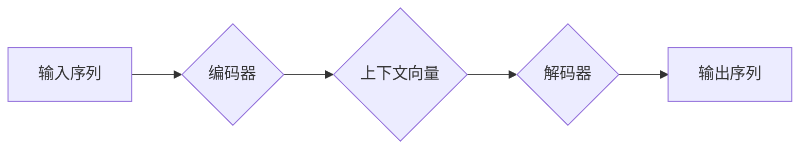

> Seq2Seq, 序列到序列, 自然语言处理, 机器翻译, 文本生成, 编码器-解码器, 注意力机制

## 1. 背景介绍

序列到序列（Seq2Seq）模型是一种强大的深度学习架构，能够处理输入序列并生成输出序列的任务。它在自然语言处理（NLP）领域取得了显著的成果，例如机器翻译、文本摘要、对话系统等。

传统的机器翻译方法通常依赖于统计模型和规则，难以捕捉语言的复杂性和语义关系。Seq2Seq模型的出现改变了这一局势，它利用神经网络的强大能力，能够学习语言的潜在结构和语义表示，从而实现更准确、更流畅的翻译。

## 2. 核心概念与联系

Seq2Seq模型的核心思想是将输入序列编码成一个固定长度的向量表示，然后解码该向量表示生成输出序列。

**架构图：**



**核心概念：**

* **编码器:** 负责将输入序列编码成一个上下文向量，该向量包含了输入序列的信息摘要。
* **解码器:** 负责根据上下文向量生成输出序列。
* **上下文向量:**  编码器输出的向量表示，包含了输入序列的信息摘要。

## 3. 核心算法原理 & 具体操作步骤

### 3.1  算法原理概述

Seq2Seq模型的核心算法是基于循环神经网络（RNN）的编码器-解码器架构。编码器使用RNN结构逐个处理输入序列，并生成一个上下文向量。解码器则使用RNN结构，根据上下文向量和已生成的输出序列，逐个生成输出序列。

### 3.2  算法步骤详解

1. **编码阶段:**
    * 将输入序列逐个输入编码器。
    * 编码器使用RNN结构，将每个单词的嵌入向量与之前隐藏状态进行计算，生成新的隐藏状态和输出向量。
    * 最后，编码器输出一个上下文向量，该向量包含了输入序列的信息摘要。

2. **解码阶段:**
    * 解码器首先使用编码器输出的上下文向量作为初始隐藏状态。
    * 解码器逐个生成输出序列。
    * 在每个时间步，解码器根据当前隐藏状态和已生成的输出序列，预测下一个单词的概率分布。
    * 选择概率最高的单词作为下一个输出单词。
    * 将下一个输出单词作为新的输入，更新解码器的隐藏状态。
    * 重复上述步骤，直到解码器生成结束标记。

### 3.3  算法优缺点

**优点:**

* 能够处理任意长度的输入和输出序列。
* 能够学习语言的复杂性和语义关系。
* 在机器翻译、文本摘要等任务中取得了显著的成果。

**缺点:**

* 训练时间长，需要大量的训练数据。
* 容易出现梯度消失或爆炸问题。
* 对于长序列的输入输出，性能可能下降。

### 3.4  算法应用领域

Seq2Seq模型在以下领域具有广泛的应用：

* **机器翻译:** 将一种语言翻译成另一种语言。
* **文本摘要:** 将长文本压缩成短文本摘要。
* **对话系统:** 建立人机对话系统。
* **问答系统:** 回答用户提出的问题。
* **文本生成:** 生成各种类型的文本，例如诗歌、小说、新闻报道等。

## 4. 数学模型和公式 & 详细讲解 & 举例说明

### 4.1  数学模型构建

Seq2Seq模型的数学模型可以概括为以下公式：

* **编码器输出:**  $h_t = f(x_t, h_{t-1})$
* **解码器输出:** $y_t = g(h_t, y_{t-1})$

其中：

* $x_t$ 是输入序列的第 $t$ 个单词的嵌入向量。
* $h_t$ 是编码器在第 $t$ 个时间步的隐藏状态。
* $y_t$ 是解码器在第 $t$ 个时间步生成的输出单词的概率分布。
* $f$ 和 $g$ 分别是编码器和解码器的激活函数。

### 4.2  公式推导过程

编码器和解码器的具体实现方式有很多种，常见的RNN结构包括LSTM和GRU。

* **LSTM (Long Short-Term Memory):** LSTM网络能够学习长期依赖关系，克服了传统RNN的梯度消失问题。
* **GRU (Gated Recurrent Unit):** GRU网络比LSTM网络结构更简单，但仍然能够有效地学习长期依赖关系。

### 4.3  案例分析与讲解

例如，在机器翻译任务中，输入序列是源语言的句子，输出序列是目标语言的句子。编码器将源语言句子编码成一个上下文向量，解码器根据上下文向量生成目标语言句子。

## 5. 项目实践：代码实例和详细解释说明

### 5.1  开发环境搭建

* Python 3.x
* TensorFlow 或 PyTorch
* CUDA 和 cuDNN (可选，用于GPU加速)

### 5.2  源代码详细实现

```python
import tensorflow as tf

# 定义编码器模型
class Encoder(tf.keras.Model):
    def __init__(self, vocab_size, embedding_dim, hidden_dim):
        super(Encoder, self).__init__()
        self.embedding = tf.keras.layers.Embedding(vocab_size, embedding_dim)
        self.lstm = tf.keras.layers.LSTM(hidden_dim)

    def call(self, inputs):
        embedded = self.embedding(inputs)
        output, state = self.lstm(embedded)
        return output, state

# 定义解码器模型
class Decoder(tf.keras.Model):
    def __init__(self, vocab_size, embedding_dim, hidden_dim):
        super(Decoder, self).__init__()
        self.embedding = tf.keras.layers.Embedding(vocab_size, embedding_dim)
        self.lstm = tf.keras.layers.LSTM(hidden_dim)
        self.dense = tf.keras.layers.Dense(vocab_size)

    def call(self, inputs, state):
        embedded = self.embedding(inputs)
        output, state = self.lstm(embedded, initial_state=state)
        output = self.dense(output)
        return output, state

# 实例化编码器和解码器模型
encoder = Encoder(vocab_size=10000, embedding_dim=128, hidden_dim=256)
decoder = Decoder(vocab_size=10000, embedding_dim=128, hidden_dim=256)

# 训练模型
# ...

```

### 5.3  代码解读与分析

* 编码器模型使用嵌入层将单词转换为向量表示，然后使用LSTM层进行编码。
* 解码器模型使用嵌入层将单词转换为向量表示，然后使用LSTM层进行解码。
* 编码器和解码器模型之间共享隐藏状态，从而实现序列到序列的映射。

### 5.4  运行结果展示

训练完成后，可以将模型应用于机器翻译任务，例如将英文句子翻译成中文句子。

## 6. 实际应用场景

Seq2Seq模型在以下实际应用场景中发挥着重要作用：

* **机器翻译:** Google Translate、DeepL 等机器翻译工具都使用了Seq2Seq模型。
* **文本摘要:**  新闻网站、学术期刊等平台使用Seq2Seq模型生成文本摘要。
* **对话系统:**  聊天机器人、虚拟助手等对话系统都使用了Seq2Seq模型进行对话生成。
* **问答系统:**  搜索引擎、知识问答平台等系统使用Seq2Seq模型回答用户提出的问题。

### 6.4  未来应用展望

随着深度学习技术的不断发展，Seq2Seq模型的应用场景将会更加广泛。例如，

* **个性化教育:**  根据学生的学习情况生成个性化的学习内容。
* **医疗诊断:**  根据患者的症状生成诊断建议。
* **法律文本分析:**  分析法律文本，生成法律意见。

## 7. 工具和资源推荐

### 7.1  学习资源推荐

* **书籍:**
    * 《深度学习》
    * 《自然语言处理》
* **在线课程:**
    * Coursera: 自然语言处理
    * Udacity: 深度学习

### 7.2  开发工具推荐

* **TensorFlow:**  开源深度学习框架。
* **PyTorch:**  开源深度学习框架。
* **Hugging Face Transformers:**  预训练模型库。

### 7.3  相关论文推荐

* **Seq2Seq Learning with Neural Networks**
* **Attention Is All You Need**

## 8. 总结：未来发展趋势与挑战

### 8.1  研究成果总结

Seq2Seq模型在自然语言处理领域取得了显著的成果，为机器翻译、文本摘要、对话系统等任务带来了革命性的改变。

### 8.2  未来发展趋势

* **更强大的模型架构:**  研究更强大的Seq2Seq模型架构，例如Transformer、T5等。
* **更有效的训练方法:**  研究更有效的训练方法，例如自监督学习、迁移学习等。
* **更广泛的应用场景:**  将Seq2Seq模型应用于更多领域，例如医疗、法律、教育等。

### 8.3  面临的挑战

* **数据稀缺:**  许多领域的数据稀缺，难以训练高质量的Seq2Seq模型。
* **计算资源:**  训练大型Seq2Seq模型需要大量的计算资源。
* **可解释性:**  Seq2Seq模型的决策过程难以解释，这限制了其在一些领域中的应用。

### 8.4  研究展望

未来，Seq2Seq模型的研究将继续朝着更强大、更有效、更可解释的方向发展。


## 9. 附录：常见问题与解答

* **Q: Seq2Seq模型的训练时间很长，有什么方法可以加速训练？**
* **A:** 可以使用GPU加速训练，还可以使用预训练模型进行微调。
* **Q: Seq2Seq模型容易出现梯度消失或爆炸问题，有什么方法可以解决？**
* **A:** 可以使用LSTM或GRU等能够学习长期依赖关系的RNN结构，也可以使用梯度裁剪等技术。
* **Q: Seq2Seq模型的输出结果不够流畅，有什么方法可以提高输出质量？**
* **A:** 可以使用注意力机制，让模型关注输入序列中与输出序列相关的部分。


作者：禅与计算机程序设计艺术 / Zen and the Art of Computer Programming 
<end_of_turn>