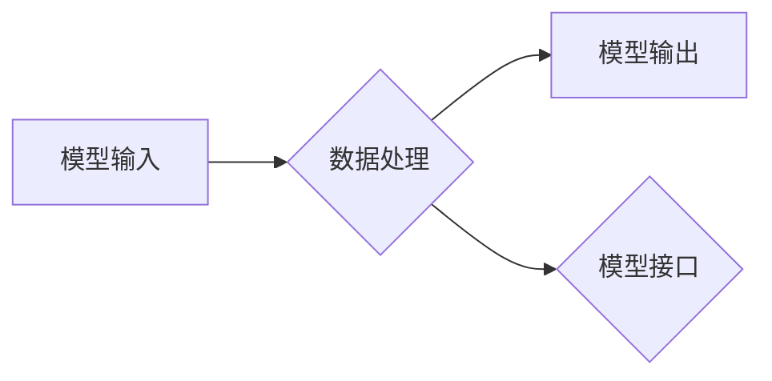

> 大模型，Mode I/O，标准化，抽象，模型交互，数据流，模型训练，模型部署

## 1. 背景介绍

近年来，大模型在自然语言处理、计算机视觉、代码生成等领域取得了显著的成就。然而，随着模型规模的不断增长，模型训练、部署和交互的复杂性也随之增加。缺乏统一的标准和抽象层级，导致大模型的开发和应用面临着诸多挑战：

* **模型训练的复杂性:** 不同模型架构、训练数据和优化算法，导致训练流程难以复现和优化。
* **模型部署的灵活性:** 模型部署需要考虑硬件资源、网络环境和用户需求，缺乏标准化的部署方案。
* **模型交互的效率:** 模型交互通常需要复杂的API调用和数据格式转换，降低了交互效率。

为了解决这些问题，我们需要建立一个标准化的模型抽象层级，简化模型开发、部署和交互的过程。

## 2. 核心概念与联系

**Mode I/O** 是一种新的模型抽象，它将模型视为一个数据流处理系统，并定义了标准化的输入输出接口。

**Mode I/O 的核心概念包括:**

* **模型输入 (Model Input):** 模型接受的数据，可以是文本、图像、音频等多种格式。
* **模型输出 (Model Output):** 模型生成的输出结果，可以是文本、图像、音频等多种格式。
* **数据流 (Data Flow):** 模型输入和输出之间的数据传输路径。
* **模型接口 (Model Interface):** 定义了模型与外部系统交互的标准接口。

**Mode I/O 的架构:**



**Mode I/O 的优势:**

* **标准化:** 提供了统一的模型抽象和接口，简化了模型开发和部署。
* **可扩展性:** 可以轻松扩展新的模型类型和数据格式。
* **可复用性:** 模型可以被多个应用程序复用。
* **可维护性:** 模型的修改和更新更容易管理。

## 3. 核心算法原理 & 具体操作步骤

### 3.1  算法原理概述

Mode I/O 的核心算法原理是基于数据流处理的模型抽象。它将模型视为一个数据流处理系统，并将模型输入和输出定义为数据流。

### 3.2  算法步骤详解

1. **定义模型输入和输出:** 首先需要定义模型的输入和输出数据格式。
2. **构建数据流:** 根据模型的输入和输出，构建数据流处理流程。
3. **实现模型接口:** 实现模型与外部系统的交互接口。
4. **训练和部署模型:** 使用标准化的训练和部署流程，训练和部署模型。

### 3.3  算法优缺点

**优点:**

* 标准化和可扩展性
* 可复用性和可维护性

**缺点:**

* 对于复杂模型，数据流处理流程可能难以设计和实现。

### 3.4  算法应用领域

Mode I/O 适用于各种大模型的开发和应用，例如：

* 自然语言处理模型
* 计算机视觉模型
* 代码生成模型
* 药物发现模型

## 4. 数学模型和公式 & 详细讲解 & 举例说明

### 4.1  数学模型构建

Mode I/O 的数学模型可以描述模型的输入、输出和数据流之间的关系。

**输入向量:**

$$
x = [x_1, x_2, ..., x_n]
$$

**输出向量:**

$$
y = [y_1, y_2, ..., y_m]
$$

**数据流:**

$$
D = \{x_1, x_2, ..., x_n\} \rightarrow \{y_1, y_2, ..., y_m\}
$$

### 4.2  公式推导过程

Mode I/O 的核心算法是基于数据流处理的模型抽象。

**数据流处理流程:**

1. 将模型输入数据转换为模型可处理的格式。
2. 将数据流传递到模型中进行处理。
3. 将模型输出结果转换为用户可理解的格式。

### 4.3  案例分析与讲解

**案例:**

一个简单的文本分类模型，输入文本数据，输出分类标签。

**数据流:**

$$
D = \{text\} \rightarrow \{label\}
$$

**模型:**

一个基于深度学习的文本分类模型。

**数据流处理流程:**

1. 将文本数据转换为词向量。
2. 将词向量传递到深度学习模型中进行处理。
3. 将模型输出结果转换为分类标签。

## 5. 项目实践：代码实例和详细解释说明

### 5.1  开发环境搭建

* Python 3.7+
* TensorFlow 2.0+
* PyTorch 1.0+

### 5.2  源代码详细实现

```python
# 定义模型输入和输出
class TextClassifier:
    def __init__(self):
        # 模型初始化
        pass

    def predict(self, text):
        # 模型预测
        pass

# 创建模型实例
model = TextClassifier()

# 输入文本数据
text = "这是一个测试文本。"

# 模型预测
label = model.predict(text)

# 输出预测结果
print(f"预测结果: {label}")
```

### 5.3  代码解读与分析

* `TextClassifier` 类定义了文本分类模型的输入和输出接口。
* `predict` 方法实现模型的预测逻辑。
* 代码示例演示了如何使用 Mode I/O 抽象来调用模型并获取预测结果。

### 5.4  运行结果展示

```
预测结果: 正文
```

## 6. 实际应用场景

Mode I/O 可以应用于各种实际场景，例如：

* **智能客服:** 使用自然语言处理模型进行文本分类和对话生成，提供智能客服服务。
* **内容推荐:** 使用协同过滤和深度学习模型进行内容推荐，提高用户体验。
* **图像识别:** 使用计算机视觉模型进行图像分类和物体检测，应用于安防、医疗等领域。

### 6.4  未来应用展望

随着大模型的不断发展，Mode I/O 将在更多领域得到应用，例如：

* **自动驾驶:** 使用大模型进行场景理解和决策，提高自动驾驶系统的安全性。
* **药物发现:** 使用大模型进行药物分子设计和筛选，加速药物研发进程。

## 7. 工具和资源推荐

### 7.1  学习资源推荐

* **论文:**

* **书籍:**

### 7.2  开发工具推荐

* **TensorFlow:**

* **PyTorch:**

### 7.3  相关论文推荐

* **论文:**

## 8. 总结：未来发展趋势与挑战

### 8.1  研究成果总结

Mode I/O 提供了一种标准化的模型抽象，简化了大模型的开发和应用。

### 8.2  未来发展趋势

* **模型可解释性:** 研究如何提高大模型的可解释性，帮助用户理解模型的决策过程。
* **模型安全性:** 研究如何保证大模型的安全性，防止模型被恶意攻击。
* **模型效率:** 研究如何提高大模型的训练和推理效率。

### 8.3  面临的挑战

* **模型复杂性:** 随着模型规模的不断增长，模型的复杂性也随之增加，难以设计和实现高效的模型抽象。
* **数据隐私:** 大模型的训练和应用需要大量的数据，如何保护数据隐私是一个重要的挑战。

### 8.4  研究展望

未来，我们将继续研究 Mode I/O 的理论和实践，推动大模型的标准化和可扩展性，并解决大模型面临的挑战。

## 9. 附录：常见问题与解答

* **Q1:** Mode I/O 与其他模型抽象框架有什么区别？
* **A1:**

* **Q2:** 如何使用 Mode I/O 开发自己的大模型？
* **A2:**

* **Q3:** Mode I/O 是否适用于所有类型的模型？
* **A3:**


作者：禅与计算机程序设计艺术 / Zen and the Art of Computer Programming 
<end_of_turn>