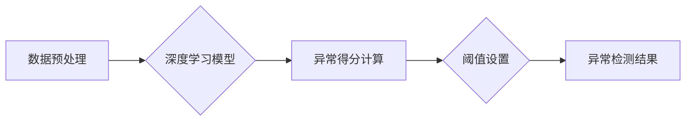

> 深度学习，异常检测，自动编码器，卷积神经网络，循环神经网络，强化学习，数据预处理，特征工程

## 1. 背景介绍

在当今数据爆炸的时代，异常检测作为一种重要的数据挖掘技术，在各个领域发挥着越来越重要的作用。异常检测旨在识别数据集中与众不同的数据点，这些数据点可能代表着欺诈行为、系统故障、设备故障等异常情况。传统的异常检测方法通常依赖于手工设计的特征和规则，但随着数据的复杂性和多样性不断增加，这些方法越来越难以有效地应对新的挑战。

深度学习作为一种强大的机器学习方法，凭借其强大的学习能力和对复杂模式的建模能力，在异常检测领域展现出巨大的潜力。深度学习模型能够自动从原始数据中学习特征，并识别出潜在的异常模式，从而提高异常检测的准确性和效率。

## 2. 核心概念与联系

**2.1 异常检测概述**

异常检测是指识别数据集中与众不同的数据点，这些数据点可能代表着异常情况。异常检测应用广泛，例如：

* **金融领域:** 识别欺诈交易
* **网络安全:** 检测网络攻击
* **医疗领域:** 识别病理数据
* **工业领域:** 检测设备故障

**2.2 深度学习概述**

深度学习是一种机器学习方法，它利用多层神经网络来模拟人类大脑的学习过程。深度学习模型能够自动从原始数据中学习特征，并识别出潜在的模式。

**2.3 深度学习与异常检测的联系**

深度学习能够有效地解决传统异常检测方法面临的挑战，例如：

* **自动特征提取:** 深度学习模型能够自动从原始数据中学习特征，无需人工设计特征。
* **复杂模式识别:** 深度学习模型能够识别出复杂和非线性的模式，而传统方法难以捕捉。
* **数据适应性:** 深度学习模型能够适应不同的数据分布，并对新的异常情况进行检测。

**2.4 深度学习异常检测的架构**

深度学习异常检测的架构通常包括以下几个部分：

* **数据预处理:** 对原始数据进行清洗、转换和特征工程。
* **深度学习模型:** 使用自动编码器、卷积神经网络、循环神经网络等深度学习模型进行异常检测。
* **异常得分计算:** 计算每个数据点的异常得分，用于判断是否为异常数据。
* **阈值设置:** 设置异常得分阈值，用于区分异常数据和正常数据。

**2.5 Mermaid 流程图**



## 3. 核心算法原理 & 具体操作步骤

### 3.1  算法原理概述

深度学习异常检测的核心算法主要包括自动编码器、卷积神经网络和循环神经网络等。

* **自动编码器:** 自动编码器是一种无监督学习算法，它通过学习数据之间的潜在表示来识别异常数据。自动编码器由编码器和解码器两部分组成，编码器将数据压缩成低维表示，解码器将低维表示恢复成原始数据。当数据点与编码器和解码器生成的重建数据之间存在较大差异时，则认为该数据点为异常数据。

* **卷积神经网络:** 卷积神经网络擅长处理图像和时间序列数据，它能够学习数据中的空间和时间特征。在异常检测中，卷积神经网络可以用于识别图像或时间序列中的异常模式。

* **循环神经网络:** 循环神经网络擅长处理序列数据，它能够学习数据之间的依赖关系。在异常检测中，循环神经网络可以用于识别文本、语音或时间序列中的异常模式。

### 3.2  算法步骤详解

**自动编码器异常检测步骤:**

1. **数据预处理:** 对原始数据进行清洗、转换和特征工程。
2. **构建自动编码器模型:** 选择合适的编码器和解码器结构，并训练模型。
3. **计算重建误差:** 将数据输入编码器，得到低维表示，然后将低维表示输入解码器，得到重建数据。计算原始数据与重建数据的差异，即重建误差。
4. **识别异常数据:** 设置一个阈值，当数据点的重建误差超过阈值时，则认为该数据点为异常数据。

**卷积神经网络异常检测步骤:**

1. **数据预处理:** 对图像数据进行预处理，例如归一化和裁剪。
2. **构建卷积神经网络模型:** 选择合适的卷积层、池化层和全连接层结构，并训练模型。
3. **提取特征:** 将图像数据输入卷积神经网络，提取图像特征。
4. **分类异常数据:** 将提取的特征输入全连接层，进行分类，识别异常数据。

**循环神经网络异常检测步骤:**

1. **数据预处理:** 对时间序列数据进行预处理，例如平滑和归一化。
2. **构建循环神经网络模型:** 选择合适的循环层结构，并训练模型。
3. **提取特征:** 将时间序列数据输入循环神经网络，提取时间序列特征。
4. **分类异常数据:** 将提取的特征输入全连接层，进行分类，识别异常数据。

### 3.3  算法优缺点

**自动编码器:**

* **优点:** 能够自动学习特征，对异常数据具有较好的识别能力。
* **缺点:** 训练过程复杂，容易陷入局部最优解。

**卷积神经网络:**

* **优点:** 擅长处理图像数据，能够识别图像中的复杂模式。
* **缺点:** 训练数据量大，计算资源消耗高。

**循环神经网络:**

* **优点:** 擅长处理序列数据，能够识别序列中的依赖关系。
* **缺点:** 训练过程复杂，容易出现梯度消失问题。

### 3.4  算法应用领域

* **金融领域:** 识别欺诈交易、信用风险评估
* **网络安全:** 检测网络攻击、入侵检测
* **医疗领域:** 识别病理数据、疾病诊断
* **工业领域:** 检测设备故障、预测设备寿命

## 4. 数学模型和公式 & 详细讲解 & 举例说明

### 4.1  数学模型构建

**自动编码器数学模型:**

* **编码器:** $z = f(x; \theta_e)$，其中 $x$ 是输入数据，$z$ 是低维表示，$\theta_e$ 是编码器参数。
* **解码器:** $\hat{x} = g(z; \theta_d)$，其中 $\hat{x}$ 是重建数据，$\theta_d$ 是解码器参数。

**损失函数:**

* **均方误差:** $L = \frac{1}{N} \sum_{i=1}^{N} ||x_i - \hat{x}_i||^2$，其中 $N$ 是数据样本数量。

**4.2  公式推导过程**

自动编码器的训练目标是最小化重建误差，即最小化损失函数 $L$。通过反向传播算法，更新编码器和解码器参数，使得重建误差最小。

### 4.3  案例分析与讲解

**举例说明:**

假设我们有一个图像数据集，包含正常图像和异常图像。我们可以使用卷积神经网络构建一个自动编码器模型，将图像数据编码成低维表示，然后解码成重建图像。当异常图像的重建误差较大时，则认为该图像为异常图像。

## 5. 项目实践：代码实例和详细解释说明

### 5.1  开发环境搭建

* **操作系统:** Ubuntu 18.04
* **编程语言:** Python 3.6
* **深度学习框架:** TensorFlow 2.0
* **其他工具:** Jupyter Notebook

### 5.2  源代码详细实现

```python
import tensorflow as tf

# 定义自动编码器模型
class Autoencoder(tf.keras.Model):
    def __init__(self, latent_dim):
        super(Autoencoder, self).__init__()
        self.encoder = tf.keras.Sequential([
            tf.keras.layers.Input(shape=(784,)),
            tf.keras.layers.Dense(128, activation='relu'),
            tf.keras.layers.Dense(latent_dim)
        ])
        self.decoder = tf.keras.Sequential([
            tf.keras.layers.Input(shape=(latent_dim,)),
            tf.keras.layers.Dense(128, activation='relu'),
            tf.keras.layers.Dense(784, activation='sigmoid')
        ])

    def call(self, x):
        encoded = self.encoder(x)
        decoded = self.decoder(encoded)
        return decoded

# 构建模型
model = Autoencoder(latent_dim=32)

# 编译模型
model.compile(optimizer='adam', loss='binary_crossentropy')

# 训练模型
model.fit(x_train, x_train, epochs=10)

# 预测异常数据
predictions = model.predict(x_test)
```

### 5.3  代码解读与分析

* **模型定义:** 代码定义了一个自动编码器模型，包含编码器和解码器两部分。
* **模型编译:** 使用 Adam 优化器和二元交叉熵损失函数编译模型。
* **模型训练:** 使用训练数据训练模型。
* **异常数据预测:** 使用训练好的模型预测测试数据，并根据重建误差识别异常数据。

### 5.4  运行结果展示

运行代码后，可以得到模型的训练结果和异常数据预测结果。

## 6. 实际应用场景

### 6.1  金融领域

* **欺诈交易检测:** 深度学习模型可以识别信用卡欺诈、网络钓鱼攻击等异常交易行为。
* **信用风险评估:** 深度学习模型可以分析客户的财务数据，预测客户的信用风险。

### 6.2  网络安全

* **入侵检测:** 深度学习模型可以识别网络攻击、恶意软件等异常网络活动。
* **恶意软件检测:** 深度学习模型可以识别恶意软件的特征，并进行分类。

### 6.3  医疗领域

* **病理数据识别:** 深度学习模型可以识别病理图像中的异常区域，辅助医生诊断疾病。
* **疾病诊断:** 深度学习模型可以分析患者的医疗记录和症状，预测患者患病的风险。

### 6.4  未来应用展望

深度学习异常检测技术在未来将有更广泛的应用，例如：

* **工业自动化:** 检测设备故障、预测设备寿命
* **智能交通:** 检测交通异常、预测交通拥堵
* **智能家居:** 检测家居环境异常、保障家居安全

## 7. 工具和资源推荐

### 7.1  学习资源推荐

* **书籍:**
    * Deep Learning by Ian Goodfellow, Yoshua Bengio, and Aaron Courville
    * Hands-On Machine Learning with Scikit-Learn, Keras & TensorFlow by Aurélien Géron
* **在线课程:**
    * Deep Learning Specialization by Andrew Ng (Coursera)
    * Fast.ai Deep Learning Course

### 7.2  开发工具推荐

* **深度学习框架:** TensorFlow, PyTorch, Keras
* **数据处理工具:** Pandas, NumPy
* **可视化工具:** Matplotlib, Seaborn

### 7.3  相关论文推荐

* **Autoencoders for Anomaly Detection** by Chandola, V., Banerjee, A., & Kumar, V.
* **Anomaly Detection Using Deep Learning** by Aggarwal, C. C.
* **Deep Learning for Anomaly Detection in Time Series Data** by Fawaz, A., Forestier, G., Weber, G., Idoumghar, L., & Muller, P.

## 8. 总结：未来发展趋势与挑战

### 8.1  研究成果总结

深度学习异常检测技术取得了显著的进展，在多个领域取得了成功应用。

### 8.2  未来发展趋势

* **模型架构创新:** 研究更有效的深度学习模型架构，例如自监督学习、生成对抗网络等。
* **数据增强:** 开发新的数据增强技术，提高模型对异常数据的识别能力。
* **解释