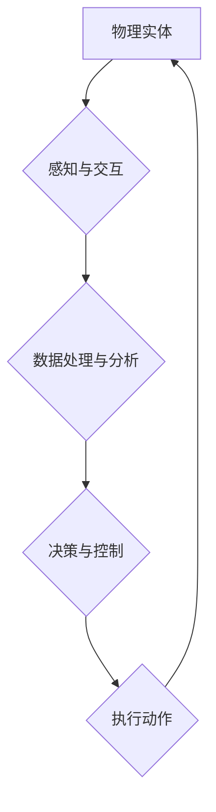

> 物理实体、自动化、机器学习、深度学习、计算机视觉、机器人技术、物联网、云计算、边缘计算

## 1. 背景介绍

随着人工智能 (AI) 技术的飞速发展，物理实体的自动化应用已成为一个备受关注的领域。从工业自动化到日常生活，自动化技术正在改变着我们与世界交互的方式。物理实体的自动化应用涵盖了广泛的领域，例如：

* **制造业:** 自动化生产线、机器人焊接、智能仓储管理
* **物流运输:** 自动驾驶车辆、无人配送机器人
* **医疗保健:** 机器人手术、智能诊断系统
* **农业:** 自动化播种、施肥、收割
* **家庭服务:** 智能家居设备、机器人清洁

这些应用都旨在提高效率、降低成本、增强安全性并创造新的价值。

## 2. 核心概念与联系

物理实体的自动化应用的核心概念包括：

* **物理实体:** 指可以感知和交互于物理世界的物体，例如机器、设备、车辆、机器人等。
* **自动化:** 指通过程序、算法和控制系统实现对物理实体的自动操作和控制。
* **人工智能:** 指赋予机器学习、推理、决策等智能能力的技术。

**核心概念架构:**



## 3. 核心算法原理 & 具体操作步骤

### 3.1  算法原理概述

物理实体的自动化应用通常依赖于以下核心算法：

* **机器学习:** 用于从数据中学习模式和规律，从而实现对物理实体的预测和控制。
* **深度学习:** 一种更高级的机器学习方法，能够处理更复杂的数据，例如图像、语音和文本。
* **计算机视觉:** 用于理解和解释图像和视频，从而使机器能够感知物理世界的视觉信息。
* **自然语言处理:** 用于理解和生成人类语言，从而使机器能够与人类进行自然交互。
* **机器人控制:** 用于控制机器人的运动和行为，使其能够完成特定的任务。

### 3.2  算法步骤详解

以机器学习为例，其核心步骤包括：

1. **数据收集:** 收集与物理实体相关的各种数据，例如传感器数据、图像数据、文本数据等。
2. **数据预处理:** 对收集到的数据进行清洗、转换和特征提取，使其适合机器学习算法的训练。
3. **模型选择:** 选择合适的机器学习算法，例如回归、分类、聚类等。
4. **模型训练:** 使用训练数据训练机器学习模型，使其能够学习到数据中的模式和规律。
5. **模型评估:** 使用测试数据评估模型的性能，并根据评估结果进行模型调优。
6. **模型部署:** 将训练好的模型部署到实际应用场景中，用于对物理实体进行自动化控制。

### 3.3  算法优缺点

**优点:**

* **自动化程度高:** 可以实现对物理实体的自动化控制，提高效率和降低成本。
* **适应性强:** 可以根据不同的应用场景和数据进行模型调整，提高适应性。
* **持续学习:** 可以通过不断收集新的数据进行模型更新，不断提高性能。

**缺点:**

* **数据依赖:** 需要大量的训练数据才能训练出有效的模型。
* **算法复杂:** 某些算法的实现和调优需要较高的技术水平。
* **安全风险:** 自动化系统存在安全风险，需要采取相应的安全措施。

### 3.4  算法应用领域

机器学习算法广泛应用于物理实体的自动化领域，例如：

* **工业自动化:** 自动化生产线、机器人焊接、智能质量检测
* **物流运输:** 自动驾驶车辆、无人配送机器人
* **医疗保健:** 机器人手术、智能诊断系统
* **农业:** 自动化播种、施肥、收割
* **家庭服务:** 智能家居设备、机器人清洁

## 4. 数学模型和公式 & 详细讲解 & 举例说明

### 4.1  数学模型构建

物理实体的自动化应用中，数学模型通常用于描述物理实体的行为、环境的特征以及控制策略。例如，在机器人控制领域，常用的数学模型包括：

* **运动学模型:** 描述机器人关节的运动关系，用于计算机器人末端执行器的位置和姿态。
* **动力学模型:** 描述机器人关节的运动和力学特性，用于计算机器人所需的驱动力矩。
* **状态空间模型:** 将机器人系统的状态和输入输出关系表示为一个数学方程组，用于分析和控制机器人系统。

### 4.2  公式推导过程

以机器人运动学模型为例，其核心公式为：

$$
\mathbf{x} = \mathbf{f}(\mathbf{q})
$$

其中：

* $\mathbf{x}$ 表示机器人末端执行器的位姿 (位置和姿态)。
* $\mathbf{q}$ 表示机器人关节的位角。
* $\mathbf{f}(\mathbf{q})$ 表示运动学方程，描述了关节位角与末端执行器位姿之间的关系。

该公式的推导过程通常涉及到几何学、线性代数和微积分等数学知识。

### 4.3  案例分析与讲解

假设一个简单的两关节机器人，其关节位角分别为 $q_1$ 和 $q_2$，末端执行器位于世界坐标系中。运动学模型可以表示为：

$$
\mathbf{x} = \begin{bmatrix}
x \\
y \\
\theta
\end{bmatrix} = \begin{bmatrix}
l_1 \cos(q_1) + l_2 \cos(q_1 + q_2) \\
l_1 \sin(q_1) + l_2 \sin(q_1 + q_2) \\
q_1 + q_2
\end{bmatrix}
$$

其中：

* $l_1$ 和 $l_2$ 分别为两条连杆的长度。
* $x$ 和 $y$ 分别为末端执行器的水平和垂直坐标。
* $\theta$ 为末端执行器的旋转角度。

通过该公式，我们可以计算出机器人末端执行器的位姿，并根据需要进行控制。

## 5. 项目实践：代码实例和详细解释说明

### 5.1  开发环境搭建

本项目使用 Python 语言进行开发，并依赖以下库：

* **NumPy:** 用于数值计算。
* **Matplotlib:** 用于数据可视化。
* **OpenCV:** 用于计算机视觉。
* **ROS (Robot Operating System):** 用于机器人开发。

### 5.2  源代码详细实现

以下代码示例演示了如何使用 OpenCV 库进行图像识别，并控制机器人手臂进行抓取操作：

```python
import cv2
import numpy as np

# 加载图像
image = cv2.imread("object.jpg")

# 使用 OpenCV 的 Haar Cascades 算法进行物体识别
face_cascade = cv2.CascadeClassifier(cv2.data.haarcascades + 'haarcascade_frontalface_default.xml')
faces = face_cascade.detectMultiScale(image, 1.3, 5)

# 如果检测到物体，控制机器人手臂进行抓取操作
if len(faces) > 0:
    # 计算物体中心坐标
    x, y, w, h = faces[0]
    center_x = x + w // 2
    center_y = y + h // 2

    # 控制机器人手臂抓取物体
    # ...

# 显示识别结果
cv2.imshow("Object Detection", image)
cv2.waitKey(0)
cv2.destroyAllWindows()
```

### 5.3  代码解读与分析

该代码首先使用 OpenCV 库加载图像，然后使用 Haar Cascades 算法进行物体识别。如果检测到物体，则计算物体中心坐标，并控制机器人手臂进行抓取操作。

### 5.4  运行结果展示

运行该代码后，将显示识别结果图像，并控制机器人手臂抓取物体。

## 6. 实际应用场景

### 6.1  工业自动化

在制造业中，物理实体的自动化应用可以提高生产效率、降低成本和提高产品质量。例如，机器人可以用于自动化焊接、喷涂、装配等任务，而智能传感器可以用于监控生产过程，及时发现问题并进行调整。

### 6.2  物流运输

无人驾驶车辆和无人配送机器人正在改变物流运输行业。无人驾驶车辆可以提高运输效率和安全性，而无人配送机器人可以用于在城市中进行短距离配送，缓解交通拥堵。

### 6.3  医疗保健

机器人手术、智能诊断系统和远程医疗等应用正在改变医疗保健行业。机器人手术可以提高手术精度和安全性，智能诊断系统可以帮助医生更快、更准确地诊断疾病，远程医疗可以使医疗服务更便捷地到达偏远地区。

### 6.4  未来应用展望

随着人工智能技术的发展，物理实体的自动化应用将更加广泛和深入。未来，我们可能会看到：

* 更智能、更灵活的机器人，能够适应更复杂的环境和任务。
* 更广泛的物联网应用，使更多物理实体能够连接起来，实现协同工作。
* 更个性化的服务，例如智能家居设备能够根据用户的需求进行个性化配置和控制。

## 7. 工具和资源推荐

### 7.1  学习资源推荐

* **Coursera:** 提供各种人工智能和机器学习课程。
* **Udacity:** 提供机器人技术和自动驾驶课程。
* **ROS Wiki:** ROS 的官方文档和教程。

### 7.2  开发工具推荐

* **ROS (Robot Operating System):** 用于机器人开发的开源平台。
* **Gazebo:** 用于机器人仿真和测试的开源软件。
* **TensorFlow:** 用于机器学习和深度学习的开源框架。

### 7.3  相关论文推荐

* **Deep Reinforcement Learning for Robotics**
* **End-to-End Learning for Robotics**
* **Transfer Learning for Robotics**

## 8. 总结：未来发展趋势与挑战

### 8.1  研究成果总结

物理实体的自动化应用取得了显著进展，人工智能技术为其提供了强大的支持。机器学习、深度学习、计算机视觉和机器人控制等技术已经应用于广泛的领域，取得了令人瞩目的成果。

### 8.2  未来发展趋势

未来，物理实体的自动化应用将朝着以下方向发展：

* **更智能、更灵活的机器人:** 机器人将更加智能、更加灵活，能够适应更复杂的环境和任务。
* **更广泛的物联网应用:** 物联网将更加广泛地应用于物理实体的自动化，使更多物理实体能够连接起来，实现协同工作。
* **更个性化的服务:** 物理实体的自动化将提供更加个性化的服务，例如智能家居设备能够根据用户的需求进行个性化配置和控制。

### 8.3  面临的挑战

物理实体的自动化应用也面临着一些挑战：

* **数据安全:** 物理实体的自动化应用需要处理大量的数据，数据安全是一个重要的挑战。
* **伦理问题:** 物理实体的自动化应用可能会引发一些伦理问题，例如机器人是否具有自主意识，如何确保机器人的行为符合人类的道德规范。
* **技术瓶颈:** 一些技术瓶颈，例如机器人运动控制、感知能力和决策能力，仍然需要进一步突破。

### 8.4  研究展望

未来，我们需要继续加强对物理实体的自动化应用的研究，解决上述挑战，并推动其健康、可持续发展。


## 9. 附录：常见问题与解答

**Q1: 物理实体的自动化应用有哪些风险？**

**A1:** 物理实体的自动化应用存在一些风险，例如安全风险、伦理风险和经济风险。

* **安全风险:** 自动化系统可能存在漏洞，被恶意攻击或意外故障，导致安全事故。
* **伦理风险:** 机器人可能做出违背人类道德规范的行为，例如伤害人类或侵犯隐私。
* **经济风险:** 自动化可能会导致大量失业，加剧社会不平等。

**Q2: 如何确保物理实体的自动化应用安全可靠？**

**A2:** 确保物理实体的自动化应用安全可靠需要采取多方面的措施，例如：

* **加强安全防护:** 对