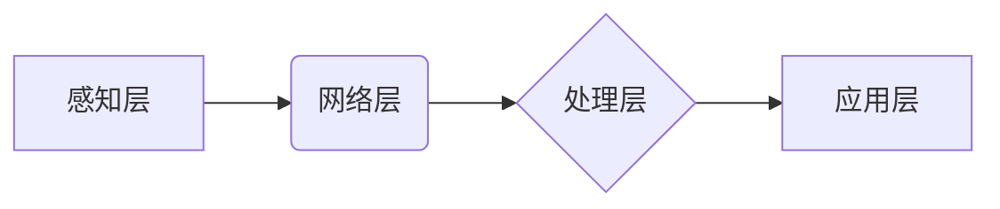

> 物联网(IoT)、传感器设备、系统集成、数据采集、数据处理、边缘计算、云计算、安全

## 1. 背景介绍

物联网(IoT)正以惊人的速度发展，它将物理世界与数字世界紧密连接，为我们带来前所未有的便利和效率。物联网的核心是传感器设备，它们能够感知环境变化并将其转换为数字信号，为数据采集和分析提供基础。然而，仅仅拥有传感器设备并不能构成完整的物联网系统。为了实现物联网的真正价值，需要将传感器设备与其他系统和服务进行有效集成，构建一个完整的物联网生态系统。

## 2. 核心概念与联系

**2.1 物联网(IoT)系统架构**

物联网系统通常由以下几个关键组件组成：

* **感知层:** 包含各种传感器设备，负责收集环境数据。
* **网络层:** 连接感知层和应用层，负责数据传输和通信。
* **处理层:** 对采集到的数据进行处理、分析和存储。
* **应用层:** 提供用户界面和应用服务，将数据转化为有价值的信息。

**2.2 传感器设备类型**

常见的传感器设备类型包括：

* **温度传感器:** 测量温度变化。
* **湿度传感器:** 测量空气湿度。
* **压力传感器:** 测量压力变化。
* **光照传感器:** 测量光照强度。
* **运动传感器:** 检测物体运动。

**2.3 系统集成原理**

系统集成是指将不同系统和组件组合在一起，形成一个整体，实现协同工作。在物联网系统中，系统集成主要涉及以下几个方面：

* **数据采集:** 将传感器设备采集到的数据传输到处理层。
* **数据处理:** 对采集到的数据进行清洗、转换、分析和存储。
* **数据传输:** 将处理后的数据传输到应用层或其他系统。
* **应用服务:** 提供用户界面和应用服务，将数据转化为有价值的信息。

**2.4 系统集成架构**

物联网系统集成架构可以采用多种方式，例如：

* **集中式架构:** 所有数据都集中到一个中心服务器进行处理。
* **分布式架构:** 数据在多个边缘设备上进行处理，并通过网络进行共享。
* **云计算架构:** 数据存储和处理在云端进行，边缘设备只负责数据采集和传输。

**Mermaid 流程图**



## 3. 核心算法原理 & 具体操作步骤

**3.1 算法原理概述**

在物联网系统中，数据处理是一个关键环节，需要采用高效的算法来处理海量数据，提取有价值的信息。常见的算法包括：

* **数据清洗:** 去除数据中的噪声、缺失值和重复值。
* **数据转换:** 将数据转换为适合分析的格式。
* **数据聚类:** 将数据按照相似性进行分组。
* **数据分类:** 将数据按照类别进行分类。
* **数据预测:** 根据历史数据预测未来趋势。

**3.2 算法步骤详解**

以数据清洗为例，其具体步骤如下：

1. **数据收集:** 从传感器设备收集原始数据。
2. **数据预处理:** 对数据进行格式转换、缺失值处理等预处理操作。
3. **数据清洗:** 使用算法去除数据中的噪声、重复值和异常值。
4. **数据验证:** 验证清洗后的数据是否满足要求。

**3.3 算法优缺点**

不同的算法具有不同的优缺点，需要根据实际应用场景选择合适的算法。例如，数据清洗算法的优缺点如下：

* **优点:** 可以提高数据质量，为后续分析提供可靠的数据基础。
* **缺点:** 需要消耗一定的计算资源，并且算法的选择需要根据数据特点进行调整。

**3.4 算法应用领域**

数据处理算法广泛应用于物联网的各个领域，例如：

* **智能家居:** 分析传感器数据，控制家电设备，实现智能家居功能。
* **智能交通:** 分析交通流量数据，优化交通信号灯控制，缓解交通拥堵。
* **工业自动化:** 分析生产设备数据，预测设备故障，提高生产效率。

## 4. 数学模型和公式 & 详细讲解 & 举例说明

**4.1 数学模型构建**

在物联网系统中，可以使用数学模型来描述系统行为和数据关系。例如，可以建立一个温度传感器模型，描述温度传感器输出电压与温度之间的关系。

**4.2 公式推导过程**

假设温度传感器输出电压与温度的关系为线性关系，可以表示为：

$$V = kT + b$$

其中：

* $V$ 是温度传感器输出电压
* $T$ 是温度
* $k$ 是温度系数
* $b$ 是偏置值

**4.3 案例分析与讲解**

假设温度传感器输出电压为 0.5V，温度系数为 0.01V/℃，偏置值为 0.0V。则可以根据公式计算温度：

$$T = (V - b) / k = (0.5V - 0.0V) / 0.01V/℃ = 50℃$$

因此，温度为 50℃。

## 5. 项目实践：代码实例和详细解释说明

**5.1 开发环境搭建**

* 操作系统: Ubuntu 20.04 LTS
* 编程语言: Python 3.8
* 开发工具: VS Code

**5.2 源代码详细实现**

```python
import RPi.GPIO as GPIO
import time

# 设置 GPIO 引脚
sensor_pin = 17

# 设置 GPIO 模式
GPIO.setmode(GPIO.BCM)
GPIO.setup(sensor_pin, GPIO.IN)

# 温度系数和偏置值
k = 0.01
b = 0.0

try:
    while True:
        # 读取传感器输出电压
        voltage = GPIO.input(sensor_pin)

        # 计算温度
        temperature = (voltage - b) / k

        # 打印温度
        print("Temperature: {:.2f}℃".format(temperature))

        # 延时
        time.sleep(1)

except KeyboardInterrupt:
    # 程序中断时清理 GPIO 引脚
    GPIO.cleanup()
```

**5.3 代码解读与分析**

* 代码首先导入必要的库，并设置 GPIO 引脚和模式。
* 然后，使用循环读取传感器输出电压，并根据公式计算温度。
* 最后，打印温度值，并使用 `time.sleep()` 函数实现延时。

**5.4 运行结果展示**

运行代码后，程序会持续读取传感器数据，并打印温度值。

## 6. 实际应用场景

物联网系统集成技术在各个领域都有广泛的应用场景，例如：

* **智能家居:** 通过传感器设备收集环境数据，实现智能照明、空调控制、安防监控等功能。
* **智慧城市:** 利用传感器设备监测城市环境，例如空气质量、交通流量、水资源利用等，为城市管理提供数据支持。
* **工业自动化:** 在生产过程中使用传感器设备监测设备状态、生产过程参数等，提高生产效率和产品质量。

**6.4 未来应用展望**

随着物联网技术的不断发展，系统集成技术将发挥越来越重要的作用。未来，物联网系统集成将更加智能化、自动化和平台化，并与人工智能、云计算等技术深度融合，为我们带来更加便捷、高效和智能的生活和工作体验。

## 7. 工具和资源推荐

**7.1 学习资源推荐**

* **书籍:**
    * 物联网技术入门
    * 物联网系统设计与实现
* **在线课程:**
    * Coursera: 物联网基础
    * edX: 物联网应用开发

**7.2 开发工具推荐**

* **物联网平台:**
    * AWS IoT Core
    * Azure IoT Hub
    * Google Cloud IoT Core
* **编程语言:**
    * Python
    * C++
    * Java

**7.3 相关论文推荐**

* 物联网系统集成技术研究进展
* 物联网数据处理与分析方法综述

## 8. 总结：未来发展趋势与挑战

**8.1 研究成果总结**

物联网系统集成技术已经取得了显著的进展，为物联网应用提供了坚实的基础。

**8.2 未来发展趋势**

* **边缘计算:** 将数据处理能力下沉到边缘设备，降低网络延迟和数据传输成本。
* **人工智能:** 将人工智能技术应用于物联网系统，实现智能感知、智能分析和智能决策。
* **区块链:** 利用区块链技术保障物联网数据的安全性和可信度。

**8.3 面临的挑战**

* **数据安全:** 物联网系统涉及大量敏感数据，需要采取有效的安全措施保障数据安全。
* **数据隐私:** 物联网系统收集的用户数据需要得到保护，需要制定相应的隐私政策和机制。
* **系统互操作性:** 不同厂商的物联网设备之间需要实现互操作性，需要制定统一的标准和协议。

**8.4 研究展望**

未来，物联网系统集成技术将继续朝着智能化、自动化和平台化的方向发展，并与人工智能、云计算等技术深度融合，为我们带来更加便捷、高效和智能的生活和工作体验。

## 9. 附录：常见问题与解答

**9.1 如何选择合适的传感器设备？**

选择传感器设备需要根据具体的应用场景和需求进行考虑，例如：

* **测量范围:** 传感器设备的测量范围是否满足应用需求。
* **精度:** 传感器设备的精度是否满足应用需求。
* **响应时间:** 传感器设备的响应时间是否满足应用需求。
* **功耗:** 传感器设备的功耗是否满足应用需求。

**9.2 如何实现物联网系统的安全？**

物联网系统的安全需要从多个方面进行考虑，例如：

* **设备认证:** 对物联网设备进行身份认证，防止未授权设备接入系统。
* **数据加密:** 对物联网数据进行加密，防止数据被窃取或篡改。
* **访问控制:** 对物联网系统进行访问控制，限制用户权限。
* **安全更新:** 定期更新物联网设备的固件和软件，修复安全漏洞。


作者：禅与计算机程序设计艺术 / Zen and the Art of Computer Programming 
<end_of_turn>