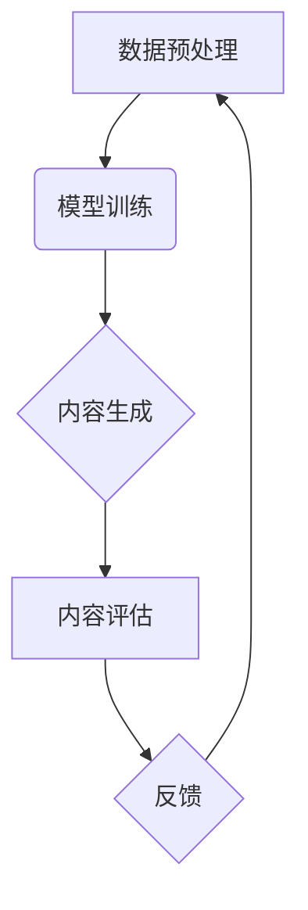

> 生成式AI, AIGC, 自然语言处理, 深度学习, Transformer, 文本生成, 图像生成, 商业应用

## 1. 背景介绍

近年来，人工智能（AI）技术取得了飞速发展，特别是生成式人工智能（AIGC）领域，展现出强大的潜力和应用前景。AIGC是指能够根据输入信息生成新内容的AI模型，例如文本、图像、音频、视频等。与传统的AI模型相比，AIGC更加注重创造性和创新性，能够突破人类的想象力，为人们带来全新的体验和价值。

AIGC技术的兴起，得益于以下几个关键因素：

* **深度学习算法的进步:** 深度学习算法，特别是Transformer模型的出现，为AIGC提供了强大的学习和生成能力。Transformer模型能够捕捉文本和图像中的长距离依赖关系，从而生成更加流畅、自然、高质量的内容。
* **海量数据量的积累:**  互联网时代，海量数据被不断生成和积累，为AIGC模型提供了充足的训练数据。
* **计算能力的提升:**  近年来，计算能力的飞速发展，使得训练大型AIGC模型成为可能。

## 2. 核心概念与联系

AIGC的核心概念包括：

* **生成模型:**  生成模型是一种能够从数据中学习并生成新数据的机器学习模型。
* **深度学习:**  深度学习是一种基于多层神经网络的机器学习方法，能够学习复杂的数据模式。
* **Transformer:**  Transformer是一种新型的深度学习架构，能够有效地处理序列数据，例如文本和图像。

AIGC的架构通常包括以下几个部分：

* **数据预处理:**  将原始数据进行清洗、格式化和转换，以便于模型训练。
* **模型训练:**  使用深度学习算法，例如Transformer模型，训练生成模型。
* **内容生成:**  将输入信息输入到训练好的生成模型中，生成新的内容。
* **内容评估:**  对生成的內容进行评估，例如流畅度、准确性、原创性等。



## 3. 核心算法原理 & 具体操作步骤

### 3.1  算法原理概述

AIGC的核心算法原理是基于深度学习的生成模型，例如Transformer模型。Transformer模型通过自注意力机制和多头注意力机制，能够捕捉文本和图像中的长距离依赖关系，从而生成更加流畅、自然、高质量的内容。

### 3.2  算法步骤详解

1. **数据预处理:** 将原始数据进行清洗、格式化和转换，例如将文本数据转换为词向量，将图像数据转换为像素矩阵。
2. **模型训练:** 使用深度学习算法，例如Transformer模型，训练生成模型。训练过程包括：
    * **输入数据:** 将预处理后的数据输入到模型中。
    * **前向传播:** 模型将输入数据进行处理，并输出预测结果。
    * **反向传播:** 计算模型预测结果与真实值的误差，并根据误差调整模型参数。
    * **优化:** 使用优化算法，例如Adam算法，更新模型参数。
3. **内容生成:** 将输入信息输入到训练好的生成模型中，模型会根据训练数据生成新的内容。

### 3.3  算法优缺点

**优点:**

* **生成高质量内容:**  AIGC模型能够生成高质量的文本、图像、音频等内容。
* **自动化内容创作:**  AIGC可以自动化内容创作，例如生成新闻报道、广告文案、产品描述等。
* **个性化内容定制:**  AIGC可以根据用户的需求生成个性化的内容，例如定制化新闻、个性化推荐等。

**缺点:**

* **数据依赖性强:**  AIGC模型的性能取决于训练数据的质量和数量。
* **伦理风险:**  AIGC可能被用于生成虚假信息、恶意内容等，存在伦理风险。
* **解释性差:**  AIGC模型的决策过程难以解释，缺乏透明度。

### 3.4  算法应用领域

AIGC技术在多个领域都有广泛的应用，例如：

* **内容创作:**  生成新闻报道、广告文案、产品描述、小说、诗歌等。
* **教育:**  生成个性化学习内容、自动批改作业、提供在线辅导等。
* **娱乐:**  生成游戏场景、电影剧本、音乐作品等。
* **商业:**  生成产品推荐、客户服务聊天机器人、营销文案等。

## 4. 数学模型和公式 & 详细讲解 & 举例说明

### 4.1  数学模型构建

AIGC模型通常基于深度学习框架，例如TensorFlow或PyTorch。这些框架提供了一系列预训练的模型和工具，可以方便地构建和训练AIGC模型。

### 4.2  公式推导过程

AIGC模型的训练过程涉及到许多数学公式，例如损失函数、优化算法等。这些公式的推导过程比较复杂，需要一定的数学基础。

### 4.3  案例分析与讲解

例如，在文本生成任务中，常用的损失函数是交叉熵损失函数。

$$
Loss = -\sum_{i=1}^{N} y_i \log(p_i)
$$

其中：

* $N$ 是文本长度
* $y_i$ 是真实标签
* $p_i$ 是模型预测的概率

## 5. 项目实践：代码实例和详细解释说明

### 5.1  开发环境搭建

AIGC模型的开发环境通常包括：

* **操作系统:**  Linux或Windows
* **编程语言:**  Python
* **深度学习框架:**  TensorFlow或PyTorch
* **GPU:**  用于加速模型训练

### 5.2  源代码详细实现

```python
import tensorflow as tf

# 定义模型结构
model = tf.keras.Sequential([
    tf.keras.layers.Embedding(input_dim=vocab_size, output_dim=embedding_dim),
    tf.keras.layers.LSTM(units=lstm_units),
    tf.keras.layers.Dense(units=vocab_size, activation='softmax')
])

# 编译模型
model.compile(optimizer='adam', loss='sparse_categorical_crossentropy', metrics=['accuracy'])

# 训练模型
model.fit(x_train, y_train, epochs=epochs)

# 生成文本
text = model.predict(x_test)
```

### 5.3  代码解读与分析

这段代码展示了如何使用TensorFlow框架构建一个简单的文本生成模型。

* `tf.keras.layers.Embedding`: 将词向量化，将每个词映射到一个向量空间。
* `tf.keras.layers.LSTM`: 使用LSTM网络捕捉文本中的长距离依赖关系。
* `tf.keras.layers.Dense`: 全连接层，输出每个词的概率分布。
* `model.compile`: 编译模型，指定优化器、损失函数和评价指标。
* `model.fit`: 训练模型，使用训练数据进行训练。
* `model.predict`: 使用训练好的模型生成文本。

### 5.4  运行结果展示

训练好的模型可以用于生成新的文本内容。例如，可以输入一个句子作为开头，模型会根据训练数据生成后续的句子。

## 6. 实际应用场景

### 6.1  新闻生成

AIGC可以自动生成新闻报道，例如从数据中提取关键信息，并自动生成新闻标题、正文和摘要。

### 6.2  广告文案创作

AIGC可以根据目标用户和产品信息，自动生成吸引人的广告文案。

### 6.3  产品描述生成

AIGC可以根据产品信息，自动生成详细的产品描述，帮助电商平台提高产品展示效果。

### 6.4  未来应用展望

AIGC技术的发展将带来更多新的应用场景，例如：

* **个性化教育:**  根据学生的学习进度和需求，生成个性化的学习内容。
* **虚拟助手:**  开发更加智能、人性化的虚拟助手，能够理解用户的自然语言指令，并提供更精准的帮助。
* **创意设计:**  辅助设计师进行创意设计，例如生成新的产品外观、服装款式等。

## 7. 工具和资源推荐

### 7.1  学习资源推荐

* **书籍:**
    * 《深度学习》
    * 《自然语言处理》
* **在线课程:**
    * Coursera
    * edX
* **博客和论坛:**
    * TensorFlow博客
    * PyTorch论坛

### 7.2  开发工具推荐

* **TensorFlow:**  开源深度学习框架
* **PyTorch:**  开源深度学习框架
* **Hugging Face:**  提供预训练的AIGC模型和工具

### 7.3  相关论文推荐

* **Attention Is All You Need:**  Transformer模型的论文
* **BERT: Pre-training of Deep Bidirectional Transformers for Language Understanding:**  BERT模型的论文
* **GPT-3: Language Models are Few-Shot Learners:**  GPT-3模型的论文

## 8. 总结：未来发展趋势与挑战

### 8.1  研究成果总结

AIGC技术取得了显著的进展，能够生成高质量的文本、图像、音频等内容。

### 8.2  未来发展趋势

* **模型规模和能力的提升:**  未来AIGC模型将更加强大，能够处理更复杂的任务，生成更逼真的内容。
* **多模态生成:**  AIGC模型将能够融合文本、图像、音频等多种模态信息，生成更加丰富、多样的内容。
* **个性化定制:**  AIGC将更加注重个性化定制，能够根据用户的需求生成更加符合其口味和偏好的内容。

### 8.3  面临的挑战

* **数据安全和隐私:**  AIGC模型的训练需要大量数据，如何保证数据安全和隐私是一个重要的挑战。
* **伦理风险:**  AIGC可能被用于生成虚假信息、恶意内容等，需要制定相应的伦理规范和监管机制。
* **可解释性:**  AIGC模型的决策过程难以解释，缺乏透明度，需要研究如何提高模型的可解释性。

### 8.4  研究展望

未来，AIGC技术将继续发展，为人们带来更多新的体验和价值。需要加强对AIGC技术的研发和应用，同时也要关注其带来的伦理风险和社会影响，确保其健康发展。

## 9. 附录：常见问题与解答

### 9.1  AIGC和传统AI的区别是什么？

传统AI通常是指基于规则或机器学习算法的AI系统，而AIGC是指能够生成新内容的AI系统。

### 9.2  AIGC技术有哪些应用场景？

AIGC技术在新闻生成、广告文案创作、产品描述生成、教育、娱乐等多个领域都有广泛的应用。

### 9.3  如何学习AIGC技术？

可以通过阅读相关书籍、在线课程、博客和论坛等方式学习AIGC技术。

### 9.4  AIGC技术有哪些伦理风险？

AIGC技术可能被用于生成虚假信息、恶意内容等，需要制定相应的伦理规范和监管机制。

### 9.5  AIGC技术的未来发展趋势是什么？

未来AIGC技术将更加强大，能够处理更复杂的任务，生成更逼真的内容。


作者：禅与计算机程序设计艺术 / Zen and the Art of Computer Programming 
<end_of_turn>