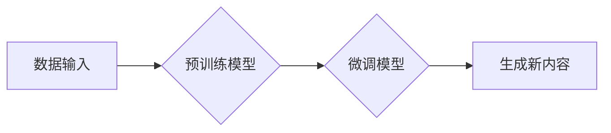

> 生成式AI，AIGC，自然语言处理，深度学习，Transformer，文本生成，图像生成，代码生成

## 1. 背景介绍

近年来，人工智能（AI）技术取得了飞速发展，其中生成式人工智能（Generative AI）作为其重要分支，展现出强大的潜力，引发了广泛的关注和研究。生成式AI是指能够根据输入数据生成新数据的AI模型，其应用场景涵盖文本、图像、音频、视频等多媒体领域。

传统的AI模型主要侧重于分类、识别等任务，而生成式AI则能够创造全新的内容，这使得其在创意设计、内容创作、科学研究等领域具有巨大的应用价值。例如，在文本生成领域，生成式AI可以用于自动撰写新闻报道、生成诗歌、翻译语言等；在图像生成领域，可以用于生成逼真的图像、设计海报、创作艺术作品等。

## 2. 核心概念与联系

**2.1 生成式AI的核心概念**

生成式AI的核心概念是学习数据中的模式和规律，并利用这些知识生成新的数据。它通常基于深度学习算法，例如生成对抗网络（GAN）、变分自编码器（VAE）和Transformer等。

**2.2 生成式AIGC的联系**

AIGC（AI-Generated Content）是指由人工智能技术生成的各种内容，包括文本、图像、音频、视频等。生成式AI是实现AIGC的关键技术，它为AIGC提供了强大的内容生成能力。

**2.3 生成式AI与数据的关系**

数据是生成式AI训练和运行的基础。高质量的数据能够帮助模型学习到更丰富的模式和规律，从而生成更优质的内容。

**2.4 生成式AI与算法的关系**

算法是生成式AI的核心，它决定了模型的学习方式和内容生成的方式。不同的算法具有不同的特点和优势，选择合适的算法对于生成高质量的内容至关重要。

**2.5 Mermaid 流程图**



## 3. 核心算法原理 & 具体操作步骤

### 3.1 算法原理概述

生成式AI的核心算法主要包括：

* **生成对抗网络（GAN）：** GAN由两个网络组成：生成器和判别器。生成器试图生成逼真的数据，而判别器试图区分真实数据和生成数据。两者相互竞争，最终生成器能够生成与真实数据相似的样本。
* **变分自编码器（VAE）：** VAE通过编码器将数据压缩成低维表示，然后通过解码器将低维表示恢复成原始数据。在训练过程中，VAE学习到数据的潜在结构，并能够根据潜在结构生成新的数据。
* **Transformer：** Transformer是一种基于注意力机制的深度学习模型，能够处理序列数据，例如文本和音频。Transformer在自然语言处理领域取得了突破性的进展，也应用于图像和音频生成领域。

### 3.2 算法步骤详解

以文本生成为例，使用Transformer模型进行文本生成，具体步骤如下：

1. **数据预处理：** 将文本数据进行清洗、分词、词嵌入等预处理操作，以便模型能够理解和处理数据。
2. **模型训练：** 使用预训练的Transformer模型，在文本数据上进行微调训练。训练过程中，模型学习到文本数据的语法结构、语义关系等知识。
3. **文本生成：** 在训练完成后，输入一个文本提示，模型根据训练得到的知识，生成新的文本内容。

### 3.3 算法优缺点

**GAN：**

* **优点：**能够生成逼真的数据，在图像生成领域取得了显著成果。
* **缺点：**训练过程比较复杂，容易出现模式崩溃问题。

**VAE：**

* **优点：**能够生成多样化的数据，并且能够控制生成数据的分布。
* **缺点：**生成的图像质量可能不如GAN。

**Transformer：**

* **优点：**能够处理长序列数据，在自然语言处理领域取得了突破性进展。
* **缺点：**训练成本较高，计算资源需求大。

### 3.4 算法应用领域

生成式AI算法广泛应用于以下领域：

* **文本生成：**自动撰写新闻报道、生成诗歌、翻译语言、聊天机器人等。
* **图像生成：**生成逼真的图像、设计海报、创作艺术作品等。
* **音频生成：**合成语音、生成音乐、制作音效等。
* **视频生成：**生成视频片段、制作动画等。

## 4. 数学模型和公式 & 详细讲解 & 举例说明

### 4.1 数学模型构建

**4.1.1 GAN模型数学模型**

GAN模型由两个网络组成：生成器G和判别器D。

* **生成器G：**输入随机噪声z，输出生成的数据样本x。

* **判别器D：**输入数据样本x，输出判断该样本是真实数据还是生成数据。

**4.1.2 VAE模型数学模型**

VAE模型由编码器E和解码器D组成。

* **编码器E：**输入数据样本x，输出低维表示z。

* **解码器D：**输入低维表示z，输出生成的数据样本x。

**4.1.3 Transformer模型数学模型**

Transformer模型的核心是注意力机制，它能够学习到序列数据之间的依赖关系。

* **注意力机制：**计算每个词与其他词之间的相关性，并根据相关性权重分配注意力。

### 4.2 公式推导过程

**4.2.1 GAN模型损失函数**

* **生成器损失函数：**

$$
L_G(G,D) = E_{x \sim p_{data}(x)}[log(1-D(G(z)))]
$$

* **判别器损失函数：**

$$
L_D(D,G) = E_{x \sim p_{data}(x)}[log(D(x))] + E_{z \sim p_z(z)}[log(1-D(G(z)))]
$$

**4.2.2 VAE模型损失函数**

$$
L_{VAE}(E,D) = KL(p(z|x)||q(z|x)) + E_{x \sim p_{data}(x)}[D(E(x),x)]
$$

其中：

* $KL$表示KL散度，用于衡量两个概率分布之间的差异。
* $p(z|x)$表示真实数据x对应的潜在表示z的概率分布。
* $q(z|x)$表示编码器E输出的潜在表示z的概率分布。

### 4.3 案例分析与讲解

**4.3.1 文本生成案例**

使用Transformer模型进行文本生成，例如生成一首诗歌。

**输入提示：** 秋天的落叶

**生成结果：**

> 秋风萧瑟叶飘零，
> 金黄满地染秋情。
> 落叶飘零舞翩跹，
> 诉说着岁月的流年。

**4.3.2 图像生成案例**

使用GAN模型生成一张逼真的猫的图像。

**输入：** 随机噪声

**生成结果：**

> 一只毛茸茸的猫咪图像

## 5. 项目实践：代码实例和详细解释说明

### 5.1 开发环境搭建

* **操作系统：** Linux/macOS
* **编程语言：** Python
* **深度学习框架：** TensorFlow/PyTorch
* **其他工具：** Git、Jupyter Notebook

### 5.2 源代码详细实现

以下是一个使用PyTorch实现文本生成的简单代码示例：

```python
import torch
import torch.nn as nn

class TextGenerator(nn.Module):
    def __init__(self, vocab_size, embedding_dim, hidden_dim):
        super(TextGenerator, self).__init__()
        self.embedding = nn.Embedding(vocab_size, embedding_dim)
        self.lstm = nn.LSTM(embedding_dim, hidden_dim)
        self.fc = nn.Linear(hidden_dim, vocab_size)

    def forward(self, x):
        embedded = self.embedding(x)
        output, (hidden, cell) = self.lstm(embedded)
        output = self.fc(output[:, -1, :])
        return output

# ... 模型训练和使用代码 ...
```

### 5.3 代码解读与分析

* **TextGenerator类：** 定义了文本生成模型的结构。
* **embedding层：** 将单词转换为向量表示。
* **lstm层：** 使用LSTM网络处理文本序列。
* **fc层：** 将LSTM输出转换为单词概率分布。

### 5.4 运行结果展示

训练完成后，可以输入一个文本提示，模型会根据训练得到的知识生成新的文本内容。

## 6. 实际应用场景

### 6.1 文本生成

* **新闻报道自动生成：** 根据事件数据自动生成新闻报道。
* **广告文案创作：** 根据产品信息自动生成广告文案。
* **聊天机器人对话：** 训练聊天机器人模型，使其能够进行自然流畅的对话。

### 6.2 图像生成

* **艺术作品创作：** 生成独特的艺术作品，例如绘画、雕塑等。
* **产品设计：** 根据设计需求自动生成产品原型。
* **图像修复：** 修复损坏的图像，例如修复老照片。

### 6.3 音频生成

* **语音合成：** 将文本转换为语音，用于语音助手、播报系统等。
* **音乐创作：** 生成新的音乐作品，例如旋律、伴奏等。
* **音效制作：** 生成各种音效，用于游戏、电影等。

### 6.4 未来应用展望

* **个性化内容生成：** 根据用户的喜好生成个性化的内容，例如新闻推荐、个性化广告等。
* **虚拟现实和增强现实：** 生成虚拟场景和增强现实内容，例如虚拟人物、虚拟环境等。
* **科学研究：** 在药物研发、材料设计等领域加速科学研究。

## 7. 工具和资源推荐

### 7.1 学习资源推荐

* **书籍：**
    * 《深度学习》
    * 《生成对抗网络》
    * 《Transformer模型》
* **在线课程：**
    * Coursera
    * edX
    * Udacity

### 7.2 开发工具推荐

* **深度学习框架：** TensorFlow、PyTorch
* **编程语言：** Python
* **云计算平台：** AWS、Google Cloud、Azure

### 7.3 相关论文推荐

* **Generative Adversarial Networks**
* **Attention Is All You Need**
* **Variational Autoencoders for Generation**

## 8. 总结：未来发展趋势与挑战

### 8.1 研究成果总结

近年来，生成式AI取得了显著进展，在文本、图像、音频等多媒体领域展现出强大的潜力。

### 8.2 未来发展趋势

* **模型规模和能力提升：** 模型规模不断扩大，模型能力不断提升，能够生成更高质量、更复杂的内容。
* **多模态生成：** 将文本、图像、音频等多种模态数据融合，实现多模态内容的生成。
* **个性化生成：** 根据用户的喜好和需求，生成个性化的内容。
* **伦理和安全问题：** 随着生成式AI技术的进步，伦理和安全问题也日益突出，需要加强研究和监管。

### 8.3 面临的挑战

* **数据质量和可用性：** 生成式AI模型依赖于高质量的数据，数据质量和可用性是制约模型性能的关键因素。
* **计算资源需求：** 训练大型生成式AI模型需要大量的计算资源，成本较高。
* **伦理和安全问题：** 生成式AI技术可能被用于生成虚假信息、恶意内容等，需要加强伦理和安全方面的研究和监管。

### 8.4 研究展望

未来，生成式AI技术将继续发展，在更多领域发挥重要作用。需要加强基础研究，解决技术难题，并关注伦理和安全问题