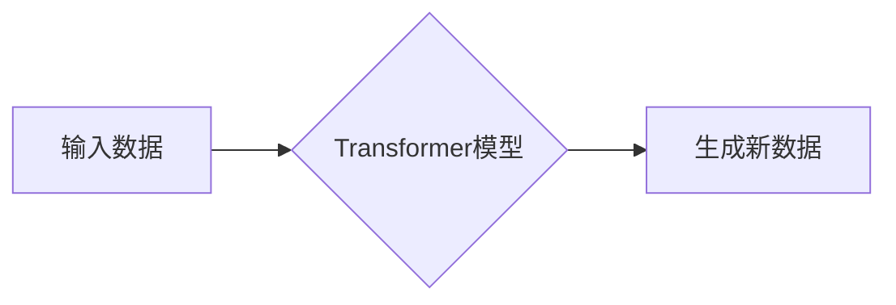

> 生成式AI、Transformer模型、自然语言处理、图像生成、代码生成、文本摘要、机器翻译、创作辅助工具

## 1. 背景介绍

近年来，人工智能（AI）领域取得了令人瞩目的进展，其中生成式AI作为一类重要的AI应用，展现出强大的潜力，正在深刻地改变着我们生活和工作方式。生成式AI是指能够根据输入数据生成新内容的AI模型，例如文本、图像、音频、视频等。与传统的AI模型相比，生成式AI更加注重创造性和表达能力，能够生成具有原创性和艺术性的内容。

生成式AI技术的兴起与深度学习技术的进步密不可分。特别是Transformer模型的出现，为生成式AI的发展带来了革命性的变革。Transformer模型能够有效地捕捉文本中的长距离依赖关系，从而生成更流畅、更自然的文本内容。

## 2. 核心概念与联系

**2.1 生成式AI的核心概念**

生成式AI的核心概念是学习数据分布，并根据学习到的分布生成新的数据。

**2.2 生成式AI与Transformer模型的联系**

Transformer模型是生成式AI领域中一种非常重要的模型架构。它通过自注意力机制（Self-Attention）有效地捕捉文本中的长距离依赖关系，从而能够生成更流畅、更自然的文本内容。

**2.3 生成式AI的应用场景**

生成式AI的应用场景非常广泛，包括：

* **自然语言处理（NLP）：** 文本生成、机器翻译、文本摘要、对话系统等。
* **计算机视觉（CV）：** 图像生成、图像编辑、图像风格迁移等。
* **音频处理：** 音频合成、语音识别、音乐生成等。
* **代码生成：** 自动生成代码、代码补全、代码翻译等。

**2.4 Mermaid 流程图**



## 3. 核心算法原理 & 具体操作步骤

**3.1 算法原理概述**

Transformer模型的核心是自注意力机制（Self-Attention）。自注意力机制能够学习文本中每个词与其他词之间的关系，从而捕捉长距离依赖关系。

**3.2 算法步骤详解**

1. **词嵌入（Word Embedding）：** 将每个词转换为一个向量表示。
2. **多头自注意力（Multi-Head Self-Attention）：** 对每个词进行多头自注意力计算，学习每个词与其他词之间的关系。
3. **前馈神经网络（Feed-Forward Neural Network）：** 对每个词的注意力输出进行非线性变换。
4. **位置编码（Positional Encoding）：** 为每个词添加位置信息，因为Transformer模型没有循环结构，无法捕捉词序信息。
5. **堆叠Transformer层（Stacked Transformer Layers）：** 将多个Transformer层堆叠在一起，形成深层网络。
6. **输出层（Output Layer）：** 将最终的隐藏状态转换为目标输出，例如文本、图像等。

**3.3 算法优缺点**

**优点：**

* 能够有效地捕捉长距离依赖关系。
* 训练速度快，收敛性好。
* 能够处理不同类型的输入数据，例如文本、图像等。

**缺点：**

* 计算量大，需要大量的计算资源。
* 参数量大，容易过拟合。

**3.4 算法应用领域**

* **自然语言处理（NLP）：** 机器翻译、文本摘要、对话系统、问答系统等。
* **计算机视觉（CV）：** 图像分类、目标检测、图像生成等。
* **音频处理：** 语音识别、语音合成、音乐生成等。

## 4. 数学模型和公式 & 详细讲解 & 举例说明

**4.1 数学模型构建**

Transformer模型的数学模型主要包括以下几个部分：

* **词嵌入层（Word Embedding Layer）：** 将每个词转换为一个向量表示。
* **多头自注意力层（Multi-Head Self-Attention Layer）：** 计算每个词与其他词之间的关系。
* **前馈神经网络层（Feed-Forward Neural Network Layer）：** 对每个词的注意力输出进行非线性变换。
* **位置编码层（Positional Encoding Layer）：** 为每个词添加位置信息。

**4.2 公式推导过程**

* **词嵌入层：**

$$
\mathbf{x}_i = \mathbf{W}_e \mathbf{v}_i
$$

其中，$\mathbf{x}_i$ 是词 $i$ 的嵌入向量，$\mathbf{v}_i$ 是词 $i$ 的词向量，$\mathbf{W}_e$ 是词嵌入矩阵。

* **多头自注意力层：**

$$
\mathbf{Attention}(\mathbf{Q}, \mathbf{K}, \mathbf{V}) = \text{softmax}\left(\frac{\mathbf{Q} \mathbf{K}^T}{\sqrt{d_k}}\right) \mathbf{V}
$$

其中，$\mathbf{Q}$, $\mathbf{K}$, $\mathbf{V}$ 分别是查询矩阵、键矩阵和值矩阵，$d_k$ 是键向量的维度。

* **前馈神经网络层：**

$$
\mathbf{h} = \text{ReLU}(\mathbf{W}_1 \mathbf{x} + \mathbf{b}_1)
$$

$$
\mathbf{h} = \mathbf{W}_2 \mathbf{h} + \mathbf{b}_2
$$

其中，$\mathbf{h}$ 是前馈神经网络的输出，$\mathbf{W}_1$, $\mathbf{W}_2$, $\mathbf{b}_1$, $\mathbf{b}_2$ 分别是权重矩阵和偏置向量。

**4.3 案例分析与讲解**

例如，在机器翻译任务中，Transformer模型可以将源语言文本转换为目标语言文本。

* 输入：源语言文本
* 输出：目标语言文本

Transformer模型通过学习源语言文本和目标语言文本之间的对应关系，从而能够生成准确的翻译结果。

## 5. 项目实践：代码实例和详细解释说明

**5.1 开发环境搭建**

* Python 3.7+
* TensorFlow 2.0+
* PyTorch 1.0+

**5.2 源代码详细实现**

```python
import tensorflow as tf

# 定义Transformer模型
class Transformer(tf.keras.Model):
    def __init__(self, vocab_size, embedding_dim, num_heads, num_layers):
        super(Transformer, self).__init__()
        self.embedding = tf.keras.layers.Embedding(vocab_size, embedding_dim)
        self.transformer_layers = [
            tf.keras.layers.MultiHeadAttention(num_heads, embedding_dim)
            for _ in range(num_layers)
        ]
        self.feed_forward_layers = [
            tf.keras.layers.Dense(embedding_dim * 4, activation="relu")
            for _ in range(num_layers)
        ]
        self.output_layer = tf.keras.layers.Dense(vocab_size)

    def call(self, inputs):
        # 词嵌入
        embedded = self.embedding(inputs)
        # Transformer层
        for transformer_layer in self.transformer_layers:
            embedded = transformer_layer(embedded)
        # 前馈神经网络层
        for feed_forward_layer in self.feed_forward_layers:
            embedded = feed_forward_layer(embedded)
        # 输出层
        outputs = self.output_layer(embedded)
        return outputs

# 实例化模型
model = Transformer(vocab_size=10000, embedding_dim=512, num_heads=8, num_layers=6)

# 训练模型
model.compile(optimizer="adam", loss="sparse_categorical_crossentropy", metrics=["accuracy"])
model.fit(x_train, y_train, epochs=10)

```

**5.3 代码解读与分析**

* **词嵌入层：** 将每个词转换为一个向量表示。
* **Transformer层：** 包含多头自注意力层和前馈神经网络层。
* **输出层：** 将最终的隐藏状态转换为目标输出。

**5.4 运行结果展示**

训练完成后，模型能够生成新的文本内容。

## 6. 实际应用场景

**6.1 文本生成**

* **小说、诗歌、剧本创作：** 生成式AI可以帮助作家克服创作瓶颈，生成新的故事创意和情节。
* **新闻报道、文章撰写：** 自动生成新闻报道、科技文章等，提高写作效率。
* **聊天机器人、对话系统：** 生成更自然、更流畅的对话内容，提升用户体验。

**6.2 图像生成**

* **艺术作品创作：** 生成具有艺术风格的图像，例如绘画、摄影等。
* **图像编辑、修复：** 自动修复图像缺陷、增强图像质量。
* **3D模型生成：** 从文本描述生成3D模型，用于游戏、动画等领域。

**6.3 代码生成**

* **代码补全、代码翻译：** 自动补全代码片段、将代码从一种编程语言翻译成另一种编程语言。
* **代码生成工具：** 根据用户需求自动生成代码，例如生成网页、API接口等。

**6.4 未来应用展望**

* **个性化内容生成：** 根据用户的喜好和需求生成个性化的内容，例如新闻推荐、电影推荐等。
* **虚拟助手、智能家居：** 更智能、更人性化的虚拟助手和智能家居设备。
* **教育、医疗等领域应用：** 生成个性化学习内容、辅助医生诊断等。

## 7. 工具和资源推荐

**7.1 学习资源推荐**

* **书籍：**
    * 《深度学习》
    * 《Transformer模型详解》
* **在线课程：**
    * Coursera: 深度学习
    * Udacity: 自然语言处理
* **博客和网站：**
    * TensorFlow博客
    * PyTorch博客
    * Hugging Face

**7.2 开发工具推荐**

* **TensorFlow:** 开源深度学习框架
* **PyTorch:** 开源深度学习框架
* **Hugging Face:** 提供预训练模型和工具

**7.3 相关论文推荐**

* 《Attention Is All You Need》
* 《BERT: Pre-training of Deep Bidirectional Transformers for Language Understanding》
* 《GPT-3: Language Models are Few-Shot Learners》

## 8. 总结：未来发展趋势与挑战

**8.1 研究成果总结**

近年来，生成式AI取得了显著进展，在文本生成、图像生成、代码生成等领域取得了突破性成果。

**8.2 未来发展趋势**

* **模型规模和能力的提升：** 预训练模型规模将继续扩大，模型能力将进一步提升。
* **多模态生成：** 将文本、图像、音频等多种模态数据融合，实现多模态生成。
* **个性化生成：** 根据用户的需求和喜好生成个性化的内容。
* **伦理和安全问题：** 关注生成式AI的伦理和安全问题，防止其被用于恶意目的。

**8.3 面临的挑战**

* **数据获取和标注：** 生成式AI模型需要大量的训练数据，数据获取和标注成本高。
* **计算资源需求：** 大型生成式AI模型训练需要大量的计算资源。
* **模型解释性和可控性：** 生成式AI模型的决策过程难以解释，缺乏可控性。

**8.4 研究展望**

未来，生成式AI将继续朝着更强大、更智能、更安全的方向发展。研究者将继续探索新的算法、模型架构和训练方法，以解决当前面临的挑战，并推动生成式AI技术在更多领域得到应用。

## 9. 附录：常见问题与解答

**9.1 如何选择合适的生成式AI模型？**

选择合适的生成式AI模型需要根据具体的应用场景和需求进行选择。例如，对于文本生成任务，可以选择BERT、GPT等预训练模型；对于图像生成任务，可以选择GAN、Diffusion模型等。

**9.2 如何训练生成式AI模型？**

训练生成式AI模型需要准备大量的训练数据，并使用合适的训练算法和参数。