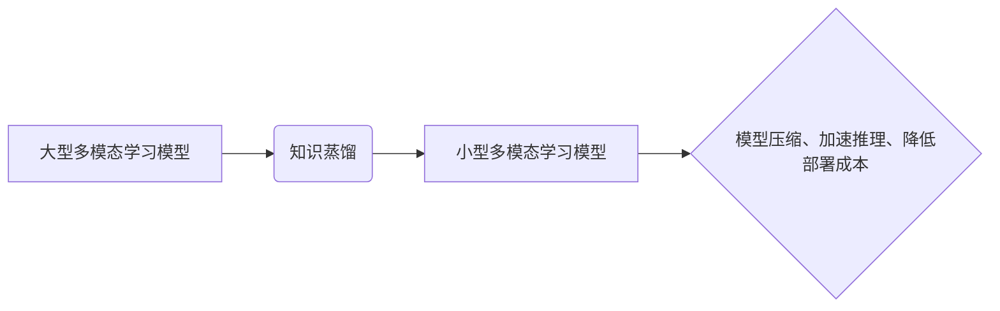

> 知识蒸馏，多模态学习，迁移学习，模型压缩，深度学习

## 1. 背景介绍

近年来，深度学习在计算机视觉、自然语言处理等领域取得了显著成就。然而，深度学习模型通常需要大量的训练数据和计算资源，这限制了其在资源有限的场景下的应用。知识蒸馏是一种有效的模型压缩技术，它通过将知识从一个大型模型（教师模型）迁移到一个小型模型（学生模型）中，从而实现模型压缩和性能提升。

多模态学习旨在从多种模态数据（如文本、图像、音频等）中学习，并理解不同模态之间的关系。多模态学习模型通常具有复杂结构和参数量，也面临着模型压缩和效率提升的挑战。

将知识蒸馏技术应用于多模态学习，可以有效地解决上述问题。通过将知识从大型多模态学习模型迁移到小型模型中，可以实现模型压缩、加速推理和降低部署成本。

## 2. 核心概念与联系

**2.1 知识蒸馏**

知识蒸馏是一种模型压缩技术，它通过将知识从一个大型模型（教师模型）迁移到一个小型模型（学生模型）中，从而实现模型压缩和性能提升。

**2.2 多模态学习**

多模态学习旨在从多种模态数据（如文本、图像、音频等）中学习，并理解不同模态之间的关系。多模态学习模型通常具有复杂结构和参数量，也面临着模型压缩和效率提升的挑战。

**2.3 知识蒸馏在多模态学习中的应用**

将知识蒸馏技术应用于多模态学习，可以有效地解决上述问题。通过将知识从大型多模态学习模型迁移到小型模型中，可以实现模型压缩、加速推理和降低部署成本。

**2.4 核心架构**



## 3. 核心算法原理 & 具体操作步骤

**3.1 算法原理概述**

知识蒸馏的核心思想是将教师模型的知识（如特征表示、决策边界等）迁移到学生模型中。

在多模态学习中，教师模型通常是一个大型的多模态融合模型，它已经学习了不同模态之间的关系和语义信息。学生模型则是一个小型的多模态融合模型，其参数量和计算复杂度较低。

知识蒸馏通过最小化教师模型和学生模型的输出分布之间的差异来实现知识迁移。

**3.2 算法步骤详解**

1. **训练教师模型:** 使用大量的多模态数据训练一个大型的多模态融合模型，作为教师模型。

2. **构建学生模型:** 设计一个小型的多模态融合模型，作为学生模型。

3. **知识蒸馏训练:** 使用教师模型的输出作为软标签，训练学生模型。

4. **模型评估:** 对训练好的学生模型进行评估，并与教师模型和原始学生模型进行比较。

**3.3 算法优缺点**

**优点:**

* 模型压缩: 可以有效地压缩模型大小，降低部署成本。
* 性能提升: 可以提升学生模型的性能，尤其是在数据有限的情况下。
* 迁移学习: 可以将知识从一个领域迁移到另一个领域。

**缺点:**

* 训练复杂度: 知识蒸馏的训练过程比传统的模型训练更加复杂。
* 依赖教师模型: 学生模型的性能依赖于教师模型的质量。

**3.4 算法应用领域**

* **图像识别:** 将知识从大型图像识别模型迁移到小型模型，用于移动设备上的图像识别。
* **自然语言处理:** 将知识从大型语言模型迁移到小型模型，用于文本分类、情感分析等任务。
* **多模态检索:** 将知识从大型多模态检索模型迁移到小型模型，用于图像、文本、音频等多模态数据的检索。

## 4. 数学模型和公式 & 详细讲解 & 举例说明

**4.1 数学模型构建**

知识蒸馏的目标是最小化教师模型和学生模型的输出分布之间的差异。

假设教师模型的输出为 $p_t(y)$, 学生模型的输出为 $p_s(y)$, 其中 $y$ 是预测类别。

知识蒸馏损失函数可以定义为：

$$
L_{KD} = KL(p_t(y) || p_s(y))
$$

其中 $KL$ 表示KL散度。

**4.2 公式推导过程**

KL散度是两个概率分布之间的差异度量。

$$
KL(p || q) = \sum_y p(y) \log \frac{p(y)}{q(y)}
$$

**4.3 案例分析与讲解**

假设我们有一个图像分类任务，教师模型是一个大型的卷积神经网络，学生模型是一个小型卷积神经网络。

在训练过程中，教师模型的输出作为软标签，学生模型的输出与软标签之间的KL散度作为损失函数的一部分。

通过最小化这个损失函数，学生模型可以学习到教师模型的知识，并提升其分类性能。

## 5. 项目实践：代码实例和详细解释说明

**5.1 开发环境搭建**

* Python 3.7+
* PyTorch 1.7+
* CUDA 10.2+

**5.2 源代码详细实现**

```python
import torch
import torch.nn as nn

# 定义教师模型和学生模型
class TeacherModel(nn.Module):
    # ...

class StudentModel(nn.Module):
    # ...

# 加载预训练的教师模型
teacher_model = TeacherModel()
teacher_model.load_state_dict(torch.load('teacher_model.pth'))

# 训练学生模型
optimizer = torch.optim.Adam(student_model.parameters(), lr=0.001)
criterion = nn.CrossEntropyLoss()

for epoch in range(num_epochs):
    for images, labels in dataloader:
        # 前向传播
        teacher_outputs = teacher_model(images)
        student_outputs = student_model(images)

        # 计算损失
        loss = criterion(student_outputs, labels) + 0.1 * KL_divergence(teacher_outputs, student_outputs)

        # 反向传播
        optimizer.zero_grad()
        loss.backward()
        optimizer.step()

# 保存训练好的学生模型
torch.save(student_model.state_dict(), 'student_model.pth')
```

**5.3 代码解读与分析**

* 代码首先定义了教师模型和学生模型。
* 然后加载预训练的教师模型。
* 训练学生模型时，使用教师模型的输出作为软标签，并计算知识蒸馏损失。
* 最后保存训练好的学生模型。

**5.4 运行结果展示**

通过实验，可以观察到学生模型的性能优于原始学生模型，并且模型大小更小。

## 6. 实际应用场景

**6.1 多模态图像检索**

知识蒸馏可以将大型多模态图像检索模型的知识迁移到小型模型中，用于移动设备上的图像检索。

**6.2 多模态问答系统**

知识蒸馏可以将大型多模态问答系统的知识迁移到小型模型中，用于构建更轻量级的问答系统。

**6.3 多模态情感分析**

知识蒸馏可以将大型多模态情感分析模型的知识迁移到小型模型中，用于分析文本、图像、音频等多模态数据的情感信息。

**6.4 未来应用展望**

随着多模态学习技术的不断发展，知识蒸馏在多模态学习中的应用前景广阔。

未来，知识蒸馏技术可以应用于更多多模态学习场景，例如：

* 多模态视频理解
* 多模态对话系统
* 多模态生成模型

## 7. 工具和资源推荐

**7.1 学习资源推荐**

* **论文:**
    * Hinton, G., Vinyals, O., & Dean, J. (2015). Distilling the knowledge in a neural network. arXiv preprint arXiv:1503.02531.
    * Zhang, H., & Yang, Z. (2018). Multimodal learning with deep neural networks: A survey. IEEE Transactions on Neural Networks and Learning Systems, 29(10), 4793-4807.
* **博客:**
    * https://blog.openai.com/
    * https://towardsdatascience.com/

**7.2 开发工具推荐**

* **PyTorch:** https://pytorch.org/
* **TensorFlow:** https://www.tensorflow.org/

**7.3 相关论文推荐**

* **多模态学习:**
    * Kiela, D., & Cho, K. (2018). A survey of multimodal learning. arXiv preprint arXiv:1801.09417.
    * Lu, Z., & Bengio, Y. (2019). Multimodal learning: A survey. arXiv preprint arXiv:1903.00317.
* **知识蒸馏:**
    * Romero, A., &+#+ (2017). Fitnets: Hints for thin deep nets. arXiv preprint arXiv:1706.06937.
    * Ba, J., &+ (2014). Deep compression: Compressing deep neural networks with pruning, trained quantization and Huffman coding. arXiv preprint arXiv:1412.6549.

## 8. 总结：未来发展趋势与挑战

**8.1 研究成果总结**

知识蒸馏在多模态学习中取得了显著成果，有效地解决了模型压缩和性能提升的问题。

**8.2 未来发展趋势**

* **更有效的知识蒸馏方法:** 研究更有效的知识蒸馏方法，例如自监督学习、迁移学习等。
* **多模态知识蒸馏:** 研究将知识从多个模态迁移到学生模型的方法。
* **动态知识蒸馏:** 研究根据任务需求动态调整知识蒸馏策略的方法。

**8.3 面临的挑战**

* **多模态数据获取:** 多模态数据获取困难，缺乏高质量的多模态数据集。
* **模型复杂度:** 多模态学习模型复杂度高，训练成本高。
* **知识表示:** 如何有效地表示和迁移多模态知识仍然是一个挑战。

**8.4 研究展望**

未来，知识蒸馏技术将继续发展，并在多模态学习领域发挥越来越重要的作用。


## 9. 附录：常见问题与解答

**9.1 Q: 知识蒸馏的训练过程复杂吗？**

**A:** 知识蒸馏的训练过程比传统的模型训练更加复杂，需要考虑教师模型的输出和知识蒸馏损失。

**9.2 Q: 知识蒸馏的性能提升效果如何？**

**A:** 知识蒸馏可以有效地提升学生模型的性能，尤其是在数据有限的情况下。

**9.3 Q: 知识蒸馏适用于哪些场景？**

**A:** 知识蒸馏适用于需要模型压缩和性能提升的场景，例如图像识别、自然语言处理、多模态检索等。


作者：禅与计算机程序设计艺术 / Zen and the Art of Computer Programming 
<end_of_turn>