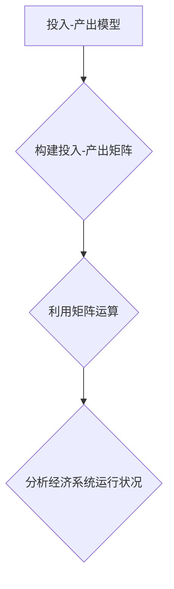

> 矩阵理论，投入-产出模型，数理经济学，经济系统分析，线性代数，经济增长

## 1. 背景介绍

在现代经济学研究中，为了更深入地理解经济系统之间的复杂相互作用，数理经济学逐渐成为重要的研究工具。其中，投入-产出模型作为一种经典的经济模型，利用矩阵理论对经济系统进行建模和分析，能够有效地揭示经济活动之间的关联性和反馈机制。

投入-产出模型的核心思想是：经济活动是一个相互依存的系统，每个行业生产的最终产品不仅满足自身需求，还会作为其他行业的投入，从而形成一个复杂的生产循环。通过构建矩阵模型，我们可以将经济系统中的各行业和产品进行量化描述，并利用矩阵运算来分析经济系统整体的运行状况。

## 2. 核心概念与联系

**2.1 投入-产出模型的基本概念**

投入-产出模型的核心概念包括：

* **行业:** 将经济活动划分为若干个行业，例如农业、工业、服务业等。
* **产品:**  指每个行业生产的最终产品或中间产品。
* **投入:** 指一个行业使用其他行业生产的产品作为生产要素，例如原材料、能源、劳动力等。
* **产出:** 指一个行业生产的最终产品或中间产品。

**2.2 矩阵理论与投入-产出模型的联系**

矩阵理论为构建和分析投入-产出模型提供了强大的工具。

* **投入-产出矩阵:**  将经济系统中的各行业和产品用矩阵形式表示，其中矩阵元素代表不同行业之间投入和产出的比例。
* **矩阵运算:** 利用矩阵加法、乘法等运算，可以分析经济系统整体的运行状况，例如计算最终需求、产业结构变化等。

**2.3 投入-产出模型的结构**

投入-产出模型的结构可以概括为以下公式：

$$X = A X + Y$$

其中：

* $X$：产出向量，表示各行业的产出量。
* $A$：投入-产出矩阵，表示各行业之间投入产出的比例。
* $Y$：最终需求向量，表示最终消费、投资、政府支出等需求量。

**2.4 Mermaid 流程图**



## 3. 核心算法原理 & 具体操作步骤

**3.1 算法原理概述**

投入-产出模型的核心算法是利用矩阵运算来求解经济系统中的产出向量。

* **逆矩阵法:**  通过求解矩阵 $A$ 的逆矩阵，可以得到产出向量 $X$ 的表达式。
* **迭代法:**  通过迭代计算，逐步逼近产出向量 $X$ 的解。

**3.2 算法步骤详解**

**3.2.1 逆矩阵法**

1. 将投入-产出模型的方程 $X = A X + Y$  重写为 $X - A X = Y$。
2. 将 $X$ 移到左边，得到 $(I - A) X = Y$，其中 $I$ 是单位矩阵。
3. 求解矩阵 $(I - A)$ 的逆矩阵 $(I - A)^{-1}$。
4. 将两边同时乘以 $(I - A)^{-1}$，得到 $X = (I - A)^{-1} Y$。

**3.2.2 迭代法**

1. 将投入-产出模型的方程 $X = A X + Y$  重写为 $X = (A + I)^{-1} Y$。
2. 利用迭代公式 $X^{(k+1)} = (A + I)^{-1} Y$，其中 $X^{(k)}$ 是第 $k$ 次迭代的产出向量，逐步逼近产出向量 $X$ 的解。

**3.3 算法优缺点**

**3.3.1 逆矩阵法**

* **优点:**  解法清晰，计算结果精确。
* **缺点:**  当矩阵 $A$ 的行列式为零时，无法求解逆矩阵，导致算法失效。

**3.3.2 迭代法**

* **优点:**  适用于矩阵 $A$ 的行列式为零的情况，能够求解近似解。
* **缺点:**  迭代次数较多，计算效率较低。

**3.4 算法应用领域**

投入-产出模型的算法广泛应用于以下领域：

* **经济预测:**  预测经济增长率、产业结构变化等。
* **政策分析:**  评估政策对经济的影响，例如财政刺激政策、产业扶持政策等。
* **资源配置:**  优化资源配置，提高经济效率。

## 4. 数学模型和公式 & 详细讲解 & 举例说明

**4.1 数学模型构建**

投入-产出模型的数学模型可以表示为一个线性方程组：

$$X = A X + Y$$

其中：

* $X$：是一个 $n \times 1$ 的列向量，表示各行业的产出量。
* $A$：是一个 $n \times n$ 的矩阵，表示各行业之间投入产出的比例。
* $Y$：是一个 $n \times 1$ 的列向量，表示最终需求量。

**4.2 公式推导过程**

为了求解 $X$，我们可以将方程重写为：

$$(I - A) X = Y$$

其中 $I$ 是一个 $n \times n$ 的单位矩阵。

然后，我们可以通过求解 $(I - A)$ 的逆矩阵来得到 $X$ 的表达式：

$$X = (I - A)^{-1} Y$$

**4.3 案例分析与讲解**

假设一个经济系统只有三个行业：农业、工业和服务业。

* 农业行业投入产出矩阵为：

$$A_1 = \begin{bmatrix} 0 & 0.2 & 0.1 \\ 0.3 & 0 & 0.2 \\ 0.1 & 0.1 & 0 \end{bmatrix}$$

* 工业行业投入产出矩阵为：

$$A_2 = \begin{bmatrix} 0.1 & 0 & 0.3 \\ 0 & 0.4 & 0.1 \\ 0.2 & 0.2 & 0 \end{bmatrix}$$

* 服务业投入产出矩阵为：

$$A_3 = \begin{bmatrix} 0 & 0.3 & 0 \\ 0.2 & 0 & 0.1 \\ 0.1 & 0.1 & 0 \end{bmatrix}$$

最终需求向量为：

$$Y = \begin{bmatrix} 10 \\ 20 \\ 15 \end{bmatrix}$$

我们可以利用上述公式和矩阵运算来计算各行业的产出量。

## 5. 项目实践：代码实例和详细解释说明

**5.1 开发环境搭建**

本项目使用 Python 语言进行开发，需要安装以下软件包：

* NumPy：用于进行数值计算和矩阵运算。
* Matplotlib：用于数据可视化。

**5.2 源代码详细实现**

```python
import numpy as np
from matplotlib import pyplot as plt

# 投入产出矩阵
A = np.array([[0, 0.2, 0.1],
              [0.3, 0, 0.2],
              [0.1, 0.1, 0]])

# 最终需求向量
Y = np.array([10, 20, 15])

# 计算产出向量
I = np.eye(3)
X = np.linalg.inv(I - A) @ Y

# 打印产出向量
print("各行业的产出量为：\
", X)

# 数据可视化
plt.bar(range(1, 4), X)
plt.xlabel("行业")
plt.ylabel("产出量")
plt.title("投入-产出模型结果")
plt.show()
```

**5.3 代码解读与分析**

1. 首先，我们定义了投入产出矩阵 $A$ 和最终需求向量 $Y$。
2. 然后，我们计算了单位矩阵 $I$ 和 $(I - A)$ 的逆矩阵。
3. 最后，我们利用公式 $X = (I - A)^{-1} Y$ 计算了产出向量 $X$，并将其打印出来。

**5.4 运行结果展示**

运行代码后，会输出各行业的产出量，并生成一个柱状图，展示各行业的产出量。

## 6. 实际应用场景

**6.1 经济预测**

投入-产出模型可以用来预测经济增长率、产业结构变化等。例如，我们可以利用模型分析政府财政刺激政策对经济的影响，预测政策实施后各行业的产出量变化。

**6.2 政策分析**

投入-产出模型可以用来评估政策对经济的影响，例如产业扶持政策、环境保护政策等。例如，我们可以利用模型分析产业扶持政策对特定行业的产出量和就业的影响。

**6.3 资源配置**

投入-产出模型可以用来优化资源配置，提高经济效率。例如，我们可以利用模型分析不同行业对资源的需求，并制定合理的资源分配方案。

**6.4 未来应用展望**

随着数据量的增加和计算能力的提升，投入-产出模型的应用场景将会更加广泛。例如，我们可以利用大数据和人工智能技术，构建更加精细化的投入-产出模型，并将其应用于更复杂的经济问题分析。

## 7. 工具和资源推荐

**7.1 学习资源推荐**

* **书籍:**
    * 《投入产出分析》
    * 《数理经济学》
* **在线课程:**
    * Coursera 上的 "Introduction to Econometrics" 课程
    * edX 上的 "Microeconomic Theory" 课程

**7.2 开发工具推荐**

* **Python:**  Python 语言及其相关库，例如 NumPy、SciPy、Pandas 等。
* **R:**  R 语言及其相关包，例如 Matrix、lmtest 等。

**7.3 相关论文推荐**

* **Leontief, W. (1951). The Structure of the American Economy. New York: Oxford University Press.**
* **Miller, R. E., & Blair, P. J. (2009). Input-Output Analysis: Foundations and Extensions. Cambridge: Cambridge University Press.**

## 8. 总结：未来发展趋势与挑战

**8.1 研究成果总结**

投入-产出模型作为一种经典的经济模型，在经济预测、政策分析、资源配置等领域取得了重要的应用成果。

**8.2 未来发展趋势**

未来，投入-产出模型的发展趋势包括：

* **更加精细化:**  利用大数据和人工智能技术，构建更加精细化的投入-产出模型，并将其应用于更复杂的经济问题分析。
* **更加动态化:**  考虑时间因素，构建动态的投入-产出模型，能够更准确地预测经济系统未来的发展趋势。
* **更加多维化:**  考虑更多因素，例如环境、社会等，构建更加多维化的投入-产出模型，能够更全面地分析经济系统的运行状况。

**8.3 面临的挑战**

投入-产出模型的发展也面临着一些挑战：

* **数据获取:**  构建精细化的投入-产出模型需要大量的经济数据，而这些数据往往难以获取。
* **模型复杂性:**  随着模型的复杂化，模型的构建和分析难度也会增加。
* **模型验证:**  需要开发有效的模型验证方法，确保模型的准确性和可靠性。

**8.4 研究展望**

未来，我们需要继续加强投入-产出模型的研究，克服面临的挑战，使其更好地服务于经济决策和社会发展。

## 9. 附录：常见问题与解答

**9.1 投入产出模型的局限性是什么？**

投入产出