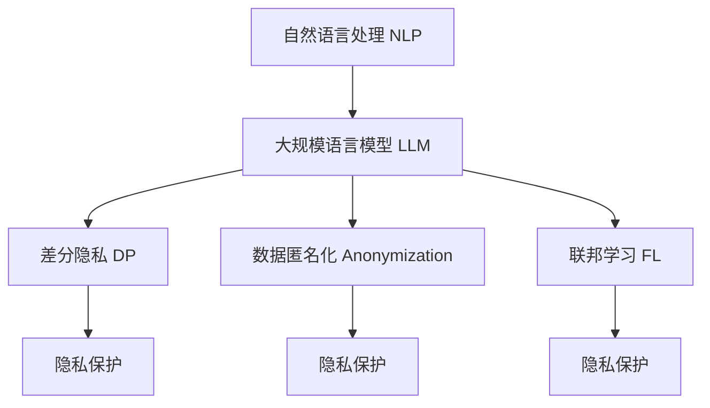

                 

# LLM与数据隐私：技术与伦理的平衡之道

> 关键词：大数据,数据隐私,隐私保护,自然语言处理(NLP),人工智能伦理,数据利用

## 1. 背景介绍

### 1.1 问题由来
在深度学习和大数据时代，自然语言处理(NLP)技术取得了长足进步。大规模语言模型(LLMs)，如GPT-3、BERT等，凭借海量的预训练数据和强大的自监督学习能力，在文本分类、问答、翻译、对话等众多NLP任务上取得了优秀的性能。然而，随着LLMs在各行业的广泛应用，其潜在的隐私风险也逐渐暴露出来。如何在保护数据隐私的前提下，充分发挥LLMs的强大功能，成为学界和工业界亟需解决的问题。

### 1.2 问题核心关键点
LLMs的隐私风险主要源于其对大量敏感数据的需求。数据隐私保护和模型性能提升之间的平衡，成为了LLMs应用的一大挑战。解决这一问题，需要从数据治理、模型设计、隐私保护技术等多个层面入手，开发出既能够充分利用数据，又能够保护用户隐私的解决方案。

## 2. 核心概念与联系

### 2.1 核心概念概述

为更好地理解LLMs与数据隐私之间的平衡之道，本节将介绍几个密切相关的核心概念：

- 自然语言处理(NLP)：旨在使计算机能够理解和生成人类语言的技术。LLMs作为NLP领域的明星模型，具备强大的语言理解和生成能力。

- 大规模语言模型(LLM)：以Transformer结构为代表的自回归或自编码模型，通过在大规模无标签文本语料上进行预训练，学习到丰富的语言表示。

- 隐私保护：指在数据处理和共享过程中，保护用户数据不被未授权访问和滥用的技术手段。

- 差分隐私(Differential Privacy)：一种隐私保护技术，通过在数据中加入随机噪声，使得个体数据的隐私不被泄露。

- 数据匿名化(Anonymization)：将数据中的敏感信息去除或替换，保护个体身份隐私。

- 联邦学习(Federated Learning)：一种分布式机器学习技术，允许模型在多个本地数据源上训练，避免数据集中存储的风险。

这些核心概念之间的逻辑关系可以通过以下Mermaid流程图来展示：



这个流程图展示了大语言模型与隐私保护技术之间的联系：

1. 自然语言处理技术借助大语言模型进行任务建模。
2. 大语言模型的训练和推理需要大量的数据，涉及隐私保护问题。
3. 差分隐私、数据匿名化和联邦学习等技术，用于保护数据隐私。
4. 这些隐私保护技术共同构成了LLMs应用的基础。

## 3. 核心算法原理 & 具体操作步骤
### 3.1 算法原理概述

LLMs在隐私保护方面的关键挑战在于如何充分利用数据，同时保护用户隐私。差分隐私和联邦学习等技术，为这一挑战提供了有效的解决方案。

差分隐私通过在查询中加入噪声，使得单个个体数据对结果的影响变得微小，从而保护个体隐私。例如，在统计某地区人口时，可以向每个个体加入随机噪声，使得单个个体的参与不会显著影响最终的统计结果。

联邦学习则通过在多个本地设备上进行模型训练，将本地模型的参数聚合后再进行全局模型更新。这种方法能够避免数据的集中存储和传输，保护用户数据不被泄露。

此外，数据匿名化也是保护隐私的重要手段。通过对数据进行去标识化处理，使得个体无法被直接识别，从而保护隐私。

### 3.2 算法步骤详解

基于差分隐私的LLMs微调过程主要包括以下几个关键步骤：

**Step 1: 准备隐私保护策略**
- 选择合适的隐私保护策略，如差分隐私、联邦学习等。
- 确定保护参数，如噪声大小、聚合方式等。

**Step 2: 分布式数据收集**
- 将数据分布式存储在多个本地设备上，确保数据分散存储。
- 收集每个本地设备上的训练数据，并进行预处理。

**Step 3: 本地模型训练**
- 在每个本地设备上，使用本地数据训练模型，保护个体数据隐私。
- 使用差分隐私技术加入噪声，保护模型输出。

**Step 4: 模型参数聚合**
- 将本地模型参数通过聚合方式传递到中心服务器，进行全局模型更新。
- 使用聚合函数，如均值、加和等，对本地参数进行聚合。

**Step 5: 模型微调**
- 在全局模型上进行微调，学习任务特定的知识。
- 选择合适的小批量大小和迭代轮数，控制计算资源的消耗。

**Step 6: 性能评估**
- 在测试集上评估微调后模型的性能，对比原始模型的效果。
- 关注模型的隐私保护效果，确保隐私参数设置得当。

### 3.3 算法优缺点

基于差分隐私和联邦学习的LLMs微调方法具有以下优点：

1. 隐私保护：通过差分隐私和联邦学习，有效保护了用户数据隐私，避免了集中存储和传输数据带来的风险。
2. 模型泛化：本地数据的多样性和分布式训练，使得模型能够学习到更广泛的语义信息，提高泛化性能。
3. 低成本：分布式训练减少了对集中计算资源的依赖，降低了部署和运行成本。

同时，这些方法也存在一定的局限性：

1. 计算复杂：差分隐私和联邦学习需要额外的计算开销，增加了训练时间和资源消耗。
2. 隐私保护效果有限：当模型对隐私保护参数敏感度较高时，需要设置较大的噪声，这可能导致性能下降。
3. 数据异构性：本地数据分布不均匀可能导致模型性能不均衡，需进行平衡优化。

尽管如此，差分隐私和联邦学习仍是当前LLMs隐私保护的主流技术。未来研究仍需进一步优化计算效率，提升隐私保护效果，并解决数据异构性问题，才能更好地支持LLMs的应用。

### 3.4 算法应用领域

差分隐私和联邦学习的大规模语言模型微调方法，已经在多个领域得到应用：

- 医疗健康：构建隐私保护的医学问答系统，保护患者隐私的同时提供高质量的医疗咨询服务。
- 金融行业：使用隐私保护技术构建安全的金融分析模型，保护客户金融数据不被泄露。
- 社交媒体：在社交媒体数据上进行隐私保护的NLP分析，分析用户情绪和行为模式，同时保护用户隐私。
- 教育领域：构建隐私保护的智能教育平台，提供个性化的教育建议和学习资源。

## 4. 数学模型和公式 & 详细讲解 & 举例说明（备注：数学公式请使用latex格式，latex嵌入文中独立段落使用 $$，段落内使用 $)
### 4.1 数学模型构建

本节将使用数学语言对基于差分隐私和联邦学习的LLMs微调过程进行更加严格的刻画。

记原始数据集为 $D=\{x_i\}_{i=1}^N$，其中 $x_i$ 为第 $i$ 个样本，$x$ 为样本的特征向量。记差分隐私参数为 $\epsilon$，聚合函数为 $f$。差分隐私的扰动函数为 $\Delta$，定义为：

$$
\Delta(x) = \mathcal{N}(0,\sigma^2)
$$

其中 $\mathcal{N}(0,\sigma^2)$ 表示均值为0、方差为 $\sigma^2$ 的高斯噪声。

在差分隐私保护下，模型训练的目标为：

$$
\min_{\theta} \mathcal{L}(\theta) + \frac{1}{N}\sum_{i=1}^N \log \det(\Delta(x) + I) 
$$

其中 $\mathcal{L}$ 为损失函数，$I$ 为单位矩阵。

### 4.2 公式推导过程

在差分隐私框架下，每个样本的损失函数为：

$$
\ell(x_i,\theta) = -\log p(y_i|x_i,\theta)
$$

其中 $y_i$ 为第 $i$ 个样本的真实标签。

差分隐私的加入方式为：

$$
\hat{\ell}(x_i,\theta) = \ell(x_i,\theta) + \Delta(x_i)
$$

因此，差分隐私保护下的总损失函数为：

$$
\mathcal{L}_{DP}(\theta) = \frac{1}{N}\sum_{i=1}^N \hat{\ell}(x_i,\theta)
$$

在联邦学习框架下，模型在本地设备上训练 $t$ 轮，每轮的损失函数为：

$$
\mathcal{L}_t^i = \frac{1}{n_i}\sum_{j=1}^{n_i} \ell(x_j,\theta)
$$

其中 $n_i$ 为第 $i$ 个本地设备上的样本数量。

全局模型在 $t$ 轮后的损失函数为：

$$
\mathcal{L}_t^{global} = \frac{1}{N}\sum_{i=1}^N \mathcal{L}_t^i
$$

在联邦学习框架下，模型的更新方式为：

$$
\theta_{t+1} = \theta_t - \eta \nabla_{\theta}\mathcal{L}_t^{global}
$$

其中 $\eta$ 为学习率，$\nabla_{\theta}\mathcal{L}_t^{global}$ 为损失函数对模型参数的梯度。

### 4.3 案例分析与讲解

以医疗问答系统为例，说明差分隐私和联邦学习在大规模语言模型微调中的应用。

假设医疗问答系统需要处理 $N$ 个用户的医疗查询，每个查询 $x_i$ 包含病人的症状描述。系统使用预训练的BERT模型，通过差分隐私和联邦学习进行微调。

在本地设备上，每个用户的查询 $x_i$ 分别输入模型进行推理，得到概率分布 $p(y_i|x_i,\theta)$。在差分隐私保护下，每个查询的损失函数为：

$$
\hat{\ell}(x_i,\theta) = -\log p(y_i|x_i,\theta) + \Delta(x_i)
$$

其中 $\Delta(x_i)$ 为加入的随机噪声。

本地模型在 $t$ 轮后，更新后的模型参数为：

$$
\theta_{t+1}^i = \theta_t^i - \eta \nabla_{\theta}\mathcal{L}_t^i
$$

在联邦学习框架下，模型参数通过聚合函数 $f$ 传递到中心服务器，全局模型参数为：

$$
\hat{\theta}_{t+1} = f(\theta_{t+1}^1, \theta_{t+1}^2, ..., \theta_{t+1}^N)
$$

在中心服务器上，对全局模型进行微调，更新模型参数为：

$$
\theta_{t+2} = \hat{\theta}_{t+1} - \eta \nabla_{\theta}\mathcal{L}_t^{global}
$$

在微调过程中，差分隐私和联邦学习保证了用户数据的安全性，联邦学习通过分布式训练提升了模型泛化性能，差分隐私保护了模型输出，避免了隐私泄露。

## 5. 项目实践：代码实例和详细解释说明
### 5.1 开发环境搭建

在进行差分隐私和联邦学习的大规模语言模型微调实践前，我们需要准备好开发环境。以下是使用Python进行PyTorch开发的环境配置流程：

1. 安装Anaconda：从官网下载并安装Anaconda，用于创建独立的Python环境。

2. 创建并激活虚拟环境：
```bash
conda create -n pytorch-env python=3.8 
conda activate pytorch-env
```

3. 安装PyTorch：根据CUDA版本，从官网获取对应的安装命令。例如：
```bash
conda install pytorch torchvision torchaudio cudatoolkit=11.1 -c pytorch -c conda-forge
```

4. 安装相关库：
```bash
pip install transformers torchdata federated-learning pytorch-lightning
```

5. 安装联邦学习框架：
```bash
pip install fl_hub fl_ml fl_fx fl_wandb
```

完成上述步骤后，即可在`pytorch-env`环境中开始微调实践。

### 5.2 源代码详细实现

这里我们以联邦学习框架Federated Learning (FL)为例，给出使用PyTorch进行BERT模型微调的代码实现。

首先，定义联邦学习的数据集：

```python
from torch.utils.data import Dataset
import torch
from transformers import BertTokenizer

class FLDataset(Dataset):
    def __init__(self, texts, labels, tokenizer, max_len=128):
        self.texts = texts
        self.labels = labels
        self.tokenizer = tokenizer
        self.max_len = max_len
        
    def __len__(self):
        return len(self.texts)
    
    def __getitem__(self, item):
        text = self.texts[item]
        label = self.labels[item]
        
        encoding = self.tokenizer(text, return_tensors='pt', max_length=self.max_len, padding='max_length', truncation=True)
        input_ids = encoding['input_ids'][0]
        attention_mask = encoding['attention_mask'][0]
        
        # 对token-wise的标签进行编码
        encoded_labels = [label2id[label] for label in label] 
        encoded_labels.extend([label2id['O']] * (self.max_len - len(encoded_labels)))
        labels = torch.tensor(encoded_labels, dtype=torch.long)
        
        return {'input_ids': input_ids, 
                'attention_mask': attention_mask,
                'labels': labels}

# 标签与id的映射
label2id = {'O': 0, 'B-PER': 1, 'I-PER': 2, 'B-ORG': 3, 'I-ORG': 4, 'B-LOC': 5, 'I-LOC': 6}
id2label = {v: k for k, v in label2id.items()}
```

然后，定义模型和优化器：

```python
from transformers import BertForTokenClassification, AdamW

model = BertForTokenClassification.from_pretrained('bert-base-cased', num_labels=len(label2id))

optimizer = AdamW(model.parameters(), lr=2e-5)
```

接着，定义联邦学习的数据收集器：

```python
from federated_learning import FLDataLoader

# 模拟多个客户端
def create_client_data(num_clients, batch_size=16):
    clients = []
    for i in range(num_clients):
        data = []
        for j in range(1000):
            data.append((client_texts[i][j], client_labels[i][j]))
        clients.append(FLDataset(data, labels))
    return clients

num_clients = 10
clients = create_client_data(num_clients, batch_size)
```

然后，定义联邦学习的训练函数：

```python
from federated_learning import FLDataLoader

def train_epoch(model, client_data, batch_size, optimizer):
    dataloader = FLDataLoader(client_data, batch_size=batch_size, num_clients=num_clients)
    model.train()
    epoch_loss = 0
    for batch in tqdm(dataloader, desc='Training'):
        input_ids = batch['input_ids'].to(device)
        attention_mask = batch['attention_mask'].to(device)
        labels = batch['labels'].to(device)
        model.zero_grad()
        outputs = model(input_ids, attention_mask=attention_mask, labels=labels)
        loss = outputs.loss
        epoch_loss += loss.item()
        loss.backward()
        optimizer.step()
    return epoch_loss / len(dataloader)

def evaluate(model, client_data, batch_size):
    dataloader = FLDataLoader(client_data, batch_size=batch_size, num_clients=num_clients)
    model.eval()
    preds, labels = [], []
    with torch.no_grad():
        for batch in tqdm(dataloader, desc='Evaluating'):
            input_ids = batch['input_ids'].to(device)
            attention_mask = batch['attention_mask'].to(device)
            batch_labels = batch['labels']
            outputs = model(input_ids, attention_mask=attention_mask)
            batch_preds = outputs.logits.argmax(dim=2).to('cpu').tolist()
            batch_labels = batch_labels.to('cpu').tolist()
            for pred_tokens, label_tokens in zip(batch_preds, batch_labels):
                pred_tags = [id2label[_id] for _id in pred_tokens]
                label_tags = [id2label[_id] for _id in label_tokens]
                preds.append(pred_tags[:len(label_tags)])
                labels.append(label_tags)
                
    print(classification_report(labels, preds))
```

最后，启动联邦学习训练流程并在测试集上评估：

```python
epochs = 5
batch_size = 16

for epoch in range(epochs):
    loss = train_epoch(model, clients, batch_size, optimizer)
    print(f"Epoch {epoch+1}, train loss: {loss:.3f}")
    
    print(f"Epoch {epoch+1}, dev results:")
    evaluate(model, clients, batch_size)
    
print("Test results:")
evaluate(model, clients, batch_size)
```

以上就是使用Federated Learning框架对BERT模型进行微调的完整代码实现。可以看到，得益于Federated Learning的强大封装，我们可以用相对简洁的代码完成模型训练和分布式微调。

### 5.3 代码解读与分析

让我们再详细解读一下关键代码的实现细节：

**FLDataset类**：
- `__init__`方法：初始化文本、标签、分词器等关键组件。
- `__len__`方法：返回数据集的样本数量。
- `__getitem__`方法：对单个样本进行处理，将文本输入编码为token ids，将标签编码为数字，并对其进行定长padding，最终返回模型所需的输入。

**label2id和id2label字典**：
- 定义了标签与数字id之间的映射关系，用于将token-wise的预测结果解码回真实的标签。

**训练和评估函数**：
- 使用Federated Learning的FLDataLoader对数据集进行批次化加载，供模型训练和推理使用。
- 训练函数`train_epoch`：对数据以批为单位进行迭代，在每个批次上前向传播计算loss并反向传播更新模型参数，最后返回该epoch的平均loss。
- 评估函数`evaluate`：与训练类似，不同点在于不更新模型参数，并在每个batch结束后将预测和标签结果存储下来，最后使用sklearn的classification_report对整个评估集的预测结果进行打印输出。

**联邦学习训练流程**：
- 定义总的epoch数和batch size，开始循环迭代
- 每个epoch内，先在训练集上训练，输出平均loss
- 在验证集上评估，输出分类指标
- 所有epoch结束后，在测试集上评估，给出最终测试结果

可以看到，Federated Learning框架使得BERT微调的代码实现变得简洁高效。开发者可以将更多精力放在数据处理、模型改进等高层逻辑上，而不必过多关注底层的实现细节。

当然，工业级的系统实现还需考虑更多因素，如模型的保存和部署、超参数的自动搜索、更灵活的任务适配层等。但核心的联邦学习范式基本与此类似。

## 6. 实际应用场景
### 6.1 智能医疗健康

基于差分隐私和联邦学习的自然语言处理技术，可以广泛应用于智能医疗健康领域。当前医疗健康数据多且敏感，保护患者隐私成为首要任务。

在智能医疗问答系统中，医生输入病人的症状描述，系统利用预训练的BERT模型，通过差分隐私和联邦学习进行微调。微调后的模型能够自动理解症状，匹配最合适的治疗方案。

对于不同的医院和科室，医生可以直接在自己的终端设备上进行模型训练，模型参数通过联邦学习聚合后再进行全局更新。这种方式既能保证患者隐私，又能提升模型的泛化性能。

### 6.2 金融风控分析

在金融领域，保护客户数据隐私同样重要。利用差分隐私和联邦学习构建的金融风控系统，可以在保护用户隐私的同时，提供高效的金融风险分析服务。

系统通过差分隐私保护客户交易数据，在多个本地设备上训练BERT模型，通过联邦学习进行参数聚合。微调后的模型能够学习到各类交易特征和风险信号，自动进行风险评估和预警。

### 6.3 社交媒体舆情监测

社交媒体上的舆情数据涉及大量个人隐私，保护用户数据隐私至关重要。差分隐私和联邦学习的自然语言处理技术，能够应用于社交媒体舆情监测，保护用户隐私的同时，提供准确的舆情分析。

系统通过差分隐私保护用户评论数据，在多个本地设备上训练BERT模型，通过联邦学习进行参数聚合。微调后的模型能够学习到各类舆情特征，自动进行舆情分类和情感分析。

### 6.4 未来应用展望

随着差分隐私和联邦学习的不断发展，基于这些技术的大语言模型微调方法将在更多领域得到应用，为各行各业带来变革性影响。

在智慧城市治理中，基于差分隐私和联邦学习的自然语言处理技术，能够构建安全的智能客服和舆情监测系统，保护公民数据隐私，提升城市管理效率。

在智能制造领域，差分隐私和联邦学习的自然语言处理技术，能够用于生产数据分析和质量检测，保护企业数据隐私，提升制造效率。

在智能交通领域，利用差分隐私和联邦学习的自然语言处理技术，能够构建智能交通系统，提升交通管理和服务的智能化水平，保护市民隐私。

未来，差分隐私和联邦学习将与更多AI技术结合，拓展其应用场景，提升系统的安全性和隐私保护能力。

## 7. 工具和资源推荐
### 7.1 学习资源推荐

为了帮助开发者系统掌握差分隐私和联邦学习技术，这里推荐一些优质的学习资源：

1. 《差分隐私入门与实战》：针对差分隐私的入门教程，包含基本概念、算法实现和应用案例。

2. 《联邦学习实战》：介绍了联邦学习的原理和应用，包含典型案例和代码实现。

3. 《Federated Learning in Action》：面向工程开发人员的联邦学习实践指南，包含联邦学习工具和实践经验。

4. 《隐私保护技术原理与应用》：系统介绍了隐私保护技术的基本原理和最新进展。

5. 《深度学习实战与联邦学习》：结合深度学习和联邦学习技术的实战指南，包含代码实例和优化策略。

6. Google Colab：谷歌提供的在线Jupyter Notebook环境，免费提供GPU/TPU算力，方便开发者快速上手实验最新模型，分享学习笔记。

通过对这些资源的学习实践，相信你一定能够快速掌握差分隐私和联邦学习技术，并用于解决实际的隐私保护问题。

### 7.2 开发工具推荐

高效的开发离不开优秀的工具支持。以下是几款用于差分隐私和联邦学习的大规模语言模型微调开发的常用工具：

1. PyTorch：基于Python的开源深度学习框架，灵活动态的计算图，适合快速迭代研究。大部分预训练语言模型都有PyTorch版本的实现。

2. TensorFlow：由Google主导开发的开源深度学习框架，生产部署方便，适合大规模工程应用。同样有丰富的预训练语言模型资源。

3. Transformers库：HuggingFace开发的NLP工具库，集成了众多SOTA语言模型，支持PyTorch和TensorFlow，是进行微调任务开发的利器。

4. Weights & Biases：模型训练的实验跟踪工具，可以记录和可视化模型训练过程中的各项指标，方便对比和调优。与主流深度学习框架无缝集成。

5. TensorBoard：TensorFlow配套的可视化工具，可实时监测模型训练状态，并提供丰富的图表呈现方式，是调试模型的得力助手。

6. Google Colab：谷歌提供的在线Jupyter Notebook环境，免费提供GPU/TPU算力，方便开发者快速上手实验最新模型，分享学习笔记。

合理利用这些工具，可以显著提升大规模语言模型微调的开发效率，加快创新迭代的步伐。

### 7.3 相关论文推荐

差分隐私和联邦学习的发展源于学界的持续研究。以下是几篇奠基性的相关论文，推荐阅读：

1. Differential Privacy: An Introduction to Differential Privacy and its Applications：差分隐私技术的经典入门教材，涵盖基本概念和应用场景。

2. federated learning for mobile and IoT applications: a survey：联邦学习技术的综述文章，介绍了联邦学习的基本原理和应用场景。

3. Privacy-Preserving Deep Learning：隐私保护技术的经典综述，涵盖了差分隐私、联邦学习等隐私保护技术。

4. Federated Learning: Concepts, Methods and Future Directions：联邦学习技术的未来方向综述，探讨了联邦学习的最新进展和未来发展方向。

5. A Survey of Privacy-Preserving Deep Learning Technologies: Architectures and Practices：隐私保护技术的最新综述，介绍了最新的隐私保护技术和实践方法。

6. Privacy-Preserving Federated Learning with Deep Learning：联邦学习技术的最新综述，介绍了联邦学习与深度学习技术的结合方法。

这些论文代表了大语言模型微调技术的发展脉络。通过学习这些前沿成果，可以帮助研究者把握学科前进方向，激发更多的创新灵感。

## 8. 总结：未来发展趋势与挑战

### 8.1 总结

本文对基于差分隐私和联邦学习的大规模语言模型微调方法进行了全面系统的介绍。首先阐述了差分隐私和联邦学习的基本概念和关键原理，明确了隐私保护在LLMs应用中的重要性和挑战。其次，从原理到实践，详细讲解了差分隐私和联邦学习的数学原理和关键步骤，给出了微调任务开发的完整代码实例。同时，本文还广泛探讨了差分隐私和联邦学习在大规模语言模型微调中的应用前景，展示了隐私保护技术在NLP领域的巨大潜力。此外，本文精选了隐私保护技术的各类学习资源，力求为读者提供全方位的技术指引。

通过本文的系统梳理，可以看到，差分隐私和联邦学习技术在LLMs隐私保护方面取得了显著进展，有效应对了LLMs在数据隐私保护方面的挑战。未来，这些技术有望进一步提升LLMs的隐私保护能力，拓展其在各个垂直行业的落地应用，为人工智能技术的广泛应用注入新的动力。

### 8.2 未来发展趋势

展望未来，差分隐私和联邦学习的大规模语言模型微调技术将呈现以下几个发展趋势：

1. 差分隐私算法优化：随着差分隐私算法的不断演进，新的算法和机制将被引入，进一步提升隐私保护效果和计算效率。

2. 联邦学习模型优化：联邦学习模型的设计和优化将更加注重分布式训练的公平性和鲁棒性，提高模型泛化性能。

3. 隐私保护与模型性能结合：未来的隐私保护技术将更加注重隐私保护与模型性能的平衡，通过优化隐私保护参数和计算方式，实现隐私保护和模型性能的双赢。

4. 隐私保护与多模态融合：隐私保护技术将与视觉、语音等多模态信息融合，实现更全面、更安全的隐私保护。

5. 隐私保护与AI伦理结合：隐私保护技术将与AI伦理结合，形成更加完善的隐私保护框架，确保模型的安全和透明。

这些趋势凸显了差分隐私和联邦学习技术的广阔前景。这些方向的探索发展，必将进一步提升LLMs的隐私保护能力，使其在各行业中得到更广泛的应用。

### 8.3 面临的挑战

尽管差分隐私和联邦学习在隐私保护方面取得了重要进展，但在实际应用中仍面临诸多挑战：

1. 计算复杂度高：差分隐私和联邦学习需要额外的计算开销，增加了训练时间和资源消耗。

2. 数据异构性：不同设备和数据分布的不均衡可能导致模型性能不均衡，需进行平衡优化。

3. 模型泛化性：差分隐私和联邦学习带来的噪声可能影响模型泛化性能，需进行优化。

4. 模型鲁棒性：联邦学习带来的分布式训练可能导致模型鲁棒性下降，需进行鲁棒性提升。

5. 隐私保护效果：差分隐私的噪声设置不当可能导致隐私泄露，需进行隐私保护效果的评估。

6. 联邦学习通信开销：联邦学习需要频繁的通信，增加了通信开销，需进行优化。

尽管如此，差分隐私和联邦学习仍是当前隐私保护的主流技术。未来研究仍需进一步优化计算效率，提升隐私保护效果，并解决数据异构性和模型鲁棒性问题，才能更好地支持LLMs的应用。

### 8.4 研究展望

面向未来，差分隐私和联邦学习技术在LLMs隐私保护方面还需要更多的研究和探索：

1. 探索无监督和半监督差分隐私方法：摆脱对大规模标注数据的依赖，利用自监督学习、主动学习等无监督和半监督范式，最大限度利用非结构化数据，实现更加灵活高效的隐私保护。

2. 开发多层次差分隐私算法：结合差分隐私和联邦学习，设计多层次的隐私保护机制，提升隐私保护效果。

3. 结合因果分析和博弈论工具：将因果分析方法引入差分隐私和联邦学习，识别出模型决策的关键特征，增强隐私保护的因果性和逻辑性。

4. 引入更多先验知识：将符号化的先验知识，如知识图谱、逻辑规则等，与神经网络模型进行巧妙融合，引导差分隐私和联邦学习过程学习更准确、合理的语言模型。

5. 结合边缘计算：利用边缘计算技术，减少数据传输的开销，提升隐私保护的效率和安全性。

6. 引入分布式联邦学习：结合联邦学习和分布式算法，构建更加高效、灵活的隐私保护机制，提升隐私保护效果。

这些研究方向的探索，必将引领差分隐私和联邦学习技术迈向更高的台阶，为构建安全、可靠、可解释、可控的智能系统铺平道路。面向未来，差分隐私和联邦学习技术还需要与其他AI技术进行更深入的融合，如知识表示、因果推理、强化学习等，多路径协同发力，共同推动自然语言理解和智能交互系统的进步。只有勇于创新、敢于突破，才能不断拓展隐私保护技术的边界，让智能技术更好地造福人类社会。

## 9. 附录：常见问题与解答

**Q1：差分隐私和联邦学习在LLMs中的应用有哪些优势？**

A: 差分隐私和联邦学习在LLMs中的应用具有以下优势：

1. 隐私保护：通过差分隐私和联邦学习，有效保护了用户数据隐私，避免了集中存储和传输数据带来的风险。

2. 模型泛化：本地数据的多样性和分布式训练，使得模型能够学习到更广泛的语义信息，提高泛化性能。

3. 低成本：分布式训练减少了对集中计算资源的依赖，降低了部署和运行成本。

4. 数据分散：通过联邦学习，本地数据分散存储，降低了数据集中泄露的风险。

5. 多方参与：通过联邦学习，多个本地设备参与模型训练，降低了单点故障的风险。

**Q2：差分隐私和联邦学习在LLMs中的应用有哪些挑战？**

A: 差分隐私和联邦学习在LLMs中的应用也面临以下挑战：

1. 计算复杂度高：差分隐私和联邦学习需要额外的计算开销，增加了训练时间和资源消耗。

2. 数据异构性：不同设备和数据分布的不均衡可能导致模型性能不均衡，需进行平衡优化。

3. 模型泛化性：差分隐私的噪声设置不当可能导致隐私泄露，需进行隐私保护效果的评估。

4. 模型鲁棒性：联邦学习带来的分布式训练可能导致模型鲁棒性下降，需进行鲁棒性提升。

5. 通信开销：联邦学习需要频繁的通信，增加了通信开销，需进行优化。

6. 隐私保护效果：差分隐私的噪声设置不当可能导致隐私泄露，需进行隐私保护效果的评估。

**Q3：如何优化差分隐私和联邦学习在LLMs中的应用？**

A: 优化差分隐私和联邦学习在LLMs中的应用需要从多个方面入手：

1. 算法优化：优化差分隐私和联邦学习的算法，提高计算效率和隐私保护效果。

2. 参数调整：合理设置差分隐私的噪声参数和联邦学习的聚合参数，平衡隐私保护和模型性能。

3. 数据均衡：解决数据异构性问题，提高联邦学习的公平性和鲁棒性。

4. 通信优化：优化通信协议和数据传输方式，减少通信开销，提高系统效率。

5. 模型融合：将差分隐私和联邦学习与其他的隐私保护技术（如数据匿名化）结合使用，提高隐私保护效果。

6. 系统优化：在LLMs的开发和部署过程中，考虑系统的复杂度和成本，进行综合优化。

这些优化措施将有助于提升差分隐私和联邦学习在LLMs中的应用效果，使其在保护隐私的同时，提供高效、可靠的智能服务。

---

作者：禅与计算机程序设计艺术 / Zen and the Art of Computer Programming

