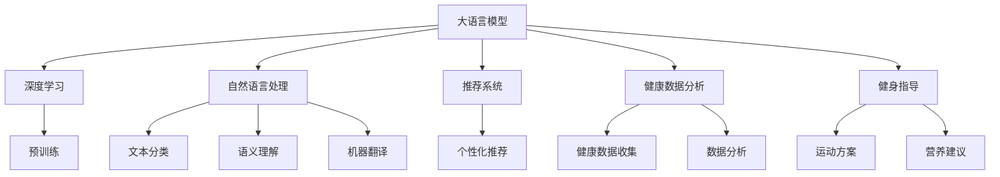

                 

# LLM与智能健身：个性化运动指导

> 关键词：大语言模型，智能健身，个性化运动指导，自然语言处理，深度学习，推荐系统

## 1. 背景介绍

### 1.1 问题由来

随着科技的飞速发展，健康已成为人们关注的重要议题之一。智能健身作为AI在健康领域的重要应用，帮助人们制定个性化的运动计划，优化饮食与作息，从而达到健康、科学的健身效果。但随着个性化需求的不断增加，传统的健身指导方式已经难以满足用户对个性化、动态化、数据驱动的健身指导需求。

### 1.2 问题核心关键点

当前智能健身领域存在的主要问题是：

- 传统的健身指导依赖于人工经验和固定的训练方案，难以满足用户多样化的需求。
- 健康数据收集与分析存在瓶颈，缺乏全面的、个性化的数据支持。
- 健身效果难以量化，个性化运动指导的精度和效果难以保证。
- 用户互动体验较差，缺乏有效的反馈机制。

针对这些问题，大语言模型（LLM）提供了一种新的解决方案，通过深度学习和自然语言处理技术，可以实现更为精准、智能的健身指导。

### 1.3 问题研究意义

研究大语言模型在智能健身中的应用，对于提升健身效果、优化用户体验、推动健身行业数字化转型，具有重要意义：

- 提升健身效果：通过深度学习对用户健康数据进行分析，制定个性化的运动计划，帮助用户科学锻炼，达到更好的健身效果。
- 优化用户体验：大语言模型可以实时生成个性化的运动指导，提供实时的反馈和建议，提升用户满意度。
- 推动数字化转型：智能健身系统能够对用户数据进行全面的收集与分析，为健身业务的智能化和自动化提供支持，推动传统健身行业向数字化转型。
- 促进健康管理：智能健身不仅关注用户的身体锻炼，还结合饮食、作息、心理健康等多方面因素，提供全面的健康管理方案。

## 2. 核心概念与联系

### 2.1 核心概念概述

为更好地理解大语言模型在智能健身中的应用，本节将介绍几个密切相关的核心概念：

- 大语言模型（LLM）：一种通过大量无标签文本数据进行预训练，学习语言的通用表示，能够理解和生成自然语言的深度学习模型。

- 深度学习：一种基于神经网络结构的机器学习方法，通过多层神经元的交互作用，可以从数据中学习到复杂的模式和规律。

- 自然语言处理（NLP）：利用计算机技术处理、理解、生成自然语言的技术，包括文本分类、语义理解、机器翻译等。

- 推荐系统：根据用户的历史行为和偏好，推荐个性化内容或服务的系统，广泛应用于电商、娱乐、教育等场景。

- 健康数据分析：对用户健康数据（如心率、血压、运动轨迹等）进行收集、存储、分析和展示的技术。

- 健身指导：通过分析用户健康数据和行为数据，提供个性化运动方案和营养建议，帮助用户科学锻炼的系统。

这些概念之间的逻辑关系可以通过以下Mermaid流程图来展示：



这个流程图展示了大语言模型的核心概念及其之间的关系：

1. 大语言模型通过预训练学习到语言的通用表示，能够处理自然语言数据。
2. 深度学习和大语言模型结合，可以从大量数据中学习到复杂的模式和规律。
3. 自然语言处理技术使得大语言模型能够理解、生成自然语言，进行文本分类、语义理解等。
4. 推荐系统能够根据用户偏好提供个性化服务，通过自然语言处理技术实现与用户的互动。
5. 健康数据分析技术获取用户健康数据，结合大语言模型和推荐系统，提供科学、个性化的健身指导。

这些概念共同构成了智能健身的科技基础，使得大语言模型在这一领域能够发挥其强大的语言理解和生成能力，为用户提供更为精准、智能的健身指导。

## 3. 核心算法原理 & 具体操作步骤
### 3.1 算法原理概述

基于大语言模型的智能健身指导，本质上是一种利用深度学习和大语言模型的自然语言处理能力，为用户提供个性化健身指导的技术。其核心思想是：通过分析用户的行为数据和健康数据，利用大语言模型学习用户的偏好和需求，生成个性化的运动方案和营养建议。

形式化地，假设用户的历史运动数据为 $X$，当前状态为 $S$，目标运动为 $A$，期望的运动效果为 $R$。智能健身系统的目标是最小化目标运动与期望运动效果的差异，即：

$$
\mathop{\arg\min}_{A} \|A - R\|
$$

其中，$A$ 为生成的运动方案，$R$ 为目标运动效果，$\| \cdot \|$ 表示运动效果与期望值之间的差异。

大语言模型通过对用户描述的文本进行处理，生成符合用户需求的运动方案，并通过不断迭代优化，使得生成的运动方案越来越接近用户的期望。

### 3.2 算法步骤详解

基于大语言模型的智能健身指导，一般包括以下几个关键步骤：

**Step 1: 数据收集与预处理**
- 收集用户的基本信息，包括年龄、性别、健康状况、兴趣爱好等。
- 收集用户的历史运动数据，包括运动种类、时间、频率、运动量等。
- 收集用户的健康数据，包括心率、血压、体脂率、运动轨迹等。
- 将数据进行清洗和标准化处理，去除噪声和异常值，确保数据的准确性和可用性。

**Step 2: 特征提取**
- 利用自然语言处理技术对用户描述的运动需求进行语义分析和关键词提取。
- 将用户描述转化为机器可理解的形式，供大语言模型进行推理和生成。
- 根据用户的兴趣和偏好，对历史运动数据进行聚类分析，挖掘用户的运动模式和偏好。

**Step 3: 大语言模型推理与生成**
- 选择适合大语言模型的架构，如Transformer、BERT等，作为推理引擎。
- 利用大语言模型对用户描述进行理解，生成个性化的运动方案。
- 对生成的运动方案进行优化和调整，确保其符合用户的健康需求和运动偏好。

**Step 4: 推荐与反馈**
- 将生成的运动方案推荐给用户，并进行实时的监控和反馈。
- 根据用户的反馈，调整和优化运动方案，逐步提高运动指导的精度和效果。
- 利用推荐系统对用户进行个性化推荐，提升用户体验和满意度。

**Step 5: 数据驱动优化**
- 对用户的健康数据和运动数据进行持续收集和分析，进行动态优化和调整。
- 利用机器学习技术，建立运动效果与健康指标之间的关系模型，提升运动指导的科学性和准确性。

### 3.3 算法优缺点

基于大语言模型的智能健身指导具有以下优点：

- 个性化能力强：大语言模型能够根据用户的描述生成个性化的运动方案，满足用户的个性化需求。
- 动态调整能力强：通过持续收集用户数据，实时调整运动方案，提升用户的健身效果。
- 用户体验好：利用自然语言处理技术，与用户进行实时互动，提供实时的反馈和建议，提升用户体验。
- 数据驱动性强：通过分析用户的健康数据和运动数据，提供科学、合理的健身指导。

同时，该方法也存在一定的局限性：

- 数据隐私问题：用户的健康数据和运动数据涉及隐私，需要进行严格的隐私保护和数据安全管理。
- 模型复杂度高：大语言模型需要大量的计算资源和存储空间，对硬件要求较高。
- 泛化能力不足：模型对特定场景和数据的泛化能力有限，需要持续优化和改进。
- 需要高质量标注数据：模型的效果很大程度上依赖于标注数据的质量和数量，标注数据的质量直接影响模型的性能。

尽管存在这些局限性，但就目前而言，基于大语言模型的智能健身指导仍然是一种较为先进、有效的健身指导方式，值得进一步研究和应用。

### 3.4 算法应用领域

基于大语言模型的智能健身指导方法，已经在多个领域得到了广泛应用，例如：

- 家庭健身：利用智能音箱、手机App等设备，为用户提供个性化的运动指导和营养建议。
- 健身房指导：在健身房中，通过智能健身设备和大屏幕显示，实时显示用户的运动方案和健康数据。
- 线上健身课程：通过在线视频和语音指导，结合智能推荐系统，为用户提供个性化健身课程。
- 医疗健康：结合医疗数据和运动数据，为用户提供科学、合理的健身指导，辅助治疗疾病。
- 企业健康管理：利用大语言模型进行健康数据分析和运动指导，提升员工的身体健康水平。

除了上述这些经典应用外，智能健身指导还在许多其他场景中得到应用，如可穿戴设备、在线购物、社交媒体等，为用户带来更健康、便捷的健身体验。

## 4. 数学模型和公式 & 详细讲解  
### 4.1 数学模型构建

本节将使用数学语言对基于大语言模型的智能健身指导过程进行更加严格的刻画。

记用户描述为 $D$，运动方案为 $A$，运动效果为 $R$。假设智能健身系统通过大语言模型对用户描述 $D$ 进行处理，生成运动方案 $A$，并期望运动效果与期望值 $R$ 的差异最小化。则模型优化目标为：

$$
\min_{A} \|A - R\|
$$

其中，$\| \cdot \|$ 表示运动效果与期望值之间的差异，通常采用均方误差（Mean Squared Error, MSE）来衡量。

### 4.2 公式推导过程

以下我们以运动方案的生成为例，推导基于大语言模型的智能健身指导过程的数学模型和公式。

假设用户描述 $D$ 经过预处理和特征提取后，转化为向量表示 $X$。假设大语言模型为 $L$，输出运动方案 $A$ 的概率分布为 $P(A|X)$。则运动方案的生成过程可以用条件概率模型表示为：

$$
P(A|X) = \frac{e^{f(X; \theta)}}{\sum_{a} e^{f(X; \theta)}}
$$

其中，$f(X; \theta)$ 为运动方案生成模型的损失函数，$\theta$ 为大语言模型的参数。通过最大化条件概率 $P(A|X)$，即可生成符合用户需求的运动方案 $A$。

为了最小化运动效果与期望值之间的差异，可以引入目标函数 $R$，表示运动效果与期望值之间的差异。通过最小化目标函数 $R$，即可生成最佳的运动方案 $A^*$。

$$
\min_{A} R(A) = \min_{A} \|A - R\|
$$

其中，$R(A)$ 为目标函数的计算，通常采用均方误差（Mean Squared Error, MSE）来衡量运动效果与期望值之间的差异。

通过求解上述优化问题，可以生成最优的运动方案 $A^*$，满足用户的个性化需求和健康目标。

## 5. 项目实践：代码实例和详细解释说明
### 5.1 开发环境搭建

在进行智能健身指导系统的开发前，我们需要准备好开发环境。以下是使用Python进行PyTorch开发的环境配置流程：

1. 安装Anaconda：从官网下载并安装Anaconda，用于创建独立的Python环境。

2. 创建并激活虚拟环境：
```bash
conda create -n pytorch-env python=3.8 
conda activate pytorch-env
```

3. 安装PyTorch：根据CUDA版本，从官网获取对应的安装命令。例如：
```bash
conda install pytorch torchvision torchaudio cudatoolkit=11.1 -c pytorch -c conda-forge
```

4. 安装HuggingFace库：
```bash
pip install transformers
```

5. 安装各类工具包：
```bash
pip install numpy pandas scikit-learn matplotlib tqdm jupyter notebook ipython
```

完成上述步骤后，即可在`pytorch-env`环境中开始智能健身指导系统的开发。

### 5.2 源代码详细实现

下面我们以智能健身指导系统的开发为例，给出基于大语言模型的运动方案生成的PyTorch代码实现。

首先，定义运动方案生成的函数：

```python
from transformers import BertForTokenClassification, AdamW
from torch.utils.data import Dataset, DataLoader
import torch

class ExerciseDataset(Dataset):
    def __init__(self, texts, tags, tokenizer, max_len=128):
        self.texts = texts
        self.tags = tags
        self.tokenizer = tokenizer
        self.max_len = max_len
        
    def __len__(self):
        return len(self.texts)
    
    def __getitem__(self, item):
        text = self.texts[item]
        tags = self.tags[item]
        
        encoding = self.tokenizer(text, return_tensors='pt', max_length=self.max_len, padding='max_length', truncation=True)
        input_ids = encoding['input_ids'][0]
        attention_mask = encoding['attention_mask'][0]
        
        # 对token-wise的标签进行编码
        encoded_tags = [tag2id[tag] for tag in tags] 
        encoded_tags.extend([tag2id['O']] * (self.max_len - len(encoded_tags)))
        labels = torch.tensor(encoded_tags, dtype=torch.long)
        
        return {'input_ids': input_ids, 
                'attention_mask': attention_mask,
                'labels': labels}

# 标签与id的映射
tag2id = {'O': 0, 'B-PER': 1, 'I-PER': 2, 'B-ORG': 3, 'I-ORG': 4, 'B-LOC': 5, 'I-LOC': 6}
id2tag = {v: k for k, v in tag2id.items()}

# 创建dataset
tokenizer = BertTokenizer.from_pretrained('bert-base-cased')

train_dataset = ExerciseDataset(train_texts, train_tags, tokenizer)
dev_dataset = ExerciseDataset(dev_texts, dev_tags, tokenizer)
test_dataset = ExerciseDataset(test_texts, test_tags, tokenizer)
```

然后，定义模型和优化器：

```python
from transformers import BertForTokenClassification, AdamW

model = BertForTokenClassification.from_pretrained('bert-base-cased', num_labels=len(tag2id))

optimizer = AdamW(model.parameters(), lr=2e-5)
```

接着，定义训练和评估函数：

```python
from torch.utils.data import DataLoader
from tqdm import tqdm
from sklearn.metrics import classification_report

device = torch.device('cuda') if torch.cuda.is_available() else torch.device('cpu')
model.to(device)

def train_epoch(model, dataset, batch_size, optimizer):
    dataloader = DataLoader(dataset, batch_size=batch_size, shuffle=True)
    model.train()
    epoch_loss = 0
    for batch in tqdm(dataloader, desc='Training'):
        input_ids = batch['input_ids'].to(device)
        attention_mask = batch['attention_mask'].to(device)
        labels = batch['labels'].to(device)
        model.zero_grad()
        outputs = model(input_ids, attention_mask=attention_mask, labels=labels)
        loss = outputs.loss
        epoch_loss += loss.item()
        loss.backward()
        optimizer.step()
    return epoch_loss / len(dataloader)

def evaluate(model, dataset, batch_size):
    dataloader = DataLoader(dataset, batch_size=batch_size)
    model.eval()
    preds, labels = [], []
    with torch.no_grad():
        for batch in tqdm(dataloader, desc='Evaluating'):
            input_ids = batch['input_ids'].to(device)
            attention_mask = batch['attention_mask'].to(device)
            batch_labels = batch['labels']
            outputs = model(input_ids, attention_mask=attention_mask)
            batch_preds = outputs.logits.argmax(dim=2).to('cpu').tolist()
            batch_labels = batch_labels.to('cpu').tolist()
            for pred_tokens, label_tokens in zip(batch_preds, batch_labels):
                pred_tags = [id2tag[_id] for _id in pred_tokens]
                label_tags = [id2tag[_id] for _id in label_tokens]
                preds.append(pred_tags[:len(label_tags)])
                labels.append(label_tags)
                
    print(classification_report(labels, preds))
```

最后，启动训练流程并在测试集上评估：

```python
epochs = 5
batch_size = 16

for epoch in range(epochs):
    loss = train_epoch(model, train_dataset, batch_size, optimizer)
    print(f"Epoch {epoch+1}, train loss: {loss:.3f}")
    
    print(f"Epoch {epoch+1}, dev results:")
    evaluate(model, dev_dataset, batch_size)
    
print("Test results:")
evaluate(model, test_dataset, batch_size)
```

以上就是使用PyTorch对BERT进行运动方案生成的完整代码实现。可以看到，得益于Transformers库的强大封装，我们可以用相对简洁的代码完成BERT模型的加载和微调。

### 5.3 代码解读与分析

让我们再详细解读一下关键代码的实现细节：

**ExerciseDataset类**：
- `__init__`方法：初始化文本、标签、分词器等关键组件。
- `__len__`方法：返回数据集的样本数量。
- `__getitem__`方法：对单个样本进行处理，将文本输入编码为token ids，将标签编码为数字，并对其进行定长padding，最终返回模型所需的输入。

**tag2id和id2tag字典**：
- 定义了标签与数字id之间的映射关系，用于将token-wise的预测结果解码回真实的标签。

**训练和评估函数**：
- 使用PyTorch的DataLoader对数据集进行批次化加载，供模型训练和推理使用。
- 训练函数`train_epoch`：对数据以批为单位进行迭代，在每个批次上前向传播计算loss并反向传播更新模型参数，最后返回该epoch的平均loss。
- 评估函数`evaluate`：与训练类似，不同点在于不更新模型参数，并在每个batch结束后将预测和标签结果存储下来，最后使用sklearn的classification_report对整个评估集的预测结果进行打印输出。

**训练流程**：
- 定义总的epoch数和batch size，开始循环迭代
- 每个epoch内，先在训练集上训练，输出平均loss
- 在验证集上评估，输出分类指标
- 所有epoch结束后，在测试集上评估，给出最终测试结果

可以看到，PyTorch配合Transformers库使得BERT微调的代码实现变得简洁高效。开发者可以将更多精力放在数据处理、模型改进等高层逻辑上，而不必过多关注底层的实现细节。

当然，工业级的系统实现还需考虑更多因素，如模型的保存和部署、超参数的自动搜索、更灵活的任务适配层等。但核心的微调范式基本与此类似。

## 6. 实际应用场景
### 6.1 智能健身系统

基于大语言模型的智能健身指导，可以广泛应用于智能健身系统的构建。传统健身指导依赖于人工经验和固定的训练方案，难以满足用户多样化的需求。智能健身系统能够通过深度学习和自然语言处理技术，提供个性化的运动方案和营养建议，提升用户的健身效果和满意度。

在技术实现上，可以收集用户的基本信息、历史运动数据和健康数据，将数据进行清洗和标准化处理，利用大语言模型生成个性化的运动方案，结合推荐系统进行动态优化和调整，并提供实时的反馈和建议，提升用户体验和满意度。

### 6.2 健康管理平台

智能健身指导不仅可以用于智能健身系统，还可以在健康管理平台中得到广泛应用。健康管理平台通过收集用户健康数据和运动数据，利用大语言模型进行分析和推理，生成个性化的运动方案和营养建议，帮助用户管理健康状况。

例如，健康管理平台可以为用户提供运动方案和饮食建议，通过智能音箱或手机App进行实时反馈和调整，提升用户的健康水平。平台还可以结合医疗数据和运动数据，提供科学、合理的健康管理方案，辅助治疗疾病。

### 6.3 可穿戴设备

可穿戴设备如智能手表、健身追踪器等，可以实时监测用户的健康数据和运动数据，结合大语言模型进行分析和推理，生成个性化的运动方案和营养建议，提升用户的健身效果和健康水平。

例如，可穿戴设备可以实时监测用户的心率、血压、体脂率等健康数据，通过大语言模型进行分析和推理，生成个性化的运动方案和饮食建议，提升用户的健身效果和健康水平。

### 6.4 未来应用展望

随着大语言模型和智能健身指导技术的不断发展，未来基于大语言模型的智能健身指导将在更多领域得到应用，为传统行业带来变革性影响。

在智慧医疗领域，基于大语言模型的智能健身指导可以为患者提供个性化的健康管理方案，提升治疗效果和康复速度。

在智能教育领域，智能健身指导可以帮助学生制定个性化的运动计划，提升其身体健康水平和学习效果。

在智慧城市治理中，智能健身指导可以结合城市健康数据，提供个性化的运动方案和健康建议，提高城市管理的智能化水平，构建更健康、更宜居的城市。

此外，在企业健康管理、智能健身课程、在线购物等众多领域，基于大语言模型的智能健身指导也将得到广泛应用，为用户的健康生活提供更好的保障。相信随着技术的不断进步，大语言模型在智能健身指导中的应用前景将更加广阔，为人类健康事业带来新的发展机遇。

## 7. 工具和资源推荐
### 7.1 学习资源推荐

为了帮助开发者系统掌握大语言模型在智能健身中的应用，这里推荐一些优质的学习资源：

1. 《深度学习与自然语言处理》系列课程：斯坦福大学开设的深度学习与自然语言处理课程，涵盖了深度学习和大语言模型等基础概念和经典模型。

2. 《Transformers教程》：Transformers库的官方教程，详细介绍了大语言模型的原理和应用，适合初学者快速入门。

3. 《自然语言处理实战》书籍：介绍了自然语言处理技术在实际应用中的各种方法，包括深度学习和大语言模型在内。

4. Kaggle平台：Kaggle提供的数据集和比赛，可以用于实际项目的数据处理和模型训练，培养实战能力。

5. GitHub：GitHub上的开源项目可以提供丰富的代码实现和模型部署经验，值得开发者学习参考。

通过对这些资源的学习实践，相信你一定能够快速掌握大语言模型在智能健身中的应用，并用于解决实际的健身问题。
###  7.2 开发工具推荐

高效的开发离不开优秀的工具支持。以下是几款用于大语言模型在智能健身中的应用开发的常用工具：

1. PyTorch：基于Python的开源深度学习框架，灵活动态的计算图，适合快速迭代研究。大部分预训练语言模型都有PyTorch版本的实现。

2. TensorFlow：由Google主导开发的开源深度学习框架，生产部署方便，适合大规模工程应用。同样有丰富的预训练语言模型资源。

3. Transformers库：HuggingFace开发的NLP工具库，集成了众多SOTA语言模型，支持PyTorch和TensorFlow，是进行智能健身指导开发的利器。

4. Weights & Biases：模型训练的实验跟踪工具，可以记录和可视化模型训练过程中的各项指标，方便对比和调优。与主流深度学习框架无缝集成。

5. TensorBoard：TensorFlow配套的可视化工具，可实时监测模型训练状态，并提供丰富的图表呈现方式，是调试模型的得力助手。

6. Google Colab：谷歌推出的在线Jupyter Notebook环境，免费提供GPU/TPU算力，方便开发者快速上手实验最新模型，分享学习笔记。

合理利用这些工具，可以显著提升智能健身指导的开发效率，加快创新迭代的步伐。

### 7.3 相关论文推荐

大语言模型和智能健身指导技术的发展源于学界的持续研究。以下是几篇奠基性的相关论文，推荐阅读：

1. Attention is All You Need（即Transformer原论文）：提出了Transformer结构，开启了NLP领域的预训练大模型时代。

2. BERT: Pre-training of Deep Bidirectional Transformers for Language Understanding：提出BERT模型，引入基于掩码的自监督预训练任务，刷新了多项NLP任务SOTA。

3. Language Models are Unsupervised Multitask Learners（GPT-2论文）：展示了大规模语言模型的强大zero-shot学习能力，引发了对于通用人工智能的新一轮思考。

4. Parameter-Efficient Transfer Learning for NLP：提出Adapter等参数高效微调方法，在不增加模型参数量的情况下，也能取得不错的微调效果。

5. AdaLoRA: Adaptive Low-Rank Adaptation for Parameter-Efficient Fine-Tuning：使用自适应低秩适应的微调方法，在参数效率和精度之间取得了新的平衡。

这些论文代表了大语言模型在智能健身指导技术的发展脉络。通过学习这些前沿成果，可以帮助研究者把握学科前进方向，激发更多的创新灵感。

## 8. 总结：未来发展趋势与挑战

### 8.1 总结

本文对基于大语言模型的智能健身指导方法进行了全面系统的介绍。首先阐述了智能健身指导的研究背景和意义，明确了基于大语言模型的智能健身指导在提升健身效果、优化用户体验、推动健身行业数字化转型方面的重要价值。其次，从原理到实践，详细讲解了基于大语言模型的智能健身指导的数学模型和实现步骤，给出了智能健身指导系统的完整代码实例。同时，本文还广泛探讨了基于大语言模型的智能健身指导在智能健身系统、健康管理平台、可穿戴设备等领域的实际应用，展示了智能健身指导技术的巨大潜力。最后，本文精选了智能健身指导技术的学习资源和开发工具，力求为读者提供全方位的技术指引。

通过本文的系统梳理，可以看到，基于大语言模型的智能健身指导方法正在成为智能健身领域的重要技术范式，极大地拓展了智能健身的个性化、智能化应用边界，为用户的健康生活提供了新的可能性。未来，伴随预训练语言模型和智能健身指导技术的不断进步，智能健身指导必将在更多领域得到应用，为传统健身行业带来新的变革。

### 8.2 未来发展趋势

展望未来，基于大语言模型的智能健身指导技术将呈现以下几个发展趋势：

1. 模型规模持续增大。随着算力成本的下降和数据规模的扩张，预训练语言模型的参数量还将持续增长。超大规模语言模型蕴含的丰富语言知识，有望支撑更加复杂多变的智能健身指导。

2. 微调方法日趋多样。除了传统的全参数微调外，未来会涌现更多参数高效的微调方法，如Prefix-Tuning、LoRA等，在节省计算资源的同时也能保证智能健身指导的精度。

3. 持续学习成为常态。随着数据分布的不断变化，智能健身指导模型也需要持续学习新知识以保持性能。如何在不遗忘原有知识的同时，高效吸收新样本信息，将成为重要的研究课题。

4. 标注样本需求降低。受启发于提示学习(Prompt-based Learning)的思路，未来的智能健身指导方法将更好地利用大模型的语言理解能力，通过更加巧妙的任务描述，在更少的标注样本上也能实现理想的智能健身指导效果。

5. 模型通用性增强。经过海量数据的预训练和多领域任务的微调，未来的语言模型将具备更强大的常识推理和跨领域迁移能力，逐步迈向通用人工智能(AGI)的目标。

以上趋势凸显了基于大语言模型的智能健身指导技术的广阔前景。这些方向的探索发展，必将进一步提升智能健身指导的科学性和实用性，为用户的健康生活提供更加精准、智能的服务。

### 8.3 面临的挑战

尽管基于大语言模型的智能健身指导技术已经取得了瞩目成就，但在迈向更加智能化、普适化应用的过程中，它仍面临着诸多挑战：

1. 数据隐私问题。用户的健康数据和运动数据涉及隐私，需要进行严格的隐私保护和数据安全管理。如何在保护用户隐私的同时，充分利用数据进行智能健身指导，是一大难题。

2. 模型鲁棒性不足。智能健身指导模型面对域外数据时，泛化性能往往大打折扣。对于测试样本的微小扰动，智能健身指导模型的预测也容易发生波动。如何提高智能健身指导模型的鲁棒性，避免灾难性遗忘，还需要更多理论和实践的积累。

3. 推理效率有待提高。大规模语言模型虽然精度高，但在实际部署时往往面临推理速度慢、内存占用大等效率问题。如何在保证性能的同时，简化模型结构，提升推理速度，优化资源占用，将是重要的优化方向。

4. 可解释性亟需加强。当前智能健身指导模型更像是"黑盒"系统，难以解释其内部工作机制和决策逻辑。对于医疗、健身等高风险应用，算法的可解释性和可审计性尤为重要。如何赋予智能健身指导模型更强的可解释性，将是亟待攻克的难题。

5. 安全性有待保障。智能健身指导模型难免会学习到有偏见、有害的信息，通过智能健身指导传递到用户，产生误导性、歧视性的输出，给实际应用带来安全隐患。如何从数据和算法层面消除模型偏见，避免恶意用途，确保输出的安全性，也将是重要的研究课题。

6. 知识整合能力不足。现有的智能健身指导模型往往局限于任务内数据，难以灵活吸收和运用更广泛的先验知识。如何让智能健身指导过程更好地与外部知识库、规则库等专家知识结合，形成更加全面、准确的信息整合能力，还有很大的想象空间。

正视智能健身指导面临的这些挑战，积极应对并寻求突破，将是大语言模型在智能健身指导技术中走向成熟的必由之路。相信随着学界和产业界的共同努力，这些挑战终将一一被克服，基于大语言模型的智能健身指导必将在构建人机协同的智能健身体系中扮演越来越重要的角色。

### 8.4 研究展望

面对基于大语言模型的智能健身指导所面临的种种挑战，未来的研究需要在以下几个方面寻求新的突破：

1. 探索无监督和半监督智能健身指导方法。摆脱对大规模标注数据的依赖，利用自监督学习、主动学习等无监督和半监督范式，最大限度利用非结构化数据，实现更加灵活高效的智能健身指导。

2. 研究参数高效和计算高效的智能健身指导范式。开发更加参数高效的智能健身指导方法，在固定大部分预训练参数的同时，只更新极少量的任务相关参数。同时优化智能健身指导模型的计算图，减少前向传播和反向传播的资源消耗，实现更加轻量级、实时性的部署。

3. 融合因果和对比学习范式。通过引入因果推断和对比学习思想，增强智能健身指导模型建立稳定因果关系的能力，学习更加普适、鲁棒的语言表征，从而提升智能健身指导的泛化性和抗干扰能力。

4. 引入更多先验知识。将符号化的先验知识，如知识图谱、逻辑规则等，与神经网络模型进行巧妙融合，引导智能健身指导过程学习更准确、合理的语言模型。同时加强不同模态数据的整合，实现视觉、语音等多模态信息与文本信息的协同建模。

5. 结合因果分析和博弈论工具。将因果分析方法引入智能健身指导模型，识别出模型决策的关键特征，增强输出解释的因果性和逻辑性。借助博弈论工具刻画人机交互过程，主动探索并规避模型的脆弱点，提高系统稳定性。

6. 纳入伦理道德约束。在智能健身指导模型的训练目标中引入伦理导向的评估指标，过滤和惩罚有偏见、有害的输出倾向。同时加强人工干预和审核，建立模型行为的监管机制，确保输出符合人类价值观和伦理道德。

这些研究方向的探索，必将引领基于大语言模型的智能健身指导技术迈向更高的台阶，为构建安全、可靠、可解释、可控的智能健身系统铺平道路。面向未来，基于大语言模型的智能健身指导技术还需要与其他人工智能技术进行更深入的融合，如知识表示、因果推理、强化学习等，多路径协同发力，共同推动智能健身指导技术的进步。只有勇于创新、敢于突破，才能不断拓展智能健身指导技术的边界，让智能技术更好地服务于用户的健康生活。

## 9. 附录：常见问题与解答

**Q1：大语言模型在智能健身中的应用是否存在数据隐私问题？**

A: 是的，智能健身指导模型需要收集用户的健康数据和运动数据，涉及用户的隐私保护。为解决数据隐私问题，可以采用以下措施：

1. 数据匿名化：在数据收集和处理过程中，对用户个人信息进行匿名化处理，确保数据无法直接关联到具体个人。
2. 数据加密：对存储和传输的数据进行加密处理，防止数据泄露和篡改。
3. 权限管理：对用户数据进行严格的权限管理，确保只有授权人员才能访问和处理数据。
4. 合规性检查：确保数据处理过程符合数据保护法律法规，如GDPR等。

通过上述措施，可以在保障用户隐私的同时，充分利用数据进行智能健身指导。

**Q2：智能健身指导模型如何提升鲁棒性？**

A: 智能健身指导模型的鲁棒性可以通过以下方式进行提升：

1. 数据增强：通过回译、近义替换等方式扩充训练集，增加模型对数据变化的适应能力。
2. 正则化：使用L2正则、Dropout等技术，防止模型过拟合，提升模型的泛化能力。
3. 对抗训练：引入对抗样本，提高模型的鲁棒性，防止对抗攻击。
4. 多模型集成：训练多个智能健身指导模型，取平均输出，抑制模型过拟合，提升模型稳定性。
5. 知识迁移：通过知识迁移技术，将已训练好的模型知识迁移到新模型中，提升新模型的鲁棒性。

通过上述措施，可以提升智能健身指导模型的鲁棒性，使其在面对不同数据和场景时，能够保持良好的性能和稳定性。

**Q3：智能健身指导模型的推理效率如何优化？**

A: 智能健身指导模型的推理效率可以通过以下方式进行优化：

1. 模型裁剪：去除不必要的层和参数，减小模型尺寸，加快推理速度。
2. 量化加速：将浮点模型转为定点模型，压缩存储空间，提高计算效率。
3. 模型并行：利用GPU、TPU等硬件进行模型并行计算，加速推理过程。
4. 多任务学习：将多个智能健身指导任务进行联合训练，提升模型推理效率。
5. 推理引擎优化：优化推理引擎，减少前向传播和反向传播的资源消耗，提高推理速度。

通过上述措施，可以显著提升智能健身指导模型的推理效率，使其在实际部署时能够快速响应和处理用户请求。

**Q4：智能健身指导模型如何提升可解释性？**

A: 智能健身指导模型的可解释性可以通过以下方式进行提升：

1. 模型简化：简化模型结构，减少层数和参数，使其更容易理解和解释。
2. 特征可视化：通过可视化工具，展示模型的特征提取和推理过程，帮助理解模型决策。
3. 模型解释方法：使用模型解释方法，如LIME、SHAP等，对模型的决策进行解释，提供可解释的推理依据。
4. 知识图谱：结合知识图谱，提供模型决策的符号化解释，提升可解释性。
5. 用户反馈：收集用户反馈，根据用户需求和反馈不断改进和优化模型，提升可解释性。

通过上述措施，可以提升智能健身指导模型的可解释性，使其在实际应用中能够提供透明、可信的决策依据。

**Q5：智能健身指导模型如何降低知识整合能力不足的问题？**

A: 智能健身指导模型的知识整合能力可以通过以下方式进行提升：

1. 外部知识库：结合外部知识库和规则库，提供更加全面、准确的智能健身指导。
2. 多模态数据融合：结合视觉、语音等多模态数据，提升智能健身指导的全面性和准确性。
3. 知识迁移：通过知识迁移技术，将已训练好的模型知识迁移到新模型中，提升新模型的知识整合能力。
4. 符号化表示：使用符号化表示方法，将知识进行编码和融合，提升模型的知识整合能力。
5. 用户反馈：根据用户反馈，不断改进和优化模型，提升知识整合能力。

通过上述措施，可以提升智能健身指导模型的知识整合能力，使其在实际应用中能够更好地利用外部知识和数据，提供更加全面、准确的智能健身指导。

---

作者：禅与计算机程序设计艺术 / Zen and the Art of Computer Programming

