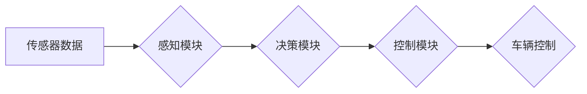

> 自动驾驶, 端到端学习, 鲁棒性, 深度学习, 计算机视觉, 强化学习, 安全性

## 1. 背景介绍

自动驾驶技术作为未来交通运输的重要发展方向，近年来取得了显著进展。端到端自动驾驶，即利用深度学习模型直接从传感器数据中学习驾驶策略，已成为该领域的研究热点。然而，端到端自动驾驶系统面临着诸多挑战，其中鲁棒性问题尤为突出。

传统的自动驾驶系统通常采用规则-基于模型的方法，将驾驶任务分解成多个子任务，并分别设计相应的算法。这种方法虽然在特定场景下表现良好，但缺乏泛化能力，难以应对复杂、多变的实际道路环境。

端到端自动驾驶系统通过学习全局驾驶策略，能够更好地适应复杂环境，并具有更高的泛化能力。然而，由于其学习过程依赖于海量数据，且模型结构复杂，因此更容易受到噪声、干扰和异常情况的影响，导致鲁棒性不足。

## 2. 核心概念与联系

端到端自动驾驶系统主要由以下几个核心模块组成：

* **传感器模块:** 负责获取车辆周围环境信息，常用的传感器包括摄像头、雷达、激光雷达等。
* **感知模块:** 对传感器数据进行处理，识别道路边界、车辆、行人等目标，并构建环境地图。
* **决策模块:** 根据感知结果，规划车辆行驶路径和控制策略。
* **控制模块:** 将决策结果转化为车辆的实际控制指令，例如转向、加速、制动等。

**Mermaid 流程图:**



## 3. 核心算法原理 & 具体操作步骤

### 3.1  算法原理概述

端到端自动驾驶系统主要采用深度学习算法进行训练，常用的算法包括卷积神经网络（CNN）、循环神经网络（RNN）和强化学习（RL）。

* **CNN:** 用于处理图像数据，例如摄像头采集的图像，可以提取图像特征，识别目标。
* **RNN:** 用于处理序列数据，例如车辆的历史行驶轨迹，可以学习时间序列模式，预测未来行为。
* **RL:** 用于训练决策模块，通过奖励机制引导模型学习最优的驾驶策略。

### 3.2  算法步骤详解

1. **数据收集:** 收集大量真实道路场景数据，包括传感器数据、驾驶轨迹、地图信息等。
2. **数据预处理:** 对收集到的数据进行清洗、格式化、标注等处理，使其适合深度学习模型训练。
3. **模型构建:** 根据任务需求，选择合适的深度学习模型架构，并进行参数初始化。
4. **模型训练:** 利用训练数据，通过反向传播算法，调整模型参数，使模型能够准确预测目标和规划驾驶策略。
5. **模型评估:** 利用测试数据，评估模型的性能，例如准确率、召回率、平均行驶距离等。
6. **模型部署:** 将训练好的模型部署到实际车辆中，实现自动驾驶功能。

### 3.3  算法优缺点

**优点:**

* 能够学习复杂的驾驶策略，适应多变的道路环境。
* 具有较高的泛化能力，能够在未见过的场景下进行驾驶。

**缺点:**

* 依赖于海量数据，数据标注成本高。
* 模型结构复杂，训练过程耗时且资源消耗大。
* 鲁棒性不足，容易受到噪声、干扰和异常情况的影响。

### 3.4  算法应用领域

端到端自动驾驶算法广泛应用于自动驾驶汽车、无人机、机器人等领域。

## 4. 数学模型和公式 & 详细讲解 & 举例说明

### 4.1  数学模型构建

端到端自动驾驶系统可以抽象为一个马尔可夫决策过程（MDP），其中：

* **状态空间:** 包含车辆的位置、速度、方向、周围环境信息等。
* **动作空间:** 包含车辆的控制指令，例如转向、加速、制动等。
* **奖励函数:** 根据车辆的行为和环境状态，给予相应的奖励或惩罚。
* **转移概率:** 描述车辆在执行特定动作后，状态转移的概率。

### 4.2  公式推导过程

强化学习算法的目标是找到一个最优策略，使得车辆在整个驾驶过程中获得最大的总奖励。常用的强化学习算法包括Q学习、SARSA等。

**Q学习算法:**

$$
Q(s,a) = Q(s,a) + \alpha [r + \gamma \max_{a'} Q(s',a') - Q(s,a)]
$$

其中：

* $Q(s,a)$ 表示在状态 $s$ 下执行动作 $a$ 的价值函数。
* $\alpha$ 为学习率。
* $r$ 为奖励。
* $\gamma$ 为折扣因子。
* $s'$ 为下一个状态。

### 4.3  案例分析与讲解

假设车辆处于十字路口，需要选择转向方向。

* 如果选择向左转，奖励为 1，下一个状态为左转弯后的路段。
* 如果选择向右转，奖励为 0，下一个状态为原地。

根据 Q 学习算法，车辆会根据当前状态、动作价值函数和奖励信息，选择最优动作，从而实现安全、高效的驾驶。

## 5. 项目实践：代码实例和详细解释说明

### 5.1  开发环境搭建

* 操作系统: Ubuntu 20.04
* 编程语言: Python 3.8
* 深度学习框架: TensorFlow 2.0
* 其他依赖库: NumPy, OpenCV, PyTorch

### 5.2  源代码详细实现

```python
# 导入必要的库
import tensorflow as tf

# 定义模型架构
model = tf.keras.models.Sequential([
    tf.keras.layers.Conv2D(32, (3, 3), activation='relu', input_shape=(64, 64, 3)),
    tf.keras.layers.MaxPooling2D((2, 2)),
    tf.keras.layers.Conv2D(64, (3, 3), activation='relu'),
    tf.keras.layers.MaxPooling2D((2, 2)),
    tf.keras.layers.Flatten(),
    tf.keras.layers.Dense(10, activation='softmax')
])

# 定义损失函数和优化器
loss_fn = tf.keras.losses.CategoricalCrossentropy()
optimizer = tf.keras.optimizers.Adam(learning_rate=0.001)

# 训练模型
model.compile(loss=loss_fn, optimizer=optimizer)
model.fit(x_train, y_train, epochs=10)

# 评估模型
loss, accuracy = model.evaluate(x_test, y_test)
print('Loss:', loss)
print('Accuracy:', accuracy)
```

### 5.3  代码解读与分析

* 代码首先导入必要的库，定义模型架构，并使用卷积神经网络（CNN）进行图像分类。
* 然后定义损失函数和优化器，并使用 `model.compile()` 方法将它们与模型连接起来。
* 接着使用 `model.fit()` 方法训练模型，并使用 `model.evaluate()` 方法评估模型性能。

### 5.4  运行结果展示

训练完成后，可以将模型部署到实际车辆中，实现自动驾驶功能。

## 6. 实际应用场景

端到端自动驾驶技术已在一些场景下得到应用，例如：

* **自动驾驶汽车:** Tesla、Waymo 等公司正在开发基于端到端自动驾驶技术的自动驾驶汽车。
* **无人配送:** 利用无人驾驶汽车或无人机进行货物配送。
* **智能交通:** 利用自动驾驶技术优化交通流量，提高道路安全。

### 6.4  未来应用展望

未来，端到端自动驾驶技术将应用于更广泛的场景，例如：

* **自动驾驶公共交通:** 实现自动驾驶公交车、地铁等公共交通工具。
* **自动驾驶农业:** 利用无人驾驶拖拉机、喷洒机等进行农业生产。
* **自动驾驶医疗:** 利用无人驾驶车辆进行医疗物资运输和患者接送。

## 7. 工具和资源推荐

### 7.1  学习资源推荐

* **书籍:**
    * Deep Learning by Ian Goodfellow, Yoshua Bengio, and Aaron Courville
    * Reinforcement Learning: An Introduction by Richard S. Sutton and Andrew G. Barto
* **在线课程:**
    * Coursera: Deep Learning Specialization
    * Udacity: Self-Driving Car Engineer Nanodegree

### 7.2  开发工具推荐

* **TensorFlow:** 开源深度学习框架
* **PyTorch:** 开源深度学习框架
* **OpenCV:** 图像处理库
* **ROS:** 机器人操作系统

### 7.3  相关论文推荐

* **End to End Learning for Self-Driving Cars** by Bojarski et al. (2016)
* **Learning to Drive with Deep Reinforcement Learning** by Schulman et al. (2015)
* **Deep Reinforcement Learning for Autonomous Driving** by Wang et al. (2018)

## 8. 总结：未来发展趋势与挑战

### 8.1  研究成果总结

端到端自动驾驶技术取得了显著进展，能够实现车辆在复杂道路环境下的自主驾驶。

### 8.2  未来发展趋势

* **模型复杂度提升:** 采用更复杂的深度学习模型，例如Transformer、Graph Neural Network等，提高模型的表达能力和鲁棒性。
* **数据增强技术:** 利用数据增强技术，例如图像仿射变换、合成数据生成等，扩大训练数据规模，提高模型泛化能力。
* **安全性和可靠性提升:** 开发更安全的自动驾驶算法，并进行严格的测试和验证，确保自动驾驶系统的可靠性。

### 8.3  面临的挑战

* **鲁棒性问题:** 端到端自动驾驶系统仍然容易受到噪声、干扰和异常情况的影响，需要进一步提高其鲁棒性。
* **数据标注成本:** 训练端到端自动驾驶模型需要大量标注数据，数据标注成本高昂。
* **伦理问题:** 自动驾驶系统面临着伦理挑战，例如如何处理紧急情况下的决策问题。

### 8.4  研究展望

未来，端到端自动驾驶技术将继续朝着更安全、更可靠、更智能的方向发展。

## 9. 附录：常见问题与解答

**Q1: 端到端自动驾驶和传统自动驾驶有什么区别？**

**A1:** 端到端自动驾驶系统直接从传感器数据中学习驾驶策略，而传统自动驾驶系统则将驾驶任务分解成多个子任务，分别设计相应的算法。

**Q2: 端到端自动驾驶的鲁棒性如何？**

**A2:** 端到端自动驾驶系统仍然面临着鲁棒性问题，容易受到噪声、干扰和异常情况的影响。

**Q3: 端到端自动驾驶的未来发展趋势是什么？**

**A3:** 未来，端到端自动驾驶技术将朝着更安全、更可靠、更智能的方向发展。


作者：禅与计算机程序设计艺术 / Zen and the Art of Computer Programming 
<end_of_turn>