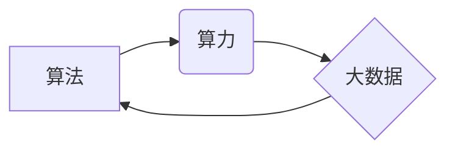

> 
> 算法、算力、大数据、人工智能、机器学习、深度学习、模型训练、数据分析、应用场景

## 1. 背景介绍

人工智能（AI）近年来发展迅速，已成为引领科技发展的重要力量。从自动驾驶到语音识别，从医疗诊断到金融风险控制，AI技术正在深刻地改变着我们的生活和工作方式。然而，AI的发展并非一蹴而就，它离不开三大核心要素：算法、算力和数据。这三者相互依存、相互促进，共同推动着AI技术的进步。

## 2. 核心概念与联系

**2.1 算法**

算法是AI的核心驱动力，它指解决特定问题的一系列步骤或规则。不同的算法适用于不同的任务，例如，用于图像识别的卷积神经网络算法，用于自然语言处理的循环神经网络算法，等等。

**2.2 算力**

算力是指计算机处理信息的速率和能力。AI模型的训练和推理都需要大量的计算资源，因此强大的算力是AI发展的重要保障。随着摩尔定律的放缓，传统CPU的算力提升已趋于瓶颈，GPU、TPU等专用芯片的出现为AI算力提供了新的突破口。

**2.3 大数据**

数据是AI发展的基石，它为算法的训练和优化提供了燃料。AI模型的性能与其所训练的数据量和质量密切相关。随着互联网、物联网等技术的快速发展，海量数据正在不断涌现，为AI的发展提供了丰富的资源。

**2.4 三者关系**

算法、算力和数据相互依存，共同构成了AI的三驾马车。算法提供解决问题的思路，算力提供执行能力，数据提供训练和验证依据。



## 3. 核心算法原理 & 具体操作步骤

### 3.1  算法原理概述

深度学习算法是目前AI领域最热门的算法之一，它能够自动学习数据中的特征，并进行复杂的模式识别和预测。深度学习算法的核心是多层神经网络，每一层神经元都连接着上一层的输出，并进行非线性变换。通过不断调整神经网络的权重，深度学习算法能够学习到数据的复杂规律。

### 3.2  算法步骤详解

1. **数据预处理:** 将原始数据进行清洗、转换和特征工程，使其适合深度学习算法的训练。
2. **网络结构设计:** 根据任务需求设计深度神经网络的结构，包括层数、神经元数量、激活函数等。
3. **模型训练:** 使用训练数据训练深度神经网络，通过反向传播算法不断调整神经网络的权重，使其能够准确地预测目标值。
4. **模型评估:** 使用测试数据评估模型的性能，并根据评估结果进行模型调优。
5. **模型部署:** 将训练好的模型部署到实际应用场景中，用于进行预测或决策。

### 3.3  算法优缺点

**优点:**

* 能够自动学习数据中的特征，无需人工特征工程。
* 能够处理复杂的数据模式，并取得较高的预测精度。
* 适用范围广泛，可应用于图像识别、自然语言处理、语音识别等多个领域。

**缺点:**

* 训练数据量要求高，需要大量的计算资源和时间。
* 模型解释性差，难以理解模型的决策过程。
* 对数据质量要求高，数据噪声或偏差会影响模型的性能。

### 3.4  算法应用领域

深度学习算法已广泛应用于各个领域，例如：

* **计算机视觉:** 图像识别、目标检测、图像分割、人脸识别等。
* **自然语言处理:** 文本分类、情感分析、机器翻译、对话系统等。
* **语音识别:** 语音转文本、语音助手等。
* **医疗诊断:** 疾病预测、影像分析、药物研发等。
* **金融风险控制:** 欺诈检测、信用评分、风险评估等。

## 4. 数学模型和公式 & 详细讲解 & 举例说明

### 4.1  数学模型构建

深度学习算法的核心是多层神经网络，每个神经元接收来自上一层的输入信号，并对其进行线性变换和非线性激活函数处理。

**4.1.1 神经网络结构**

一个典型的深度神经网络由输入层、隐藏层和输出层组成。

* **输入层:** 接收原始数据，每个神经元对应一个输入特征。
* **隐藏层:** 对输入数据进行多层处理，提取特征和表示。
* **输出层:** 输出最终预测结果，每个神经元对应一个输出类别或值。

**4.1.2 权重和偏置**

每个神经元连接到上一层的每个神经元，并具有一个权重值，用于控制信号的传递强度。每个神经元还具有一个偏置值，用于调整神经元的激活阈值。

### 4.2  公式推导过程

**4.2.1 线性变换**

神经元的线性变换公式为：

$$z = w^T x + b$$

其中：

* $z$ 是神经元的输出值。
* $w$ 是连接到上一层的权重向量。
* $x$ 是上一层的输出向量。
* $b$ 是神经元的偏置值。

**4.2.2 非线性激活函数**

非线性激活函数用于引入非线性特性，使神经网络能够学习复杂的数据模式。常见的激活函数包括：

* **ReLU (Rectified Linear Unit):**

$$f(z) = max(0, z)$$

* **Sigmoid:**

$$f(z) = \frac{1}{1 + e^{-z}}$$

* **Tanh (Hyperbolic tangent):**

$$f(z) = \frac{e^z - e^{-z}}{e^z + e^{-z}}$$

**4.2.3 反向传播算法**

反向传播算法用于训练神经网络，通过调整权重和偏置值，使模型的预测结果与真实值之间的误差最小化。

### 4.3  案例分析与讲解

**4.3.1 图像分类**

使用深度学习算法进行图像分类，例如识别猫和狗的图片。

* **数据:** 使用大量猫狗图片作为训练数据，并进行标签标注。
* **模型:** 使用卷积神经网络（CNN）作为模型，提取图像特征。
* **训练:** 使用反向传播算法训练CNN模型，使其能够准确地识别猫和狗的图片。
* **评估:** 使用测试数据评估模型的准确率，并根据评估结果进行模型调优。

## 5. 项目实践：代码实例和详细解释说明

### 5.1  开发环境搭建

使用Python语言和深度学习框架TensorFlow或PyTorch进行开发。

### 5.2  源代码详细实现

```python
# 使用TensorFlow构建一个简单的CNN模型
import tensorflow as tf

# 定义模型结构
model = tf.keras.models.Sequential([
    tf.keras.layers.Conv2D(32, (3, 3), activation='relu', input_shape=(28, 28, 1)),
    tf.keras.layers.MaxPooling2D((2, 2)),
    tf.keras.layers.Conv2D(64, (3, 3), activation='relu'),
    tf.keras.layers.MaxPooling2D((2, 2)),
    tf.keras.layers.Flatten(),
    tf.keras.layers.Dense(10, activation='softmax')
])

# 编译模型
model.compile(optimizer='adam',
              loss='sparse_categorical_crossentropy',
              metrics=['accuracy'])

# 训练模型
model.fit(x_train, y_train, epochs=5)

# 评估模型
loss, accuracy = model.evaluate(x_test, y_test)
print('Test loss:', loss)
print('Test accuracy:', accuracy)
```

### 5.3  代码解读与分析

* **模型结构:** 代码定义了一个简单的CNN模型，包含两层卷积层、两层最大池化层、一层全连接层和一层输出层。
* **激活函数:** 使用ReLU激活函数，可以提高模型的学习能力。
* **损失函数:** 使用交叉熵损失函数，用于计算模型预测结果与真实值之间的误差。
* **优化器:** 使用Adam优化器，用于更新模型的权重和偏置值。
* **训练过程:** 使用训练数据训练模型，并根据评估结果进行模型调优。

### 5.4  运行结果展示

训练完成后，可以评估模型的性能，并使用模型进行预测。

## 6. 实际应用场景

### 6.1  医疗诊断

深度学习算法可以用于辅助医生进行疾病诊断，例如：

* **影像分析:** 使用深度学习算法分析医学影像，例如X光片、CT扫描、MRI扫描等，识别肿瘤、骨折等异常情况。
* **病理学诊断:** 使用深度学习算法分析病理切片，识别癌细胞、感染等病理特征。

### 6.2  金融风险控制

深度学习算法可以用于识别金融风险，例如：

* **欺诈检测:** 使用深度学习算法分析交易数据，识别欺诈交易行为。
* **信用评分:** 使用深度学习算法分析客户的信用历史数据，评估客户的信用风险。

### 6.3  智能客服

深度学习算法可以用于构建智能客服系统，例如：

* **聊天机器人:** 使用深度学习算法训练聊天机器人，使其能够理解用户的自然语言输入，并提供相应的回复。
* **语音助手:** 使用深度学习算法训练语音助手，使其能够识别用户的语音指令，并执行相应的操作。

### 6.4  未来应用展望

随着人工智能技术的不断发展，深度学习算法将在更多领域得到应用，例如：

* **自动驾驶:** 使用深度学习算法训练自动驾驶系统，使其能够感知周围环境，并做出安全可靠的驾驶决策。
* **个性化推荐:** 使用深度学习算法分析用户的行为数据，提供个性化的商品推荐。
* **药物研发:** 使用深度学习算法加速药物研发过程，例如预测药物的活性、安全性等。

## 7. 工具和资源推荐

### 7.1  学习资源推荐

* **书籍:**
    * 深度学习 (Deep Learning) - Ian Goodfellow, Yoshua Bengio, Aaron Courville
    * 构建深度学习模型 (Hands-On Machine Learning with Scikit-Learn, Keras & TensorFlow) - Aurélien Géron
* **在线课程:**
    * 深度学习 Specialization - Andrew Ng (Coursera)
    * fast.ai - Practical Deep Learning for Coders
* **博客和网站:**
    * TensorFlow Blog
    * PyTorch Blog
    * Towards Data Science

### 7.2  开发工具推荐

* **深度学习框架:** TensorFlow, PyTorch, Keras
* **编程语言:** Python
* **数据处理工具:** Pandas, NumPy
* **可视化工具:** Matplotlib, Seaborn

### 7.3  相关论文推荐

* **ImageNet Classification with Deep Convolutional Neural Networks** - Alex Krizhevsky, Ilya Sutskever, Geoffrey E. Hinton
* **Sequence to Sequence Learning with Neural Networks** - Ilya Sutskever, Oriol Vinyals, Quoc V. Le
* **Attention Is All You Need** - Ashish Vaswani, Noam Shazeer, Niki Parmar, Jakob Uszkoreit, Llion Jones, Aidan N. Gomez, Łukasz Kaiser, Illia Polosukhin

## 8. 总结：未来发展趋势与挑战

### 8.1  研究成果总结

近年来，深度学习算法取得了显著的成果，在图像识别、自然语言处理、语音识别等领域取得了突破性的进展。

### 8.2  未来发展趋势

* **模型规模和复杂度提升:** 未来深度学习模型将更加庞大，包含更多层级和参数，以学习更复杂的模式。
* **模型解释性和可解释性增强:** 研究人员将致力于开发更可解释的深度学习模型，使其决策过程更加透明。
* **跨模态学习:** 深度学习模型将能够处理多种模态数据，例如文本、图像、音频等，实现跨模态的知识